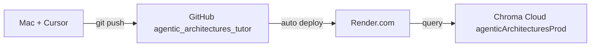

# Deploy: Mac → GitHub → Render

Same workflow as [agente-de-ia-juridico](https://github.com/rdebiasec/agente-de-ia-juridico) and other DBX projects.



## Daily workflow

1. Develop and test locally (`./scripts/smoke_test.sh`)
2. `git push origin main`
3. Render redeploys automatically (~2–3 min)

---

## Local development

```bash
cd "/Users/ricardodebiase/Documents/agentic-architectures"
source .venv/bin/activate
./scripts/use-env.sh local
python3 scripts/rag_query.py "Supervisor Architecture" --search-only
./scripts/smoke_test.sh
```

---

## GitHub (already set up)

**Repository:** https://github.com/rdebiasec/agentic_architectures_tutor

```bash
git add .
git commit -m "Describe your change"
git push origin main
```

Never commit `.env`, `.env.local`, or `.env.cloud-prod`.

---

## Render (first time)

### Option A — One-click Blueprint (recommended)

1. Sign in at [render.com](https://render.com) with **GitHub**
2. Open the deploy link:

   **https://render.com/deploy?repo=https://github.com/rdebiasec/agentic_architectures_tutor**

3. Review the Blueprint (`render.yaml`) → **Deploy Blueprint**
4. When prompted for secrets, paste values from your local `.env.cloud-prod`:

   | Render variable | Source |
   |-----------------|--------|
   | `OPENAI_API_KEY` | `.env.cloud-prod` |
   | `CHROMA_API_KEY` | `.env.cloud-prod` (prod DB key — **not** the dev key) |
   | `CHROMA_TENANT` | `.env.cloud-prod` |

   Get fresh Chroma prod credentials anytime:

   ```bash
   export PATH="$HOME/.local/bin:$PATH"
   chroma db connect agenticArchitecturesProd --env-vars
   ```

5. Wait for deploy → URL will be like `https://agentic-architectures-rag.onrender.com`

### Option B — Dashboard manually

1. [dashboard.render.com](https://dashboard.render.com) → **New** → **Blueprint**
2. Connect repo **`agentic_architectures_tutor`**
3. Add the three secrets above
4. **Deploy Blueprint**

---

## Verify production

```bash
export RENDER_URL="https://agentic-architectures-rag.onrender.com"  # your actual URL

curl -s "$RENDER_URL/health" | python3 -m json.tool

curl -s -X POST "$RENDER_URL/query" \
  -H "Content-Type: application/json" \
  -d '{"question":"What is the Supervisor Architecture pattern?","top_k":4}'
```

Expected `/health`:

```json
{
  "status": "ok",
  "chroma_mode": "cloud",
  "collection": "agentic_architectures",
  "chunks_indexed": 1371
}
```

Run the full parity check from your Mac:

```bash
python3 scripts/verify_index_parity.py
```

---

## Re-index after `kb/` changes

The vector index lives in **Chroma Cloud**, not on Render disk. After editing chapters:

```bash
./scripts/use-env.sh local && python3 scripts/build_rag_index.py
./scripts/use-env.sh cloud-prod && python3 scripts/build_rag_index.py
python3 scripts/verify_index_parity.py
git push origin main   # Render picks up code changes only
```

Or sync via CLI:

```bash
chroma copy --all --from-local --to-cloud \
  --db agenticArchitecturesProd \
  --path "$(pwd)/.rag/chroma"
```

---

## Security checklist (production)

| Item | Action |
|------|--------|
| Chroma dev key exposed in chat | Rotate in Chroma dashboard; update `.env.cloud-dev` |
| Prod secrets on Render | Set only in Render Dashboard (never in Git) |
| OpenAI key | Render secret only |

See [SECURITY.md](SECURITY.md) for key rotation steps.

---

## Troubleshooting

| Symptom | Fix |
|---------|-----|
| `/health` → 503, Chroma auth error | Wrong `CHROMA_API_KEY` — prod DB has its own key |
| `chunks_indexed: 0` | Run `build_rag_index.py` with `cloud-prod` env locally |
| Build fails on Render | Check logs; ensure Python 3.11 and `requirements.txt` install |
| Cold start slow | Starter plan spins down after inactivity; first request ~30s |
