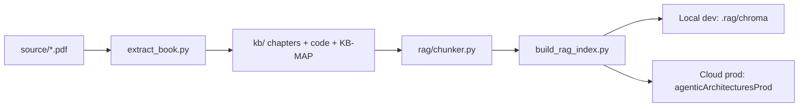

# Agentic Architectural Patterns — RAG Knowledge Base

Local development environment for studying and querying *Agentic Architectural Patterns for Building Multi-Agent Systems* (Packt) via semantic search and GPT-backed Q&A.

## Architecture



- **Single source of truth:** `kb/` (markdown chapters, code snippets, figures, KB-MAP)
- **Dev vectors:** local disk at `.rag/chroma` (default for Cursor)
- **Prod vectors:** Chroma Cloud database `agenticArchitecturesProd` (identical chunks, separate store)

## Prerequisites

- Python 3.11+ (3.9+ works; project tested with 3.9 locally)
- [OpenAI API key](https://platform.openai.com/api-keys) for embeddings + chat
- Optional: [Chroma CLI](https://docs.trychroma.com/cli) at `~/.local/bin` for cloud DB management

```bash
export PATH="$HOME/.local/bin:$PATH"   # add to ~/.zshrc for persistence
chroma login
```

## One-time setup

```bash
./scripts/dev-setup.sh
cp .env.example .env.local   # if needed; then add OPENAI_API_KEY
./scripts/use-env.sh local
python3 scripts/build_rag_index.py   # skip if .rag/chroma already populated
```

## Daily workflow

```bash
source .venv/bin/activate
./scripts/use-env.sh local

# Semantic search (no LLM)
python3 scripts/rag_query.py "Supervisor Architecture" --search-only

# Full Q&A with citations
python3 scripts/rag_query.py "What is the FCoT pattern?"

# Restrict to a chapter
python3 scripts/rag_query.py "loan processing tools" --chapter 13
```

### Switch environments

| Command | Target |
|---------|--------|
| `./scripts/use-env.sh local` | Disk index at `.rag/chroma` (default) |
| `./scripts/use-env.sh cloud-dev` | `agenticArchitecturesDev` |
| `./scripts/use-env.sh cloud-prod` | `agenticArchitecturesProd` |

Each env file has the same variable shape; only Chroma target differs.

### Rebuild after KB changes

```bash
./scripts/use-env.sh local
python3 scripts/extract_book.py      # re-extract from PDF if needed
python3 scripts/build_rag_index.py   # rebuild local index

# Sync cloud prod (choose one):
./scripts/use-env.sh cloud-prod && python3 scripts/build_rag_index.py
# or:
chroma copy --all --from-local --to-cloud \
  --db agenticArchitecturesProd \
  --path "$(pwd)/.rag/chroma"
```

### Verify local == cloud prod

```bash
python3 scripts/verify_index_parity.py
```

Exports text-hash manifests to `.rag/manifest-local.json` and `.rag/manifest-cloud.json`. Exit 0 only on 100% match (chunk IDs + SHA256 of chunk text).

## Local API

```bash
./scripts/use-env.sh local
uvicorn app.main:app --reload --port 8000
```

| Endpoint | Description |
|----------|-------------|
| `GET /health` | Index status and chunk count |
| `POST /query` | `{"question": "...", "top_k": 6, "chapter": null}` |
| `GET /search?q=...` | Retrieve chunks without LLM answer |

## Smoke test

```bash
./scripts/smoke_test.sh
```

Checks venv, local env, index count, search quality, and optionally `/health`.

## Project layout

| Path | Purpose |
|------|---------|
| `kb/chapters/` | Chapter markdown (extracted from PDF) |
| `kb/code/` | Validated Python snippets |
| `kb/KB-MAP.md` | Navigation index |
| `rag/` | Chunking, Chroma store, query logic |
| `scripts/` | Extraction, indexing, CLI tools |
| `app/main.py` | FastAPI wrapper for deploy |
| `.rag/chroma/` | Local vector store (gitignored) |

## Security

- **Never commit** `.env`, `.env.local`, `.env.cloud-prod`, or `.env.cloud-dev`
- Rotate **Chroma API keys** if they were ever exposed (Chroma Cloud dashboard → API keys)
- Each Chroma Cloud database has its own API key; prod and dev keys differ
- PDF source is gitignored by default (`source/*.pdf`)

## Current index stats

After KB quality fixes: **1,371 chunks** (chapters + KB-MAP + validated code). Local and cloud prod verified identical via `verify_index_parity.py`.

## Repository

GitHub: [agentic_architectures_tutor](https://github.com/rdebiasec/agentic_architectures_tutor)

[](https://render.com/deploy?repo=https://github.com/rdebiasec/agentic_architectures_tutor)

Full deploy guide: [DEPLOY.md](DEPLOY.md)

## Next phase

Render deploy is ready — see [DEPLOY.md](DEPLOY.md). After first Blueprint deploy, verify with `./scripts/smoke_produccion.sh`.
