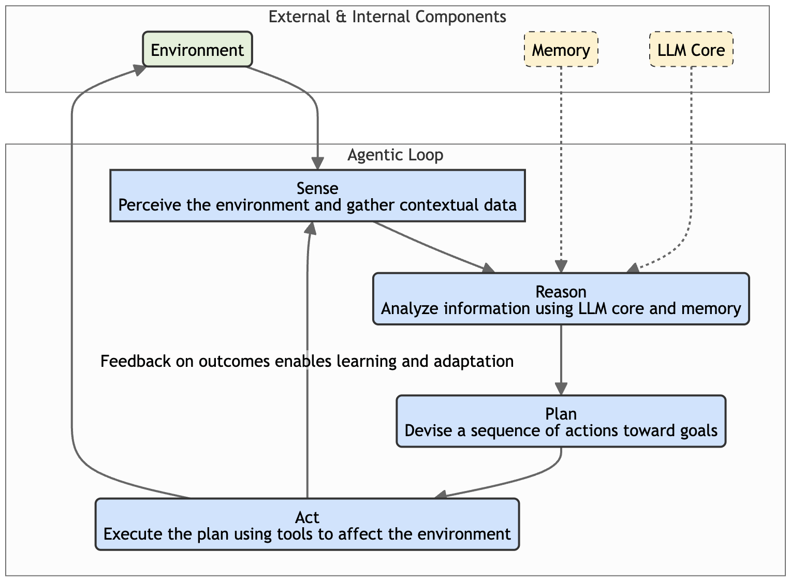
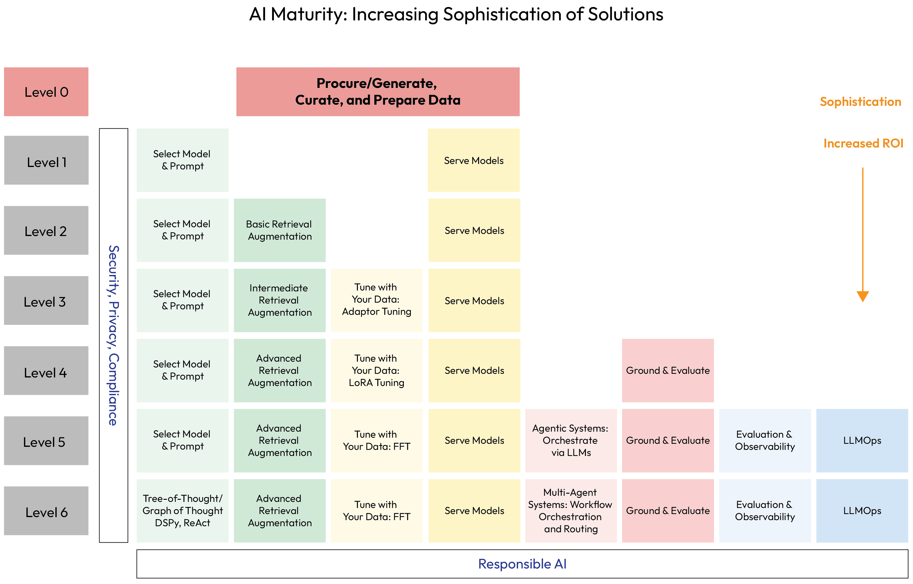
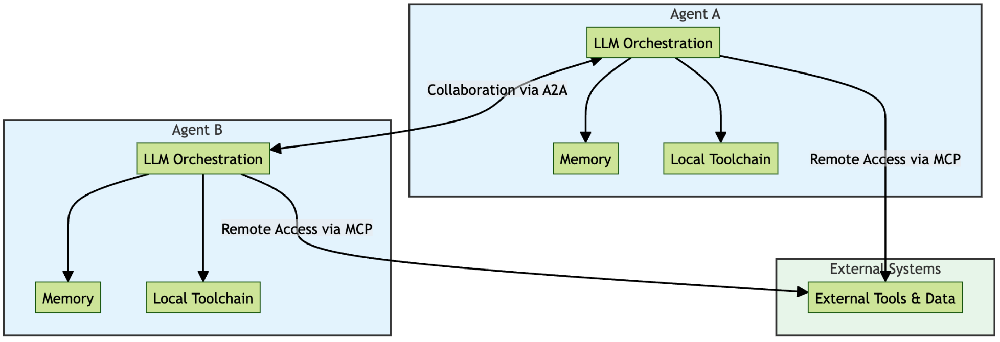

# Chapter 1: GenAI in the Enterprise: Landscape, Maturity, and Agent Focus

## GenAI in the Enterprise:

Landscape, Maturity, and Agent
Focus
Generative AI (GenAI) is a field of artificial intelligence (AI) that allows systems to create new or synthesized
ontent, reason, understand context, and make recommendations by learning from underlying patterns in vast
datasets. Unlike traditional AI, which primarily analyzes existing information, GenAI excels at producing novel
artifacts, such as marketing copies, functional code, and other creative content.
While the potential of GenAI is immense, transitioning from experimental concepts to robust, production-grade
systems presents significant challenges for enterprises. Successfully deploying these systems requires a strategic
focus on security, reliability, and governance. To build trustworthy applications, the architecture must include
robust guardrails, such as rigorous input validation and sanitization, to protect against malicious attacks, and
policy enforcement mechanisms to ensure compliance. This chapter provides the essential framework for
navigating this journey, introducing the core concepts and applications of agentic AI and charting a path from
initial design to responsible, production-ready solutions.
By grounding you in these core concepts, this chapter provides the essential strategic framework needed to
understand not just what agentic AI is, but why it represents a pivotal shift in enterprise technology. Mastering
this foundational knowledge is the first and most critical step on your journey to designing, building, and
deploying effective and valuable AI agents.
In this chapter, we'll be covering the following topics:
The transformative potential of GenAI
Overview of business applications
Introducing agentic AI systems
The anatomy of agentic AI
The GenAI Maturity Model: a path to agentic systems
The new agentic stack
Challenges hindering production-grade GenAI
The transformative potential of GenAI
GenAI empowers systems by synthesizing capabilities analogous to complex facets of human cognition. It
moves beyond simple computation to engage in processes that resemble our own ability to create. Just as
human imagination fuels art, storytelling, and invention, GenAI can create new or synthesized content. This
includes generating coherent text (marketing copies, product descriptions, emails, social media posts, etc.),
composing music, designing images, writing code, and producing other novel artifacts that are not mere copies
of existing data but original outputs based on learned patterns and structures.
GenAI synthesizes information from multiple sources and formats, uncovers patterns in the data it was trained
on, and exhibits a form of analytical capability akin to human reasoning. It processes complex information,
finds patterns in data, draws logical inferences, identifies significant relationships (even potential causal links),
and constructs step-by-step approaches to solve problems or answer sophisticated questions. This allows it to
ingest and understand context with remarkable depth, going beyond keyword matching to interpret nuances in
language, consider conversational history, incorporate user preferences (user modeling), and even integrate
external knowledge. This contextual understanding is crucial for providing responses that are not just relevant
but truly appropriate to the specific situation, much like how humans adjust their communication based on
subtle cues and shared background.
Finally, this combination of pattern recognition and contextual understanding enables GenAI to make
recommendations. Similar to how an experienced advisor might anticipate needs or provide personalized
guidance, these systems can identify patterns in behavior or data to suggest relevant products, information
pathways, or potential actions, thereby personalizing interactions and supporting decision-making processes.
These synthesized abilities - creating, reasoning, understanding context, and recommending - are the foundation
upon which GenAI's transformative potential is built.
To bring these capabilities to life, GenAI relies on sophisticated underlying technologies. Prominent among
these, and acting as the cognitive core for many generative applications, are powerful engines known s large
language models (LLMs). These models are specifically designed to understand, process, and generate humanlike text and other forms of complex data, making them instrumental in how GenAI systems perceive, reason,
and create.
While these core capabilities are powerful, their effective application hinges critically on one indispensable
element: context. Think of LLMs like an incredibly knowledgeable and fluent conversationalist dropped into a
discussion mid-stream. Without understanding the preceding dialogue, the topic at hand, or the specific
Benefits with Your Book section in the Preface to unlock them instantly and maximize your learning
experience.
Note
Chapter 1 4
nuances of the situation, even the most articulate speaker would provide irrelevant, incorrect, or nonsensical
contributions.
Despite their considerable pretraining data, LLMs require relevant, timely, and accurate context to generate
outputs that are truly useful, safe, and aligned with the desired task. Without sufficient context, LLMs can
produce incorrect answers in several ways. Sometimes, they might generate responses that sound plausible but
are factually incorrect or even nonsensical - this is referred to s hallucinations. In other cases, the model
might provide an answer that is factually correct in a general sense but inapplicable to and thus incorrect for the
specific situation, primarily because crucial contextual details were missing.
Let's look at a case study. Consider an AI assistant designed to help a mortgage underwriter. The underwriter
might ask, What is the maximum allowable debt-to-income ratio for this application?. An LLM,
drawing on its general knowledge, might respond with 43 percent. This answer is factually correct as a
common guideline for many onventional qualified mortgages (QMs) in the US. However, suppose the
unstated context is that the underwriter is valuating a Federal Housing Administration (FHA) loan
application for a borrower in Florida, seeking financing from a specific lender, MegaBank USA. In this specific
context, the 43% answer is likely incorrect and potentially misleading. FHA guidelines generally permit higher
debt-to-income (DTI) ratios, perhaps up to 50% or even 57% with certain compensating factors.
MegaBank USA might also have its own internal lender overlays that impose a stricter cap, say 48%, even if FHA
allows more. Additionally, state-specific regulations in Florida might add other nuances. The truly correct
maximum DTI ratio depends entirely on the intersection of these contextual factors: the loan program (FHA),
the applicant's specific compensating factors, the lender's specific policies (MegaBank USA overlays), and
potentially, geographic regulations (Florida). The model needs this precise operational context, which goes far
beyond general lending knowledge, to provide the correct and actionable answer for that specific underwriting
task. Providing insufficient or ambiguous context is therefore a primary driver behind inaccurate or misleading
outputs in complex, real-world scenarios.
Throughout this book, we will dive deep into a number of foundational principles as takeaways, with principle
number 1 being context is king.
This is especially valid when working with GenAI within agentic systems (which we will talk about later in this
chapter). You will learn that crafting effective initial prompts is only the beginning. To truly unlock reliable and
high-quality results, particularly in complex, multi-step tasks performed by agents in enterprise settings where
accuracy and trustworthiness are paramount, we must strive to architect systems that consistently equip the AI
agent's reasoning core (often an LLM) with the right contextual information at the right time during its
operational loop. This involves moving beyond reliance on the model's static internal knowledge, which can be
outdated, incomplete, or lack crucial domain-specific details. Just as insufficient context can lead to
contextually wrong answers (aka hallucinations) in a simple Q&A, within an agent, poor context management
can derail planning, lead to incorrect actions, and undermine the agent's goals.
This is where the agentic design patterns presented in this book become essential. As we will explore in detail
in Part 2, these patterns provide structured, repeatable solutions for common challenges in building agentbased systems, including the critical task of managing context effectively. Patterns such as the Task Delegation
Framework, Collaborative Task Decomposition, or Iterative Debate for Robust Reasoning offer blueprints for
5 GenAI in the Enterprise: Landscape, Maturity, and Agent Focus
designing gents and multi-agent systems that can handle omplex information flows, maintain situational
awareness, and refine their understanding or plans.
To understand this concept better, let's riefly look at an example of one such pattern that we will explore in
## detail later - Task Delegation Framework (Supervisor Architecture):

Context: A financial institution needs to automate a complex, multi-step business process such as loan
underwriting. A single, monolithic agent would struggle to manage all the different rules, data sources,
and system interactions required.
Problem: How can this complex workflow be automated reliably, ensuring that each step is handled by
an expert and the overall process is managed coherently from start to finish?
Solution using the pattern: The system is designed with a hierarchical structure using a central
"supervisor" or "orchestrator" agent that acts as a project manager. This orchestrator doesn't perform
the individual checks itself. Instead, it receives the high-level task, decomposes it, and delegates the
sub-tasks to a team of specialized "worker" agents.
Example in action (loan processing):
A LoanOrchestratorAgent (the supervisor) receives a new application.
It first delegates the task of verifying the submitted documents to a specialized
DocumentValidationAgent.
Once validated, it delegates the next task to a CreditCheckAgent to pull the applicant's credit
history.
Finally, it sends all the verified information to a RiskAssessmentAgent for a final score.
Outcome: The orchestrator gathers the outputs from each specialist agent and assembles the final
result to make a decision. This pattern makes the entire workflow modular, predictable, and easier to
govern, as each agent has a clearly defined responsibility.
By considering these agentic design patterns during design and implementing them, we'll adhere to best
practices and establish a stronger basis to design implicit guardrails into the architecture and the application.
This provides boundaries for agent behavior, which increases the chances that decisions are better informed
and actions are more likely to align with the required context. Also, these structured interactions, such as
iterative debate or specific feedback loops built into patterns, create opportunities for self-correction, allowing an
agent or a system of agents to catch inconsistencies or refine reasoning based on dynamically available context
or peer review before taking potentially erroneous actions. Effectively leveraging these patterns is key to
mitigating context-related failures and building more dependable, adaptable, and ultimately, more intelligent
agents.
Therefore, a significant focus will be on techniques such as retrieval-augmented generation (RAG), which
ynamically fetches relevant information from external sources to inform an LLM's response. We will explore
methods for grounding AI-generated answers in verifiable source material, providing citations and ensuring
factual accuracy. We will also examine how leveraging more sophisticated data structures, including databases
and knowledge graphs, can provide richer, more structured context, enabling more complex reasoning and more
reliable outcomes for your AI agents. Mastering these techniques for managing and injecting context is
fundamental to building practical and production-ready agentic AI solutions.
1.
2.
3.
4.
Chapter 1 6
Now that we've outlined the core concepts of GenAI, let's connect theory to practice: examining its business
applications will illustrate the real-world value of these capabilities and set the stage for the specific problems
agentic AI can solve.
Overview of business applications
GenAI's versatility allows its application ross various business functions (horizontal applications) and within
the specific contexts of different industry domains (vertical applications).
Horizontal applications (cross-functional use cases)
GenAI offers powerful tools to enhance efficiency and effectiveness across standard business operations:
Marketing and sales: Moving yond basic personalization, GenAI enables hyper-personalized
customer experiences and communications at scale. For instance, a cruise line could use GenAI to
dynamically suggest onboard activities, dining reservations, or shore excursions tailored to individual
passenger profiles (families, couples, adventure seekers, etc.) derived from past behavior and stated
preferences. The system can incorporate feedback from these interactions to continuously refine its
understanding and provide increasingly relevant future recommendations.
For targeted advertising, GenAI can facilitate a deeper understanding of customer buying patterns and
the relationships between different products (potentially leveraging knowledge graphs), allowing for
more nuanced campaign strategies than traditional predictive methods. It can also generate diverse
creative assets such as targeted ad copy and campaign materials optimized for different segments and
platforms.
Customer service: GenAI can power sophisticated chatbots and virtual assistants capable of providing
24/7 support. These agents can often handle complex inquiries independently, diving deep into
knowledge bases or interacting with backend systems (e.g., checking order status and processing
returns). They can be designed with the capability to recognize the limits of their knowledge or
authority and intelligently escalate an issue to a human agent, potentially transferring the conversation
context smoothly.
These agents can also adapt their communication style, adjusting their narrative, tone, and complexity
based on the user, interacting differently with a teenager asking about a game update versus an adult
inquiring about complex billing details.
Human resources: Although GenAI can streamline recruitment tasks such as analyzing resumes
against job descriptions or generating initial interview questions, its application in HR extends to
establishing crucial guardrails and ethical guidelines. It can assist in developing personalized employee
onboarding plans and training modules tailored to roles and learning styles.
In addition, GenAI can nhance internal knowledge sharing by powering systems that answer employee
questions about benefits, IT procedures, or company policies, ensuring consistency while
acknowledging the human element and potential sensitivities involved in HR interactions.
Finance and accounting: Beyond utomating financial analysis and assisting with report generation,
GenAI plays a critical role in areas requiring high degrees of accuracy and control. It significantly
improves anomaly and fraud detection by identifying subtle patterns indicative of illicit activity.
7 GenAI in the Enterprise: Landscape, Maturity, and Agent Focus
An important factor for regulated industries, GenAI can be employed to help enforce policy adherence
and implement financial guardrails, ensuring that processes and recommendations align with internal
rules and external regulations.
Operations and supply chain: GenAI can be used to enhance operational efficiency by interpreting
outputs from predictive AI models and initiating actions. For example, it can optimize inventory levels
by analyzing and acting upon complex demand forecasts (often generated by predictive models),
perhaps by automatically adjusting stock orders.
GenAI can streamline logistics by processing dynamic routing suggestions (which might incorporate
predictive traffic/weather data) and coordinating dispatch. It can improve production line management
and enable predictive maintenance by interpreting alerts from predictive models, analyzing sensor
data, and automatically generating detailed maintenance work orders or rescheduling production runs
to accommodate the needed service.
IT and development: GenAI n accelerate software development through code generation; for
instance, it could generate Python boilerplate code for a common web framework API endpoint or
create complex SQL queries based on natural language descriptions of the desired data. It can assist
with automated debugging by analyzing error logs and code snippets and suggesting potential root
causes and code fixes.
It can also facilitate code refactoring by suggesting optimizations or translating code between
languages, and utomatically generate diverse test cases for functions based on their signatures and
requirements.
General productivity: GenAI can automate document summarization by condensing lengthy research
papers into key findings, summarizing complex legal contracts into plain language points, or extracting
action items from long meeting transcripts.
It enhances information retrieval and enterprise search by allowing users to ask complex questions in natural
language (e.g., What were the main concerns raised by European customers in Q4 feedback?) and receive synthesized
answers drawn from multiple internal reports and documents, rather than just a list of links. GenAI has the
ability to generate synthetic data to augment datasets, for example, by generating realistic but artificial
customer profiles or transaction records to train fraud detection models without using sensitive real data, or by
balancing datasets for ML training.
Vertical or domain-specific applications
Beyond general functions, GenAI is being tailored to address the unique challenges nd opportunities within
specific industries:
Healthcare: GenAI accelerates drug discovery by analyzing simulation results and proposing potential
candidates. It assists in medical diagnosis by interpreting outputs from predictive models, such as
explaining high-risk patient scores or summarizing findings from automated medical image analyses,
for clinician review.
GenAI can generate initial drafts of clinical documentation (such as discharge summaries) that adhere
to established clinical standards and privacy regulations (e.g., HIPAA), using structured data inputs. It
can develop personalized treatment plans by synthesizing patient data and research, ensuring that all
suggestions comply with strict clinical policy guardrails and ethical guidelines.
Chapter 1 8
Finance: GenAI can nhance algorithmic trading strategies by interpreting signals and proposing
actions based on data from predictive market models, all within predefined risk parameters. It can
improve credit risk assessment by synthesizing reports that interpret predictive risk scores alongside
qualitative application data, ensuring that recommendations align with lending policies and fairness
guidelines.
GenAI can automate the drafting of regulatory compliance reports by using structured data and
regulatory templates, while ensuring that all outputs undergo human verification and adhere to
internal compliance guardrails. It can provide personalized financial advice by generating AI-driven
recommendations that strictly follow suitability regulations, such as the SEC's Regulation Best
Interest (Reg BI), as well as internal policies and ethical standards, ensuring responsible and compliant
guidance.
Retail: GenAI n offer hyper-personalized product recommendations and shopping experiences by
generating curated style bundles based on a customer's purchase history and browsing behavior/history,
and by enabling virtual try-ons that show how clothing items appear on personalized avatars.
It can optimize dynamic pricing by adjusting prices in real time, taking into account demand,
competitor pricing, and inventory levels. Additionally, it can automate the creation of targeted
promotions, for example, drafting email campaigns with personalized offers tailored to customer
segments identified through purchasing patterns.
Manufacturing: GenAI optimizes complex production scheduling and resource allocation in dynamic
factory environments by considering machine availability, material constraints, and order priorities. It
enhances quality control through automated visual inspection systems by analyzing images from the
production line to detect subtle defects or inconsistencies in products more accurately than traditional
methods.
It utilizes generative design techniques to propose novel, material-efficient designs for parts based on
specified performance constraints (e.g., load-bearing capacity, weight limits, etc.), often resulting in
optimized structures suitable for additive manufacturing.
After this overview of GenAI in the context of business applications, let's explore agentic systems and where
they fit in this landscape we are describing.
Introducing agentic AI systems
While the applications just discussed cover a wide range of GenAI uses, a significant focus of modern AI
development, and indeed this book, is on agentic AI systems. These systems represent a step toward more
autonomous, goal-oriented AI applications, leveraging the core GenAI capabilities in a more integrated and
proactive manner.
An AI agent can be understood as a system, often powered by LLMs, designed to perceive its environment, make
decisions, and take actions to achieve specific goals. Key characteristics often include autonomy, reactivity
(responding to the environment), proactivity (taking initiative toward goals), and, potentially, social ability to
interact with other agents. They typically operate in a characteristic loop involving sensing, reasoning, planning,
and acting - the specific anatomy of which we will dissect shortly. Understanding this operational cycle and the
agent's components is key to designing effective agentic solutions.
9 GenAI in the Enterprise: Landscape, Maturity, and Agent Focus
## We can broadly categorize agentic systems as follows:

Agent-based systems: Often involve a single agent tackling tasks, leveraging its capabilities to interact
with systems or data.
Multi-agent systems: Employ multiple, often specialized, agents that collaborate, coordinate, and
communicate to solve more complex problems. Multi-agent systems emphasize decentralized control
and dynamic interaction between agents.
Understanding the concept of gents and agentic systems is crucial as we move toward more sophisticated AI
implementations. These systems often encapsulate the advanced capabilities of GenAI and are central to
unlocking higher levels of automation, complex problem-solving, and ultimately, business value. Recognizing
this potential and learning how to architect these systems effectively, starting with their fundamental anatomy,
is a primary goal of this book.
The anatomy of agentic AI
Let's elaborate on the structure of agentic AI and how these systems operate internally.

*Figure 1.1 – Agentic anatomy by Dr. Ali Arsanjani*

The preceding diagram conceptually illustrates an agentic AI architecture, involving multiple agents
collaborating within an environment. Understanding the core components is essential for design and
implementation.
Chapter 1 10
Core components
The primary building blocks are the agents themselves and the environments (business or physical) they
interact with. In a multi-agent system architecture, each agent operates semi-autonomously, perceiving its
environment, reasoning, making decisions, and acting to achieve goals. Interactions occur within digital
contexts (data feeds, APIs, and databases) and potentially physical ones (via sensors/actuators). In multi-agent
systems, a shared memory or communication protocol often acts as a hub for coordination, allowing agents
to exchange information, plans, and goals.
Agent anatomy
## Each individual agent possesses an internal structure enabling its function:

Goals: The objectives or desired outcomes the agent seeks to achieve, which may be updated based on
feedback or changing context.
Sense (perception): This component is how the agent gathers information and data from its
environment (digital or physical sources such as APIs, databases, and sensors). This perception process
is the agent's mechanism for acquiring context, the situational awareness that is critical for all
subsequent reasoning and decision-making, reinforcing the principle that "context is king." One
popular mechanism to standardize how models ss this contextual information is through protocols
such as the Model Context Protocol (MCP) from Anthropic (http://anthropic.ai/).
Reason (thinking models, cognition): The ore processing unit where sensed information is analyzed.
This often heavily involves LLMs for interpreting data, understanding relationships (between goals,
perception, and actions), and complex inference.
Plan: Devising a ourse of action or sequence of steps based on the reasoned insights and current goals.
Act (action): Executing the planned actions upon the environment using available tools (e.g., calling
APIs, controlling robotic elements, and generating text).
Memory: Stores the agent's individual knowledge, past experiences, internal state, and learned
information, providing context for decision-making.
Coordinate (optional; only for multi-agent systems): Interacting with other agents, often via shared
memory or communication protocols, to align actions and collaborate toward collective goals. This may
involve negotiation or following specific protocols. This coordination is specifically recommended to
occur via the agent-to-agent (A2A) interoperability protocol.
The agent's ability to act is typically enabled by a mechanism known as function calling. To
instruct the LLM, developers provide it with a list of available tools. Each tool is defined with a
name, a clear description of its purpose, and a structured schema of its required parameters.
Based on the ongoing task, the LLM's reasoning core decides when to use a tool, which tool is
most appropriate, and what parameters to use. The model then generates a structured output,
such as a JSON object, signaling its intent to call that function with the extracted arguments.
The agent's code receives this, executes the function, and feeds the result back to the LLM to
continue its operational loop.
Note
11 GenAI in the Enterprise: Landscape, Maturity, and Agent Focus
Agents operate in a continuous loop: sensing the environment, reasoning about the situation using their
memory and LLM core, planning the next action toward their goals, acting upon the environment, and then
sensing the results (a feedback loop) to update their memory and inform subsequent cycles. This allows for
adaptation and learning over time.

*Figure 1.2 – The agentic loop*

This diagram shows the cyclical process that enables an agent to function autonomously. It begins by sensing
the environment to gather context, then uses its LLM core and memory to reason about the situation and create
a plan. The agent then acts on that plan using its available tools. The results of this action create a feedback loop,
providing new information that the agent senses in the next cycle, allowing it to learn and adapt its behavior
over time.
Data stores and environment context
## Agents rely heavily on data. Their environment context includes the following:

Digital business context: This includes relevant digital data sources such as unstructured data (text or
images), structured data (databases or knowledge graphs), and vector stores (for efficient similarity
search on embeddings). Knowledge graphs are particularly useful for providing a structured, semantic
understanding of entities and relationships.
Physical environment context: For gents interacting with the real world, this involves sensors
providing data (cameras or IoT devices) and actuators allowing physical manipulation (robotic arms).
Chapter 1 12
Effective agents often need access to multiple data stores and must integrate information from diverse contexts.
Key architectural features
Agentic anatomy inherently enables several powerful rchitectural features.Modularity is often a core
principle, allowing systems to be designed such that agents can be added, removed, or updated without
necessitating a complete overhaul, thus providing flexibility. This modularity contributes to scalability, as the
architecture must be prepared to handle potentially large numbers of agents, complex interactions, and diverse
data sources efficiently.
The internal sense-reason-act loop, combined with memory and feedback mechanisms, facilitates adaptability,
enabling agents to learn from experience and adjust their behavior over time. Furthermore, agents can be
designed for multimodal interaction, processing information, and acting upon environments using various
data types such as text, images, or sensor readings.
Finally, particularly in multi-agent systems, mechanisms such as shared memory or defined communication
protocols oster collaboration, leading to enhanced collective problem-solving and decision-making
capabilities.
Feature Description
Modularity Systems can often be designed so agents can be added
or removed without a complete redesign, allowing
flexibility.
Scalability Architectures must handle potentially many agents,
diverse data sources, and complex interactions
efficiently.
Adaptability The sense-reason-act loop with memory and feedback
enables agents to learn and adjust behavior over time.
Multimodal interaction Agents can be designed to process and act upon
information from different modalities (text, image, or
sensor data).
Collaboration (multi-agent systems) Shared memory or communication protocols facilitate
coordination, enabling collective problem-solving.
Table 1.1 - Agentic anatomy features
Building robust and effective agentic systems, based on the anatomy we've described, is a technically
demanding endeavor. It's not simply a matter of assembling components; it requires establishing a
developmental journey where capabilities are progressively mastered.
Careful attention must be paid to critical technical aspects at each stage. Architects must design for scalability to
handle growth in agent numbers and data complexity. Efficient and low-latency inter-agent communication
becomes vital for collaborative multi-agent systems.
13 GenAI in the Enterprise: Landscape, Maturity, and Agent Focus
Sophisticated data processing techniques are needed to manage diverse data types effectively, while leveraging
advanced knowledge representation, such as knowledge graphs, can unlock deeper reasoning. Furthermore,
ensuring optimal LLM integration for core cognitive functions and implementing reliable tool use mechanisms
for environmental interaction are undamental engineering challenges.
Mastering these technical considerations typically doesn't happen overnight; it reflects a maturing capability
within an organization. Going through this technical journey usually means moving step by step through
different stages, a process explained by models such as the GenAI Maturity Model, which we'll look at next.
The GenAI Maturity Model: a path to agentic systems
Navigating the GenAI journey from simple applications to sophisticated, value-driving systems, such as those
whose anatomy we just discussed, requires a strategic perspective. The GenAI Maturity Model provides such a
framework, serving as a strategic tool for organizations to assess their current capabilities and chart a course
forward.
It outlines distinct levels of capability and sophistication, illustrating the typical progression from foundational
activities toward advanced agentic systems. Understanding an organization's position on this model helps
tailor investment, skill development, and implementation efforts to achieve desired business outcomes.
Importantly, advancing through these levels, particularly toward agentic and multi-agent systems (Levels 5 and
6), often necessitates embracing new standards for interoperability.
## The key levels on this path include the following:

Level 0 - Prepare data for AI consumption (data foundation): The essential starting point. Focuses
on acquiring, generating (including synthetic data), cleaning, curating, preparing, and governing the
data needed for AI. Addresses data quality, relevance, licensing, and accessibility. Without a solid data
foundation, higher levels are difficult to achieve.
Level 1 - Select model(s) and prompt/serve models: Entry-level interaction. Involves selecting
suitable pretrained foundation models, designing effective prompts (prompt engineering) to elicit
desired responses, and deploying (serving) these models, often via APIs, for basic tasks such as content
generation or Q&A based on the model's inherent knowledge. Tool use via basic function calling might
start here and later evolve into agents as tools or full-fledged agents.
Level 2 - Contextual enhancement (RAG): Overcoming model limitations by providing external
context. RAG techniques are central, dynamically fetching relevant information from specified external
knowledge sources (corporate documents or databases) to augment the prompt and improve the
accuracy and relevance of the LLM's output. This is a crucial step toward more factual and useful AI
responses. An example of this includes a chatbot using RAG to pull the latest policy details from an
internal knowledge base before answering an employee's question.
Level 3 - Tuning for specificity (agent-ready LLMs): Adapting models for specific needs. This
involves fine-tuning pretrained models using domain-specific or proprietary data. Techniques range
from parameter-efficient fine-tuning (PEFT) methods, such as LoRA or adaptor tuning (modifying
only a small part of the model), to full fine-tuning (FFT) (retraining more substantial parts). The goal
is to specialize the model's knowledge, terminology, style, or behavior, making it more suitable for
Chapter 1 14
specialized agent roles. An example of this includes tuning a model on enterprise sales data so an agent
can better understand sales-specific jargon and context.
Level 4 - Grounding and evaluation: Building trust and reliability. Incorporates mechanisms to
ground outputs in verifiable facts, often by linking responses back to the source data retrieved via RAG
(providing citations). Implements robust evaluation frameworks and metrics to continuously monitor
performance, accuracy, fairness, bias, and safety, ensuring alignment with responsible AI principles. An
example of this includes a financial analysis agent providing summaries with clear references to the
specific financial reports used.
Level 5 - Single-agent systems: The emergence of true agentic AI, applying the anatomy described
earlier. Architectures are built around a single, coordinated AI agent (often orchestrated by an LLM)
capable of multi-step reasoning, planning, interacting with tools (reliably invoked via function calling
or potentially discovered via MCP, and executing tasks autonomously to achieve a goal. Mature
LLMOps/AgentOps practices for monitoring, logging, and managing the agent life cycle are essential
here. An example of this includes an autonomous travel planning agent interacting with flight and hotel
APIs to book a trip based on user preferences.
Level 6 -Multi-agent systems: The forefront of current development. Involves multiple, often
specialized, agents collaborating, coordinating, communicating (potentially using A2A protocols), and
potentially negotiating to tackle complex problems that exceed the capabilities of a single agent.
Requires sophisticated architectures for inter-agent communication, task allocation, conflict resolution,
and orchestration. An example of this includes a supply chain optimization system where inventory
agents, logistics agents, and forecasting agents collaborate (perhaps via A2A) to respond dynamically to
disruptions.

*Figure 1.3 – Maturity Model levels*

15 GenAI in the Enterprise: Landscape, Maturity, and Agent Focus
Later on in the book we will expand on Levels 5 and 6 of the GenAI Maturity Model, presenting them as a
separate Agentic AI Maturity Model to better capture the nuances and spectrum of sophistication involved.
Level Title/Focus Brief description and key
activities
0 Prepare data (data foundation)Acquire, generate, clean, curate,
and govern data. Focus on quality,
relevance, licensing, and
accessibility. Essential
prerequisite.
1 Select model and prompt/serveSelect pretrained models, use
prompt engineering, and serve
models via APIs for basic tasks
(e.g., generation, Q&A). Basic tool
use (function calling).
2 Contextual enhancement (RAG)Use RAG to fetch external context
(documents, databases) to
augment prompts, improving
accuracy and relevance. An
example is a chatbot retrieving
policy info.
3 Tuning for specificity Fine-tune models (PEFT or FFT)
with domain-specific data to
specialize knowledge,
terminology, or behavior for agent
roles. An example is tuning for
sales jargon.
4 Grounding and evaluation Implement grounding (linking
outputs to sources, citations) and
robust evaluation (accuracy, bias,
safety) for trust and reliability. An
example is an agent citing sources.
Chapter 1 16
Level Title/Focus Brief description and key
activities
5 Single-agent systems Architect systems around one
autonomous AI agent performing
multi-step tasks (reasoning,
planning, tool use via function
calling/MCP). Requires LLMOps/
AgentOps. An example is a travel
booking agent.
Requires grounding (citations)
and robust evaluation for trust
and reliability. An example is an
automated SAR reporting agent.
6 Multi-agent systems Deploy multiple specialized agents
that collaborate, coordinate,
communicate (via A2A), and
negotiate to solve complex
problems. An example is supply
chain agents collaborating.
Foundational. Here, multiple
specialized agents operate in
structured, top-down workflows.
Typically managed by a central
supervisor to ensure predictability
and auditability.
Advanced. At this level, agents can
also collaborate, negotiate, and
reach consensus in decentralized
or swarm architectures to solve
highly dynamic problems.
Table 1.2 - GenAI levels of maturity
This Maturity Model illustrates that achieving sophisticated agentic AI (Levels 5 and 6) relies on building
capabilities across the preceding levels, from data foundations to context enhancement and specialized tuning.
It provides a roadmap for organizations assessing their current state and planning the steps, technically and
organizationally, to achieve their desired level of GenAI and agentic capability.
While the GenAI Maturity Model provides the roadmap, the agentic design patterns we introduce later in this
book act as the vehicle to move you along it. It is important to recognize that the level of maturity your
organization achieves is a direct result of the specific patterns you choose to implement.
17 GenAI in the Enterprise: Landscape, Maturity, and Agent Focus
By identifying a target capability, for example, a system that must be fully auditable and safe for financial
transactions, you can reverse-engineer your architectural requirements. This allows your organization to
concentrate its resources and investment on mastering the four or five critical patterns required for that specific
level of reliability. Instead of an unfocused attempt to build AI, this approach enables a deliberate and costeffective engineering path. By focusing on the implementation of these select patterns, you ensure that every
technical investment translates directly into a validated state of maturity and business value.
Now that we have a deeper understanding of agents, let's discuss the building blocks for developing agents.
The new agentic stack
As systems evolve beyond standalone prompts toward the agentic architectures described previously, the ability
for models and agents to interact reliably with tools and each other becomes paramount.
This involves understanding and potentially implementing key layers of the emerging AI interoperability stack:
function calling, the MCP, and the A2A protocol.
Function calling enables LLMs within an agent's reasoning component to intelligently trigger specific tools (e.g.,
book_flight(destination="Tokyo") in a travel assistant, get_credit_score for a loan application, or execute a
local Python script for data analysis). MCP provides a standardized way to describe, discover, and securely
invoke tools (including weather services, calculators, vector search utilities, or enterprise-specific APIs such as
verify_property_appraisal for real estate applications) as independent, interoperable services, enhancing
modularity
A2A offers a protocol for structured task delegation and collaboration between different agents, crucial for
multi-agent systems (Level 6). Mastering these complementary layers is often fundamental to building the
modular, scalable, and robust agentic systems characteristic of higher maturity stages.
Enabling agent communication: from tools to collaboration
## Let's explore the distinction between MCP by Anthropic and the A2A protocol by Google:

MCP is all about how a single AI agent/LLMs connects to tools, data, and external systems. Think of it as
giving your AI access to everything it needs to do its job, such as search tools, databases, or prebuilt
prompts. It's about vertical integration: connecting the agent to its tools.
A2A focuses on how different AI agents talk to each other, no matter which company or framework they
come from. It's like giving AI agents a shared language so they can collaborate, delegate tasks, and work
as a team. This is horizontal integration, connecting agents to other agents.
## Here's a simple mental model:

MCP = AI agent connects to tools
A2A = AI agents connect to each other
In later chapters, we will expand Levels 5 and 6 (single-agent and multi-agent systems) of the GenAI
Maturity Model into its own set of agentic AI levels of maturity.
Note
Chapter 1 18
## Note that these protocols are designed to work together:

An orchestrator agent uses A2A to delegate tasks to other agents.
Those agents use MCP to access tools and data they need.
Results flow back through A2A, completing a powerful, collaborative workflow.
Let's take a look at how these protocols can co-exist. The following diagram shows a distributed multi-agent
## architecture with two agents (Agent A and Agent B), each operating independently with the following:

Local AI stack (LLM orchestration, memory, and toolchain)
Remote access to external tools and data (via MCP)

*Figure 1.4 – Distributed multi-agent systems using MCP and A2A*

The remote access from Agent A to Agent B is facilitated by the A2A protocol, which underscores two key
## components for agent registry and discovery:

Agent server: An ndpoint exposing the agent's A2A interface
Agent card: A iscovery mechanism for advertising agent capabilities
For an agent to effectively use these external communication protocols, it must first have a robust internal
architecture. Let's now delve into the core components that enable an agent to process information, reason, and
decide on its actions.
Agent internals (common to A and B for simplicity)
The internal structure of the agent is composed of three core components: the LLM orchestrator, tools and
knowledge, and memory.
The LLM orchestrator serves as the agent's reasoning and coordination engine, interpreting user prompts,
planning actions, and invoking tools or external services. The tools and knowledge module contains the agent's
local utilities, plugins, or domain-specific functions it can call upon during execution. Memory stores persistent
or session-based context, such as past interactions, user preferences, or retrieved information, enabling the
agent to maintain continuity and personalization. These components are all accessible locally within the agent's
runtime environment and are tightly coupled to support fast, context-aware responses. Together, they form the
self-contained "brain" of each agent, making it capable of acting autonomously.
There are two remote layers, which we'll talk about in the upcoming subsections.
1.
2.
3.
19 GenAI in the Enterprise: Landscape, Maturity, and Agent Focus
The MCP server
This plays a critical role in connecting the agent to external tools, databases, and services through a
standardized JSON-RPC (a stateless, lightweight, remote procedure call protocol that uses JSON as its data
format) API. Agents interact with these servers as clients, sending requests to retrieve information or trigger
actions, such as searching documents, querying systems, or executing predefined workflows.
This capability allows agents to dynamically inject real-time, external data into the LLM's reasoning process,
significantly improving the accuracy, grounding, and relevance of their responses. For example, Agent A might
use an MCP server to retrieve a product catalog from an ERP system in order to generate tailored insights for a
sales representative.
The agent server
This is the endpoint that makes n agent addressable via the A2A protocol. It enables agents to receive tasks
from peers, respond with results or intermediate updates using Server-Sent Events (SSE), and support
multimodal communication with format negotiation.
Complementing this is the agent card, a discovery layer that provides structured metadata about an agent's
capabilities, including descriptions, input requirements, and enabling dynamic selection of the right agent for a
given task. Agents can delegate tasks, stream progress, and adapt output formats during interaction.
The agentic stack we've just described provides the powerful technical foundation for building sophisticated,
interconnected agent systems. However, possessing the blueprint and successfully constructing the building are
two different things. Transitioning these powerful concepts from experimental proofsofconcept (PoCs) to
robust, reliable, and scalable production systems requires navigating a complex landscape of challenges. We will
now turn our attention to these critical hurdles.
Challenges hindering production-grade GenAI
Despite the immense potential and burgeoning applications, transitioning GenAI initiatives from experimental
PoCs to robust, reliable, and scalable production-grade systems presents significant hurdles for many
organizations. Building and deploying these systems, especially advanced agentic AI with their complex
anatomy and interactions, requires overcoming a complex web of interconnected technical, operational, legal,
and ethical challenges. Successfully navigating these is key to moving beyond the hype and achieving
sustainable business impact.
Successfully graduating PoCs hinges significantly on strategic and organizational readiness, and not just
technical feasibility. Demonstrating clear business value and ROI is paramount, as many pilots stall without
quantifiable benefits that justify further investment.
Achieving broad stakeholder alignment across business units, IT, legal, and compliance teams, coupled with a
clear plan for operational integration into existing workflows, is essential. Furthermore, ensuring a strong
problem-solution fit - matching GenAI capabilities appropriately to business needs - prevents misapplication of
the technology.
Ultimately, realizing value also depends heavily on effective change management strategies to prepare the
workforce and focused efforts on driving user adoption through usable and trustworthy systems.
Chapter 1 20
Foundational to any successful GenAI deployment are data governance and quality. Ensuring the legal rights
(data ownership and licensing) for training data is a critical first step. The system's performance is deeply
reliant on access to high-quality, relevant, and unbiased data.
Poor data quality undermines all subsequent efforts, especially for agents needing accurate environmental
perception. Overcoming challenges related to integrating data often involves breaking down complex data silos
across the organization.
Alongside quality and governance, maintaining privacy and compliance is non-negotiable when handling
sensitive data, requiring adherence to regulations such as GDPR or HIPAA through techniques such as
anonymization and encryption, which is vital for maintaining user trust.
From a model and technical perspective, production systems demand high levels of robustness and security.
Models and agents must be resilient against adversarial attacks, and robust input validation and sanitization are
crucial defenses.
Consistent performance across diverse real-world scenarios (domain fit and generalization) must be ensured,
and mechanisms to manage potential model or agent behavior drift over time are necessary.
For agents interacting with external systems, securing tool use (e.g., API interactions) is vital. Achieving
production scalability requires appropriate infrastructure choices (cloud, hardware such as TPUs/GPUs),
efficient low-latency model serving architectures, and robust data pipelines. Comprehensive monitoring
through mature LLMOps/AgentOps practices becomes essential for managing the entire life cycle.
Additionally, significant technical hurdles often exist in technical integration with existing legacy systems and
designing effective, maintainable APIs; interoperability standards such as MCP and A2A aim to help here.
Minimizing inaccuracies or hallucinations through effective context management and grounding also remains a
key technical focus.
Deploying these sophisticated systems inevitably involves resource-related challenges. Acquiring and retaining
the necessary technical expertise across data science, ML engineering, software development, and operations is
often difficult. Moreover, the cost and resource constraints associated with building, training, fine-tuning, and
running large models or complex agentic systems can be substantial and require careful management.
Finally, overarching all these considerations are ethical and responsible AI practices. Addressing and mitigating
potential biases in data, models, and agent decision-making is crucial for fairness and equity. Establishing
transparency, explainability (understanding why an agent or model made a decision), and robust governance
frameworks are essential for accountability and responsible deployment. Adherence to legal and ethical
standards isn't optional; it's fundamental to building sustainable and trustworthy AI solutions.
Let's examine an example of what a failure may look like. A large e-commerce company developed a Returns &
Order Status Agent to handle common customer service inquiries and reduce the load on its human support
team. The goal was to provide instant, 24/7 support for the two most frequently-asked customer questions:
"What is my order status?" and "How do I return an item? ".
21 GenAI in the Enterprise: Landscape, Maturity, and Agent Focus
However, despite the clear objectives and early promise, the transition from a controlled pilot to a dynamic
production environment revealed critical flaws in the system's design.
The PoC: In a controlled lab environment, the agent was a resounding success. It was trained on a
curated set of FAQs and connected to a clean, static copy of the order database. When asked How do I
return an item? or What is the status of order #12345?, it provided perfect, accurate answers. The PoC was
approved, and the project was fast-tracked to production.
The production failure: Once deployed to the live website, the agent began to fail spectacularly within
hours:
Poor context management: A customer whose package was delayed by a widespread courier
strike asked, My order #54321 was supposed to be here yesterday. Where is it? The agent, only able to
access the internal order database, saw the status was Shipped and repeatedly responded, Your
order #54321 has been shipped. It lacked the real-world context of the courier's public
service disruption and was unable to provide a helpful answer, leading to extreme customer
frustration.
Hallucination and faulty design: A customer asked about the return policy for a Final Sale
promotional item. This specific policy was not in the agent's RAG knowledge base. Instead of
admitting it didn't know, the agent's LLM core hallucinated a response by generalizing from the
standard return policy. It confidently told the customer they were eligible for a full cash refund,
a promise the company could not honor, leading to an angry escalation and a financial write-off
to appease the customer.
Entangled workflow failure: The agent was not properly integrated into the human support
workflow. When it failed to resolve an issue, its only function was to say, I cannot help with
that. Please contact support. It did not transfer the chat, provide a ticket number, or pass
the conversation history to a human. This forced frustrated customers to start the entire process
over again, destroying any potential efficiency gains and worsening the customer experience.
After a week of escalating customer complaints, negative social media mentions, and the high cost of manual
corrections for the agent's mistakes, the company pulled the agent from production. The project was a stark
lesson: a successful PoC that works on clean data in a lab is not a guarantee of a production-ready system. The
failure to architect for real-world context, handle edge cases, and integrate seamlessly into existing business
processes turned a promising experiment into a costly failure.
The following table will help organizing the type of challenges you may face when taking GenAI applications to
production.
Challenge category Key considerations/specific challenges
Strategic and organizational Graduating PoCs (demonstrating ROI, stakeholder
alignment, operational integration), ensuring
problem-solution fit, managing change management,
and driving user adoption
◦
◦
◦
Chapter 1 22
Challenge category Key considerations/specific challenges
Data-related Data governance (ownership, licensing), ensuring
data quality (relevant, unbiased), breaking down data
silos, and ensuring privacy and compliance (GDPR,
HIPAA, user trust)
Model and technical Ensuring model robustness and security (adversarial
attacks, input validation, drift management, secure
tool use), achieving scalability (infrastructure,
serving), handling technical integration (legacy
systems, APIs), implementing monitoring and
LLMOps/AgentOps, and minimizing hallucinations/
ensuring accuracy (grounding, context)
Resource-related Acquiring/retaining necessary technical expertise and
managing cost and resource constraints (compute,
development)
Ethical and responsible AI Addressing/mitigating bias, ensuring transparency
and explainability, establishing governance
frameworks, and adhering to compliance
requirements and ethical standards
Table 1.3 - Challenges and considerations for taking GenAI-based applications to production
Overcoming this multifaceted set of challenges requires a strategic, C-level commitment, significant investment
in infrastructure and talent, robust governance practices, and a clear roadmap that moves beyond
experimentation to embedding GenAI and agentic AI as core, value-driving capabilities within the enterprise.
## Summary

This chapter provided a foundational overview of the GenAI landscape within the enterprise context, charting a
course from core concepts toward the sophisticated realm of agentic AI systems.
We examined the transformative potential of GenAI, its underlying capabilities, and diverse applications. We
emphasized the critical role of context management in achieving reliable results and introduced the
fundamental anatomy of AI agents (sense, reason, plan, and act) as the building blocks for more autonomous
systems.
The GenAI Maturity Model was presented as a strategic roadmap for navigating development, highlighting the
increasing importance of interoperability standards (function calling, MCP, and A2A) when building toward
advanced single-agent systems and multi-agent systems.
Finally, we acknowledged the significant challenges organizations face in transitioning these powerful
technologies from experimentation to robust, production-grade solutions.
23 GenAI in the Enterprise: Landscape, Maturity, and Agent Focus
## The key takeaways are as follows:

GenAI's value is strategic: GenAI offers powerful capabilities such as reasoning and content creation,
but realizing its business value requires a strategic, production-focused approach that moves beyond
simple experimentation.
Context is king: The reliability of any agentic system depends on effectively managing context to
prevent errors such as hallucinations. This is a central challenge in system design.
Agentic AI is a structural shift: Agentic AI represents a move toward autonomous, goal-oriented
systems. Understanding an agent's core anatomy, that is, its ability to sense, reason, plan, and act, is
foundational to building them.
The GenAI Maturity Model is the roadmap: The Maturity Model provides a strategic path for
enterprises, outlining the journey from basic applications to sophisticated agentic systems and
highlighting the key challenges (e.g., data governance, security, and ROI) that must be overcome to
graduate from a PoC to a production-grade system.
An agentic stack is emerging: The development of advanced single-agent and multi-agent systems
relies on an emerging stack of technologies, including interoperability standards such as function
calling, MCP, and A2A, to enable critical features such as modularity, scalability, and collaboration.
In the next chapter, we will focus specifically on the engine driving many agentic systems: the LLM. We will
deep dive into selecting, deploying, and adapting LLMs to ensure that they are truly "agent-ready," capable of
powering the reasoning (aka thinking), planning, and communication required for effective agent performance.
then follow the steps on the page.
Note: Keep your invoice handy. Purchases made directly from Packt don't require one
Chapter 1 24