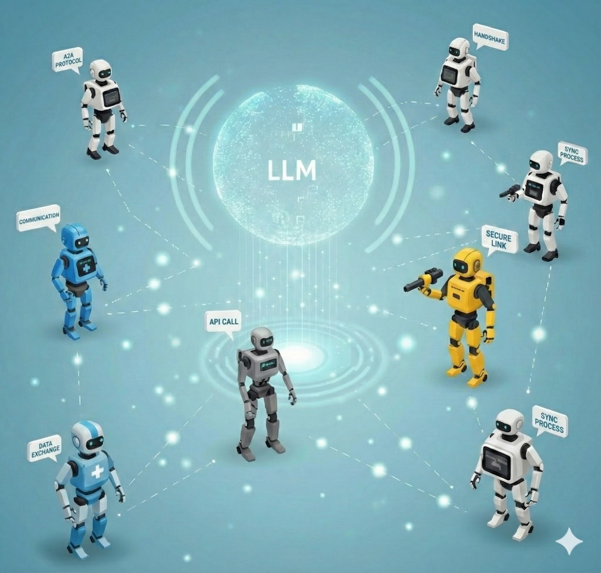
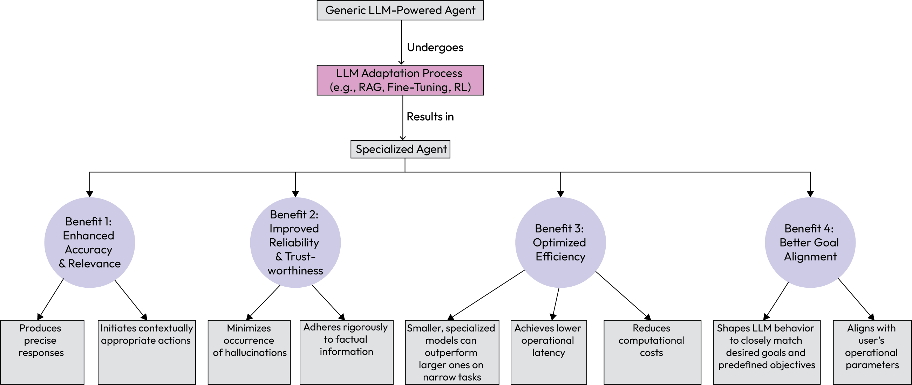
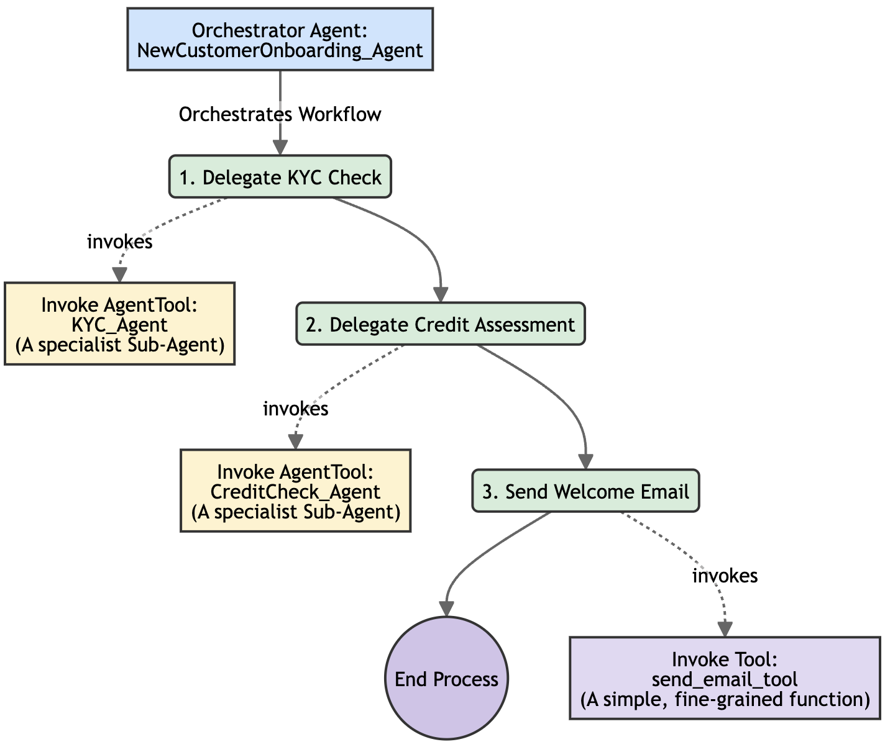
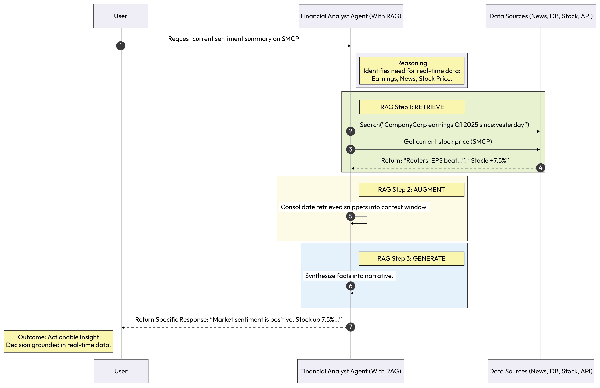
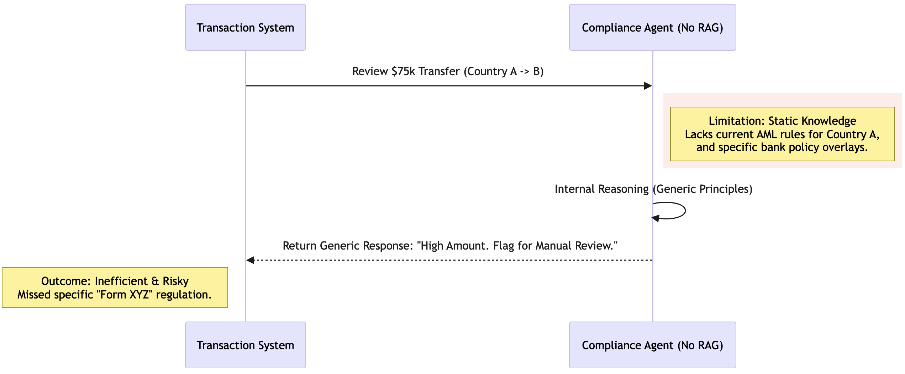
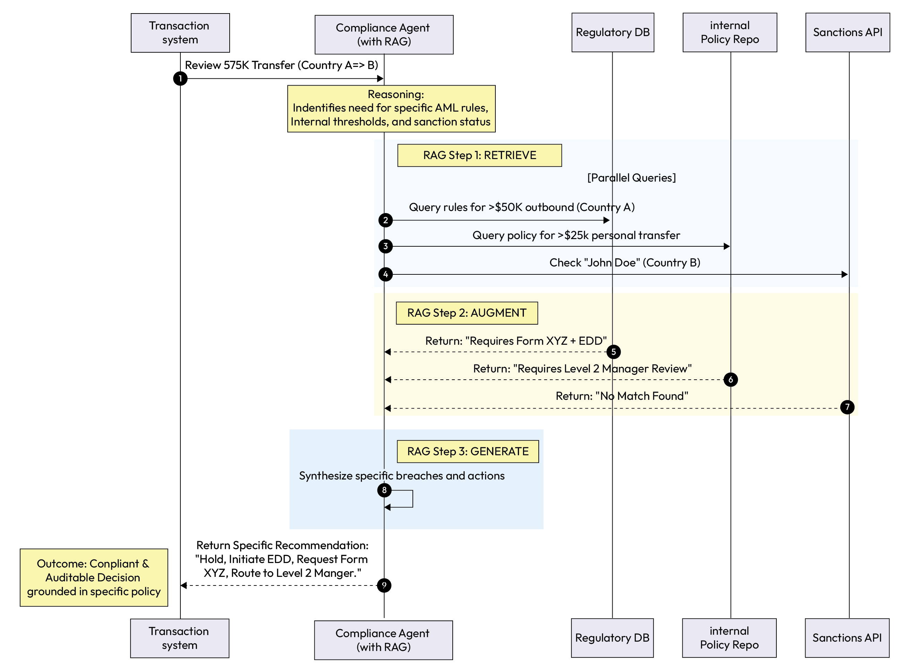

# Chapter 3: The Spectrum of LLM Adaptation for Agents: RAG to Fine-tuning

The Spectrum of LLM Adaptation
for Agents: RAG to Fine-tuning
In the previous chapter, we explored the critical considerations for selecting and deploying LLMs, establishing
them as the cognitive engines that drive the reasoning and decision-making capabilities of AI agents. We saw
how an LLM's capacity for understanding, planning, and tool use is fundamental to an agent's ability to perform
its designated functions effectively.
However, the journey to creating a truly proficient AI agent rarely ends with selecting a powerful, generalpurpose LLM. The initial wave of generative AI focused on monolithic frontier models, but the landscape is
evolving toward a distributed society of intelligent agents. To unlock business value, these agents must operate
correctly, reliably, and optimally within a specific enterprise context, which requires significant adaptation.

*Figure 3.1 – An LLM as the brain of agents (image generated with Google Imagen)*

In this chapter, we'll explore the techniques used to tailor these models. We'll begin by examining why
adaptation is essential, outlining the benefits of specializing a generic LLM for a specific agent's role. Then, we'll
introduce a hierarchical agentic architecture as a concrete blueprint for building advanced multi-agent systems.
Understanding this architecture will set the stage for our core discussion of the practical techniques that you'll
use to build and specialize agents within these systems, from RAG to fine-tuning and in-context learning
(ICL).
Chapter 3 58
In this chapter, we'll be covering the following topics:
From generic LLMs to specialized agents
A hierarchical agentic architecture for business process automation
Contextual enhancement: enhancement with RAG (agent-focused)
Fine-tuning for agentic capabilities
In-context learning for agent adaptation
Grounding the model output
From generic LLMs to specialized agents
While pretrained LLMs possess a vast range of general skills, they are, by design, generalists. In contrast,
enterprise gents need to be specialists, tailored to excel in specific domains such as finance, healthcare, or legal
services. These domains involve unique vocabularies, complex workflows, and proprietary data that generic
models aren't equipped to fully understand out of the box.
Another important shift is the move away from relying on a single, centralized LLM. We're now seeing a trend
toward distributed systems composed of multiple agents, with each potentially powered by its own "brain."
These internal models or LLMs can vary based on factors such as cost, performance, latency, or quality, and may
include different modalities or architectures depending on the specific role of the agent. This evolution is
exemplified by emerging industry practices often referred to s Router-Executor or Planner-Worker models. In
this book, we formalize these concepts in Chapter 5 through the Tool Routing and Supervisor Architecture
patterns, and we will explore the frameworks that support them later in the book.
As mentioned, an agent's purpose is to perform focused tasks, such as ensuring strict compliance or conducting
a risk assessment, with a level of precision and behavioral nuance that a general-purpose model is not
optimized for.
Therefore, adapting an LLM is a critical process for bridging the gap between broad potential and specialized
application. This tailoring is essential for transforming the agent's cognitive core into an expert for its
designated role.
The benefits of this specialization are clear and direct. It leads to enhanced accuracy and relevance, as the agent
learns to speak the language of its domain. It fosters improved reliability and trustworthiness by grounding the
model and reducing the risk of hallucinations. Specialization also drives optimized efficiency, as smaller,
focused models can deliver superior performance with lower latency and cost for specific tasks.
Finally, adaptation ensures better goal alignment, shaping the agent's behavior to precisely match its
operational objectives and constraints.
59 The Spectrum of LLM Adaptation for Agents: RAG to Fine-tuning

*Figure 3.2 – Agent specialization: adapting agents for task-specific execution*

Successfully navigating the path from a generic LLM to a specialized intelligence core for an agent involves a
strategic selection of adaptation techniques. Often, it's not a matter of choosing a single method, but rather a
thoughtful combination of strategies, carefully aligned with the agent's specific requirements and context, the
resources available for adaptation, and the precise level of customization needed to ensure that it performs its
role effectively and responsibly.
A thoughtful combination of adaptation strategies, carefully aligned with an agent's specific requirements, is
necessary for successfully navigating the path from a generic LLM to a specialized intelligence core for that
agent. We will transition from the foundational aspects of LLM selection to the diverse spectrum of techniques
used to tailor these models and the agents they empower, transforming them into highly specialized and
effective components ready for more sophisticated agentic tasks.
Another maturity model for agentic AI
In this section, we'll elaborate on the various levels of maturity, this time specifically in the context of agentic AI,
tracing the journey from simple, centralized models to complex, decentralized networks of collaborating agents.
This spectrum helps frame why different patterns (such as Multi-Agent Planning, Consensus, Resource
Allocation, and Trust Modeling) become essential as agentic systems grow in complexity and autonomy. The
use of these patterns is intended to address specific challenges that arise at each stage of adoption and maturity
in LLM-based and agentic applications.
In Chapter 1, we explored the GenAI Maturity Model. The last two levels of that model were single- and multiagent systems. Here we will expand those into their own levels of sophistication using the Agentic AI Maturity
Model as described below.
Chapter 3 60
Maturity level Description Scalability
insight
Compliance
insight
Key patterns/
methods
1. Basic agentic
systems
Single agents
handle specific,
well-defined tasks
semiautonomously,
using simple,
predefined
workflows and
function calls to
external APIs or
tools.
Adaptable but
rigid. Workflows
are relatively fixed,
which limits the
potential for
innovation.
Straightforward to
manage as tasks
are well-defined,
minimizing the
risk of policy
violations.
Single-agent,
single-LLM calling
tools with function
calling
2. Dynamic singleagent workflows
A single agent can
dynamically
choose from
variety of preselected tools or
APIs based on the
problem at hand,
allowing for more
flexible problemsolving.
More versatile and
efficient, as agents
can tackle more
complex problems
by selecting the
appropriate tools.
Manageable due to
the pre-selection
of approved tools,
but requires
careful monitoring
of agent behavior
as autonomy
increases
Basic agentic
system/singleLLM calling tools
with dynamic tool
selection
3. Introspective
patterns with
ReAct and
Reflexion
Single agents use
methods such as
ReAct and
Reflexion patterns
that incorporate
step-by-step
reasoning and selfreflection. This
enables them to
learn from their
actions and selfcorrect through
feedback loops.
The introduction
of feedback and
self-correction
allows agents to
handle more
complex tasks and
improve over time,
creating paths for
scalability.
Real-time
monitoring and
corrective
mechanisms
become essential
to ensure that
agents remain
aligned with
policies while
learning.
ReAct (Reasoning
and Action) and
Reflexion
61 The Spectrum of LLM Adaptation for Agents: RAG to Fine-tuning
Maturity level Description Scalability
insight
Compliance
insight
Key patterns/
methods
4. Multi-agent
systems
Multiple
specialized agents
collaborate to
handle complex
tasks. Each agent
focuses on
different, nonoverlapping
functions, and
their coordination
allows for parallel
processing.
Ideal for highscale
environments.
Tasks can be
distributed across
multiple agents,
enabling efficient
parallel processing
of complex
workflows.
More complex to
manage.
Monitoring
systems are
required to ensure
that all semiautonomous
agents collaborate
in ways that
adhere to
regulations.
Multi-agent
systems
5. Advanced multiagent coordination
with meta-agents
A "meta-agent" is
introduced to
oversee and
oordinate the
other agents. This
allows for dynamic
task reassignment
and real-time
planning
adjustments.
Enhanced
adaptability. The
system can scale
effectively even in
changing
environments due
to optimized task
distribution by the
meta-agent.
Meta-agents act as
overseers, helping
to maintain policy
adherence by
adjusting
workflows and
redistributing
tasks as needed.
Meta-agent policy
adherence,
advanced agent
coordination, and
conflict resolution
6. Self-correcting
agents: Agentic
workflows with
feedback
mechanisms for
self-learning
Advanced multiagent systems use
complex, multiturn feedback
loops. Agents
critique, correct,
and refine one
another's outputs
iteratively, leading
to continuous
process
improvement.
Highly scalable
with continuous
improvement built
in. These systems
can evolve in real
time, making them
extremely efficient
for dynamic tasks.
Most complex.
Automated
compliance checks
and self-corrective
actions are
necessary to
ensure that agents
stay aligned with
policies while
adapting.
Multi-agent
learning systems
Table 3.1 - Agent and LLM maturity spectrum
To unlock business value for your organization or for a specific industry or functional area, we need to ensure
that the organization operates correctly, reliably, and optimally within the specific enterprise context. This is
only feasible if we are able to solve each of the problems and challenges that arise as the levels of complexity and
Chapter 3 62
sophistication increase. Models and agents often require significant adaptation, augmentation, guardrails,
policy adherence, steering, and collaboration.
This chapter moves from the foundational aspects of LLM selection to the wide range of techniques for tailoring
these models (and the agents they enable) into specialized, high-performing components. These agents may
serve as atomic units that handle simple, narrowly defined tasks or operate as more complex, compound
systems designed for sophisticated workflows.
The granularity of agents
As we move toward the building of more advanced systems, a key design question arises: how large or granular
should an agent be? Should a single agent encompass an entire business process, or should it ocus on a simple,
atomic task as part of a larger AI orchestration?
There is no single correct answer, as the optimal granularity depends on the problem. An agent can be a finegrained, atomic unit of functionality (e.g., an agent whose only job is to check inventory levels) or a coarsegrained system that manages a compound, multi-step process (e.g., an agent orchestrating the entire order
fulfillment process).
The architecture we will explore next provides a practical model for how these different granularities can coexist
and collaborate effectively. As agentic systems evolve from simple to increasingly complex architectures, the
demands on adaptation grow significantly, necessitating more advanced and flexible strategies to maintain
performance, coherence, and responsiveness. We will investigate why such adaptation is not merely beneficial
but often crucial for enhancing an agent's performance, its reliability, and its relevance to the tasks at hand.
Our exploration will cover methods for dynamically enriching an LLM's knowledge at the moment of inference
through RAG, dive into the more enduring model modifications achieved via various fine-tuning strategies,
including the increasingly popular PEFT approaches, and examine the flexibility of ICL for on-the-fly behavioral
adjustments.
Throughout this discussion, we will also underscore the vital importance of grounding the outputs of these
adapted models to maintain accuracy and foster trust, a non-negotiable aspect of developing responsible and
dependable agentic AI systems.
A hierarchical agentic architecture for business process
automation
The example we're about to show represents a significant evolution from the concept of a single agent
navigating a flat list of tools. That monolithic approach, while functional for simple automation, struggles to
scale and maintain clarity as process complexity grows. Instead, this architecture stablishes a structured,
observable ecosystem that mirrors a well-run organization, designed for modularity and resilience.
At the top of this hierarchy are coarse-grained orchestrator agents. These agents function like AI conductors;
their primary responsibility is not to execute every small step, but to understand the end-to-end business
process and conduct the overall workflow by designing and supervising the collaboration between specialized
agents.
63 The Spectrum of LLM Adaptation for Agents: RAG to Fine-tuning
To achieve the overall goal, they delegate specialized, compound tasks to a team of fine-grained sub-agents.
Each sub-agent is an expert, designed and adapted to perform a specific function reliably, such as analyzing a
document, checking compliance, or accessing a specific database.
In a hierarchical agentic architecture, a complex workflow is broken down and delegated to specialized agents.
We can visualize this structure with a practical example.

*Figure 3.3 – Orchestrator agent architecture*

In the figure, the NewCustomerOnboarding_Agent acts as the orchestrator, or the AI conductor, responsible or
managing the end-to-end business process of onboarding a new customer. To achieve this high-level goal, it
delegates specific, compound tasks to a team of specialized sub-agents.
It invokes a KYC_Agent to handle the complex know your customer (KYC) check and a CreditCheck_Agent to
perform the credit assessment. For simpler, atomic tasks, such as sending the final welcome email, the
orchestrator directly invokes a fine-grained send_email_tool. This architecture allows the orchestrator to focus
on the overall process flow, delegating specialized work without needing to know the intricate details of how
each sub-agent or tool operates.
Chapter 3 64
By coordinating these specialist agents, the orchestrator can effectively manage and complete complex business
processes that would be too brittle or convoluted for a single agent to handle. To see how this powerful
structure is built, we will break down the architecture into its three core capabilities: the core components that
define every agent, the hierarchical structure that organizes them, and the governance and observability
framework that ensures reliability.
The core components: agents and their capabilities
To implement the hierarchical architecture described above, we must move from conceptual blocks to a concrete
programming model. While modern AI development often relies on high-level frameworks (which we will dive
into in Chapter 15), understanding the foundational code structure is essential for building production-grade
systems.
In this book, we use Python as our primary implementation language. Python's dominance in the AI ecosystem
and its support for object-oriented programming make it the ideal choice for defining modular, reusable agentic
components. By defining a base blueprint for our agents, we ensure that every specialist, from a simple email
tool to a complex orchestrator, shares a predictable interface.
This onsistency is established by defining two fundamental aspects for every agent: its core definition and its
## spectrum of capabilities:

Agent definition: Every agent is an instance of a base LLMAgent class, ensuring that all actors in the
system share a common set of foundational properties and methods. This inheritance provides
consistency and simplifies development. The core of each agent instance is its cognition, powered by an
assigned LLM that acts as its "brain." This cognitive core is responsible for all higher-order functions:
interpreting its environment, reasoning through problems, formulating plans, and making decisions
within its given context.
The capability spectrum-from simple tools to sophisticated AgentTools: An agent's power comes
from the "toolbox" it has at its disposal. In this architecture, that toolbox is not a simple list but a
## spectrum of capabilities, ranging from atomic functions to entire self-contained agents:

Tools (fine-grained functions): A tool is the most basic building block of action. It is a direct,
stateless wrapper around a single function or API endpoint, designed to perform one specific,
atomic action. These are the fundamental action verbs an agent can use to interact with its
environment.
Examples: A send_email tool, a query_database tool, or a calculate_amortization
tool.
Usage: Tools are best used for simple, deterministic tasks that do not require complex
reasoning or a multi-step process to execute. They are the simple, reliable actions an
agent can take.
AgentTools (sophisticated, compound agents): An AgentTool represents a far more
sophisticated pability. Critically, an AgentTool is a complete, self-contained, fine-grained
agent (a sub-agent) that has been packaged and exposed as a tool for other agents to use. It is a
◦
▪
▪
◦
65 The Spectrum of LLM Adaptation for Agents: RAG to Fine-tuning
powerful straction that can have its own internal state, a multi-step workflow, and its own
dedicated set of tools.
Examples: A CustomerSentimentAnalyzer agent that takes raw text as input, internally
uses several NLP tools to process it, and returns a structured sentiment score. A
DataProfiler agent that accepts a dataset, internally uses various statistical tools to
perform a full analysis, and returns a comprehensive data profile.
Usage: AgentTools are designed to be invoked by an orchestrator agent to delegate a
complex, multi-step sub-task, allowing the orchestrator to manage workflows without
needing to know the intricate details of how the sub-task is performed.
The hierarchical structure: orchestrators and specialists
This architecture is deliberately not flat. It is a hierarchy of control and specialization, designed to mirror n
effective organizational structure. This allows for greater modularity, oversight, and scalability. Let's look at the
structure:
Sub-agents (fine-grained specialists): These are the specialist workers or domain experts of the
system. Each sub-agent is an LLMAgent instance designed and adapted to become an expert at a specific
compound task or within a narrow domain. They are the components that are packaged into
AgentTools, making their specialized expertise available to the broader system.
Example: A KnowYourCustomer_Agent is a perfect example of a sub-agent. Its sole purpose is to
perform comprehensive KYC checks. To do this, it might have its own internal workflow and use
several simple tools, such as query_identity_database, check_sanctions_list, and
verify_address_api.
Orchestrator agents (coarse-grained orchestrators): These are the managers or process oordinators
of the architecture. An orchestrator agent's primary responsibility is not to perform the low-level tasks,
but to orchestrate sub-agents to complete an end-to-end business process. Their workflows are
designed to directly reflect a high-level business objective.
Example: A NewCustomerOnboarding_Agent is a perfect example of an orchestrator agent. Its
primary responsibility is to manage the end-to-end business process of onboarding a new
customer. To achieve this goal, it functions as an "AI conductor," orchestrating the collaboration
between specialized sub-agents by delegating compound tasks, such as a
KnowYourCustomer_Agent for identity verification or a CreditCheck_Agent for financial
assessment. While it manages the complex workflow, it may also use its own simple tools for
straightforward final actions, such as a send_email_tool to welcome the customer.
Toolbox composition: An orchestrator agent's toolbox consists primarily of AgentTools, the
specialized sub-agents it manages. It delegates work to them to handle the complex parts of the
process. The orchestrator might also have a few simple tools of its own, but these are typically
for straightforward tasks such as sending a final notification or logging the completion of the
overall process.
▪
▪
◦
◦
◦
Chapter 3 66
Governance and observability via callbacks
A sophisticated, multi-agent architecture is only as good as our ability to manage and understand it. To prevent
the system from becoming an opaque "black box," a robust observability framework would be beneficial and
essential. For instance, consider a scenario where gent adaptation fails, such as an agent hallucinating a tool
call with invalid parameters during a high-stakes transaction. Without granular tracing, this results in a silent
failure. By implementing callbacks, we gain the visibility needed to detect these anomalies immediately. We will
explore the specific patterns to mitigate such failures, specifically Instruction Fidelity Auditing for verification
and Adaptive Retry for recovery, in detail in Chapter 6 and Chapter 7, respectively.
This instrumentation of the agent's workflow is the practical implementation of the AgentOps and governance
principles discussed in Chapter 2, in the AgentOps: managing LLMs in agentic systems section. The mechanism for
achieving this is a comprehensive system of callbacks, which provide hooks into the critical moments of every
component's life cycle, enabling powerful, real-time debugging, monitoring, and governance.
Let's explore some examples of callbacks:
Monitoring the cognitive core (on_model_start/on_model_end): These callbacks fire whenever any
agent's "brain" queries its LLM, providing a granular window into its thought process. The purpose is to
log the exact prompt sent to the model, any intermediate reasoning steps, the final generated response,
and key performance metrics such as token counts and latency.
This level of detailed traceability is essential for auditing agent decisions for compliance, diagnosing
hallucinations by inspecting the exact context used, and managing operational costs. It lays the
groundwork for achieving true explainability in the agent's behavior.
Tracking actions and interactions (on_tool_start/on_tool_end): These callbacks are triggered
whenever any tool or AgentTool is invoked, effectively logging every action an agent takes upon its
environment. Their purpose is to create an immutable audit trail, recording which agent called which
tool, the precise input arguments it used, the data that was returned, and any errors encountered.
This is vital for security and debugging, as it helps isolate failures. It helps pinpoint whether a fault lies
in the agent's reasoning or in the execution of the tool itself. In a multi-agent system, this provides a
clear view of the chain of delegation from an orchestrator to a sub-agent.
High-level process oversight (on_agent_start/on_agent_end): These callbacks track the entire life
cycle of an individual agent's execution run from beginning to end. This provides the high-level
perspective needed for business-level monitoring. Their purpose is to log the agent's initial goal, its
final outcome (success or failure), and the total duration.
This data s directly into business process monitoring (BPM) dashboards nd is essential for
tracking and enforcing service-level agreements (SLAs), connecting the technical performance of the
agentic system directly to business value.
67 The Spectrum of LLM Adaptation for Agents: RAG to Fine-tuning
This refined architecture establishes a powerful and scalable paradigm for building agentic systems. It creates a
## clear and logical separation of concerns that is easy to maintain and extend:

Orchestrator agents own the what and when-the high-level business process flow and orchestration
Sub-agents own the how-the expert execution of a specific, complex task they have been specialized
for
Tools represent the most basic, atomic capabilities that any agent can use to interact with its
environment
By orchestrating specialist sub-agents (as AgentTools), an orchestrator agent can execute complex, end-to-end
business processes in a way that is far more robust, modular, and maintainable than a single, monolithic agent
attempting to manage every detail itself.
The integrated callback system is the critical final piece, ensuring that this entire multi-agent ecosystem is not
just powerful, but also transparent, governable, and truly ready for production deployment.
Now that we have established a robust architecture for organizing agents, we can turn our attention to the
agents themselves. The following section explores the critical process of transforming a generic LLM into the
specialized cognitive core that each agent needs to perform its role effectively.
Contextual enhancement: stage 1, enhancement with
RAG
As emphasized in Chapter 1, the principle that context is king holds especially true for LLMs, and its significance
becomes even greater in the context of AI agents. These agents must consistently make well-informed decisions
and execute precise actions; however, these abilities are highly dependent on access to current, relevant, and
accurate information.
In this regard, RAG has emerged as a powerful and widely adopted technique to dynamically furnish an agent's
LLM core with essential context precisely when it's needed, at the point of inference. Rather than an agent
operating solely on the basis of its LLM's static, pretrained knowledge, which can inevitably become outdated or
lack crucial niche details, RAG empowers the agent with the capability to actively fetch pertinent information
from designated external and up-to-date knowledge sources.
Within an agentic system, RAG serves as a key mechanism for enhancing an agent's operational intelligence.
Agents often need to interact with proprietary or rapidly changing data, ranging from internal enterprise
knowledge bases such as detailed product specifications, confidential customer interaction histories, and
internal policy documents to dynamic external information such as real-time news feeds or current market
data. RAG allows agents to query and retrieve this specific information on the fly, ensuring their actions are
based on the most current and relevant knowledge available.
This ability is fundamental to improving factual grounding and substantially reducing the tendency for
hallucinations. When an agent's responses or decisions are directly informed by retrieved documents, it can
produce more factually accurate outputs. Moreover, this often allows the agent to provide citations or references
back to the source documents, which dramatically increases transparency and user trust in the agent's
pronouncements.
Chapter 3 68
Consequently, the overall relevance of the agent's actions is enhanced, as the retrieved context ensures that the
agent's LLM is reasoning over information that is directly pertinent to the immediate task or query at hand,
leading to more coherent plans, more appropriate actions, and ultimately, more successful goal achievement.
To truly appreciate how RAG transforms agent capabilities, let's examine specific operational flows for the
agents in our examples. We will have two contrasting scenarios: one where the agent operates with RAG and the
other without this dynamic retrieval mechanism.
RAG-powered customer support agent
In today's manding customer service landscape, an AI-powered customer support agent is frequently the first
point of contact, and its primary goal is to deliver swift, accurate, and genuinely helpful resolutions.
Users expect solutions tailored to their specific problems, not generic, time-wasting advice. However, this
expectation presents a significant challenge when the issues encountered are highly specific to a particular
product model, involve obscure error codes, or, crucially, stem from very recent changes such as a software or
firmware update that occurred "last night."
These are precisely the kinds of situations where an agent relying solely on a general-purpose LLM's static,
pretrained knowledge is likely to falter.
To bring this into sharp focus, imagine such a customer support agent tasked with assisting a user who presents
a common yet potentially complex issue. The user is seeking immediate, effective help for a problem that has
just arisen with their specific device due to a recent software update. Let's compare how an agent would handle
this with and without RAG.
## Here is the scenario:

My ProWidget X is showing "Error E404" after the update last night.
## Let's look at the flow options:

## Flow without RAG,the generalist's failure:

User query received: The agent's LLM core processes the user's statement.
LLM reasoning (based on pretrained knowledge): The LLM accesses its general knowledge. It might
know about common error codes or general troubleshooting steps, such as restarting devices. However,
if "ProWidget X" or "Error E404" are new or specific to a recent update, this information won't be in its
training data.
## Generated response: The agent falls back on generic advice:

I'm sorry you're experiencing Error E404. Please try restarting your ProWidget
X. If that doesn't work, ensure your internet connection is stable.
Outcome: This response is unhelpful because the error is due to a known firmware bug. The user
remains frustrated, resolution time increases, and the agent appears ineffective and out of touch.
1.
2.
3.
4.
69 The Spectrum of LLM Adaptation for Agents: RAG to Fine-tuning
## Flow with RAG, the specialist's success:

## User query received: The agent's LLM core processes the statement:

"My ProWidget X is showing 'Error E404' after the update last night."
LLM reasoning (identifies need for specific information): The LLM recognizes "ProWidget X",
"Error E404", and "after the update" as key entities requiring specific, potentially recent,
information. This triggers the RAG process.
RAG step 1 (retrieve): The agent executes a targeted query against its integrated knowledge sources
(e.g., a vector database containing product manuals and recent service bulletins). The query might be
search("ProWidget X Error E404 firmware update June 2025").
RAG step 2 (augment): The retrieval system returns the most relevant document snippets, such as the
following:
## Snippet 1 (Service Bulletin #SB2025-06-26):

"Issue: Error E404 on ProWidget X units post-June 25th firmware push (v1.2.2).
Cause: Firmware mismatch with server authentication. Solution: Advise users to
perform immediate firmware update to patch v1.2.3 available via Settings >
Update, or guide through firmware rollback procedure detailed in KB Article
#FW789."
## Snippet 2 (Knowledge Base Article #FW789):

"ProWidget X Firmware Rollback: 1. Navigate to Settings > Advanced. 2. Select
'Firmware Management'. 3. Choose 'Rollback to Previous Version'..."
RAG step 3 (generate): The LLM synthesizes this retrieved, authoritative information into a helpful,
## specific, and empathetic response:

"I understand you're seeing Error E404 on your ProWidget X after the recent
update. This is a known issue related to the new firmware. The recommended
solution is to update to patch v1.2.3, which you can find in Settings > Update.
Would you like me to guide you through that, or would you prefer to try a
firmware rollback as detailed in our knowledge base?"
Outcome: The agent provides an accurate, actionable solution based on the very latest information.
This leads to a much faster resolution, higher user satisfaction, and demonstrates the agent's
competence. The ability to refer to the knowledge base article further builds trust.
1.
2.
3.
4.
5.
6.
Chapter 3 70
Key aspect Agent without RAG Agent with RAG
Knowledge source Static, pretrained model data Dynamic, external knowledge base
(service bulletins)
Agent's insight No context for the specific error or
update
Understands the error is a known,
recent issue with a documented fix
Generated response Generic troubleshooting
("restart device")
Specific, actionable solution
("update to patch v1.2.3")
Business outcome User frustration, increased
support time
Fast resolution, high user
satisfaction, and increased trust
Table 3.2 - Impact of RAG in agentic experiences
Let's ompare both scenarios; we can clearly see the transformative impact of RAG. The agent without RAG,
constrained by its static training data, defaults to generic and unhelpful advice. Its inability to access the most
current service bulletins renders it useless for timely, specific problems, leading directly to user frustration.
The integration of RAG, however, fundamentally shifts the agent's capabilities from a simple conversationalist
to a competent problem-solver. By actively querying dedicated knowledge sources, the agent grounds its
reasoning in verifiable, real-time facts. This allows it to provide accurate, actionable solutions that build user
confidence and dramatically improve the effectiveness of the support interaction.
Financial analyst agent leveraging RAG for timely market
insights
In the st-paced world of financial markets, decisions must be grounded in the most current and
comprehensive information available. A financial analyst agent is often tasked with synthesizing vast amounts
of rapidly changing data to provide actionable insights for investment strategies, risk assessment, or market
understanding.
The challenge here is extreme timeliness; market sentiment can shift in minutes based on new information, and
an LLM relying on its potentially months-old training data would be severely disadvantaged. An earnings report
release, for instance, can dramatically alter a company's outlook and market perception literally overnight. To
bridge this gap, organizations typically architect a retrieval pipeline using a vector database to index real-time
streams, which the agent then queries dynamically before generating a response.
To illustrate how RAG addresses this need for currency and depth, consider a financial analyst agent assigned a
critical task. This request demands an understanding of financial performance, immediate market reactions,
and broader sentiment, all within a 24-hour window.
## Here is the scenario:

## Generate a concise summary of current market sentiment regarding CompanyCorp (Ticker:

SMCP) following their Q1 earnings release yesterday.
71 The Spectrum of LLM Adaptation for Agents: RAG to Fine-tuning
## Let's look at the flow options:

## Flow without RAG, the outdated generalist:

Task received: The agent's LLM processes the request.
LLM reasoning (based on pretrained knowledge): The LLM's knowledge about CompanyCorp is
limited to its last training update, which could be months old. It has no information about yesterday's
specific earnings figures, real-time market reactions, or subsequent analyst commentary.
## Generated response: The agent produces a generic, outdated, and therefore irrelevant summary:

"CompanyCorp is a leading technology company focused on cloud solutions.
Historically, their earnings have shown steady growth..."
Outcome: The summary is useless for understanding current market sentiment. It provides no value for
timely investment decisions and could lead to significant strategic errors based on old data.
## Flow with RAG, the real-time specialist:

Task received: The agent's LLM processes the request for a current sentiment summary on SMCP.
LLM reasoning (identifies need for real-time financial data): The LLM recognizes the need for very
recent information: SMCP's Q1 earnings figures, financial news published in the last 24 hours, and stock
performance data.
RAG step 1 (retrieve): The agent orchestrates queries to multiple connected data sources, such as the
following:
Financial news APIs (e.g., Bloomberg and Reuters) for articles matching search("CompanyCorp
OR SMCP earnings Q1 2025" since:yesterday)
A press release database for SMCP's official Q1 earnings announcement
A stock market data API for SMCP's price movement and volume since yesterday's close
## RAG step 2 (augment): Key information snippets are retrieved and consolidated:

## News snippet 1:

"Reuters (June 27, 2025): CompanyCorp (SMCP) Q1 EPS beats estimates at
$1.25 vs $1.10 expected. Revenue up 15% YoY. Stock surges 7% in pre-market
trading."
## Earnings release highlight:

"CompanyCorp Q1 2025 Report: Net income $500M, driven by 25% growth in AI
services division."
Market data:
"SMCP: Current Price $150.00 (+$10.50, +7.5% since yesterday's close)."
1.
2.
3.
4.
1.
2.
3.
◦
◦
◦
4.
◦
◦
◦
Chapter 3 72
RAG step 3 (generate): The LLM synthesizes these diverse, current data points into a coherent, datarich summary:
"Following CompanyCorp's (SMCP) Q1 2025 earnings release yesterday, June 26th,
market sentiment is strongly positive. The company reported an EPS of $1.25,
beating analyst expectations, with revenues up 15% year-over-year, largely driven
by a 25% growth in its AI services division. The stock has reacted favorably,
currently trading up 7.5% at $150.00 since yesterday's close."
Outcome: The agent delivers a timely and actionable summary explicitly grounded in the latest
financial reports and market reactions. This provides genuine value for decision-making.
## The ollowing diagram illustrates the flow:

*Figure 3.4 – Example flow for RAG with a real-time specialist*

The following table summarizes these stark differences, highlighting how the integration of RAG shifts the
## agent's capability from generic description to actionable insight:

Key aspect Agent without RAG Agent with RAG
Knowledge source Static, outdated training dataReal-time financial news APIs,
press releases, and market data
feeds
5.
6.
73 The Spectrum of LLM Adaptation for Agents: RAG to Fine-tuning
Key aspect Agent without RAG Agent with RAG
Agent's insight No knowledge of recent eventsSynthesizes yesterday's earnings
figures, market reaction, and news
Generated response Generic, irrelevant company
description
Data-rich, timely, and actionable
market summary
Business outcome Misinformed decisions and
potential financial loss
Informed strategic planning and
timely investment decisions
Table 3.3 - Impact of RAG on a financial analyst agent
This inancial analysis scenario underscores how RAG empowers an agent to transcend the limitations of static
knowledge. Without it, the agent's outputs are anachronistic and potentially misleading, failing entirely to
capture the impact of market-moving events. It offers no value in a domain where currency is a primary
requirement.
With RAG, however, the agent transforms into a dynamic information synthesizer, actively seeking out and
integrating the latest financial news, official company reports, and real-time market data to construct a
comprehensive understanding of the current situation. This is crucial for informed trading and investment
strategies.
Compliance agent ensuring adherence with RAG in transaction
monitoring
Within financial institutions, the role of a compliance agent is critical, involving the meticulous review of
transactions to prevent illicit activities and ensure adherence to a complex web of evolving regulations.
The stakes are exceptionally high, with non-compliance potentially leading to severe regulatory penalties,
financial losses, and significant reputational damage. An agent tasked with such responsibilities must navigate
specific, often jurisdiction-dependent, anti-money laundering (AML) rules, internal bank policies that may be
even stricter than public regulations, and constantly updated international sanctions lists. Relying on a generic
LLM's baseline knowledge for such a sensitive and dynamic task would be fraught with unacceptable risk.
Envision such a compliance agent within a major bank. Its immediate task is to review a high-value,
international wire transfer. The agent must determine whether this transaction is permissible according to all
relevant external regulations and internal bank policies.
## Here is the scenario:

A $75,000 wire transfer from an account in Country A to a personal account of Mr. John
Doe in Country B.
Chapter 3 74
## Let's look at the flow options:

## Flow without RAG, the risky generalist:

Transaction details received: The agent's LLM core processes the transaction information.
LLM reasoning (based on general pretrained knowledge): The LLM might have general knowledge
of AML principles, but is highly unlikely to know the specific, current AML regulations of Country A and
Country B, the bank's detailed internal policy nuances, or whether Mr. John Doe's name has recently
appeared on a sanctions list.
Generated recommendation/action: The agent makes a decision based on overly simplistic rules. It
## might be overly cautious and inefficient, or worse, miss a critical detail:

"Transaction amount is high ($75,000). Flag for manual review."
Outcome: This approach leads to either inefficient processing (flagging too many benign transactions)
or, more severely, non-compliance if a specific, newly enacted regulation is missed. This exposes the
institution to significant legal and financial risk.
This diagram illustrates the limitations of relying on pretrained knowledge, where the agent misses
## critical regulatory nuances such as Form XYZ requirements:

*Figure 3.5 – The risky generalist workflow*

This better safe than sorry approach highlighted in Figure 3.5 creates operational bottlenecks and leaves the
institution vulnerable to specific regulatory breaches that the model simply doesn't know about. To close this
gap, we must move from a closed system to an open one. Let's examine how the workflow transforms when we
inject real-time context via RAG, turning the agent into a precise gatekeeper.
## AI orchestration workflow with RAG as the precise gatekeeper:

Transaction details received: The agent processes the $75,000 wire transfer details.
LLM reasoning (identifies need for specific regulatory and policy data): The LLM determines it
needs to check current AML rules for both countries, the bank's internal policy for this specific
transaction type, and global sanctions lists.
1.
2.
3.
4.
1.
2.
75 The Spectrum of LLM Adaptation for Agents: RAG to Fine-tuning
## RAG step 1 (retrieve): The agent queries its integrated, specialized data sources:

A regularly updated regulatory intelligence database for rules on large outbound transfers from
Country A and inbound transfers to Country B
The bank's internal, version-controlled policy document repository
A real-time sanctions screening API with the recipient's details
## RAG step 2 (augment): The system retrieves critical, specific contextual information:

## Regulatory snippet (effective June 1, 2025):

"All outbound wire transfers from Country A exceeding $50,000 USD to
individual recipients in non-FATF member states require submission of Form
XYZ and enhanced due diligence."
## Internal policy snippet (Bank Policy Manual v3.1.2):

"International wire transfers to personal accounts in Country B exceeding
$25,000 USD require documented proof of purpose and automatically trigger a
Level 2 Manager review queue."
## Sanctions check result (as of June 27, 2025):

"API Response: John Doe, DOB 1980-01-15, Country B - No active sanctions
matches found."
RAG step 3 (generate): The LLM processes these retrieved facts and generates detailed, grounded
## recommendation with a clear action plan:

"Transaction Review: $75,000 wire from Country A to John Doe, Country B.
- Sanctions: Cleared. No matches found for John Doe.
- External regulation: Breach. Transaction exceeds the $50,000 threshold for
Country A, requiring Form XYZ and enhanced due diligence (EDD).
- Internal policy: Breach. Transaction exceeds the $25,000 threshold for a
personal account in Country B, requiring documented proof of purpose and a
mandatory Level 2 Manager review.
- Recommendation: Hold transaction. Initiate EDD, request Form XYZ, and obtain
documented proof of purpose. Route to the Level 2 Manager review queue upon
completion."
Outcome: The agent makes an accurate, highly compliant, and risk-aware recommendation. It
identifies specific, layered requirements from different sources, leading to correct processing and
creating an auditable decision trail.
## The following diagram illustrates the workflow of the RAG-equipped compliance agent:

3.
◦
◦
◦
4.
◦
◦
◦
5.
6.
Chapter 3 76

*Figure 3.6 – Example workflow leveraging a RAG-enabled agent*

The ollowing table summarizes these differences, highlighting how access to live data transforms the agent's
role from a simple alert generator to a sophisticated compliance partner.
Key aspect Agent without RAG Agent with RAG
Knowledge source General, outdated knowledge of
AML principles
Real-time regulatory databases,
internal version-controlled
policies, and sanction-screening
APIs
Agent's insight Cannot apply specific, current
rules for the transaction's context
Identifies and cross-references
multiple, layered compliance
obligations from different sources
Generated response Simplistic action (flag for
review)
A detailed, multi-step, and
auditable recommendation
77 The Spectrum of LLM Adaptation for Agents: RAG to Fine-tuning
Key aspect Agent without RAG Agent with RAG
Business outcome High risk of non-compliance and
financial penalties
Minimized compliance risk,
auditable process, and operational
efficiency
Table 3.4 - Impact of RAG on a compliance agent
In the high-stakes domain of financial compliance, the difference made by RAG is stark. An agent without RAG
operates as a blunt instrument, relying on generalized knowledge that cannot navigate the intricate and
dynamic landscape of international regulations and internal policies. This deficit leads to either inefficient
operations or, far more dangerously, missed compliance obligations that attract severe penalties.
The RAG-equipped compliance agent, in contrast, functions as a precise and informed gatekeeper. It
dynamically consults the latest versions of relevant AML directives, specific internal bank policies, and real-time
sanctions lists.
This ability to retrieve and synthesize specific, multi-faceted information allows the agent to make nuanced,
risk-aware decisions, thereby safeguarding the institution, ensuring auditable compliance, and streamlining the
review process.
Analyzing the scenarios
These detailed flows clearly demonstrate that RAG isn't just about accessing more data; it's about providing
gents with the right data at the right time to make them significantly more effective, reliable, and aligned with
real-world operational needs. The ability to dynamically retrieve and incorporate context is fundamental to
building truly intelligent and useful AI agents.
The sophistication of RAG implementations can be understood as a spectrum, with each level introducing more
complexity and capability. Importantly, this spectrum directly corresponds to the GenAI Maturity Model
discussed in Chapter 1. As an organization's needs evolve from simple contextual enhancement to building
complex, collaborative agentic systems, the type of RAG it employs will likewise advance.
The following table maps each level of RAG sophistication to its corresponding stage in the maturity journey:
RAG level Description Corresponding maturity level(s)
"Vanilla" RAG A straightforward approach for
basic contextual augmentation
from a single knowledge source
Level 2 - Contextual
enhancement: This is the
foundational application of RAG,
focused on overcoming basic
model limitations by providing
external context from a single
knowledge base
Chapter 3 78
RAG level Description Corresponding maturity level(s)
Advanced RAG More sophisticated methods to
improve the quality, relevance,
and trustworthiness of retrieved
context, often from multiple
sources
Level 4 - Grounding and
evaluation: The focus on reranking, fusion, and citing sources
aligns perfectly with the need for
reliable, verifiable, and wellgrounded agent outputs
Agentic RAG An emerging pattern that uses
autonomous agents to manage
and orchestrate the entire retrieval
process itself, often involving
collaboration
Levels 5 and 6 - Single and
multi-agent systems: This
advanced pattern is a hallmark of
mature agentic architectures,
where specialized agents
collaborate to perform complex
tasks, in this case, sophisticated
information retrieval
Table 3.5 - Mapping the RAG spectrum to the GenAI Maturity Model
Regardless of the complexity, the fundamental objective of any RAG implementation remains consistent: to
provide the agent's LLM core with the specific, accurate, and timely information it needs to execute its sensereason-plan-act cycle with maximum effectiveness and reliability.
While RAG offers a powerful solution for dynamic, inference-time contextualization by bringing external
knowledge to the LLM, certain agent requirements may call for more enduring modifications within the LLM's
intrinsic knowledge or its ingrained behavioral patterns. Such deep-seated adaptations are typically achieved
through the process of fine-tuning, which we will explore next.
Fine-tuning for agentic capabilities
Fine-tuning represents a more profound and persistent method of LLM adaptation, as it involves directly
modifying the model's internal parameters, or weights, through additional training on specialized datasets.
This process allows us to deeply embed specific knowledge, instill particular skills, or shape the behavioral
nuances of the LLM to align it more precisely with an AI agent's designated role and operational requirements.
Unlike RAG, which augments the model with external information at the moment of use, fine-tuning
fundamentally alters the model's inherent knowledge base and its default response tendencies. This makes the
model intrinsically more adept at certain tasks or within particular domains.
Domain specialization
When developing sophisticated agentic systems, fine-tuning can be strategically employed to achieve several
ritical outcomes. A primary application is domain specialization. By training an LLM on a comprehensive
corpus of domain-specific texts, such as legal case files for a legal research agent, medical journals for a
diagnostic support agent, or financial regulatory documents for a compliance agent, the model becomes much
more fluent in the specific terminology.
79 The Spectrum of LLM Adaptation for Agents: RAG to Fine-tuning
It also gains a better understanding of the key entities and their relationships within that domain and can
generate outputs that are far more contextually appropriate and accurate for that field. This ensures that the
agent truly speaks the language of its operational environment.
Another key objective is the development of task-specific skills. Agents are often designed to excel at particular
functions. These might include generating code in a specific programming language, summarizing lengthy
reports into a predefined structured format, extracting precise named entities from unstructured text, or
engaging in a particular type of dialogue.
Fine-tuning the agent's LLM on datasets composed of numerous examples of these specific tasks can
significantly enhance its proficiency and reliability in performing them. For instance, an LLM could be finetuned on a dataset consisting of the following format: "user request" -> "correct API tool_call_json"
pairs. Such training would drastically improve an agent's ability to reliably invoke external tools with the correct
parameters.
Additionally, fine-tuning is instrumental for behavioral alignment. This involves shaping the agent's LLM to
follow desired conversational styles, for example, a customer service agent may need to be consistently
empathetic, while a technical support agent might need to be exceptionally concise and direct.
It can also be used to ensure the model follows complex, multi-step instructions with greater fidelity.
This alignment can extend to reinforcing adherence to specific ethical guidelines or safety protocols that might
not have been fully ingrained in the base model. An agent could, for example, be fine-tuned to always ask for
explicit confirmation before executing a potentially irreversible action.
The spectrum of tuning: parameter-efficient fine-tuning to full
fine-tuning
Model adaptation or fine-tuning involves a spectrum of options. These start from simpler, less expensive, less
time-consuming techniques, such as parameter-efficient fine-tuning (PEFT), all the way to full fine-tuning
(FFT), where the entire weights of the models are changed. Thus, when considering fine-tuning, a significant
choice lies between FFT and various PEFT methods. FFT involves updating all, or a very substantial portion, of
the LLM's parameters.
PEFT techniques, such as Low-Rank Adaptation (LoRA), adapter tuning, or prompt tuning, offer a more
resource-friendly approach. These methods work by modifying only a very small subset of the model's existing
parameters or by adding a small number of new, trainable parameters, all while keeping the vast majority of the
original model frozen.
For agent development, PEFT methods are often highly advantageous. They are much more computationally
efficient and can often achieve good results with smaller datasets. They also significantly reduce the risk of
catastrophic forgetting and make it far more practical to create and manage many distinct specialized agent
"personalities" or skill sets derived from a single base LLM.
This approach allows for a diverse ecosystem of specialized agents without the immense overhead associated
with maintaining numerous large, independently fine-tuned models. The trade-off is that for extremely
complex tasks requiring the deepest possible specialization, PEFT might not achieve the same absolute
performance ceiling as FFT, and the degree of behavioral change might be more constrained in some cases.
Chapter 3 80
For agents, the main advantage of FFT is the potential for very deep specialization and significant performance
improvements on the target task or within the specific domain. This allows for extensive modifications to the
model's inherent behavior. However, FFT is computationally very expensive and typically requires large, highquality training datasets. It also carries a risk of "catastrophic forgetting," where the model may lose some of its
valuable general capabilities learned during its initial pretraining. Creating, managing, and deploying multiple
fully fine-tuned large models for different specialized agents can also be prohibitively resource-intensive.
The training data used for fine-tuning can also be categorized based on its nature and how it's used.
Unsupervised fine-tuning, sometimes referred to as domain-adaptive pretraining, involves continuing the
model's pretraining phase using a large corpus of unlabeled text specific to the target domain.
This process helps the LLM thoroughly learn the vocabulary, stylistic nuances, and general background
knowledge of that particular domain. For agents, this means they can better understand and process
information within their specialized operational environment.
Supervised fine-tuning (SFT), on the other hand, trains the model on a dataset of curated, labeled examples.
These examples typically take the form of input-output pairs, such as an instruction paired with the desired
response, or a question paired with the correct answer. SFT is crucial for teaching the model-specific tasks, how
to accurately follow diverse instructions, or how to generate outputs in a precise, desired format. For agents, SFT
is key for teaching them how to perform specific actions correctly or to communicate in a way that aligns with
their designed persona and function.
Understanding the distinctions between FFT and PEFT is essential when devising a fine-tuning strategy for an
agent's LLM core. The choice significantly impacts resource requirements, the depth of specialization
achievable, and the overall ease of managing multiple specialized agents within an enterprise.
## The following table provides a comparative overview of FFT and PEFT from an agentic perspective:

## Feature/consideration FFT PEFT

Depth of specialization High. Can lead to deep adaptation
to specific domains, tasks, or agent
behaviors.
Moderate to high. Effective for
many specialization needs, though
potentially less deep than FFT for
extremely complex or novel tasks.
Computational cost (training)Very high. Requires significant
GPU/TPU resources and time.
Low to moderate. Significantly less
resource-intensive than FFT.
Dataset size requirement Large. Typically needs substantial
high-quality, task-specific labeled
data.
Small to moderate. Can often
achieve good results with smaller
datasets.
Risk of catastrophic forgettingHigher. Updating all weights can
lead to the model losing some
general capabilities.
Lower. Freezing most base model
parameters helps retain general
knowledge.
81 The Spectrum of LLM Adaptation for Agents: RAG to Fine-tuning
## Feature/consideration FFT PEFT

Resource impact (multiple agents)High. Storing and serving many
fully fine-tuned large models is
costly and complex.
Low. Multiple PEFT adaptations
(e.g., LoRA layers) for different
agents can often share the same
base model, drastically reducing
overhead.
Impact on base model weightsAll or most weights are modified.Only a small fraction of weights
are modified, or a few new, small
parameter sets (e.g., adapters and
LoRA matrices) are trained.
Ease of implementation/iterationMore complex and timeconsuming to iterate and
experiment with.
Generally faster and easier to
experiment with different
adaptations due to lower resource
needs.
Typical use cases for agents Agents that require deep domain
expertise or highly specialized
behavioral traits, beyond what
PEFT can effectively capture.
Creating diverse specialized
agents (e.g., different skills, roles,
and communication styles) from a
common base LLM; agents in
resource-constrained
environments.
Primary benefit for agents Potential for maximum
performance and deepest
specialization for a given task/
domain.
Efficiency, scalability for multiple
specializations, and retention of
general capabilities.
Primary drawback for agents High cost, resource-intensive, and
risk of losing general knowledge.
May not achieve the absolute peak
performance of FFT for some
highly demanding or nuanced
specializations.
Example techniques N/A (involves retraining most/all
layers)
LoRA, adapter tuning, prefixtuning, and prompt-tuning.
Table 3.6 - Comparison of FFT vs. PEFT for agent-ready LLMs
For many agentic applications, especially when developing a suite of specialized agents or when needing to
adapt agents to evolving tasks without incurring massive retraining costs, PEFT methods offer a compelling
balance of specialization and efficiency. They allow organizations to tailor gent behaviors and knowledge
effectively while managing resources more sustainably. However, FFT remains a viable option when the
absolute highest level of specialization is required, and the associated costs are justifiable for the agent's critical
role.
Chapter 3 82
Fine-tuning, and particularly the agile PEFT methods, provides a robust toolkit for forging LLMs that are truly
agent-ready. These techniques provide the models with the specialized knowledge and finely-honed behavioral
characteristics necessary for them to be capable, reliable, and efficient in their designated roles.
This deep specialization achieved through fine-tuning is invaluable for creating highly proficient agents.
However, agents also benefit significantly from the ability to adapt their behavior quickly in response to
immediate, unforeseen circumstances or novel instructions, without undergoing a full retraining cycle. We will
now examine how ICL offers a powerful mechanism for achieving this dynamic adaptive capability.
In-context learning for agent adaptation
While fine-tuning offers deep, persistent specialization, agents often benefit from the ability to adapt their
havior more immediately, responding to novel situations or specific instructions within an ongoing
interaction. ICL provides this remarkable adaptive capability.
It allows LLMs to effectively learn new tasks or modify their responses based solely on the information and
examples provided within the immediate context of the current prompt or conversation.
Crucially, this occurs without requiring any changes to the model's underlying weights or parameters. This
capacity for learning on the fly is exceptionally valuable for AI agents, particularly those that need to adapt
dynamically to new scenarios, shifting user preferences, or evolving instructions in real time.
The fundamental mechanism behind ICL involves presenting the LLM with illustrative examples directly within
the prompt. This might be a few-shot prompt, containing just a handful of demonstrations, or, especially with
models boasting large context windows, even many examples (many-shot prompting).
The following examples showcase the desired input-output behavior, task structure, or response style. The LLM
endeavors to infer the underlying pattern from these contextual cues and applies this inferred understanding to
new, similar inputs it encounters.
For an agent, its control logic would dynamically construct such prompts, injecting relevant examples as needed
## to guide its LLM core. A simple conceptual structure for such a prompt would be as follows:

## System: You are a specialized assistant for [Task Domain]:

Example 1 input: A specific type of user query or environmental data
Example 1 output: The agent's desired response or action for Example 1
Example 2 input: Another specific type of user query or data
Example 2 output: The agent's desired response or action for Example 2
Current situation input: The new user query or the current environmental data that the agent
needs to process
Agent's LLM output: The LLM attempts to generate a response or action consistent with the
provided examples
This ability to guide an agent's behavior by directly showing its LLM core what is expected translates into
several practical advantages. The following table outlines key scenarios where an agent can leverage ICL for
dynamic, on-the-fly adaptation, along with the agent's internal rationale for doing so.
◦
◦
◦
◦
◦
◦
83 The Spectrum of LLM Adaptation for Agents: RAG to Fine-tuning
Use case/advantage Scenario descriptionAgent's approach with
ICL
Agent's internal
"thought" (rationale)
Task demonstration for
ad hoc needs
The agent must produce
output in a new, ad hoc
format for which it has
not been fine-tuned
(e.g., a three-section
report from
unstructured text).
Constructs a prompt
that includes a few
examples demonstrating
the desired input-tooutput transformation
(Raw Feedback ->
Formatted Summary).
"This specific request
requires a new output
format. I will construct a
prompt with examples
to guide the LLM's
generation for this
instance."
Dynamic style
adaptation
The agent detects user
frustration based on
conversational cues and
determines its standard
factual tone may
escalate the situation.
Dynamically augments
the LLM's context with
examples of empathetic
or reassuring responses
to guide the tone of the
conversation.
"The user's sentiment is
negative. I need to adjust
my communication
style. I will add examples
of empathetic responses
to my context before
generating the next
reply."
Clarifying tool usage in
unforeseen cases
An agent needs to call a
tool or API with a rare or
complex combination of
parameters, creating a
high risk of incorrect
formatting.
Includes a complete,
successful example of a
similar complex tool
invocation in the prompt
before asking the LLM to
format the new call.
"This tool invocation is
complex and has several
optional parameters. I
will retrieve a similar
successful example and
add it to the prompt to
ensure the LLM formats
this new request
accurately."
Table 3.7 - Practical applications of ICL for dynamic agent adaptation
## These pplications are particularly powerful in dynamic and unpredictable environments:

Handling novel and evolving tasks: When agents are faced with tasks that are entirely new or rapidly
changing, ICL offers a quick and resource-efficient method to guide their performance. This avoids the
delay and expense of retraining or fine-tuning for situations that might be temporary or unique. For
instance, if an agent supports a software application and a new feature is released with minimal
documentation, the initial support queries can be handled by providing the LLM with the available
feature notes and a couple of example question-answer pairs directly in the prompt.
Adapting to in-session user preferences: As user preferences or requirements change during an
interaction, an agent can leverage ICL for immediate adaptation. A personal assistant agent planning a
trip might initially suggest detailed, multi-stop itineraries. If the user then states, Actually, for this
trip, I just want a simple list of potential destinations and one key attraction for
Chapter 3 84
each, like this: [user provides a brief example], the agent can use that in-context example to
immediately adapt its output style for subsequent suggestions within that same conversation.
Managing highly contingent behavior: In situations where the optimal agent behavior depends on a
multitude of rapidly changing variables, providing a few highly relevant, current examples within the
prompt can be more agile than attempting to fine-tune the model for every conceivable circumstance.
For example, an agent advising on event planning, where permitted activities and capacity limits
change based on the venue and number of guests, could be fed the currently applicable rules and a
sample plan conforming to those rules as part of its context for each new planning request.
The efficacy of ICL is significantly influenced by the inherent capabilities of the LLM being used, particularly its
ability to generalize from limited examples and, very importantly, by the size of its context window. As
discussed in Chapter 2, LLMs with larger context windows can accommodate more comprehensive and
numerous examples, which generally leads to more robust and accurate few-shot or many-shot learning.
To make the concept of ICL more concrete, let's walk through an end-to-end example of an agent adapting its
behavior on the fly.
End-to-end example: Product feedback analyzer agent with ICL
Imagine an AI agent designed to analyze customer reviews for e-commerce products. Its core task is to xtract
mentions of specific product features and determine the sentiment expressed toward each individual feature,
and not just an overall review sentiment. This granular feedback is highly valuable for product development
teams.
A new review comes in for the AstroZoom telescope: The magnification on the AstroZoom is incredible, I can see
Saturn's rings clearly! However, the tripod is a bit wobbly and feels cheap. Let's see what the agent does:
Agent's initial behavior (without specific ICL for this granular task): If the agent's LLM core relies only
on its general pretraining or has only been broadly fine-tuned for sentiment analysis, its response to
## this review might be as follows:

Overall sentiment: Mixed. Positive mention of magnification/seeing Saturn.
Negative mention of a wobbly/cheap tripod.
While not entirely wrong, this output isn't structured enough for easy data aggregation and doesn't
clearly separate features from the sentiment directed at them in a machine-readable way. Product
teams need to know which feature had which sentiment.
Agent dynamically constructs an ICL prompt: To guide the LLM to perform the more nuanced task of
feature-specific sentiment extraction and provide a structured output (e.g., JSON), the agent's control
logic dynamically assembles a prompt that includes few-shot examples. This prompt is constructed for
## this specific analysis task instance:

System: You are an advanced Product Feedback Analyzer. Your task is to identify
key product features mentioned in a customer review and the sentiment (Positive,
Negative, or Neutral) expressed specifically towards each
1.
2.
85 The Spectrum of LLM Adaptation for Agents: RAG to Fine-tuning
feature. Please provide the output as a JSON list of objects, where each object
has a "feature" key and a "sentiment" key.
Here re some examples:
Example 1 review: "The smartwatch's battery lasts for days, which is amazing, and
the display is so crisp."
## Output: [ {"feature": "battery life", "sentiment": "Positive"}, {"feature":

"display clarity", "sentiment": "Positive"} ]
Example 2 review: "I love the camera quality of this phone, but the speaker
volume is too low. The setup was straightforward."
## Output: [ {"feature": "camera quality", "sentiment": "Positive"}, {"feature":

"speaker volume", "sentiment": "Negative"}, {"feature": "setup process",
"sentiment": "Positive"} ]
Example 3 review: "The e-reader's screen is easy on the eyes. The page-turn
buttons feel a bit flimsy, though the software is responsive."
Output: [ {"feature": "screen (eye comfort)", "sentiment": "Positive"},
{"feature": "page-turn buttons (build quality)", "sentiment": "Negative"},
{"feature": "software responsiveness", "sentiment": "Positive"} ]
Actual review to analyze: "The magnification on the AstroZoom is incredible, I can see Saturn's rings
clearly! However, the tripod is a bit wobbly and feels cheap."
## Agent's LLM processes the ICL prompt and generates an adapted output:

The agent sends this complete prompt (system message, examples, and the actual review) to its LLM
core. The LLM, by processing the examples, infers the desired task (extracting feature-specific
sentiments) and the required JSON output format.
## Here is the LLM output (after ICL):

[
{"feature": "magnification (AstroZoom)", "sentiment": "Positive"},
{"feature": "clarity (seeing Saturn's rings)", "sentiment": "Positive"},
{"feature": "tripod (wobbliness)", "sentiment": "Negative"},
{"feature": "tripod (feel/build quality)", "sentiment": "Negative"}
]
Outcome and significance: By using ICL, the agent has successfully performed a nuanced analysis and
produced a structured, highly useful output, all without any persistent changes to its LLM's weights.
For this specific interaction, it "learned" the task from the provided examples.
3.
◦
2.
Chapter 3 86
The product team can now easily ingest this JSON output into their databases to track feedback per feature. If
the next review requires a different type of analysis, the agent can construct a new prompt with different
examples, showcasing the dynamic adaptability ICL offers.
This end-to-end example demonstrates how ICL allows agents to tackle specific, sometimes unanticipated,
tasks with greater precision by providing "just-in-time" guidance to their LLM core. It's a powerful technique
for enhancing agent versatility and responsiveness in complex, real-world scenarios.
While ICL does not result in the deep, persistent specialization achieved through fine-tuning, it endows agents
with a crucial layer of flexibility and immediate responsiveness. This makes them more versatile and better able
to navigate the complexities of dynamic, real-world interactions, often serving as a valuable complement to
both RAG and fine-tuning strategies.
Whether n agent's LLM is adapted through the dynamic provision of external knowledge via RAG, through the
deep, persistent changes of fine-tuning, or via the on-the-fly guidance of ICL, one final consideration is
paramount for ensuring the agent's dependability: the grounding of its outputs. This brings us to a critical
practice for building trustworthy AI.
Grounding the model output
Whether an agent's LLM is adapted through RAG, fine-tuning, or ICL, one final practice is essential for nsuring
its dependability: grounding. Grounding is the process of systematically connecting the model's output back to
verifiable information sources.
For AI agents, this is not just a best practice but a critical requirement. Because agentic outputs often trigger
real-world actions or inform high-stakes decisions, a failure in factual accuracy can lead to significant negative
consequences, from user frustration to operational or financial repercussions.
As mentioned, grounding is the critical process of systematically connecting the content generated by an LLM to
verifiable information sources or established facts. This practice significantly bolsters the reliability of the
agent's pronouncements and actions, and is a key strategy in mitigating the risk of the LLM producing
hallucinations-outputs that may sound plausible but are incorrect or entirely fabricated-or making other
unsubstantiated claims.
For AI agents, the concept of grounding is especially crucial because their outputs, whether informational
responses or decisions to act, often have direct consequences in the real world. An agent that disseminates
incorrect information, makes decisions based on flawed reasoning, or triggers inappropriate actions can lead to
significant negative outcomes, ranging from user frustration and loss of trust to more severe operational or
financial repercussions.
Achieving effective grounding within agentic systems involves several key techniques and design
considerations, all aimed at ensuring that the agent operates with accurate and reliable information. One
fundamental practice is the diligent citing of sources and attributions.
When an agent provides information, especially if it was retrieved via RAG or is based on specific documents,
datasets, or internal knowledge bases, it should, wherever feasible, offer clear citations or references back to the
original source material. This transparency is not merely a technical feature; it is fundamental for building trust
87 The Spectrum of LLM Adaptation for Agents: RAG to Fine-tuning
and accountability, as it allows users, auditors, or other interconnected systems to readily verify the information
and understand its provenance.
Beyond simply referencing retrieved data, robust grounding often requires active fact verification and crossreferencing, particularly for critical pieces of information that an agent generates or intends to act upon. This is
especially important if the information is derived from the LLM's own generative capabilities rather than being
a direct pass-through from a retrieved source. An agent's design can incorporate a specific step for such
verification, perhaps by programmatically cross-referencing a key assertion against one or more trusted external
knowledge bases, curated databases, or predefined authoritative sources before presenting the information or
taking a dependent action. Indeed, some sophisticated agent architectures might even include a dedicated factchecking tool or a specialized sub-agent whose sole responsibility is this validation task.
Another valuable technique involves leveraging confidence scores that more advanced LLMs, or the platforms
serving them, may provide in association with their generated assertions or predictions. Agents can be
programmed to interpret these scores and modulate their behavior at runtime/inference-time, accordingly. For
instance, if an agent's LLM expresses low confidence in an answer it has formulated or a piece of information it
intends to use, the agent might be designed to respond more cautiously.
This could manifest as an explicit statement of uncertainty (e.g., "I'm not entirely certain about this, but one
possibility is...") or it could trigger an automated process to seek further validation from an alternative source as
a tool call, or even escalate the query to a human expert for review before proceeding.
Effective grounding also extends to the agent's own interpretive processes through proactive ambiguity
reduction. This means ensuring that the agent's own understanding of a given query, instruction, or perceived
environmental state is accurate and unambiguous before it proceeds to generate a response or formulate a plan.
If an agent receives an input that is vague or open to multiple interpretations, a well-grounded agent will be
designed to ask clarifying questions.
This preemptive grounding of its own interpretation is crucial as it helps prevent a cascade of downstream
errors that could easily arise from acting on misunderstood premises.
Grounding is not just a technical process; it's the cornerstone of building responsible and reliable AI agents. It
helps to ensure that as agents become more autonomous, their actions and communications remain rooted in
verifiable reality. Techniques like RAG inherently support grounding by linking outputs to retrieved documents.
Fine-tuning can also contribute by training models to be more fact-aware within specific domains.
By employing a combination of dynamic contextual enhancement through RAG, deep specialization via finetuning, flexible adaptation with ICL, and robust grounding practices, we can develop LLMs that are truly agentready, that is, they are capable of powering intelligent, reliable, and adaptable AI agents.
To further clarify how these grounding practices are applied, the following table summarizes each key aspect
## and its direct relevance to building more dependable AI agents:

Chapter 3 88
Grounding aspect Description andpurpose in
agentic systems
Agent implication example
Citing sources and attributionsAgents provide clear references to
original source material for
information they present,
especially when retrieved via RAG.
This nhances transparency,
allows users or auditors to verify
information, and builds trust and
accountability.
An HR agent, after answering a
query about the parental leave
policy, provides a direct link to the
specific section of the internal
company policy document it
referenced.
Fact verification and crossreferencing
For critical information,
particularly if internally generated
by the LLM rather than directly
quoted, the agent
programmatically cross-references
assertions against trusted
knowledge bases, databases, or
predefined authoritative sources
before acting or presenting. Some
architectures may use dedicated
fact-checking tools or sub-agents.
Before finalizing a complex order
configuration suggested by its
LLM, a sales assistant agent crossverifies component compatibility
against an internal product
database.
Leveraging confidence scores Agents interpret and act upon
confidence scores that LLMs may
provide for their assertions or
predictions. Based on the score, an
agent might proceed, express
uncertainty, seek further
validation from other sources, or
escalate the matter to a human
expert for review.
A diagnostic support agent in a
technical field, if its LLM core
expresses low confidence (e.g.,
<70%) in a potential fault
diagnosis, will flag the diagnosis
for mandatory review by a senior
technician.
89 The Spectrum of LLM Adaptation for Agents: RAG to Fine-tuning
Grounding aspect Description andpurpose in
agentic systems
Agent implication example
Proactive ambiguity reductionThe agent ensures that its own
understanding of a user's query,
instructions, or perceived
environmental state is accurate
and unambiguous before
generating a response or
formulating a plan. This involves
the agent asking clarifying
questions if the input is vague or
open to multiple interpretations.
A travel planning agent, when a
user says, Book a flight to Springfield
soon, responds with, Certainly!
Which Springfield are you
referring to, and what dates
would you consider 'soon?
before proceeding.
Table 3.8 - Key grounding techniques for agentic systems
Employing these grounding techniques systematically is not just a best practice; it's essential for developing AI
agents that are not only intelligent but also responsible, reliable, and aligned with factual reality. This is the
basis of the Grounding and evaluation phase in the GenAI Maturity Model.
The journey of pting LLMs is multifaceted, offering a toolkit of techniques to transform general-purpose AI
into specialized, effective cores for intelligent agents. From dynamically infusing real-time context to deeply
ingraining domain-specific knowledge and behaviors, each method plays a crucial role in preparing LLMs for
the complexities of agentic tasks.
We've seen how these adaptations are not just enhancements but often necessities for building reliable and
high-performing AI agents in enterprise settings. To consolidate these concepts, let's summarize the key
insights from this chapter.
## Summary

This chapter explored the critical spectrum of techniques for adapting LLMs to make them truly agent-ready,
moving beyond their generic pretrained capabilities to become specialized engines for AI agents. We established
that such adaptation is vital for enhancing agent performance in specific enterprise domains, improving
accuracy, reliability, efficiency, and goal alignment.
## The key takeaways are as follows:

The imperative of LLM adaptation: Generic LLMs, while powerful, require tailoring to meet the
nuanced demands of specific agentic roles and enterprise environments. This adaptation is crucial for
unlocking their full potential in terms of performance, reliability, and contextual relevance.
RAG for dynamic contextualization: RAG is a powerful method for providing agents with timely and
relevant external knowledge at the point of inference. This improves factual grounding, reduces
hallucinations, and enables agents to operate with up-to-date or proprietary information, with varying
levels of sophistication up to and including agentic RAG.
Chapter 3 90
Fine-tuning for deep specialization: Fine-tuning modifies an LLM's internal parameters to instill
specific domain knowledge, task-oriented skills, or desired behavioral traits. PEFT methods, in
particular, offer an efficient way to create and manage multiple specialized agent capabilities from a
common base model, balancing customization with resource management.
ICL for on-demand flexibility: ICL allows agents to adapt their behavior based on examples provided
directly within the prompt, without needing model weight modifications. This learning on the fly is
invaluable for agents operating in dynamic environments or needing to respond to novel instructions or
user preferences quickly.
Grounding as a pillar of trust: Grounding model outputs by connecting them to verifiable information
sources through techniques such as citing sources, fact verification, leveraging confidence scores, and
proactive ambiguity reduction is paramount for ensuring the accuracy, reliability, and trustworthiness
of AI agents, especially when their actions have real-world consequences.
A combined approach for agent readiness: Ultimately, developing truly agent-ready LLMs often
involves a thoughtful combination of these adaptation strategies: using RAG for current context, finetuning for core specializations, ICL for immediate flexibility, and grounding to ensure dependable
outputs.
These adaptation techniques allow developers to transform powerful LLMs into highly effective and reliable
intelligence cores, capable of driving sophisticated and specialized AI agents.
Having laid the groundwork in Part 1 by understanding the GenAI landscape, the essentials of preparing LLMs
for agentic roles, and the spectrum of LLM adaptation, we are now ready to move into the practical design and
construction of these intelligent systems.Part 2 will build directly upon these foundations.
In Chapter 4, we will explore the detailed anatomy of an AI agent and introduce a comprehensive set of design
patterns crucial for building robust single and multi-agent systems, including those for coordination,
explainability, robustness, and human-agent interaction. We'll then shift toward practical implementation,
examining agent frameworks and walking through illustrative use cases.
91 The Spectrum of LLM Adaptation for Agents: RAG to Fine-tuning
then follow the steps on the page.
Note: Keep your invoice handy. Purchases made directly from Packt don't require one
Chapter 3 92
Part 2
## Agentic AI: Architecture

and Design Patterns
In this part, you will transition from foundational concepts to the hands-on engineering of robust agentic
architectures. You will master a comprehensive pattern language required to build production-grade systems,
moving beyond simple prompts to designing complex, autonomous ecosystems. We will begin by exploring the
core anatomy of an agent and then delve into essential design patterns for multi-agent coordination,
explainability, fault tolerance, and seamless human-agent interaction.
Through this progressive series of chapters, you will learn how to architect systems that are not only intelligent
but also reliable, compliant, and scalable. We will cover specific patterns for individual agent capabilities,
holistic system-level infrastructure, and advanced adaptation techniques for building agents that can selfimprove. By the end of this part, you will possess a library of proven blueprints-the "physics" of agentic
systems-ready to be applied to any domain or use case.
## This part of the book includes the following chapters:

Chapter 4, Agentic AI Architecture: Components and Interactions
Chapter 5, Multi-Agent Coordination Patterns
Chapter 6, Explainability and Compliance Agentic Patterns
Chapter 7, Robustness and Fault Tolerance Patterns
Chapter 8, Human-Agent Interaction Patterns
Chapter 9, Agent-Level Patterns
Chapter 10, System-Level Patterns for Production Readiness
Chapter 11, Advanced Adaptation: Building Agents That Learn