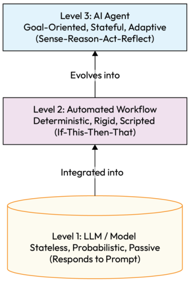
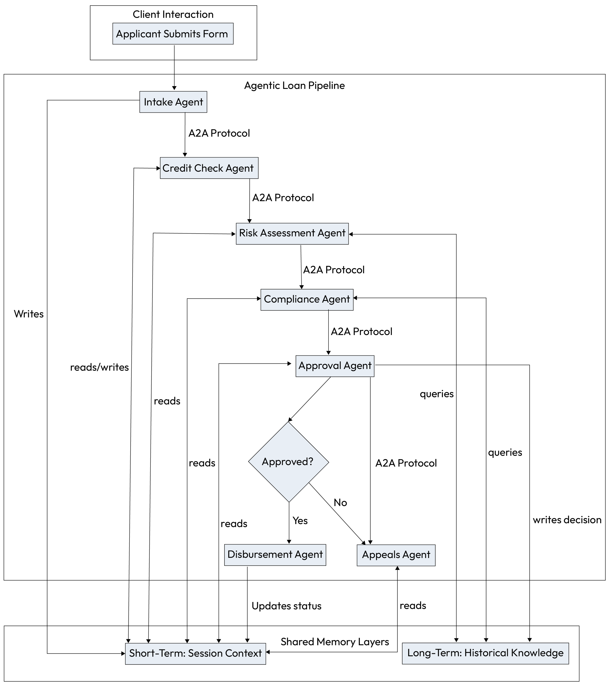
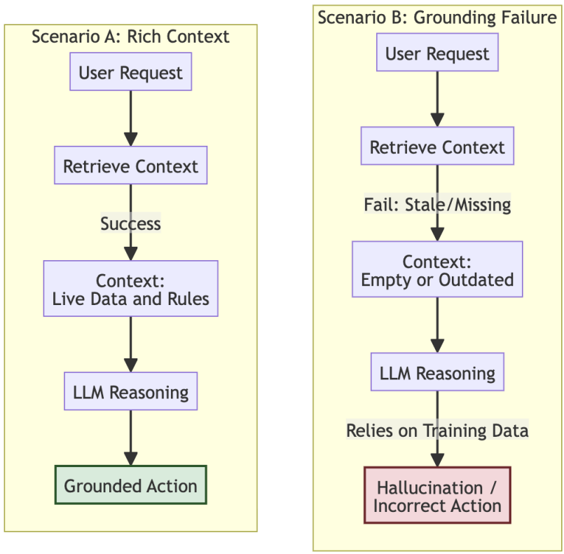
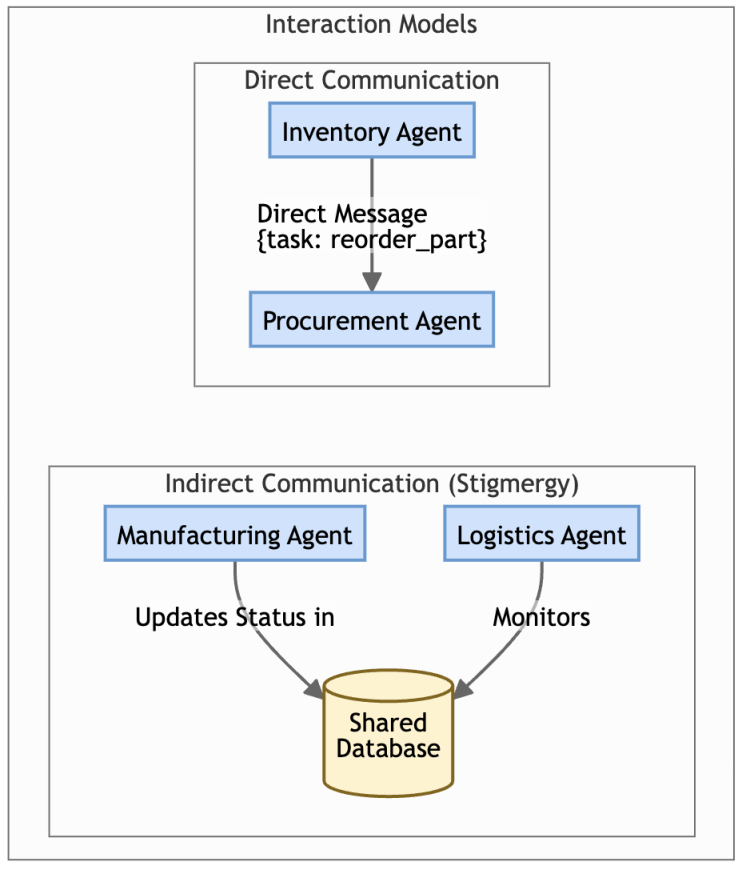
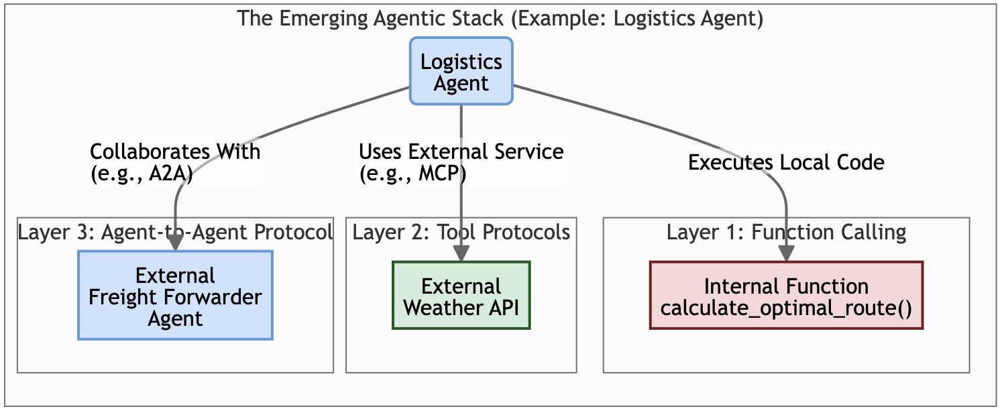

# Chapter 4: Agentic AI Architecture: Components and Interactions

## Agentic AI Architecture:

Components and Interactions
In the first part of this book, we laid the foundational groundwork for understanding generative AI and
described its progression towards more sophisticated, distributed AI and its evolution towards more
autonomous systems. We explored the transformative potential of GenAI in the enterprise, charted a path
towards increasingly more advanced capabilities using the Agentic AI Maturity Model, and then focused on the
crucial role of LLMs as the cognitive engines powering these intelligent systems.
Chapters 2 and 3 detailed the critical considerations for selecting, deploying, optimizing, and adapting LLMs,
through techniques ranging from RAG to fine-tuning, to ensure they are truly "agent-ready." We established
that preparing an LLM for agentic tasks certainly includes prompt engineering, but it goes well beyond that. It
also involves defining how the model interprets user intent and interacts with tools (APIs) through function
calling; the agent requires careful preparation to serve as a reliable reasoning core within a larger operational
construct.
Having laid the groundwork for preparing an agent's cognitive core, this chapter shifts focus to the practical
architecture necessary for developing robust and effective agentic AI systems.
We begin this chapter by examining the fundamental architecture of agentic AI, focusing on the core
components, responsibilities, and distinguishing capabilities that set agents apart from simpler AI interactions.
In previous chapters, we had established the significance of LLMs as reasoning engines, capable of adapting to
incoming sensory input from their contextual environment and revising plans of action accordingly.
Then, we shift our perspective: an LLM, no matter how capable, is not the end product but a critical component
within a broader, distributed operational construct. This marks a pivotal design paradigm shift: from monolithic
systems to dynamic ecosystems of intelligent, role-based AI agents.
We will then dissect the anatomy of an agent, examining its essential building blocks, from how it receives goals
and perceives its environment to how it acts upon it. We will explore the critical role of data stores and
environmental context that agents rely on to behave intelligently. Finally, we will introduce various agent
interaction models and key features that define how these systems operate and collaborate. Understanding this
architecture is the first step towards designing and implementing the powerful agentic patterns we will explore
later in Part 2.
In this chapter, we'll be covering the following topics:
Defining an agent: core concepts and capabilities
The anatomy of an agent
Data stores and environment context for agents
Agent interaction models and key features
Technical considerations for agentic architectures
Let's start by clearly defining what an AI agent is.
Defining an agent: core concepts and capabilities
In Chapter 1, we introduced the concept of agentic AI systems. It is crucial here to solidify our definition of an AI
agent.
An AI agent can be understood as a system, often powered by LLMs, designed to perceive its environment, make
decisions, and take actions to achieve specific goals. This definition describes a more autonomous entity with
ongoing objectives that operates beyond simply responding to a prompt.
## Several key characteristics istinguish true AI agents from more basic LLM interactions:

Autonomy: Agents possess a degree of self-governance, enabling them to operate independently to
achieve their goals without constant direct human intervention. Once a goal is set, an agent can
determine the steps needed to reach it.
Reactivity (or sensing): Agents are capable of perceiving their operational environment and
responding to changes or events within it. This "sensing" is a key aspect of agentic behavior.
Proactivity (or goal-orientation): Agents do not merely react; they take initiative and act in a goaldirected manner. They strive to achieve their defined objectives, which might involve complex planning
and execution of tasks over time.
Social ability (optional but common, especially in multi-agent systems): Many agents, particularly
those in multi-agent systems, can interact and communicate with other agents and humans. They use
agreed-upon languages and protocols to collaborate, negotiate, or coordinate actions
It is essential to learly distinguish agentic AI from both simple LLM interactions and traditional automated
workflows. While all three-LLMs, automated workflows, and AI agents-play a role in modern systems, they
represent fundamentally different levels of capability and autonomy, as illustrated in the following hierarchy.
Chapter 4 96

*Figure 4.1 – The hierarchy of autonomy*

LLMs
LLMs serve s the oundational reasoning core or "brain" of the agent; they are the engine that powers
understanding, planning, and content generation. For the purposes of our discussion, we use the terms LLM and
MMM synonymously, though the distinction is technically significant.
Multi-modal models (MMMs) represent a significant evolution in this layer. Unlike early models trained solely
on text, modern MMMs (such as Google Gemini 3) are trained on massive datasets of text, code, images, audio,
and video. This allows them to project different modalities into a shared semantic space, enabling native
reasoning across inputs. For example, an MMM can analyze a screenshot of a dashboard to diagnose a system
error, or listen to an audio file to extract sentiment, without relying on separate, disjointed translation models.
However, an MMM is not an agent. Despite these advanced perceptual capabilities, the model itself remains
inherently stateless and passive. It processes input and predicts output, but it does not initiate actions, maintain
a long-term memory of its own volition, or pursue goals independently. It only responds when prompted.
97 Agentic AI Architecture: Components and Interactions
This contrasts with centralized, reactive models with distributed, agentic systems that operate cooperatively in
swarms, coalitions, or societies. While the model provides the raw intelligence, it is the surrounding agent
architecture that transforms this passive potential into active, goal-directed behavior.
Automated workflows
An utomated workflow, or AI orchestration, is a sequence of tasks some of which are predetermined and
deterministic, while others may be non-deterministic, relying on intent interpretation and function calling.
Think of it as a script that executes a series of if-this-then-that steps. While it performs actions, it is
deterministic and rigid, following a fixed path. It lacks the ability to reason, plan dynamically, or adapt its
behavior to unforeseen circumstances.
AI agents
An AI agent is the most sophisticated of the three. It is a complete system that uses an LLM as its "brain" to
autonomously achieve a goal. An agent is goal-oriented, stateful, and adaptive. Unlike a simple workflow, an
agent can reason about its environment, create a dynamic plan, use tools to execute that plan, and learn from
the outcomes to improve its future performance.
For instance, an LLM might draft an email when prompted. An automated workflow might send a pre-written
email every Monday at 9 AM. An AI agent, however, could be tasked with managing an entire inbox, proactively
categorizing emails, using tools to schedule meetings based on email content, and alerting the user to urgent
matters, all while learning the user's preferences over time.
## To further clarify these differences, the following table provides a direct comparison:

Characteristic LLM Automated workflow AI agent
Core function Generates text, answers
questions, synthesizes
information based on a
prompt.
Executes a predefined,
static sequence of tasks.
Autonomously achieves
a specific goal.
Decision-making Pattern matching and
probabilistic text
generation. Does not
make decisions.
Based on hard-coded,
if-this-then-that
logic. Does not reason.
Reasons, plans, and
makes dynamic
decisions to navigate
complex problems.
State and memory Stateless: each
interaction is new
(though context can be
passed in).
Generally stateless; does
not remember past
executions.
Stateful: maintains
short-term and longterm memory to learn
and adapt.
Adaptability Does not adapt unless
fine-tuned or supported
by new prompting
techniques.
Rigid: any change to the
process requires reprogramming the
workflow.
Highly adaptive; learns
from experience and
reacts to changes in its
environment.
Chapter 4 98
Characteristic LLM Automated workflow AI agent
Interaction model Receives a prompt,
returns a response.
Triggered by an event,
executes a fixed script.
Operates in a continuous
sense-reason-plan-act
loop to pursue its goals.
Failure handling Passive/None: May
generate plausible but
incorrect info
(hallucination) without
awareness of failure.
Rigid/Brittle: Fails hard
or triggers a pre-set
exception path (e.g.,
"stop and alert admin")
when specific rules are
broken.
Resilient/Self-correcting:
Can detect errors, reflect
on the cause, and
autonomously retry with
a different strategy or
tool.
Table 4.1 - Comparing LLMs, automated workflows, and AI agents
In essence, an agent is a system that integrates and elevates the capabilities of the other two. It leverages an LLM
for its reasoning power but places it within a structure that allows for the autonomous, goal-driven execution of
tasks in a way that a static workflow cannot.
With these foundational concepts and distinctions established, let's now examine the internal structure that
brings these powerful agentic characteristics to life.
The anatomy of an agent
As introduced previously, an AI agent's functionality can be understood through its core components. While our
earlier discussion provided a high-level overview, this section revisits that anatomy from an architectural
perspective.
We will now frame these components not just as concepts, but as the functional building blocks that enable an
agent's continuous operational loop: perceiving the environment, reasoning to form a plan, and acting to
achieve its goals. Understanding this structure is essential for implementing the design patterns that follow.
Each individual agent possesses an internal structure comprising the following building blocks, which are
## summarized in the table below with their architectural roles:

99 Agentic AI Architecture: Components and Interactions
Component Core function (recap) Architectural role and
implementation
Goals
(Specified through Instructions)
The objectives or desired
outcomes the agent seeks to
achieve.
Defines the agent's objective
function and directs its high-level
planning. Implemented as
configuration parameters or a
dynamic state that can be
updated.
Sense (Perception) Gathers information and data
from its environment (digital or
physical).
Serves as the input layer.
Implemented via API listeners,
data stream processors, or
standardized protocols such as
Model Context Protocol (MCP).
Reason (Cognition) The core processing unit where
sensed information is analyzed
and interpreted.
This is the cognitive core where
the agent-ready LLM is integrated.
It interprets inputs, evaluates
them against goals, and
formulates high-level strategies.
Plan Devises a sequence of actions
based on reasoned insights to
achieve its goals.
The tactical layer, also powered by
the LLM. It breaks down the highlevel strategy from the Reason
component into a concrete,
ordered sequence of executable
steps or tool calls.
Act (Action) Executes the planned actions upon
the environment using available
tools.
Serves as the output layer.
## Implemented by invoking tools:

calling external APIs, executing
code, sending commands to
actuators, or generating responses.
Memory Stores the agent's knowledge,
experiences, and state to provide
context for decisions.
Manages state. Implemented
using short-term variables for the
current task and long-term
persistent stores such as vector
databases for RAG or user
preferences.
Chapter 4 100
Component Core function (recap) Architectural role and
implementation
Coordinate Interacts with other agents to
align actions and collaborate
toward collective goals (primarily
in multi-agent systems).
The inter-agent communication
layer. This component manages
the full life of a task, tracking
standardized agent-to-agent
(A2A) states such as submitted,
working, input-required, and
completed. It is implemented via
protocols like the Agent2Agent
(A2A) protocol, enabling agents to
delegate work and synchronize
state deterministically across
distributed boundaries.
Table 4.2 - The architectural roles of agent components
These building locks are not static; they operate in a continuous cycle. The agent senses its environment, reasons
about the new information in the context of its goals and memory, formulates a plan, and then acts upon the
environment.
The results of this action are then sensed in the next iteration, creating a powerful feedback loop that allows the
agent to learn and adapt its behavior over time. It is this dynamic, operational loop (built upon these
architectural components) that is the foundation for the more complex behaviors and design patterns we will
explore throughout the rest of this book.
To transition these architectural concepts from theory to practice, we will now explore two distinct case studies.
These examples were specifically chosen to demonstrate the agent's anatomy operating at different scales of
complexity.
First, we will examine a Travel Planning Agent, a relatable single-agent system that clearly illustrates how the
core building blocks-Goals, Sense, Reason, Plan, Act, and Memory-work in concert to fulfill a user's request
from start to finish.
Then, we will nalyze an Agentic Loan Processing System, which showcases a more sophisticated multi-agent
architecture. This enterprise-grade example will highlight how multiple specialized agents collaborate,
coordinate, and share context to manage a complex, end-to-end business workflow.
Together, these case studies provide a practical lens through which to understand both the fundamental
components of a single agent and the architectural principles of a multi-agent system in action.
101 Agentic AI Architecture: Components and Interactions
Case study: Travel Planning Agent
To better illustrate how these building blocks function together, let's consider a practical example: an
autonomous Travel Planning Agent. The agent's primary goal is to book a complete travel itinerary based on a
user's natural language request, interacting with various external systems to accomplish its task.
The following table breaks down each component of the agent's anatomy within the context of this example:
Anatomy component Travel Planning Agent example
Goals The agent's primary objective is to fulfill the user's
request: "Book a round-trip flight to Paris and a 4-star
hotel for 5 nights next month, keeping the total cost
under $2500." This goal is dynamic and can be
updated if the user changes their mind or provides
new constraints.
Sense (Perception) The agent gathers initial information by processing
the user's natural language request. It continues to
"sense" by receiving data back from external systems,
such as a list of available flights from an airline API or
pricing information from a hotel booking service.
Reason (Cognition) The LLM core analyzes the user's explicit preferences
("Paris," "4-star," "5 nights") and implicit intent. It
interprets the structured data from flight and hotel
searches, compares options against the budget
constraint, and performs complex inference to
determine the optimal itinerary.
Plan Based on its reasoning, the agent devises a sequence of
steps:
Deconstruct user requests into sub-tasks
(flight booking, hotel booking).
Execute flight search.
Execute hotel search.
Analyze results to find a valid combination
that meets all constraints.
Present the final itinerary to the user for
confirmation.
Execute the final booking actions.
1.
2.
3.
4.
5.
6.
Chapter 4 102
Anatomy component Travel Planning Agent example
Act (Action) The agent executes its plan by using available tools.
This involves calling a flight search API (e.g.,
search_flights(destination="CDG",
month="next")) and a hotel API (e.g.,
find_hotels(city="Paris", rating=4,
nights=5)). After confirmation, it acts again by
calling booking functions and generating a final
confirmation message, and updating the user's longterm profile with these new preferences for future
interactions.
Memory The agent uses short-term memory to store the user's
preferences, the flight and hotel options it found, and
the conversation history for the current task. It might
use long-term memory to recall the user's preferred
airline or hotel chain from past interactions to
personalize future suggestions.
Coordinate If this were a multi-agent system, the Travel Agent
might coordinate with other specialized agents. For
example, after booking the main trip, it could delegate
a task to an "Excursion Agent" by sending a message
such as "Find and book a ticket for the Louvre
Museum," collaborating towards the collective goal of
planning the entire trip.
Table 4.3 - Agent components in a use case
This xample monstrates how the abstract components of an agent's anatomy translate into concrete
operations. The continuous loop of sensing the user's needs, reasoning about the options, planning the steps,
and acting via tools is what allows the agent to move from a simple request to a complex, successfully
completed goal.
Case study: Agentic Loan Processing System
Here is an application of Figure 1.1 - Agentic anatomy to a loan processing case study, using each component of
the agent architecture from your description. This maps the theory into practice and shows how agentic systems
function across a full stack, multi-agent loan approval workflow.
A financial institution deploys a multi-agent system to automate and optimize its loan application process. The
workflow spans from initial customer interaction to final disbursement, involving data verification, credit
assessment, risk scoring, compliance checks, and final approval. Each agent specializes in a distinct phase of this
pipeline, using the A2A protocol to communicate and coordinate tasks while accessing a shared memory layer
for consistent context.
103 Agentic AI Architecture: Components and Interactions

*Figure 4.2 – Use case example: Agentic loan processing*

Chapter 4 104
Component Loan Processing Agent example
## Goals Each agent has a specialized goal aligned to its role:

Intake Agent: Gathers complete applicant data.
Credit Check Agent: Validates credit history and
flags anomalies.
Risk Assessment Agent: Scores the applicant's risk
profile.
Compliance Agent: Verifies adherence to regulatory
rules.
Approval Agent: Makes final loan decision based on
holistic inputs.
## Sense (Perception) Agents gather data via:

Intake forms (natural language, structured
data)
API calls to credit bureaus
Internal CRM and KYC databases
Document OCR
Real-time market feeds (for variable rate
loans)
Each agent uses MCP to access consistent structured
and unstructured data contextually.
## Reason (Cognition) Powered by an LLM, agents reason over:

Financial document semantics (e.g., pay
stubs, bank statements)
Policy rules and risk guidelines
Inferred intent from applicant's queries
Contradictions in data (e.g., income
mismatch)
The cognitive core evaluates inputs against agent
goals.
105 Agentic AI Architecture: Components and Interactions
Component Loan Processing Agent example
## Plan Plans are agent-specific:

Intake Agent plans follow-ups for missing
info.
Credit Check Agent plans which credit
bureaus to query (e.g., Equifax, TransUnion)
and in what order, and defines a strategy for
handling API failures or data discrepancies.
Risk Agent chooses a scoring model based
on loan type.
Compliance Agent selects required checks
based on jurisdiction.
Approval Agent builds a decision tree
integrating outputs from others.
## Act (Action) Agents act by:

Sending verification emails
Updating loan status in CRM
Calling APIs to retrieve or write data
Generating compliance audit trails
Triggering downstream agents upon task
completion
## Memory Two layers:

Short-term: Applicant-specific session
memory
Long-term: Aggregated fraud patterns,
historical decisions, regulatory changes
Memory allows learning-based improvement (e.g.,
adjusting for new risk indicators).
Chapter 4 106
Component Loan Processing Agent example
Coordinate Coordination is enabled by the A2A Protocol
(Google's Agent2Agent Interoperability Protocol),
## which acts as the communication layer:

Provides a secure and standard channel for
agents to delegate tasks and exchange
information.
Allows agents to report on task status (e.g.,
working, completed, failed) back to the
delegating agent.
Enables interoperability, allowing agents built
on different platforms to collaborate without
sharing their internal memory or logic.
Table 4.4 - Agentic anatomy components in loan processing
Illustrative flow: loan application lifecycle
Customer submits a loan application → Intake Agent parses and stores in shared memory.
Credit Check Agent is triggered → retrieves FICO and credit history via API.
Risk Agent reasons over credit + income + loan amount → assigns risk score.
Compliance Agent checks KYC, AML, GDPR, and local banking rules.
Approval Agent integrates inputs, reasons over conflicts, and makes the approval decision.
If rejected, Appeals Agent may offer alternative products (e.g., secured loan).
Disbursement Agent executes fund release and updates backend systems.
Multi-agent coordination via A2A
Agents collaborate by sending structured tasks to one another using a defined protocol such as A2A. This is a
form of direct communication, where a sending agent explicitly delegates a job to a specific receiving agent.
For instance, instead of publishing a score to a general bus, the orchestrator agent would first send a task to the
Risk Agent. Upon receiving the result, it would then send a new task to the Approval Agent, including the risk
score as part of the payload. This creates a clear, auditable chain of delegation.
Disputes or edge cases (e.g., borderline credit scores) can invoke a deliberation loop. This is handled through a
sequence of A2A messages where agents can exchange offers, counter-offers, or escalate the task to a different
agent or a human for resolution.
## The benefits of applying agentic anatomy to loan processing include the following:

Responsiveness: Agents react to changes in real-time data (e.g., credit score fluctuation).
Compliance by design: Modular rules embedded within agents and shared policy layers.
1.
2.
3.
4.
5.
6.
7.
107 Agentic AI Architecture: Components and Interactions
Transparency: Memory logs and reasoning traces aid in audits and regulatory checks.
Adaptability: Agents can evolve independently; e.g., the Risk Agent can be replaced with a newer LLM
model.
These benefits demonstrate how an agent's internal structure enables intelligent and resilient behavior.
However, this intelligence is not derived solely from its internal design; it is critically dependent on the richness
and relevance of the data it can access from its environment. We will now examine the various data stores and
contextual sources that agents rely on to perceive, reason, and act effectively.
Data stores and environment context for agents
As we mphasized in Chapter 1, context is king, and this principle is especially true for agentic systems that must
make informed decisions and take appropriate actions. Agents rely heavily on various data stores and contextual
information from their surroundings to perceive, reason, and act effectively.
The following figure illustrates this high-stakes dynamic. It contrasts a healthy, grounded workflow where rich
context enables accurate reasoning against specific failure modes where stale memory or failed retrieval leads to
incorrect actions.

*Figure 4.3 – Contextual inputs versus grounding failures*

Chapter 4 108
## The environment context or an agent can be broadly categorized as follows:

Digital business context: This encompasses all relevant digital data sources that an agent might
interact with or draw information from within an enterprise or online environment. Key types include
the following:
Unstructured data: This includes vast amounts of information found in text documents
(reports, emails, articles), images, audio, and video files. LLMs are particularly adept at
processing and understanding unstructured text.
Vector stores: These specialized databases are crucial for enabling efficient similarity searches
on embeddings. When an agent needs to find information semantically similar to a query,
vector stores allow for rapid retrieval based on meaning rather than just keywords. This is a core
component of many RAG systems. Implementations typically fall into two categories: open
source libraries and databases (e.g., FAISS, Weaviate, Chroma) for local or self-hosted control,
and commercial managed services (e.g., Pinecone, Google Vertex AI Vector Search) for
scalability and ease of management.
Structured data: This refers to organized data typically found in relational databases or
spreadsheets. It provides well-defined data points that agents can query for specific tasks, such
as retrieving customer records or product information.
Knowledge graphs: These represent information as a network of entities and their
relationships, providing a structured, semantic understanding of a domain. Knowledge graphs
are particularly useful for agents that need to perform complex reasoning involving
interconnected concepts.
Physical environment context: For agents designed to interact with the real world, such as robots or
## IoT-driven systems, this involves the following:

Sensors: Devices such as cameras, microphones, temperature sensors, and GPS locators provide
data about the physical surroundings.
Actuators: Components such as robotic arms, motors, or switches allow the agent to perform
physical actions or manipulate objects in its environment.
Effective agents often need to integrate information from multiple types of data stores and must be able to
synthesize information from these diverse contexts to build a comprehensive understanding of their situation.
To make these concepts tangible, let's onsider a Supply Chain Management agent tasked with monitoring
and optimizing a company's inventory and logistics in real time. This agent must process information from
various digital systems and potentially interact with physical warehouse components to respond to disruptions.
The following table demonstrates how this agent would interact with different data stores and environmental
ontexts to perform its duties.
Context/Data store Supply Chain Management Agent example
Digital business context This is the digital world the agent operates in,
comprising all the company's operational data.
◦
◦
◦
◦
◦
◦
109 Agentic AI Architecture: Components and Interactions
Context/Data store Supply Chain Management Agent example
Unstructured data The agent processes shipping manifests (PDFs),
supplier delay notifications from emails, and news
articles about port strikes or weather events to
understand potential disruptions.
Vector stores When a new geopolitical event is detected, the agent
uses a vector store to perform a semantic search for
internal whitepapers about how similar past events
have impacted shipping lanes, retrieving the most
relevant historical context.
Structured data The agent queries a relational database to get current
inventory levels for specific product SKUs, checks
expected delivery dates, and pulls warehouse capacity
information.
Knowledge graphs The agent leverages a knowledge graph to understand
the complex, multi-level relationships between
suppliers, manufacturing plants, distribution centers,
and final retail destinations. This allows it to reason
that a delay from a single component supplier will
impact three specific product lines.
Physical environment context This includes the real-world elements the agent can
sense and act upon, often through IoT devices.
Sensors The agent receives a continuous stream of data from
GPS trackers on delivery trucks, temperature sensors
in refrigerated containers to ensure product integrity,
and RFID scanners at warehouse loading bays
confirming the arrival of goods.
Actuators If the agent predicts a major disruption on a primary
route, it could automatically trigger an actuator in the
smart warehouse, such as a conveyor belt or robotic
arm, to divert the affected pallets to a different loading
bay for an alternate shipping route.
Table 4.5 - Datastores and environment context examples
This supply chain xample highlights how an effective agent must fluidly integrate information from a wide
array of sources, from structured inventory databases to unstructured news feeds and real-world sensor data.
The ability to perceive and reason across these different contexts is what enables its intelligent and proactive
behavior.
Chapter 4 110
Having explored the internal anatomy of an agent and the external data it relies on, let's now examine the
architectural features these components enable and how agents interact with each other.
Agent interaction models and key features
The architectural components and contextual awareness previously discussed give rise to several powerful
features inherent in well-designed agentic systems. These features define how agents operate, how they can be
structured, and how they interact with each other and their environment. Understanding these characteristics
is key to appreciating the advantages agent-based approaches offer.
To explore these advantages in detail, this section will delve into two key areas. We will begin by examining the
inherent architectural features that arise from an agent's design, such as modularity, scalability, and
adaptability. We will then transition to the practical agent interaction models, exploring how agents
communicate directly and indirectly, and introduce the emerging technology stack that enables this
collaboration.
Architectural features
As we briefly outlined previously, a well-designed agentic architecture gives rise to several powerful features
that contribute to its flexibility, robustness, and intelligence. To avoid repetition, this section will not redefine
these concepts but will instead illustrate how they translate into practical benefits using our ongoing Supply
Chain Management Agent system s a cohesive example.
## The following table showcases how each key architectural feature is applied in practice:

Architectural feature Example in a supply chain management system
Modularity The supply chain system needs to incorporate
enhanced fraud detection for its shipping invoices.
Instead of rebuilding the existing InventoryAgent, a
new, specialized InvoiceFraudAgent is developed
and added to the workflow. If the fraud detection
model needs to be updated, only that specific agent is
affected.
Scalability During peak holiday shipping season, the system
handles a massive increase in GPS data from delivery
trucks by dynamically deploying multiple instances of
the LogisticsAgent in parallel. A load balancer
distributes the route optimization tasks across these
instances, ensuring the system remains responsive.
111 Agentic AI Architecture: Components and Interactions
Architectural feature Example in a supply chain management system
Adaptability A SupplierCommsAgent observes that emails from
"Supplier-X" containing the phrase "production
delay" consistently precede critical inventory
shortages. Using this learned correlation, the agent
adapts its behavior to automatically escalate any
future emails with those keywords to "urgent" and
immediately alert the InventoryAgent.
Multimodal interaction At a warehouse, a ReceivingDockAgent first
processes a text-based shipping manifest (PDF), then
uses a camera to visually inspect the received pallet for
damaged boxes (image data). It acts on this combined
information, updating the inventory system only if the
visual inspection matches the manifest's description.
Collaboration A DisruptionMonitoringAgent detects a port closure
from a news feed and updates a status in a shared
database. The InventoryAgent senses this change
and sends a direct message to the LogisticsAgent to
request alternate shipping routes, initiating a
collaborative resolution between the two agents.
Table 4.6 - Architectural features for the Supply Chain Management Agent
This table monstrates how these inherent features manifest in a practical pplication. Now, let's shift from
these high-level properties to the specific models that govern how agents interact with one another.
Agent interaction models
When multiple gents operate within the same environment, the way they interact becomes a critical aspect of
the system's design. The chosen model dictates how agents coordinate, share information, and work towards
collective goals.
To facilitate this coordination, agentic systems typically employ two fundamental interaction models, which
## differ in how agents exchange information:

Direct communication: In this model, agents explicitly send messages to one another using a common
language and protocol.
Example: The InventoryAgent detects low stock and sends a direct message {"task":
"reorder_part", "part_id": "XYZ-123", "quantity": 500} to the ProcurementAgent.
Indirect communication (Stigmergy): Agents can also interact indirectly by observing and modifying
a shared environment, such as a database.
Chapter 4 112
Example: The ManufacturingAgent updates a record in a shared database to {"status": "complete"}.
The LogisticsAgent, which monitors this database, sees the status change and initiates the shipping
process.

*Figure 4.4 – Agent interaction models*

While these models describe the conceptual approach to communication, their practical implementation relies
on an emerging technology stack. As we introduced previously, this stack is composed of complementary layers
that enable different forms of interaction. Here, we revisit these layers to detail how they facilitate agent-to-tool
## and agent-to-agent communication in practice:

Layer 1: Function calling: This is the fundamental interaction layer where an agent's LLM triggers a
local tool. It allows a model to intelligently identify what tool to use, when to call it, and with what
parameters, all within a single application runtime. This was the first major step in making LLMs more
than text generators, enabling them to take action. Its primary limitation is that the developer is
responsible for hosting, running, and securing the tool within the same environment.
113 Agentic AI Architecture: Components and Interactions
Example: The LogisticsAgent's LLM determines it needs to find the most efficient delivery path and
generates a call to its internal calculate_optimal_route() function.
Layer 2: Tool protocols: This layer provides a standardized way for agents to discover and use external
tools as interoperable services. Protocols such as Anthropic's Model Context Protocol (MCP) decouple
the tool's hosting and execution from the agent itself. This represents a significant evolution from
framework-specific solutions such as LangChain's ToolExecutor or LangGraph routers. While those
robust OSS tools manage execution within a specific application's runtime (often requiring shared
dependencies), protocols such as MCP allow tools to be defined via schemas and hosted independently.
This enables any compliant system to discover and invoke them across process or network boundaries,
effectively turning tools into portable services much like REST APIs.
Example: To account for weather, the LogisticsAgent uses a tool protocol to discover and connect to a
third-party weather service API, pulling real-time storm data into its route calculation without being
tightly coupled to that specific API's implementation.
Layer 3: Agent-to-agent protocols: This is the highest level, focused on collaboration between
independent agents, which may be running on different frameworks or in different enterprises. While
proprietary or framework-specific delegation methods exist, protocols such as agent-to-agent (A2A)
focus on universal standards for agent collaboration. It provides a standard for delegating structured
tasks, managing asynchronous workflows, and enabling complex, multi-agent coordination, effectively
acting as a universal translator or "SMTP for AI agents."
Example: After calculating a route, the LogisticsAgent needs to book sea freight. It uses an A2A
protocol to send a structured task to a completely separate FreightForwarderAgent, which is operated
by a third-party logistics company.

*Figure 4.5 – Emerging agentic stack*

Many sophisticated systems mploy a hybrid approach, using function calling for internal actions and higherlevel protocols for external collaboration.
Chapter 4 114
Technical considerations for agentic architectures
Building robust nd effective agentic systems, as we've architected them in this chapter, is a technically
demanding task. As we first identified in our high-level overview of production challenges, successfully
deploying these agents requires addressing several critical technical hurdles.
Rather than restating those challenges, this section connects them directly to the agent anatomy we have just
detailed. The following table maps those key technical considerations to the specific architectural components
they impact most, providing a clearer understanding of where these challenges manifest in your design.
Technical consideration Primary architectural component(s) affected
Data processing and integration Sense, Memory
Knowledge representation Reason, Memory
LLM integration and orchestration Reason, Plan, Coordinate
Reliable tool use mechanisms Act
State management and memory Memory
Scalability of agent populations Coordinate, Overall system architecture
Inter-agent communication efficiency Coordinate
Security and governance Reason (Prompt Injection), Act (Sandboxing), Memory
(Privacy), Coordinate (AuthN/AuthZ)
Table 4.7 - Mapping technical challenges to agent components
Successfully ressing these technical considerations involves a journey of progressively refining these
capabilities, a path that aligns with the stages of the GenAI Maturity Model.
This exploration of agent anatomy, their reliance on data, and their interaction models sets the stage for
understanding more complex agentic behaviors. In the following chapters, we will build upon this architectural
foundation to examine specific design patterns that leverage these components to solve common challenges in
building sophisticated AI systems.
115 Agentic AI Architecture: Components and Interactions
## Summary

This chapter built upon the foundational concepts of Part 1, providing a detailed architectural blueprint for the
agentic systems that LLMs power. We moved from theory to structure by defining what makes a system
"agentic," dissecting the core components that enable intelligent behavior, and mapping technical challenges
directly to this new architectural framework.
## The key takeaways are as follows:

Agents are more than LLMs: An AI agent is a complete system defined by its autonomy, goalorientation, and its ability to perceive, reason, and act. It uses an LLM as its cognitive core but is distinct
from a simple, stateless LLM interaction.
The anatomy of an agent: We framed the essential building blocks-Goals, Sense, Reason, Plan, Act,
Memory, and Coordination-by their architectural roles within a continuous operational loop, showing
how an agent moves from perception to goal-oriented action.
Context is crucial for intelligence: An agent's effectiveness is critically dependent on its environment.
It must draw from a rich context of digital data stores (such as databases and knowledge graphs) and
potentially physical data sources (such as sensors) to make informed decisions.
Interactions define the system: Agentic systems are characterized by features such as modularity and
scalability. Agents interact through direct and indirect communication models, which are increasingly
enabled by a practical stack of protocols for function calling, tool use, and agent-to-agent collaboration.
Architecture is the foundation for patterns: Understanding the core architecture laid out in this
chapter is the essential prerequisite for designing and implementing the specific, repeatable agentic
patterns that solve real-world business problems, which we will explore throughout the rest of this
book.
In this chapter, we have established the architectural blueprint for individual agents. We are now prepared to
explore how these agents can be organized into powerful, collaborative systems. In the next chapter, we will
dive deep into the first set of crucial design patterns: multi-agent coordination patterns.
These patterns provide the strategies and solutions needed to manage how multiple agents interact, share
information, and work together to tackle challenges that are beyond the scope of any single agent.
Chapter 4 116
Subscribe for a free eBook
New frameworks, evolving architectures, research drops, production breakdowns-AI_Distilled filters the noise
into a weekly briefing for engineers and researchers working hands-on with LLMs and GenAI systems. Subscribe
now and receive a free eBook, along with weekly insights that help you stay focused and informed.
Subscribe at https://packt.link/8Oz6Y or scan the QR code below.
117 Agentic AI Architecture: Components and Interactions