# Chapter 5: Multi-Agent Coordination Patterns

## Multi-Agent Coordination Patterns

In the previous chapter, we established the architectural blueprint for individual agents, exploring their
anatomy and core capabilities. We saw that a single, well-designed agent can be a powerful tool for automating
tasks. However, the most complex and valuable enterprise challenges often exceed the capabilities of any single
agent. Just as a company relies on a team of specialized employees, advanced AI solutions require a team of
specialized agents working in concert.
This chapter is icated to the coordination patterns that make this collaboration possible. When multiple
autonomous agents operate in a shared environment, their actions must be coordinated to avoid conflicts,
manage resources, and achieve overarching goals.
To make these patterns as practical as possible, we will take a "map before the journey" approach. Before diving
into the technical details of each pattern, we will first present a strategic guide to implementation.
This guide, aligned with our GenAI Maturity Model, provides a roadmap for progressively adopting
coordination patterns, from building foundational, predictable workflows to orchestrating advanced,
autonomous collectives. By understanding the bigger picture first, you will have the context to appreciate where
each specific pattern fits and why it is important.
In this chapter, we'll be covering the following topics:
A strategic guide to implementing coordination patterns
The Agent Router pattern (Intent-based routing)
## Task Delegation Frameworks

## Agent Composition Topologies

Multi-Agent Planning
Knowledge Sharing
Tool Routing in Multi-Agent Contexts
Consensus
Agent Negotiation
Resource Allocation
Conflict Resolution
Formation Control
A strategic guide to implementing coordination patterns
The relationship between coordination patterns and the GenAI Maturity Model is not about simply assigning
pattern to a specific level. Instead, it's an evolution: as an organization progresses from single-agent systems
(Levels 1-3) to multi-agent systems (Level 4), the implementation of these coordination patterns becomes more
dynamic, complex, and decentralized.
To ground this discussion, let's review the Agentic AI levels of maturity we covered in Chapter 3.
Maturity level Description Scalability
insight
Compliance
insight
Key patterns/
methods
1. Basic agentic
systems
Single agents
handle specific,
well-defined tasks
semiautonomously,
using simple,
predefined
workflows and
function calls to
external APIs or
tools.
Adaptable but
rigid. Workflows
are relatively fixed,
which limits the
potential for
innovation.
Straightforward to
manage as tasks
are well-defined,
minimizing the
risk of policy
violations.
Single-Agent
Baseline, Static
Function Calling,
Watchdog
Timeout, Agent
Calls Human.
2. Dynamic singleagent workflows
A single agent can
dynamically
choose from a
variety of preselected tools or
APIs based on the
problem at hand,
allowing for more
flexible problemsolving.
More versatile and
efficient, as agents
can tackle more
complex problems
by selecting the
appropriate tools.
Manageable due to
the pre-selection
of approved tools,
but requires
careful monitoring
of agent behavior
as autonomy
increases
Agent Router
(Basic), Dynamic
Tool Selection,
Simple RAG,
Simple Retry.
Chapter 5 120
Maturity level Description Scalability
insight
Compliance
insight
Key patterns/
methods
3. Introspective
patterns with
ReAct and
Reflexion
Single agents use
methods such as
ReAct and
Reflexion patterns
that incorporate
step-by-step
reasoning and selfreflection. This
enables them to
learn from their
actions and selfcorrect through
feedback loops.
The introduction
of feedback and
self-correction
allows agents to
handle more
complex tasks and
improve over time,
creating paths for
scalability.
Real-time
monitoring and
corrective
mechanisms
become essential
to ensure that
agents remain
aligned with
policies while
learning.
ReAct, Reflexion,
Instruction
Fidelity Auditing,
Adaptive Retry
with Prompt
Mutation.
4. Multi-agent
systems
Multiple
specialized agents
collaborate to
handle complex
tasks. Each agent
focuses on
different, nonoverlapping
functions, and
their coordination
allows for parallel
processing.
Ideal for highscale
environments.
Tasks can be
distributed across
multiple agents,
enabling efficient
parallel processing
of complex
workflows.
More complex to
manage.
Monitoring
systems are
required to ensure
that all semiautonomous
agents collaborate
in ways that
adhere to
regulations.
Supervisor
Architecture,
Multi-Agent
Planning, Shared
Epistemic
Memory, EventDriven Reactivity,
Tool/Agent
Registry.
5. Advanced multiagent coordination
with meta-agents
A "meta-agent" is
introduced to
oversee and
coordinate the
other agents. This
allows for dynamic
task reassignment
and real-time
planning
adjustments.
Enhanced
adaptability. The
system can scale
effectively even in
changing
environments due
to optimized task
distribution by the
meta-agent.
Meta-agents act as
overseers, helping
to maintain policy
adherence by
adjusting
workflows and
redistributing
tasks as needed.
Meta-agents,
Blackboard
Topology,
Resource
Allocation,
Contract-Net
Marketplace,
Supervision Trees.
121 Multi-Agent Coordination Patterns
Maturity level Description Scalability
insight
Compliance
insight
Key patterns/
methods
6. Self-correcting
agents: Agentic
workflows with
feedback
mechanisms for
self-learning
Advanced multiagent systems use
complex, multiturn feedback
loops. Agents
critique, correct,
and refine one
another's outputs
iteratively, leading
to continuous
process
improvement.
Highly scalable
with continuous
improvement built
in. These systems
can evolve in real
time, making them
extremely efficient
for dynamic tasks.
Most complex.
Automated
compliance checks
and self-corrective
actions are
necessary to
ensure that agents
stay aligned with
policies while
adapting.
Consensus, Agent
Negotiation,
Conflict
Resolution, Fractal
CoT, Coevolved
Agent Training,
Trust Decay
Table 5.1 - Agentic AI Maturity Model
Now that we have mapped the coordination patterns to our maturity levels, let's explore how an organization
begins its journey into multi-agent systems (Level 4) by establishing foundational, structured workflows. At this
stage, the focus is on stability and moving away from isolated agents toward structured collaboration.
Multi-agent systems: foundational coordination (Level 4)
In this basic, or foundational stage, of a multi-agent system, the primary goal is to establish a functional,
predictable, and auditable system where multiple agents can successfully collaborate on a well-defined
workflow. The coordination is typically explicit and managed from the top down. Architectural hoices favor
clear control and centralized orchestration over complex, decentralized autonomy.
## The key haracteristics of this foundational coordination style include the following:

Task delegation and planning: The most common approach at this level is a Supervisor Architecture.
In this rchitecture, we have a central orchestrator agent, which is easy to build, debug, and govern.
This orchestrator uses Multi-Agent Planning to decompose tasks and assign them to specialized
"worker" agents. The plan is often static or semi-static, reflecting a structured business process.
Information and resource management: Knowledge Sharing is implemented through a simple
Shared Epistemic Memory, such as a shared database. Basic Resource Allocation and Conflict
Resolution are handled centrally by the supervisor, which uses a predefined set of policies or priority
rules.
Interaction model: Agents at this level generally do not negotiate among themselves. The supervisor
dictates the workflow and relies on its hierarchical authority to resolve conflicts.
Note: Going forward in this chapter, the mention of levels pertains to those of the Agentic AI Maturity
Model outlined in Table 5.1.
Note
Chapter 5 122
Advanced multi-agent coordination and self-correction (Levels 5-6)
This more advanced level of a multi-agent system represents a significant leap in agent autonomy. The system is
designed to handle ambiguity, adapt to unforeseen events, and solve problems where the solution path is not
known in vance. Coordination omes more emergent and ntralized. The focus shifts from a top-down
ommand structure to enabling "social" capabilities among agents, allowing them to resolve conflicts, align on
goals, and adapt their collective strategy in real time.
## The key aspects of this advanced coordination style include the following:

Evolved delegation and planning: The system may move toward a decentralized Swarm Architecture
for greater resilience or adopt a Hybrid Model. Planning becomes dynamic, allowing the system to
adapt in real time.
Advanced "social" interactions: The most significant shift at Level 6 is the introduction of patterns
## that govern autonomous agent-to-agent interactions:

Consensus: When agents have conflicting data, they can engage in an iterative debate to
converge on a shared understanding.
Negotiation: Agents with competing goals can directly negotiate a compromise, enabling more
flexible and optimal outcomes.
Specialized coordination: For systems interacting with the physical world, Formation Control
becomes essential, allowing a group of agents (such as drones or robots) to self-organize and maintain
a collective structure.
The primary distinction between a Level 4 foundational and a Level 6 multi-agent system lies in the shift from a
centrally managed, predictable workflow to a decentralized, adaptive, and more autonomous collective. The
following table contrasts how key architectural aspects are implemented at each of these maturity stages.
Architectural aspect Multi-agent systems (Level 4)Advanced and self-correcting
systems (Levels 5 and 6)
Primary goal Establish a functional, predictable,
and auditable workflow.
Handle ambiguity, adapt to
unforeseen events, and solve
dynamic problems.
Coordination model Top-down and explicit, managed
by a central authority.
Bottom-up and emergent, arising
from agent interactions.
Primary architecture Supervisor architecture: A central
orchestrator agent directs the
workflow.
## Swarm or hybrid architectures:

Agents operate as a peer-to-peer
network or in self-organizing
teams.
Planning method Static planning: The supervisor
decomposes tasks and dictates a
largely fixed plan.
Dynamic planning: The plan is
adaptive and can be modified in
real time.
◦
◦
123 Multi-Agent Coordination Patterns
Architectural aspect Multi-agent systems (Level 4)Advanced and self-correcting
systems (Levels 5 and 6)
Knowledge sharing Simple shared memory: Used
primarily to pass state between
agents.
## Rich shared epistemic memory:

Used to build collective
intelligence.
Conflict resolution Centralized and policy-based: The
supervisor resolves conflicts based
on predefined rules.
## Autonomous and negotiated:

Agents resolve conflicts directly
through negotiation and
consensus.
Table 5.3 - Maturity level to pattern mapping for coordination
Now that we have defined the high-level rchitectures for multi-agent systems (Level 4) and advanced systems,
represented by either a centralized supervisor or a decentralized swarm, we face an immediate practical
challenge: traffic control. It is not enough to simply have a hierarchy; the system needs a concrete mechanism to
analyze an incoming request and dispatch it to the correct specialist. How should the supervisor actually know
that a query about 'Q3 Audit Logs' should go to a compliance agent and not a sales agent? This brings us to our
first foundational coordination pattern: Agent Router.
The Agent Router pattern (intent-based routing)
Agent Router is the oundational pattern for decoupling the user's intent from the specific agent that executes
it. In early or simple systems, developers often relied on hardcoded conditional logic (e.g., if "sales" in query:
call_sales_agent). However, at an enterprise scale with dozens of specialized agents, this approach becomes
brittle and unmanageable.Agent Router solves this by introducing a dedicated architectural layer that acts as a
sophisticated switchboard.
This pattern combines two distinct mechanisms: semantic intent extraction (understanding the "what") and
graph-constrained routing (deciding the "who"). By separating these concerns, the system can scale to support
new agents and capabilities without requiring a rewrite of the core orchestration logic. It serves as the "Hello
World" of agentic coordination, the minimal viable core required for intelligent dispatch.
Context
A system possesses suite of specialized agents, each with distinct pabilities. Users interact with the system
via natural language, which is often ambiguous, varying in phrasing, or containing irrelevant noise.
Chapter 5 124
Problem
How can the system accurately map an unstructured, variable natural language request to the specific agent
best suited to handle it, without "hallucinating" capabilities or relying on fragile keyword matching? Forces in
## the problem space include the following:

Ambiguity versus precision: User inputs are vague and unstructured, but agent execution requires
precise, structured commands.
Scalability versus maintenance: Adding a new agent should not require rewriting the central routing
logic. The system must accommodate growing capabilities dynamically.
Safety versus hallucination: The system must ensure that a request is never routed to an agent that
cannot handle it, avoiding the risk of an agent attempting to perform a task outside its guardrails.
Solution
The AgentRouter pattern implements a two-step process. First, it uses an LLM with a strict schema to perform
semantic intent extraction, translating the raw query into a structured "intent object" containing standardized
actions (verbs) and resources (nouns). Second, it uses graph-constrained routing, querying a lookup table or
knowledge graph to find which agent claims the capability to perform that specific action on that specific
resource. If a valid path exists in the graph, the request is routed; otherwise, it is rejected as unsupported.
Example: Routing a compliance request
## A user asks: "Where is the latest security audit for the Q3 finance project?" Here is the workflow:

Intent extraction: The router analyzes the text and extracts a structured intent: {Action: "Find",
Resource: "Document", Params: {"type": "audit", "period": "Q3"}}.
Graph lookup: The router queries its capability graph for the tuple (Find, Document).
Evaluation:
The SalesAgent is registered for (Find, SalesReport) → Mismatch.
The ComplianceAgent is registered for (Find, Document) → Match.
Dispatch: The router instantiates the ComplianceAgent and passes the parameters.
1.
2.
3.
◦
◦
4.
125 Multi-Agent Coordination Patterns


*Figure 5.1 – The Agent Router pattern*

Example implementation
The following Python sample implementation demonstrates the Agent Router in action. This example uses
Pydantic to define a rigorous 'vocabulary', a set of allowed actions and resources that the system understands.
The logic is divided into two parts: first, we establish the RoutingIntent schema, which acts as the contract
between the user's request and the agent. Second, we build the AgentRouter class, which maintains a capability
graph. This graph serves as the source of truth, mapping specific action-resource pairs to the specialized agent
Chapter 5 126
best suited for the task. In a production environment, an LLM would be used to extract these structured intents
from the user's natural language input before passing them to this routing logic.
```python
from pydantic import BaseModel
from typing importLiteral, List, Tuple
# 1. Define the "Vocabulary" of the system
ActionType = Literal["find", "analyze", "create"]
ResourceType = Literal["sales_report", "server_log", "document"]
classRoutingIntent(BaseModel):
action: ActionType
resource: ResourceType
parameters: dict
classAgentRouter:
def__init__(self):
# The Capability Graph: Maps (Action, Resource) -> Agent Name
self.capability_graph = {
("find", "sales_report"): "SalesAgent",
("analyze", "sales_report"): "SalesAgent",
("find", "document"): "ComplianceAgent",
("create", "server_log"): "DevOpsAgent"
}
```

defroute_request(self, intent: RoutingIntent):
```python
# 1. Lookup the capability in the graph
key = (intent.action, intent.resource)
target_agent_name = self.capability_graph.get(key)
# 2. Safety Check: If no link exists in the graph, block the request
ifnot target_agent_name:
returnf"Error: No agent exists that can '{intent.action}' a
'{intent.resource}'."
# 3. Dispatch (Simplified)
returnself.dispatch_to_agent(target_agent_name, intent.parameters)
```

defdispatch_to_agent(self, agent_name, params):
print(f"Routing to {agent_name} with params: {params}")
```python
# In real code, this would instantiate the agent class and call.run()
return"Success"
127 Multi-Agent Coordination Patterns
Consequences
Pros:
Decoupling: The xtraction layer doesn't need to know agent names, and agents don't need to
parse natural language. They communicate via a structured "intent object."
Scalability: To add a new agent, you simply register its capabilities in the graph. The routing
logic remains unchanged.
Safety: The graph acts as a whitelist. The router physically cannot send a "delete database"
```

command to an agent unless that specific link is explicitly defined in the graph.
Cons:
Latency: The intent extraction step requires an LLM call, which adds latency before any real
work begins.
Schema rigidity: If a user asks for something that doesn't fit the pre-defined Action/Resource
enums, the extraction may fail or degrade.
Implementation guidance
The success of Agent Router relies heavily on the quality of your schema definition. When defining your actions
(verbs) and resources (nouns), aim for a "Goldilocks" level of abstraction. If they are too granular (e.g., FindPDF,
FindWordDoc), the routing graph becomes massive and hard to maintain. If they are too broad (e.g., DoWork), the
router loses its ability to distinguish between agents effectively. A set of 10-20 canonical actions and resources is
usually sufficient for most enterprise systems.
For the semantic intent extraction step, utilizing function calling (or tool use) modes in LLMs is highly
recommended over simple prompt engineering. Function calling enforces a strict JSON output structure, which
eliminates the parsing errors common with free-text responses.
Finally, consider implementing a semantic cache at the routing layer. In enterprise environments, users often
ask similar questions (e.g., "Show me the sales report"). By embedding the user's query and checking a vector
database for previous similar requests, you can bypass the LLM extraction step entirely for repeat queries,
significantly reducing latency and cost.
The first nd most consequential decision you will face is determining the control structure of your system. Just
as a human organization needs a clear management style, whether hierarchical or flat, your agentic system
requires a defined model for distributing work. This brings us to Task Delegation Frameworks, the "operating
systems" that govern flow and responsibility.
◦
◦
◦
◦
◦
Chapter 5 128
## Task Delegation Frameworks

A multi-agent system needs a high-level structure to govern how tasks are initiated, how they are assigned to
agents, and how they are tracked to completion. Without a clear framework, it can be ifficult to manage
complex workflows, ensure tasks are routed to the correct specialists, and maintain overall system coherence.
The core challenge lies in defining the overarching model for how work flows through the system: how tasks are
assigned, who is accountable for progress, and how the final goal is ensured. Relying on ad hoc delegation often
leads to dropped tasks, unclear responsibility, and architectures that are difficult to debug or scale.
The Task Delegation pattern addresses this challenge by establishing the architectural model that dictates how
agents are organized and how they receive their work. More than just a pattern for individual interactions, it
functions as the system's "operating system," shaping the flow of control and communication. Choosing the
right framework is one of the most important early decisions in designing a multi-agent system, since it sets the
foundation for how work will be managed end to end.
Different frameworks bring different trade-offs. A hierarchical framework provides clear lines of authority and is
easier to monitor, making it a common choice for enterprise applications where auditability and predictability
are key. In contrast, a decentralized framework offers greater flexibility and resilience and is better suited to
creative or highly dynamic domains where the path to a solution cannot be predefined. The two most common
approaches to task delegation are Supervisor (Orchestrator) Architecture and Swarm Architecture.
Supervisor Architecture (centralized orchestration)
Supervisor Architecture is a ore pattern for multi-agent systems where a single, central orchestrator agent
manages and irects the workflow of other specialized "worker" agents. This model mirrors a traditional
hierarchical management structure, where the orchestrator receives a high-level goal, breaks it down into a
sequence of sub-tasks, and delegates them to the appropriate workers. This pattern provides clear, top-down
control and is ideal for structured, predictable business processes.
This pattern represents a foundational approach for ensuring a systematic, auditable, and repeatable process in
enterprise applications. It shifts the burden of managing complex workflows from a user to an autonomous AI
system, while still maintaining a central point of control and oversight.
Context
A complex task requires the execution of multiple, often sequential or conditional, steps. The system needs to
ensure that the process is followed correctly, with a clear chain of command and responsibility.
Problem
How can a multi-agent system reliably and predictably execute a complex task that requires multiple steps and
specialized capabilities? The system must manage the flow of data and control the order of operations without
## requiring constant human intervention. Forces in the problem space include the following:

Predictability versusflexibility: A structured workflow is predictable and easy to manage, but it may
lack the flexibility to adapt to unexpected situations.
129 Multi-Agent Coordination Patterns
Centralization versusbottleneck: Centralizing control simplifies governance and debugging but can
create a single point of failure and a performance bottleneck.
Specialization versus coordination overhead: Using specialized agents improves efficiency for
individual tasks but increases the complexity of managing their handoffs and overall coordination.
Solution
The Supervisor Architecture pattern solves this by appointing a single agent to handle all coordination. The
orchestrator's primary function is to interpret the user's request, formulate a plan (either pre-programmed or
dynamically generated), and then call upon the worker agents as needed. The orchestrator receives the output
from each worker and uses it to decide the next step, ensuring that the overall goal is achieved in a controlled
and deliberate manner.
Example: Centralized loan processing
## A user submits a loan application to a LoanOrchestratorAgent. Here is the workflow:

Orchestration (supervisor's role): The orchestrator receives the high-level task: "process this loan
application."
Delegation: The orchestrator sends the application to a DocumentValidationAgent.
Execution: The DocumentValidationAgent performs its task and returns the result to the orchestrator.
Conditional delegation: Based on the result (e.g., documents are valid), the orchestrator then
delegates the next step to a CreditCheckAgent.
Completion: The orchestrator receives the final risk score from a RiskAssessmentAgent, assembles a
summary, and makes the final decision, completing the top-level task.
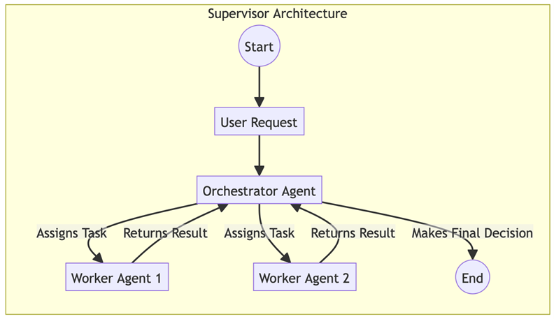

*Figure 5.2 – Supervisor Architecture workflow*

1.
2.
3.
4.
5.
Chapter 5 130
Example implementation
The following ode illustrates a Supervisor Architecture applied to an enterprise loan approval process. In this
Level 4 implementation, the LoanOrchestratorAgent serves as the central authority, managing the state and
sequencing of the entire workflow. Notice that the orchestrator doesn't perform the validation or credit checks
itself; instead, it maintains a team of specialized worker agents. This separation of concerns allows the
supervisor to focus on high-level business logic and conditional branching, such as deciding to halt the process
if a document is invalid, while the specialized agents handle the technical execution of individual tasks. This
structure provides the predictability and clear audit trail required for highly regulated financial environments.
classLoanOrchestratorAgent:
def__init__(self):
self.doc_validator = DocumentValidationAgent()
self.credit_checker = CreditCheckAgent()
self.risk_assessor = RiskAssessmentAgent()
defhandle_loan_application(self, application_data):
```python
# Step 1: Delegate document validation
validation_result = self.doc_validator.validate(application_data)
```

if validation_result!= "valid":
return"Application Rejected: Invalid Documents"
```python
# Step 2: Delegate credit check
credit_report = self.credit_checker.check(application_data.applicant_id)
```

if credit_report.score < 600:
return"Application Rejected: Low Credit Score"
```python
# Step 3: Delegate risk assessment
risk_assessment = self.risk_assessor.assess(application_data, credit_report)
# Step 4: Assemble final result and make decision
final_decision = self.make_final_decision(risk_assessment)
return final_decision
131 Multi-Agent Coordination Patterns
Consequences
Pros:
Predictability: The Supervisor model provides a clear, predictable flow, making it simple to
monitor, debug, and audit
Governance: Centralized control simplifies the enforcement of business rules and compliance
requirements
Cons:
Scalability: The single orchestrator can become a performance bottleneck as the system scales
Single point of failure: If the orchestrator fails, the entire workflow halts
Implementation guidance
When implementing a Supervisor Architecture, the most critical design principle is to maintain a strict
separation of concerns to avoid creating a "God agent." The orchestrator should be solely responsible for
coordination, that is, routing tasks, tracking state, and making decisions based on results, rather than executing
```

domain-specific logic itself. All substantial work should be encapsulated within the specialized worker agents.
This keeps the orchestrator lightweight and prevents the logic from becoming a tangled, unmanageable
monolith.
Reliability, in this centralized model, hinges on robust state management. Because the supervisor is a single
point of failure, the system must implement state persistence, often referred to as "checkpointing," after every
step of the workflow. Frameworks such as LangGraph are designed explicitly for this purpose, allowing the
system to persist the graph state to a database. This ensures that if the orchestrator or the underlying
infrastructure fails, the workflow can resume exactly where it left off without data loss.
Finally, communication between the supervisor and its workers must be deterministic. Relying on free-form
natural language for handoffs is a recipe for instability. Instead, enforce strict output schemas (using tools such
as Pydantic or JSON mode) so the orchestrator receives structured data it can programmatically parse.
Furthermore, the supervisor should act as the central handler for faults; if a worker fails or hangs, the supervisor
must possess the logic to retry the operation, route it to a backup agent, or fail gracefully, protecting the broader
system from individual agent errors.
While the centralized Supervisor Architecture excels at manageability and auditability, it is not a one-size-fitsall solution. In scenarios where the environment is unpredictable or where the system must withstand the
failure of individual components without halting, a rigid hierarchy can become a liability. To achieve true
robustness and adaptability, we must explore the opposite end of the spectrum: a decentralized approach where
control is distributed among peers.
◦
◦
◦
◦
Chapter 5 132
Swarm Architecture (emergent decentralized coordination)
In the Swarm Architecture, there is no central leader. Instead, agents operate as a peer-to-peer network,
collaborating to solve a problem in an emergent, self-organizing fashion. A task is often roadcast to the entire
group of specialized agents, who then "bid" on or self-select the tasks based on their capabilities. The workflow
emerges from the interactions tween agents, rather than being explicitly dictated by a central supervisor.
This pattern is particularly well-suited for creative tasks, dynamic problem-solving, and environments that
require high resilience. It harnesses the collective intelligence of the agents, allowing the system to adapt and
evolve in real time.
Context
A complex task is dynamic and unstructured, or the system needs to be highly resilient and adaptive to change.
A single point of failure is unacceptable, and the problem-solving process is better served by parallel,
autonomous action rather than a rigid, sequential flow.
Problem
How can a group of autonomous agents collaborate effectively to achieve a common goal without a central
orchestrator? The system needs a mechanism for task discovery, handoff, and completion in a decentralized,
## resilient manner. Forces in the problem space include the following:

Autonomy versus coordination: Maximizing agent autonomy improves resilience and adaptability,
but lack of explicit coordination can lead to redundant work or misaligned goals
Scalability versus overhead: A decentralized network can scale horizontally without a bottleneck, but
this requires an efficient communication protocol to manage inter-agent chatter.
Emergent behavior versus predictability: The self-organizing nature of a swarm can lead to highly
creative and adaptive solutions, but the final outcome may be less predictable and harder to debug
Solution
The Swarm Architecture pattern typically relies on a shared communication or task board. A task is posted, and
any gent can "pull" the task from the board when they are ready to work on it. Once an agent completes its
part, it updates the task's state on the board, making it available for the next specialized agent in the workflow.
This allows for asynchronous, parallel processing and removes the dependency on a single point of control.
Example: Decentralized content creation
## A task to "write blog post about solar power" is sent to a swarm of agents. Here is the workflow:

Task broadcast: The task is posted on a shared task board.
Self-selection: A ResearchAgent polls the board, recognizes the task's status (new), and self-selects it.
Execution andupdate: The ResearchAgent gathers facts, updates the task with its findings, and
changes its status to researched.
Handoff: A DraftingAgent sees the "researched" status, pulls the task, writes the draft, and updates the
status to drafted.
Completion: An EditorAgent performs the final proofreading and marks the task as complete.
1.
2.
3.
4.
5.
133 Multi-Agent Coordination Patterns
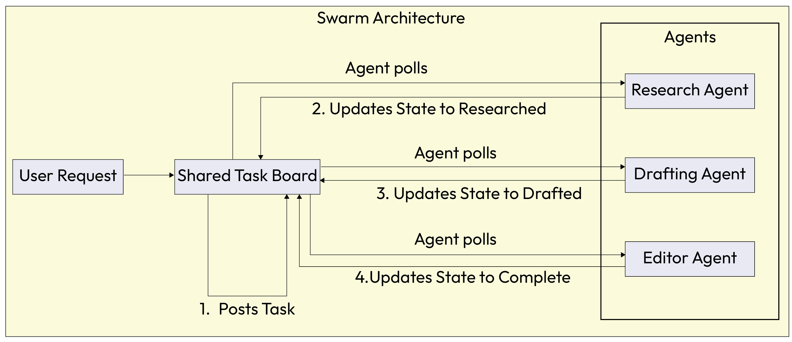

*Figure 5.3 – Swarm Architecture workflow*

Example implementation
The following sample implementation demonstrates a Swarm Architecture, highlighting the shift from topdown command to emergent, decentralized coordination at Level 6. In this model, agents operate as peers
within a network, utilizing a shared_task_board to manage the lifecycle of a project.
Rather than being directed by a supervisor, each agent, such as the ResearchAgent or DraftingAgent,
independently monitors the state of the task board. When an agent identifies a task status that matches its
specialized capability, it 'claims' the work, executes its logic, and updates the shared state. This decoupled, pullbased interaction model allows the system to remain highly resilient and flexible, as the workflow evolves
naturally through local agent decisions rather than a static, pre-programmed plan.
classResearchAgent:
defcheck_for_tasks(self, shared_task_board):
task = shared_task_board.get("task_id_123")
## if task.status == "new":

facts = self.gather_facts(task.topic)
task.data["research"] = facts
task.status = "researched"# Update status for next agent
print("ResearchAgent completed work.")
classDraftingAgent:
defcheck_for_tasks(self, shared_task_board):
task = shared_task_board.get("task_id_123")
## if task.status == "researched":

draft = self.write_draft(task.data["research"])
task.data["draft_content"] = draft
task.status = "drafted"# Update status for next agent
Chapter 5 134
print("DraftingAgent completed work.")
classEditorAgent:
defcheck_for_tasks(self, shared_task_board):
task = shared_task_board.get("task_id_123")
## if task.status == "drafted":

final_text = self.proofread(task.data["draft_content"])
task.data["final_text"] = final_text
task.status = "complete"
print("EditorAgent completed work.")
Consequences
Pros:
Resilience: The lack of a central controller means there is no single point of failure. The system
can continue to operate even if some agents go offline.
Scalability: The peer-to-peer nature allows the system to scale horizontally by simply adding
more agents to the swarm.
Cons:
Debuggability: The emergent, non-linear flow of tasks can make the system's behavior difficult
to debug and predict.
Governance: Enforcing business rules or ensuring compliance can be challenging without a
central authority.
Implementation guidance
When designing a multi-agent system, a good starting point is to embrace a centralized approach. For most
enterprise applications, a Supervisor Architecture is easier to build, debug, and govern, as it provides clear lines
of responsibility and a central point for monitoring.
However, some applications may benefit from decentralization over time.Swarm Architecture systems are
more resilient to failure and adaptive to changing conditions, making them a natural fit for dynamic
environments where agent autonomy is essential. In practice, many complex systems adopt a hybrid model. A
top-level orchestrator manages the overall business process but delegates large sub-goals to self-organizing
"swarms" or "crews" of agents, which handle the details of execution among themselves. This balance combines
the clarity of central control with the adaptability of distributed decision-making.
The following table provides a direct comparison of the characteristics of these two primary models.
◦
◦
◦
◦
135 Multi-Agent Coordination Patterns
## Feature Supervisor Architecture

(Centralized)
Swarm Architecture
(Decentralized)
Control flow Hierarchical: a single orchestrator
delegates tasks to worker agents.
Peer-to-peer: agents self-select or
pass tasks to each other.
Coordination Explicit and top-down: the
supervisor manages the workflow.
## Emergent and bottom-up:

coordination arises from local
interactions.
Modularity High: specialist agents can be
easily added or replaced under the
supervisor.
High: agents are autonomous and
can be added or removed from the
swarm.
Key benefit Predictability and clear oversight.
Easier to debug and govern.
Resilience and adaptability. No
single point of failure.
Key drawback The supervisor can become a
performance bottleneck or a single
point of failure.
Can be difficult to govern and
debug. Overall behavior can be
less predictable.
Best for Structured business processes,
workflows with clear steps (e.g.,
loan processing).
Creative tasks, dynamic problemsolving, environments requiring
high resilience.
Table 5.2 - Comparison of task delegation architectures
Choosing between centralized Supervisor and a decentralized Swarm establishes the high-level "operating
system" for your agents; it defines the flow of authority. However, real-world problems often require more
specific structural arrangements to manage data and interactions effectively.
For instance, how do you handle a problem where the solution must evolve incrementally? Or, how do you find
the best agent for a task when capabilities fluctuate? To solve these specific challenges, we turn to Agent
Composition Topologies. These architectural patterns define the structural relationships between agents.
## Agent Composition Topologies

While the task legation frameworks described define the general "rules of engagement" (centralized versus
decentralized), specific composition topologies describe the structural arrangement of agents and data in more
detail. These patterns address specific challenges related to knowledge convergence, market-based task
allocation, and fault tolerance.
Chapter 5 136
## Blackboard Knowledge Hub

In complex problem-solving scenarios, multiple specialized agents must contribute partial or uncertain facts to
a developing solution. The task evolves dynamically as new information arrives, requiring a system that
supports convergence toward a solution and strict provenance of information.
Context
The system involves ill-defined or complex problems where no single agent possesses all the necessary
knowledge to solve the entire problem. The solution requires the incremental accumulation of contributions
from various "experts," and the order in which these experts contribute cannot be fully predetermined.
Problem
How can multiple independent agents collaborate on a developing solution without direct, tightly coupled
communication channels that would become unmanageable at scale? Forces in the problem space include the
following:
Shared understanding versus race conditions: Agents need a unified view of the problem state, but
simultaneous updates can lead to conflicts
Openness to contributions versus quality control: The system needs to be open to contributions from
various experts but must filter out low-quality or hallucinatory data
Global consistency versus agent autonomy: Agents need to act independently, but the final solution
must be globally consistent
Solution
The Blackboard Knowledge Hub pattern implements a central repository, the Blackboard, that holds typed,
versioned facts and hypotheses. Knowledge sources (agents) do not communicate directly; instead, they post
updates to the Blackboard. A controller arbitrates the process phases (post → evaluate → integrate), ensuring
that contributions are validated and that the solution converges logically.
Example: Collaborative medical diagnosis
## A patient presents with complex, ambiguous symptoms. Here is the workflow:

Posting: A SymptomAnalysisAgent posts Patient has fever and rash to the Blackboard.
Triggering: Seeing "rash," the DermatologyAgent triggers, analyzes the image, and posts Rash
indicates potential viral infection (Confidence: 0.8).
Refining: The VirologyAgent reads this hypothesis and posts a request for Blood Test Results
Convergence: The controller evaluates the collective facts until a DiagnosisAgent synthesizes the final
diagnosis with sufficient confidence.
1.
2.
3.
4.
137 Multi-Agent Coordination Patterns
Example implementation
The following code provides a foundational implementation of the Blackboard Knowledge Hub pattern. This
architecture is specifically designed for complex, non-linear problems, such as medical iagnosis or fraud
detection, where a solution emerges through the incremental contributions of multiple specialized experts.
In this implementation, the Blackboard class acts as a centralized, thread-safe repository for 'facts' and
'hypotheses.' Notice that agents do not communicate with each other directly; instead, they 'post' their findings
to the blackboard with associated confidence scores and timestamps. This structure allows a separate controller
to arbitrate the problem-solving process, ensuring that the system converges toward a globally consistent
solution while maintaining a complete, auditable 'chain of thought' in the blackboard's history.
classBlackboard:
def__init__(self):
self.facts = []
## defpost_hypothesis(self, agent_id, hypothesis, confidence):

## entry = {"agent": agent_id, "data": hypothesis, "conf": confidence, "timestamp":

now()}
self.facts.append(entry)
return entry
classController:
defrun_cycle(self, problem_state):
```python
# 1. Selection: Determine which agents can contribute to current state
eligible_agents = self.select_knowledge_sources(problem_state)
# 2. Execution: Agents write to blackboard
```

for agent in eligible_agents:
hypothesis = agent.generate_hypothesis(problem_state)
self.blackboard.post_hypothesis(agent.id, hypothesis)
```python
# 3. Evaluation: Validator checks for convergence or conflicts
ifself.validator.check_convergence(self.blackboard.facts):
returnself.validator.synthesize_solution()
Chapter 5 138
```

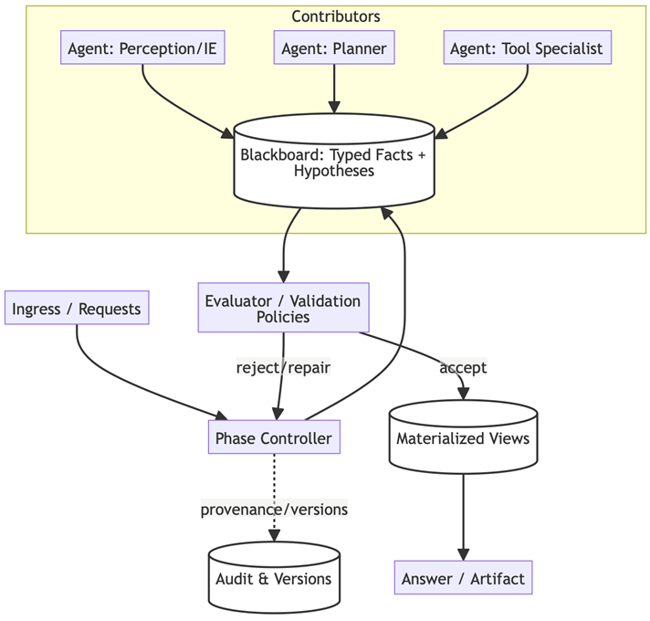

*Figure 5.4 – Blackboard topology*

Consequences
Pros:
Flexibility: Excellent for ill-posed problems where the path forward is unclear nd requires
iterative contributions
Auditability: The append-only log provides a clear history of how the solution evolved, which
is crucial for explaining the "chain of thought" of the system
Cons:
Latency: The central writing and evaluation steps introduce latency, making it slower than
direct message passing
Bottleneck: The controller can become a throughput bottleneck if the blackboard is not
properly sharded or indexed
◦
◦
◦
◦
139 Multi-Agent Coordination Patterns
Implementation guidance
This pattern is best applied when you have a large number of "weak" experts (specialized but limited agents) or
when there is a critical need for traceable convergence. However, avoid using it or low-latency, simple tool
tasks, as the overhead of managing the blackboard state outweighs the benefits. To maintain hygiene,
implement a "cleanup strategy" or a "forgetting mechanism" to prune old or invalidated facts; otherwise, the
blackboard can become a noisy scratchpad that degrades agent performance.
The Blackboard pattern focuses on how a collective of agents can incrementally converge on a solution through
a shared knowledge state. However, when the primary challenge shifts from how to solve a problem to who is best
equipped to handle a specific task within a fluctuating pool of specialists, we move from a central knowledge hub
to a dynamic, market-driven approach: the Contract-Net Marketplace.
Contract-Net Marketplace (Mediator + Bids)
A system s tasks that vary widely in complexity and domain. The vailable capabilities are heterogeneous
and dynamic; agents may come online or go offline, or their load may vary. You need to select the best-fit agent
at runtime rather than hardcoding the assignment.
Context
You are operating in a distributed environment with a diverse pool of agents. The capabilities of these agents
overlap, but their availability, cost, and performance characteristics vary dynamically. Static routing logic is
brittle and inefficient because it cannot account for real-time load or specific task nuances.
Problem
How do you ssign a task to the most suitable agent when the optimal choice depends on dynamic factors such
as availability, cost, and confidence, which are only known at runtime? Forces in the problem space include the
following:
Specialization versus routing overhead: You want highly specialized agents, but routing to them
manually is complex
Competitive bidding versus coordination cost: Bidding ensures the best agent gets the job, but the
auction process takes time and compute
Exploration versus service-level agreements (SLAs): You want to explore the best options without
missing execution deadlines.
Solution
Implement a Contract-Net Protocol, a market-based negotiation mechanism. A solicitor (or manager)
broadcasts task announcements to potential workers. Bidders (agents) evaluate the announcement nd respond
with a formal bid containing their capability, cost, estimated time of arrival (ETA), and confidence score. The
solicitor then acts as an awarder, assigning the task to the agent with the highest utility score.
Example: Selecting a cloud provider agent
A user wants to train a large model but has a strict budget. Here is the workflow.
Announcement: The TrainingSolicitor broadcasts: "Task: Train Model X. Constraint: Max cost
$100."
1.
Chapter 5 140
Bidding:
AWS_Agent bids: $90, ETA 2 hours.
Azure_Agent bids: $85, ETA 2.5 hours.
OnPrem_Agent bids: $10, ETA 12 hours.
Award: The solicitor weighs time versus. money and awards the contract to the AWS_Agent for the best
balance.
Example implementation
The following sample implementation illustrates the Contract-Net Marketplace pattern, highlighting how
Level 6 systems can move beyond hardcoded logic to a dynamic, market-driven model for task assignment.
The code defines two primary roles: the Solicitor, which manages the auction process, and the BidderAgent,
which represents a specialized resource. By broadcasting an announcement and evaluating incoming bids based
on a utility function, such as balancing model confidence against compute cost, the system ensures that every
task is handled by the agent best suited for the specific requirements at that exact moment. This decentralized
negotiation makes the system highly adaptive to enterprise environments where agent availability and API costs
fluctuate in real time.
classSolicitor:
defrequest_task_fulfillment(self, task):
```python
# 1. Announce task to all available subscribers
bids = self.broadcast_announcement(task)
# 2. Evaluate bids based on utility function (Confidence vs Cost)
best_bid = self.evaluate_bids(bids)
if best_bid:
# 3. Award contract
result = best_bid.agent.execute_contract(task)
return result
else:
raise NoBidsException()
classBidderAgent:
defreceive_announcement(self, task):
ifnotself.can_handle(task):
returnNone# Refusal
# Calculate cost and confidence
cost = self.estimate_compute_cost(task)
confidence = self.assess_capability(task)
return Bid(agent=self, cost=cost, confidence=confidence)
2.
1.
2.
3.
3.
141 Multi-Agent Coordination Patterns
```


*Figure 5.5 – Contract-Net Protocol*

Consequences
Pros:
Adaptive selection: The system dynamically adapts to changing agent availability nd
capabilities without code changes
High utilization: Decouples the requester from the provider, ensuring work flows to the agents
best suited for it at that moment
Cons:
Auction latency: The negotiation process introduces overhead before work even begins
Risk of gaming: Without incentives for truthful bidding, agents may overstate their confidence
to win tasks
Implementation guidance
Use this pattern when you have a large, variable toolset or when optimizing for dynamic factors such s cost or
speed. However, avoid it for fixed, predictable workflows where static routing (such as intent-aware routing) is
simpler and faster. To prevent infinite waiting, the solicitor must enforce strict deadlines for receiving bids.
Additionally, consider implementing a "reputation score" for bidders to penalize agents that win contracts but
fail to deliver quality results.
Market-based allocation is ideal for optimizing efficiency and cost in dynamic environments where multiple
specialists are available. However, in enterprise systems where agents perform high-stakes or risky actions,
efficiency must be balanced with absolute stability and fault tolerance. This leads us to a pattern borrowed from
the world of highly available distributed systems, the Supervision Tree with Guarded Capabilities.
Supervision Tree with Guarded Capabilities
The Supervision Tree with Guarded Capabilities is an architectural pattern designed to contain ilures and
enforce security boundaries within a multi-agent system. Instead of allowing a single agent's error to propagate
and crash the entire application, this pattern organizes agents into a hierarchical tree where supervisors are
responsible for monitoring the health and behavior of their subordinates. It combines the 'let it crash'
philosophy of the "Actor Model" with strict capability guarding, ensuring that agents only have access to the
specific tools required for their specific role, while providing a structured mechanism for automatic recovery and
self-healing.
◦
◦
◦
◦
Chapter 5 142
Context
This pattern is derived from the actor model (famous in Erlang and Akka systems) and applied to agentic AI. It is
essential in systems where many agents perform autonomous, potentially risky tool calls, such as executing
generated code, scraping web pages, or interacting with unstable external APIs.
Problem
How can the system contain failures from autonomous agents without crashing the entire application, while
## still allowing them enough freedom to operate? Forces in the problem space include the following:

Safety versus velocity: We want agents to act autonomously and fast, but an unhandled xception in a
sub-agent can propagate up and kill the main orchestrator
Isolation versus coordination: Agents need to share data to collaborate, but if they share memory
directly, a corrupted state in one agent can infect others
Developer agility versus policy enforcement: Developers need to add new capabilities quickly, but
granting every agent full system access violates the principle of least privilege
Solution
Implement Supervision Tree where agents are organized hierarchically. Supervisors are specialized agents
responsible solely for managing the lifecycle of their children (worker agents). If a child crashes or violates a
policy, the supervisor detects the failure and applies a recovery strategy (e.g., restart the child). Capabilities re
granted per subtree, ensuring that a "Research" branch cannot access "Billing" tools.
Example: Resilient web scraper
Spawn: The Root Supervisor spawns a ResearchSupervisor, which spawns three ScraperAgents.
Failure: One ScraperAgent encounters blocking captcha and throws a fatal error (or gets stuck in a
loop).
Detection: The ResearchSupervisor detects the crash signal.
Recovery: Following a "one-for-one" strategy, the supervisor restarts only the failed ScraperAgent with
a fresh state, leaving the others running. The failure is contained.
Example implementation
The following sample code illustrates the Supervision Tree with Guarded Capabilities pattern, focusing on
how a system can isolate risks and automate recovery. In this implementation, the SupervisorAgent serves as a
lifecycle manager that explicitly defines the boundaries for each worker. By providing a child agent with only a
limited subset of tools at initialization, the system ensures that a compromise or failure in one branch does not
expose sensitive capabilities in another. This structure, coupled with a defined recovery strategy such as
"ONE_FOR_ONE," allows the system to remain resilient and self-healing even when dealing with unpredictable
external tools.
classSupervisorAgent:
def__init__(self, strategy="ONE_FOR_ONE"):
1.
2.
3.
4.
143 Multi-Agent Coordination Patterns
self.children = []
self.strategy = strategy
## defspawn_child(self, agent_cls, tools):

```python
# Isolate capabilities by passing specific tools only to this child
child = agent_cls(allowed_tools=tools)
self.children.append(child)
return child
defmonitor_loop(self):
# Continuously check health of children
```

for child inself.children:
## if child.status == "CRASHED"or child.status == "POLICY_VIOLATION":

self.handle_failure(child)
defhandle_failure(self, failed_agent):
log_incident(failed_agent.id, failed_agent.error)
## ifself.strategy == "ONE_FOR_ONE":

print(f"Restarting agent {failed_agent.id} to clean state.")
failed_agent.restart()
## elifself.strategy == "ESCALATE":

```python
# If the supervisor can't handle it, crash itself to signal up the tree
raise SupervisorFailureException(failed_agent)
```

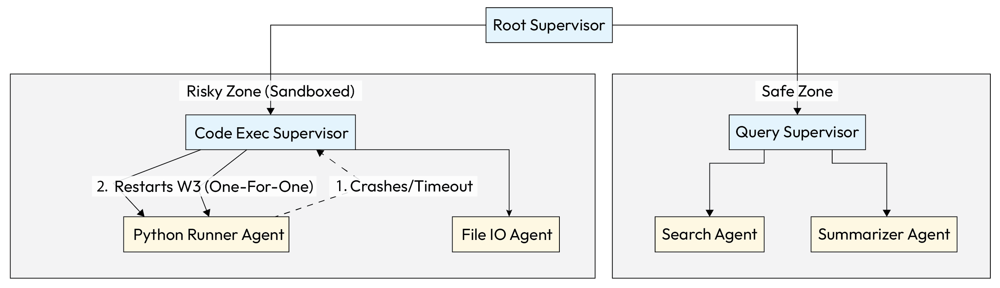

*Figure 5.6 – Supervision Tree with Guarded Capabilities*

Chapter 5 144
Consequences
Pros:
High resilience: Automatic rror recovery ensures the system can self-heal without human
intervention
Blast-radius control: A crash in a risky branch (e.g., a web scraper) does not affect the safe
branches or the root orchestrator
Cons:
Complexity: Increases architectural choreography; developers must think in terms of trees and
lifecycle management
Communication overhead: Cross-tree communication requires clear gateways (mailboxes), as
agents cannot just "grab" data from a sibling
Implementation guidance
This pattern is critical for production systems using unstable tools (such as web browsing or code execution).
Avoid deep supervision trees for simple, single-shot utilities where the setup overhead ominates the execution
time. When defining recovery strategies, ensure you implement "backoff logic." If a child crashes 5 times in 1
second, stop restarting it to prevent a "crash loop" that burns resources. Always enforce that children cannot
bypass their supervisor to communicate directly with the root.
Establishing the topology gives your system a shape, but a shape alone doesn't solve problems. Once your
agents are organized, whether in a swarm, a hierarchy, or a market, they need a process to tackle complex goals.
They need to look at a high-level objective, such as "launch a product," and figure out the sequence of steps
required to achieve it. This is the domain of Multi-Agent Planning, the cognitive engine that drives the
collective forward.
Multi-Agent Planning
Once a high-level delegation framework (e.g., a centralized supervisor or a decentralized swarm) is in place, the
system needs a concrete method for tackling complex goals. A single high-level objective, such as "launch a new
product," cannot be directly executable by any single agent. It requires a thoughtful process of breaking the goal
down into a series of coordinated, smaller actions that can be assigned to specialized agents. This is the core
purpose of the Multi-Agent Planning pattern. It provides a structured approach for a system to analyze a
complex goal and create a coherent, actionable plan that intelligently distributes the workload across the agent
team.
Context
A complex problem has been presented to the system that is too large or multifaceted for any single agent to
solve alone. The overall goal is clear, but the sequence of steps and the division of labor required to achieve it are
not. The system needs a coherent plan that leverages the specialized skills of its various agents.
◦
◦
◦
◦
145 Multi-Agent Coordination Patterns
Problem
How can a group of autonomous agents collaboratively create and execute a unified plan to achieve a common
goal? Without a shared plan, agents may perform redundant work, execute steps in the wrong order, or fail to
combine their results effectively, leading to inefficiency or outright failure. Forces in the problem space include
the following:
Decomposition versus cohesion: Breaking a large goal into smaller tasks is necessary, but the system
must ensure that the sub-tasks remain cohesive and contribute to the overall objective
Specialization versus coordination overhead: Using specialized agents improves efficiency for
individual tasks but increases the complexity of managing their handoffs and overall coordination
Static versus dynamic planning: A predefined plan is predictable but lacks the flexibility to adapt to
new information or unforeseen challenges.
Solution
The Multi-Agent Planning pattern addresses this by establishing a mechanism for decomposing high-level
goal into a graph or sequence of manageable sub-tasks and assigning those tasks to the most appropriate
agents. This process, often called collaborative task decomposition, is typically handled by the orchestrator agent
in a centralized framework. The plan itself becomes a shared artifact that guides the collective's behavior.
Example: Market analysis report generation
A high-level goal of "Generate a comprehensive market analysis report for Product X" is delegated to a
system using Multi-Agent Planning. The orchestrator decomposes this goal into a series of sub-tasks.
gather_sales_data: Assigned to a DataRetrieverAgent.
analyze_competitor_chatter: Assigned to a SocialMediaMonitoringAgent.
summarize_analyst_reports: Assigned to a FinancialDocsAgent.
synthesize_findings_and_draft_report: Assigned to a ReportWriterAgent.
These sub-tasks can then be executed in parallel or sequentially, with dependencies managed by the
orchestrator or through direct communication between the agents.
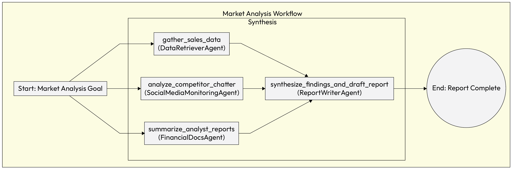

*Figure 5.7 – Multi-Agent Planning workflow*

1.
2.
3.
4.
Chapter 5 146
Implementation example
The following sample implementation demonstrates the Multi-Agent Planning pattern, showcasing how a
complex objective is decomposed into actionable sub-tasks. In this scenario, the MarketAnalysisOrchestrator
acts as the lead planner, identifying which specialized agents are required to fulfill a market research request.
By utilizing the concurrent.futures library, the orchestrator executes independent data gathering tasks in
parallel, significantly reducing the overall latency of the workflow. Once the foundational data is retrieved from
the various specialists, the orchestrator manages the final dependency by passing all findings to the report
writer, ensuring a cohesive and grounded final output.
```python
import concurrent.futures
classMarketAnalysisOrchestrator:
def__init__(self, data_retriever_agent, social_media_agent, financial_docs_agent,
report_writer_agent):
self.data_retriever = data_retriever_agent
self.social_media = social_media_agent
self.financial_docs = financial_docs_agent
self.report_writer = report_writer_agent
defgenerate_report(self, product_name):
# 1. Decompose the high-level goal into a plan
plan = {
"task1": {"agent": self.data_retriever, "input": product_name},
"task2": {"agent": self.social_media, "input": product_name},
"task3": {"agent": self.financial_docs, "input": product_name}
}
# 2. Execute independent tasks in parallel
```

with concurrent.futures.ThreadPoolExecutor() as executor:
future_to_task = {
executor.submit(plan[key]["agent"].run, plan[key]["input"]): key
for key in plan
}
results = {}
## for future in concurrent.futures.as_completed(future_to_task):

task_name = future_to_task[future]
try:
results[task_name] = future.result()
## except Exception as exc:

147 Multi-Agent Coordination Patterns
print(f'{task_name} generated an exception: {exc}')
```python
# 3. Execute dependent tasks
sales_data = results.get("task1")
competitor_chatter = results.get("task2")
analyst_summaries = results.get("task3")
final_report = self.report_writer.run(
sales_data, competitor_chatter, analyst_summaries
)
return final_report
Consequences
Pros:
Efficiency: This pattern enables solving complex problems by leveraging agent specialization
and parallel execution, leading to greater efficiency and capability
Leverages specialization: By assigning tasks to specialized agents, the system can achieve
higher-quality results than a single, general-purpose agent could
Cons:
Coordination overhead: The planning process itself consumes resources and can become a
bottleneck if not designed efficiently
Risk of rigidity: A static plan can fail if the environment changes or if a sub-task fails
Implementation guidance
```

To mitigate the risks of rigidity and coordination overhead, the plan should remain flexible rather than static.
The system must be able to adapt the plan in response to new information or failed sub-tasks. Clearly defining
dependencies between sub-tasks is essential to ensure smooth handoffs and prevent execution errors.
Now that we have explored the blueprints for orchestrating multi-agent systems and decomposing complex
problems, the next logical step is to understand how these agents exchange information. The Knowledge
Sharing pattern provides the foundational principles for how agents talk to each other to share data, coordinate
actions, and manage dependencies.
Knowledge Sharing
Once a multi-agent system has a coherent plan, the quality of each agent's execution depends heavily on the
knowledge it possesses. If agents operate in informational silos, the system as a whole cannot benefit from the
unique insights and learnings that individual agents gain over time. The Knowledge Sharing pattern addresses
this challenge directly, providing a mechanism for creating a collective intelligence and ensuring that valuable
information discovered by one agent can be accessed by all, making the entire system more effective and
adaptive.
◦
◦
◦
◦
Chapter 5 148
Context
In a multi-agent system, individual agents often acquire valuable information or learn new skills through their
experiences. For example, one agent might learn the most efficient way to query a particular database, while
another might learn to identify a new type of customer complaint. Without a sharing mechanism, this
knowledge remains siloed within the individual agents.
Problem
How can the valuable knowledge or experience gained by one agent be shared with other agents in the system
to improve the collective intelligence of the group? Without a sharing mechanism, each agent must learn
everything independently, which is inefficient and leads to the system being less capable than the sum of its
## parts. Forces in the problem space include the following:

Siloed knowledge versus collective intelligence: While it's easier to keep knowledge local to a single
agent, doing so prevents the entire system from learning and improving over time
Ease of writing versus retrieval effort: The system needs a simple way for agents to write new
knowledge to a shared repository, but the repository must also be structured for efficient and accurate
retrieval by other agents
Knowledge propagation versus integrity: Sharing knowledge widely can accelerate problem-solving,
but it also carries the risk of propagating incorrect or outdated information
Solution
The Knowledge Sharing pattern implements a Shared Epistemic Memory, which is a global, persistent ta
store that all agents can read from and write to. This shared memory, which can be a simple knowledge graph, a
vector database, or another form of persistent storage, moves beyond simple message passing. It creates a
centralized pool of knowledge that allows the entire system to learn from the experiences of its individual
members, preventing fragmented understanding and semantic drift.
Example: Shared customer service solutions
To illustrate the practical impact of a Shared Epistemic Memory, consider a scenario in a large scale customer
support environment. In this xample, the system moves beyond simple reactive responses to build a persistent
repository of institutional knowledge. By allowing agents to contribute to and query a central vector database,
the organization ensures that a solution discovered by one agent becomes an immediate asset for the entire
collective, reducing redundant troubleshooting and improving the speed of resolution for complex issues.
Agent_A discovers that Error 503 on ProWidget X is consistently resolved by having the user clear
their device's cache.
Agent_A writes this successful solution to a shared vector database.
Weeks later, Agent_B encounters a user with a similar issue. It performs a semantic search on the shared
knowledge se and immediately finds the solution from Agent_A, resolving the issue on the first try.
1.
2.
3.
149 Multi-Agent Coordination Patterns
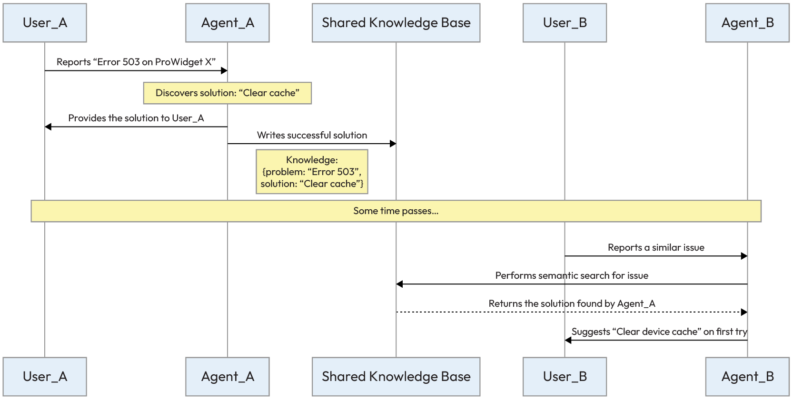

*Figure 5.8 – Agent information sharing*

This sequence illustrates how a shared memory allows the entire multi-agent system to learn and improve over
time from the experiences of its individual members.
Example implementation
The following implementation provides a concrete look at how agents interact with a Shared Epistemic
Memory. In this Python example, we use a conceptual vector database to act as the global store for institutional
knowledge. The code demonstrates the lifecycle of a knowledge entry, first showing how AgentA identifies a
successful solution and commits it to the shared base, and then showing how AgentB performs a semantic
search to retrieve that exact context when faced with a similar query. This pattern is fundamental for building
systems that grow more intelligent with every interaction, as it prevents the "amnesia" that occurs when
knowledge is siloed within individual session histories.
```python
# Shared Knowledge Base (e.g., a Vector Database)
SHARED_KNOWLEDGE_BASE = VectorDatabase()
classAgentA:
defhandle_issue(self, user_query):
```

if"Error 503 on ProWidget X"in user_query:
solution = "Have the user clear their device's cache."
#... solves the user's problem...
```python
# Write the successful solution to shared memory
knowledge_entry = {
"problem_description": "Error 503 on ProWidget X",
"solution_steps": solution
}
Chapter 5 150
SHARED_KNOWLEDGE_BASE.add_entry(knowledge_entry)
print("AgentA learned and shared a new solution.")
classAgentB:
defhandle_issue(self, user_query):
# Search the shared knowledge base for similar problems
relevant_solutions = SHARED_KNOWLEDGE_BASE.semantic_search(user_query)
if relevant_solutions:
# Use the solution found by another agent
solution = relevant_solutions[0].solution_steps
print(f"AgentB found a solution from the knowledge base: {solution}")
return solution
else:
# Handle the issue using its own logic
...
Consequences
Pros:
Collective intelligence: The most significant benefit is that the system becomes more capable
than the sum of its parts, as it can continuously learn from the collective experience of all agents
Efficiency: Agents can solve recurring problems faster by leveraging pre-existing knowledge
rather than starting from scratch each time
Cons:
Data integrity: There is a risk of propagating incorrect or malicious information
Governance overhead: A system is needed to manage, verify, and prune the knowledge base to
maintain its accuracy and reliability
Implementation guidance
To implement a successful knowledge-sharing architecture, practitioners must focus on several oundational
principles, starting with knowledge representation. For specific, objective facts, the system should utilize a
structured format such as JSON, while reserving unstructured text within vector databases for more nuanced,
experience-based knowledge.
Beyond simple storage, maintaining provenance is critical, as tracking the source of all shared knowledge allows
```

architects to assess its reliability and debug the system more effectively if incorrect information is propagated.
Finally, a robust design should incorporate trust and verification mechanisms, which might include allowing
agents to rate or validate information contributed by their peers, or even delegating a specialized "governance
agent" to periodically review and prune the knowledge base to ensure its continued accuracy and relevance.
◦
◦
◦
◦
151 Multi-Agent Coordination Patterns
A well-designed plan and a shared pool of knowledge give agents the intelligence they need to make sound
decisions. However, an agent's ability to translate those decisions into tangible outcomes often depends on its
capacity to interact with the outside world. This is where tools, such as APIs, functions, and databases, come
into play. This introduces a new coordination challenge: in a system with many specialized agents and tools,
how do we ensure the right agent calls the right tool for a specific task? The Tool Routing in Multi-Agent
Contexts pattern addresses this by providing a framework for efficiently managing and directing the use of tools
across the system.
Tool Routing in Multi-Agent Contexts
While the Knowledge Sharing pattern ensures that agents have access to the best collective information, their
ility to translate that knowledge into effective action often depends on using external tools.
This introduces a new coordination challenge: in a system with many specialized agents and tools, how do we
ensure the right agent calls the right tool or delegates for a specific task? The Tool Routing in Multi-Agent
Contexts pattern addresses this by providing a framework for efficiently managing and directing the use of tools
across the system.
Context
A multi-agent system has access to a variety of tools (APIs, functions, databases) that can be used to perform
actions. When a task requires a specific capability, the system must decide which agent should invoke which
tool.
Problem
In a system with numerous agents and tools, how do you ensure the right tool is selected for a given sub-task
and invoked by the most appropriate agent? Misalignment between an agent's goal and the tool it uses can lead
to degraded performance, incorrect results, or wasted resources. Forces in the problem space include the
following:
Accuracy versus flexibility: A rigid, hardcoded routing map ensures high accuracy for known tasks but
lacks the flexibility to handle unexpected requests
Centralization versus bottleneck: A central router simplifies the routing logic but can become a single
point of failure or a performance bottleneck in a high-traffic system
Tool specialization versus tool discovery: Agents benefit from having a small, dedicated set of tools,
but they need a mechanism to discover new or external tools if required.
Solution
The Tool Routing pattern improves focus and reduces decision fatigue by providing each agent or central
supervisor with a specific prompt that describes only its relevant tools. Instead of every agent having access to
every tool, capabilities are scoped. The orchestrator or a dedicated router agent is responsible for directing a task
to the agent whose dedicated toolset is best suited for the job. This approach ensures that agents operate
efficiently within clearly defined capabilities, leading to more accurate and reliable tool invocation.
Chapter 5 152
Example: Intelligent personal assistant
Consider personal assistant bot that needs to handle diverse user queries ranging from checking stock prices
to booking flights.
User request: The user asks, "What is the current stock price of Google?"
Classification: The central Router Agent analyzes the intent and classifies the request as a
financial_query.
Routing: Based on this classification, Router Agent delegates the task to FinancialAgent, which holds
the specific API keys and tools for market data.
Specialized execution: The FinancialAgent uses its get_stock_price tool to fetch the data.
Completion: The result is returned to the user, while the WeatherAgent and TravelAgent remain
undisturbed, preventing them from hallucinating an answer or misusing their tools.


*Figure 5.9 – Centralized tool routing example implementation*

1.
2.
3.
4.
5.
153 Multi-Agent Coordination Patterns
Example implementation
A CentralOrchestrator agent routes a user's request to the correct specialized agent based on the request's
classification.
classCentralOrchestrator:
```python
# This map defines which agent is responsible for which type of task
```

AGENT_ROUTING_MAP = {
"financial_query": "FinancialAgent",
"weather_query": "WeatherAgent",
"database_query": "DatabaseAgent"
}
defclassify_request(self, user_request):
```python
# Uses an LLM to classify the request type
# For example, "What is the current stock price of Google?" -> "financial_query"
# Or, "What is the weather like in London today?" -> "weather_query"
returnself.llm.classify(user_request)
defhandle_request(self, user_request):
# 1. Determine the type of request
request_type = self.classify_request(user_request)
# 2. Find the correct agent from the routing map
target_agent_name = self.AGENT_ROUTING_MAP.get(request_type)
if target_agent_name:
# 3. Delegate the request to the specialized agent
print(f"Routing request to {target_agent_name}")
target_agent = self.get_agent_instance(target_agent_name)
result = target_agent.process(user_request)
return result
else:
return"Sorry, I don't have an agent capable of handling that request."
classFinancialAgent:
# This agent ONLY knows about financial tools
defprocess(self, request):
# Uses its internal LLM to decide which of its specific tools to use
# e.g., self.llm.decide_tool(request, available_tools=[get_stock_price_tool])
...
Chapter 5 154
classWeatherAgent:
# This agent ONLY knows about weather tools
defprocess(self, request):
# Uses its internal LLM to decide which of its specific tools to use
# e.g., self.llm.decide_tool(request, available_tools=[get_current_weather_tool])
...
Consequences
Pros:
Higher accuracy: By limiting the tool options for each agent, the system reduces the chance of
incorrect tool invocation, leading to more reliable outcomes
Focus: Agents become highly specialized in their domains, improving their efficiency and
performance
Cons
Rigidity: This pattern can be less flexible if a task unexpectedly requires a tool outside an
agent's predefined set
Upfront design: It requires careful upfront design and maintenance of the routing map or agent
capabilities
Implementation guidance
```

For systems with a large number of tools, consider creating a tool registry that agents can query. This allows for
more dynamic routing than hardcoded tool-agent assignments. The routing logic n also be delegated to a
dedicated LLM-powered router agent that uses function-calling to select the right agent and its associated tool,
providing greater flexibility.
Ensuring the right agent uses the right tool is a crucial step in coordinating action. However, for that action to
be effective, it must be based on a clear and consistent understanding of the environment. But what happens
when different agents perceive the same environment differently, leading to conflicting data? The system needs
a way to reconcile these differences and agree on a single version of the truth before it can act. This is the
challenge addressed by the Consensus pattern.
Consensus
In any istributed system, achieving a shared perspective is a fundamental challenge. For a multi-agent system,
where autonomous agents make decisions based on their perception of the world, this challenge is even more
acute.
The Consensus pattern provides a family of protocols that enable a group of agents to agree on a specific piece of
data or the state of the system. This is not simply about voting; it is about a structured process of
communication and convergence that ensures the system can operate from a single, reliable point of view,
preventing errors that arise from acting on contradictory information.
◦
◦
◦
◦
155 Multi-Agent Coordination Patterns
Context
In a distributed system, multiple agents may have access to different, incomplete, or even conflicting
information about the state of the environment. To proceed with a coordinated action, the agents must first
agree on a single, shared understanding.
Problem
How can a group of autonomous agents reach a guaranteed agreement on a specific value or state, even in the
presence of noisy data or minor disagreements? Without a consensus mechanism, agents might act on
contradictory information, leading to system-wide failures or inefficiencies. Forces in the problem space include
the following:
Agreement versus individual accuracy: Agents may have highly accurate, yet conflicting, individual
data points. The consensus process forces them to compromise on a single value, potentially at the cost
of losing some individual precision.
Convergence versus time: The process of reaching consensus can be time-consuming, especially in a
large network of agents. The system must balance the need for a reliable outcome with the need for a
timely decision.
Honest actors versus malicious actors: The consensus algorithm must be robust enough to handle
noise and minor disagreements, but also a mechanism to identify and isolate agents that deliberately
provide false information to sabotage the process.
Solution
The Consensus pattern provides a protocol through which agents can converge on a common state, often
through an iterative debate. In this model, agents broadcast their current beliefs, receive the beliefs of others,
and adjust their own beliefs based on a predefined rule. This process repeats until the states of all agents
converge within an acceptable tolerance. This method ensures a robust and validated understanding of the
shared state before any action is taken.
Example: Financial forecasting debate
A financial services firm uses a team of agents to generate a consensus forecast for a company's next-quarter
revenue. Each agent has a different perspective or model.
Initial forecasts (Round 1): An orchestrator agent requests a forecast from the team.
An OptimistAgent, analyzing positive market trends, forecasts $110M.
A PessimistAgent, focusing on potential supply chain risks, forecasts $95M.
A RealistAgent, using historical performance data, forecasts $102M.
Iterative debate (Round 2): The agents share their forecasts with each other. They each calculate the
average forecast ($102.3M) and adjust their own value partway towards this mean.
Convergence: The process of sharing and adjusting continues. The range between the highest and
lowest forecasts narrows with each round until all forecasts are within a predefined tolerance.
Action: The system declares a final consensus forecast of $103M, which is then used to inform the firm's
investment strategy.
1.
◦
◦
◦
2.
3.
4.
Chapter 5 156
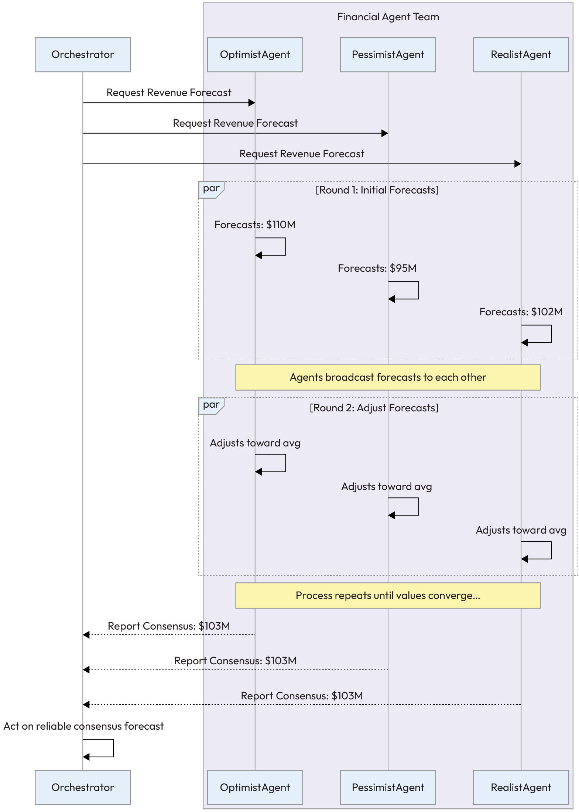

*Figure 5.10 – Agent consensus workflow*

157 Multi-Agent Coordination Patterns
Example implementation
The following sample implementation demonstrates the Consensus pattern, focusing on how a group of gents
can arrive at a shared perspective through iterative convergence. In this Level 6 architecture, the
ConsensusManager acts as the facilitator for a structured debate among specialized financial agents.
Rather than simply averaging divergent data points, the manager executes a multi-round protocol where each
agent observes the collective mean and adjusts its own hypothesis based on its internal logic. This process
continues until the individual forecasts fall within a specified tolerance, ensuring that the final decision is not
just a statistical middle ground but a validated agreement reached through the active participation of all
autonomous members.
classConsensusManager:
## defget_consensus_forecast(self, agents, tolerance=1.0, max_rounds=5):

```python
# Round 1: Get initial forecasts
forecasts = {agent.name: agent.get_initial_forecast() for agent in agents}
```

for round_num inrange(1, max_rounds + 1):
```python
# Check for convergence
max_forecast = max(forecasts.values())
min_forecast = min(forecasts.values())
```

if (max_forecast - min_forecast) <= tolerance:
print(f"Consensus reached in round {round_num}.")
returnsum(forecasts.values()) / len(forecasts)
```python
# Share and adjust
average_forecast = sum(forecasts.values()) / len(forecasts)
```

for agent in agents:
```python
# Each agent adjusts its forecast towards the average
current_forecast = forecasts[agent.name]
adjusted_forecast = agent.adjust_forecast(
current_forecast, average_forecast
)
forecasts[agent.name] = adjusted_forecast
print("Max rounds reached. No consensus.")
returnsum(forecasts.values()) / len(forecasts) # Fallback to average
classFinancialAgent:
```

def__init__(self, name, initial_forecast_value):
Chapter 5 158
self.name = name
self.initial_forecast = initial_forecast_value
defget_initial_forecast(self):
returnself.initial_forecast
## defadjust_forecast(self, current_forecast, average_forecast, adjustment_factor=0.5):

```python
# Adjusts the forecast by a certain factor towards the average
return current_forecast + (average_forecast - current_forecast) *
adjustment_factor
Consequences
Pros:
Reliability: By facilitating a structured debate, the Consensus pattern increases the reliability
and robustness of the system's decisions. It ensures that actions are based on a shared,
```

validated understanding rather than a single, potentially flawed data point.
Fault tolerance: The process is inherently robust, as a single agent's failure to participate or
provide a valid response will not necessarily halt the entire process.
Cons:
Latency: Consensus protocols introduce a natural delay, as they require multiple rounds of
communication and computation. This makes them unsuitable for real-time systems that
require instantaneous decisions.
Complexity: Implementing a robust consensus protocol is complex, requiring careful
consideration of edge cases such as agent failure, network partitions, and malicious actors.
Implementation guidance
To ensure the success of a Consensus protocol, several core principles must be integrated into its design. First, it
is crucial to establish a clear termination condition, such as a maximum number of rounds or a specific
convergence threshold, to prevent the system from entering infinite loops. Second, the convergence algorithm
should serve as the primary logic for how agents adjust their state, which can range from a simple numerical
average to a more complex method that weighs individual opinions based on an agent's historical reliability.
Finally, practitioners must prioritize explainability by recording the reasoning and intermediate states of the
debate, as this creates a vital audit trail that allows stakeholders to understand exactly how the final consensus
was reached.
While consensus helps agents agree on facts, it doesn't resolve situations where their goals are in direct
opposition. The next pattern, Negotiation, provides a framework for agents to resolve these competing interests
and find mutually beneficial outcomes.
◦
◦
◦
◦
159 Multi-Agent Coordination Patterns
Agent Negotiation
When agents operate autonomously, they often have their own objectives, which may not always align perfectly
with those of other agents. This can lead to situations where agents have competing claims over resources or
conflicting preferences for a course of action.
Rather than resorting to a simple, top-down decision that might be suboptimal for all involved, a more
sophisticated approach is to allow the agents to resolve the conflict themselves. The Negotiation pattern
provides a structured protocol for this kind of interaction.
Context
Multiple utonomous agents, often with their own self-interests or conflicting goals, need to reach a mutually
acceptable agreement to achieve a task or resolve a dispute.
Problem
How can self-interested agents reach a mutually beneficial agreement without requiring a central authority to
dictate the outcome? A fixed, non-negotiable approach can lead to deadlocks or suboptimal outcomes where a
## potential "win-win" solution is missed. Forces in the problem space include the following:

Autonomy versus alignment: Agents need the freedom to pursue their specific objectives, but the
system must ensure their individual successes do not come at the expense of the collective goal.
Fairness versus efficiency: A negotiation should ideally result in a "win-win" outcome where all
parties are satisfied, but the time and computational power required to reach such an agreement must
be balanced against the need for a timely decision.
Strategic behavior versus transparency: While complex negotiation strategies can lead to optimal
outcomes, they often make the reasoning behind a decision harder to audit and explain to human
stakeholders.
Solution
The Negotiation pattern provides a structured protocol for agents to engage in a back-and-forth dialogue of
offers and counter-offers to find a compromise. This pattern is heavily influenced by game theory, where agents
are seen as rational actors trying to maximize their own utility.
A typical negotiation protocol involves an initiation (initial offer), evaluation, and response (accept, reject, or
counter-offer). The process iterates until an agreement is reached or a termination condition is met.
Chapter 5 160
Example: Negotiating for a shared resource
Two agents in a data processing environment need to use a single, high-performance GPU server for their tasks.
A ResourceManagerAgent oversees the server and initiates negotiation when a conflict arises.
AnalyticsAgent goal: Run a time-sensitive, high-priority financial model that requires a 2-hour
processing window, ideally starting at 2:00 AM.
TrainingAgent goal: Run a routine, lower-priority model retraining job that requires a 4-hour window,
also scheduled for 2:00 AM.
## The negotiation, mediated by the ResourceManagerAgent, unfolds:

Conflict detection: Both the AnalyticsAgent and the TrainingAgent request a lock on the GPU server
for 2:00 AM. The ResourceManagerAgent detects the conflict.
Initiation: The ResourceManagerAgent informs both agents of the conflict and requests that they state
their priority and flexibility.
## AnalyticsAgentresponds: {"priority": "high", "duration": "2 hours", "flexibility":

"low"}.
## TrainingAgentresponds: {"priority": "low", "duration": "4 hours", "flexibility":

"medium"}.
Evaluation and proposal: The ResourceManagerAgent's policy is to prioritize "high" priority tasks. It
asks the TrainingAgent to propose a new time.
Counter-offer: The TrainingAgent checks the schedule and offers a compromise.
Offer: I can defer my task. I propose to start my 4-hour job at 4:00 AM,
immediately after the AnalyticsAgent's 2-hour window is complete.
Agreement: The ResourceManagerAgent confirms that this new schedule resolves the conflict and
meets all constraints. It sends a confirmation to both agents.
Confirmation: Agreement reached. AnalyticsAgent is scheduled for 2:00 AM - 4:00 AM.
TrainingAgent is scheduled for 4:00 AM - 8:00 AM.
1.
2.
3.
4.
5.
6.
◦
7.
8.
161 Multi-Agent Coordination Patterns
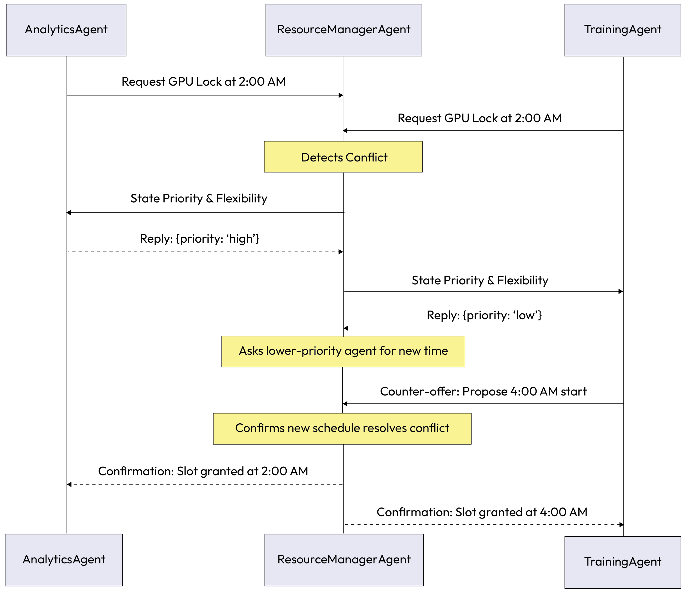

*Figure 5.11 – Agent Negotiation workflow*

In this scenario, the agents successfully negotiated a new schedule that respected task priorities, ensuring the
most critical job was completed on time without requiring human intervention.
Example implementation
The following sample implementation demonstrates the Agent Negotiation pattern in the context of resource
management. In this scenario, the ResourceManagerAgent serves as a mediator that identifies scheduling
conflicts between autonomous peers. Rather than imposing a fixed decision, the code illustrates the first phase
of a negotiation protocol, where the mediator assesses task priorities and initiates a dialogue by requesting a
counter-proposal from the lower-priority agent. This approach enables the system to find mutually acceptable
solutions that respect business constraints while maintaining the autonomy of individual agents.
classResourceManagerAgent:
## defhandle_requests(self, request1, request2):

if request1.time == request2.time: # Conflict detected
```python
# Determine which agent is lower priority
```

if request1.priority < request2.priority:
Chapter 5 162
lower_priority_agent = Agent1
higher_priority_agent = Agent2
else:
lower_priority_agent = Agent2
higher_priority_agent = Agent1
```python
# Ask the lower-priority agent to propose a new time
new_proposal = lower_priority_agent.propose_new_time()
# Check if the new proposal resolves the conflict
ifself.is_conflict_resolved(new_proposal, higher_priority_agent.request):
self.grant_slot(higher_priority_agent,
higher_priority_agent.request.time)
self.grant_slot(lower_priority_agent, new_proposal.time)
return"Agreement Reached"
else:
# Fallback or further negotiation rounds
return"Negotiation Failed"
```

defis_conflict_resolved(self, proposal, existing_request):
```python
# Logic to check if the proposed time slot is available
pass
```

defgrant_slot(self, agent, time):
```python
# Logic to update the schedule and inform the agent
pass
classTrainingAgent: # (Lower Priority)
defpropose_new_time(self):
# Agent logic to find the next best available slot
new_time = "4:00 AM"
print(f"I am lower priority. I can defer. I propose to start at {new_time}.")
return Proposal(time=new_time)
classProposal:
def__init__(self, time):
self.time = time
163 Multi-Agent Coordination Patterns
Consequences
Pros:
Flexibility: This pattern allows for flexible, dynamic agreements that can achieve better
outcomes for all parties compared to rigid, fixed policies
Optimality: It enables the discovery of "win-win" solutions that might not be obvious to a
central authority or pre-programmed rules
Cons:
Time andcomplexity: Negotiation can be time-consuming and computationally intensive, and
```

there is no guarantee that an agreement will be reached.
No guarantee: The process can fail to produce a solution, leading to a deadlock if no fallback
mechanism is in place.
Implementation guidance
Define clear termination conditions and fallback positions. What happens if no deal is reached? The agent
should have a plan B. Log the entire sequence of offers and counter-offers for auditability and to enable human
oversight.
While negotiation is an effective pattern for resolving a specific conflict between two or more agents, systems
often face the broader challenge of distributing a finite pool of assets among many competing agents.
This requires a more systematic approach to managing supply and demand. The Resource Allocation pattern
provides the framework for this system-wide challenge.
Resource Allocation
In any complex system, resources are finite. Whether it is computational power, network bandwidth, access to a
specific API, or physical assets such as robotic arms, there is often more demand than supply. When multiple
agents need the same limited resource simultaneously, the system requires a fair and efficient method to decide
who gets what.
The Resource Allocation pattern provides a structured approach to manage this distribution, moving beyond
simple "first-come, first-served" logic to a more intelligent and goal-oriented model.
Context
A multi-agent system has a finite pool of resources, such as network bandwidth, compute power, or API call
quotas, that must be distributed among multiple agents with competing needs.
◦
◦
◦
◦
Chapter 5 164
Problem
How can the system distribute limited resources among competing agents in a way that is efficient, fair, and
aligned with overall system goals? Without a clear allocation strategy, a multi-agent system can experience
contention, bottlenecks, and suboptimal performance. Forces in the problem space include the following:
Throughput versus fairness: The system aims to maximize overall productivity by prioritizing highvalue tasks, but it must also prevent starvation where lower-priority agents never receive the resources
they need to function.
Centralized control versus overhead: A central allocator provides a global view of priorities and
ensures consistency, but it can become a performance bottleneck or a single point of failure as the
number of agents and requests grows.
Predictability versus adaptability: Fixed allocation rules are simple and predictable, but they often fail
to account for dynamic shifts in task importance or sudden environmental changes that require
immediate resource reallocation.
Solution
The Resource Allocation pattern implements a mechanism to manage the distribution of resources. Key
## approaches include the following:

Centralized allocator: A dedicated agent, such as a manager, that makes allocation decisions based on
a global view of system priorities and resource availability.
Auction mechanisms: Agents "bid" for resources using an internal currency or priority score, with the
highest bidder winning the resource for a specified period. This approach is useful when the true value
of a task can be quantified by the agents themselves.
Fair division algorithms: In cases where fairness is paramount, algorithms can be used to lculate a
probably fair distribution of resources, such as dividing the resource in a way that no agent envies the
share of another.
Example: Autonomous robot allocation in a smart factory
A smart tory uses a limited fleet of autonomous mobile robots (AMRs) to transport materials. A central
AMR_DispatcherAgent allocates these robots based on task priority to maximize factory output.
The ProductionLine_A_Agent sends a high-priority request for an AMR to deliver a critical
component, warning that a line stoppage is imminent.
The WarehouseAgent sends a low-priority request for an AMR to perform routine inventory cycle
counting.
The ShippingAgent sends a medium-priority request for an AMR to move finished goods to the loading
dock for a shipment due in two hours.
The AMR_DispatcherAgent evaluates these competing requests. Based on its priority rules, it immediately
assigns the next available AMR to the ProductionLine_A_Agent to prevent the costly line stoppage. It then
allocates an AMR to the ShippingAgent to meet the shipment deadline. The WarehouseAgent's low-priority
1.
2.
3.
165 Multi-Agent Coordination Patterns
request is placed in a queue and will be fulfilled only when a robot becomes available, and no higher-priority
tasks are pending.
## This priority-based allocation workflow can be visualized as follows:

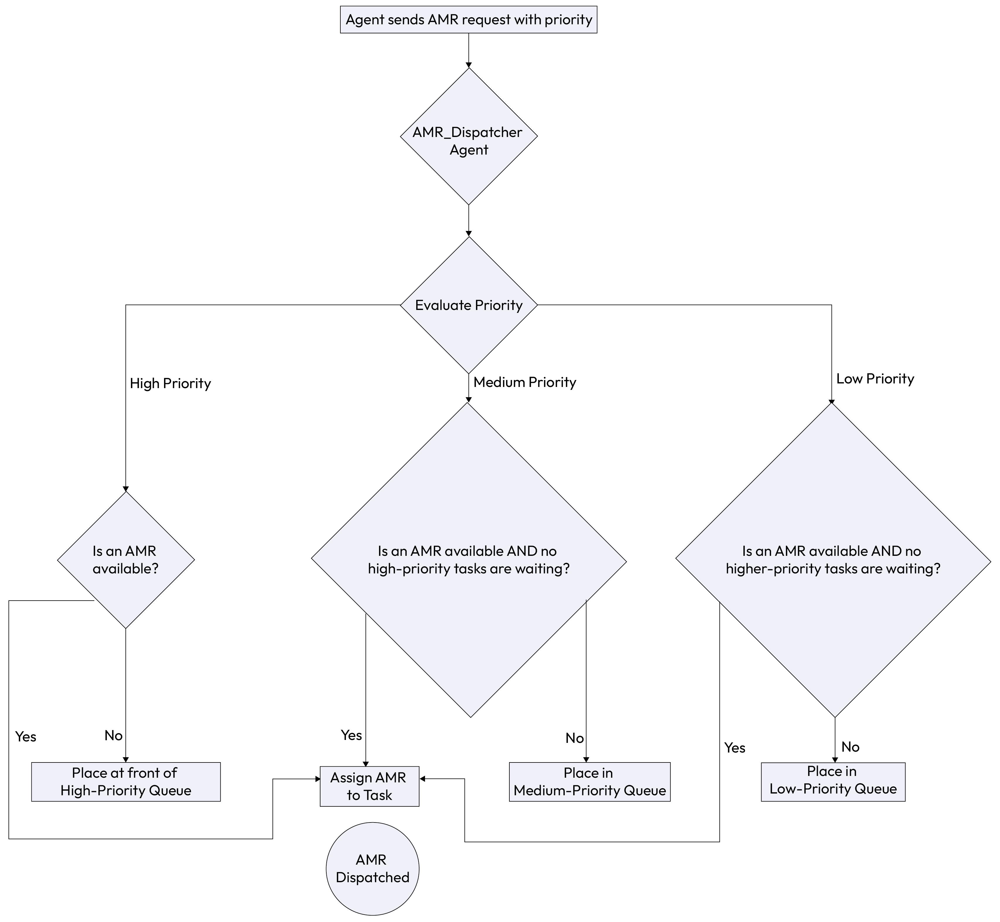

*Figure 5.12 – Resource Allocation*

Example implementation
The following implementation demonstrates the Resource Allocation pattern through an AMR dispatcher. In
this advanced coordination (Level 5) scenario, the system manages a finite fleet of physical robots by processing
incoming requests through a tiered priority queue.
The code illustrates how the AMR_DispatcherAgent acts as a centralized controller, evaluating the urgency of
tasks from different departments, such as critical components for production versus routine inventory counts,
and ensuring that the most impactful work is assigned to the next available robot. This approach effectively
Chapter 5 166
balances the competing needs of the factory loor while preventing resource contention and ensuring that
system-wide goals, like avoiding a line stoppage, are always prioritized.
classAMR_DispatcherAgent:
def__init__(self):
```python
# Queues for holding requests of different priorities
self.high_priority_queue = []
self.medium_priority_queue = []
self.low_priority_queue = []
self.available_amrs = [AMR1(), AMR2(), AMR3()]
defreceive_request(self, request):
```

if request.priority == "high":
self.high_priority_queue.append(request)
## elif request.priority == "medium":

self.medium_priority_queue.append(request)
else:
self.low_priority_queue.append(request)
self.dispatch()
defdispatch(self):
ifnotself.available_amrs:
return# No robots available right now
```python
# Process highest priority requests first
ifself.high_priority_queue:
task = self.high_priority_queue.pop(0)
robot = self.available_amrs.pop(0)
robot.assign_task(task)
elifself.medium_priority_queue:
task = self.medium_priority_queue.pop(0)
robot = self.available_amrs.pop(0)
robot.assign_task(task)
elifself.low_priority_queue:
task = self.low_priority_queue.pop(0)
robot = self.available_amrs.pop(0)
robot.assign_task(task)
classAMR1:
167 Multi-Agent Coordination Patterns
defassign_task(self, task):
print(f"AMR1 is assigned a {task.priority} priority task: {task.name}")
classAMR2:
defassign_task(self, task):
print(f"AMR2 is assigned a {task.priority} priority task: {task.name}")
classAMR3:
defassign_task(self, task):
print(f"AMR3 is assigned a {task.priority} priority task: {task.name}")
classRequest:
```

def__init__(self, name, priority):
self.name = name
self.priority = priority
```python
# Example Usage:
dispatcher = AMR_DispatcherAgent()
dispatcher.receive_request(Request("deliver critical component", "high"))
dispatcher.receive_request(Request("move finished goods", "medium"))
dispatcher.receive_request(Request("perform inventory count", "low"))
Consequences
Pros:
Optimization: Ensures scarce resources are directed toward the most critical tasks, maximizing
the overall utility of the system rather than just satisfying the fastest agent
Stability: Prevents resource contention, deadlocks, and race conditions that could lead to
system crashes or unpredictable behavior
Cons:
Overhead: The llocation process (whether a centralized calculation or a decentralized auction)
introduces latency before a task can actually execute
Risk of starvation: Poorly designed allocation rules can result in low-priority agents never
receiving the resources they need to function, requiring a safeguard
Implementation guidance
The logic for allocation must be transparent and explicit. Whether it's based on priority, bidding, or fairness,
this clarity is key for debugging and explainability. In auction-based systems, the rules should be designed to
```

encourage agents to bid their true value, a principle known as incentive compatibility.
◦
◦
◦
◦
Chapter 5 168
This prevents gents from misrepresenting their needs to gain an advantage. The allocation mechanism should
also be able to adapt to changing conditions and preempt lower-priority tasks if a more critical task arises.
By implementing a clear resource allocation strategy, a multi-agent system can move beyond simple, often
inefficient, contention. This ensures that critical system resources are used efficiently and are directed towards
the most important tasks, improving overall system performance and aligning actions with global priorities. It
provides a stable foundation for managing the operational costs and constraints of a complex agentic
ecosystem.
A robust resource allocation plan is essential for preventing one type of common conflict. However,
disagreements in a multi-agent system can arise from more than just resource scarcity. Agents can develop plans
or hold goals that are incompatible with one another, leading to potential deadlocks or unsafe conditions.
The next pattern, Conflict Resolution, provides the necessary mechanisms to detect and mediate these direct
clashes.
Conflict Resolution
As autonomous gents pursue their objectives, it is inevitable that their paths will sometimes cross in a way that
creates direct conflict. One agent's plan to move a robot arm into a specific position might clash with another's
plan to use the same space.
Two financial agents might generate opposing trade recommendations for the same stock. The Conflict
Resolution pattern is critical for system stability, providing a structured framework to identify these points of
contention and resolve them in a way that avoids system failure and aligns with the overarching goals of the
system.
Context
In a multi-agent system, two or more agents could have conflicting planned actions or goals. For example, two
logistics agents might try to route their trucks through the same narrow street at the same time.
Problem
How can the system resolve disagreements or conflicting plans between agents to avoid deadlocks, unsafe
conditions, or suboptimal outcomes? Allowing agents to proceed with conflicting actions could lead to system
failure, inefficient oscillations, or incoherent strategies. Forces in the problem space include the following:
Safety versus operational speed: Ensuring that no conflicting actions are taken prevents system
failures or physical damage, but the detection and resolution process adds latency that can slow down
high-frequency operations.
Centralized authority versus distributed agility: A supervisor can provide a decisive and consistent
resolution, but relying on a central point of control can create a bottleneck that limits the
responsiveness of the individual agents.
Logical consistency versus goal attainment: Resolving a conflict often requires at least one agent to
abandon or modify its current plan, which may lead to suboptimal results for specific tasks in exchange
for maintaining the integrity of the broader system.
169 Multi-Agent Coordination Patterns
Solution
The Conflict Resolution pattern provides a structured mechanism for detecting and resolving conflicts. Rather
than letting agents get stuck, this pattern introduces a process for mediation. The choice of approach depends
on the system's architecture, the nature of the conflict, and the need for either decisive, top-down control or
more dynamic, emergent agreement.
## Let's explore some common approaches:

Hierarchical resolution
A designated supervisor or orchestrator agent has the authority to overrule conflicting agents and impose
decision. This is the most direct approach, offering clear and predictable outcomes. It's particularly effective in
systems where a global perspective is necessary and where clear lines of authority are established, mirroring a
traditional management structure.
This is often the default choice in enterprise applications where compliance, safety, and auditable decisions are
paramount. The supervisor acts as a single point of truth, preventing the system from entering a state of
indecision or deadlock.
Policy-based resolution
The system has a set of predefined policies or rules that automatically govern how certain types of onflicts are
resolved. This is a highly reliable and auditable method. For instance, a policy might state that "safety-critical
agents always have priority over efficiency-optimizing agents" or "agents handling customer-facing tasks take
precedence over internal reporting agents."
The resolution is deterministic and consistent. This approach is powerful because it externalizes the decisionmaking logic, making it easier for humans to understand, modify, and audit the system's behavior without
needing to understand the internal state of each individual agent.
Negotiation
The conflicting agents can enter into a negotiation process (using the Negotiation pattern) to find a mutually
acceptable compromise. This bottom-up approach is suitable when there is room for a "win-win" or "less-lose"
outcome and when agents have the sophistication to make concessions and evaluate counter offers.
Instead of a top-down command, this method allows the agents directly involved in the conflict to find a
solution that best aligns with their individual goals, within the constraints of the system. It fosters adaptability
and can lead to more nuanced and creative solutions than a rigid, predefined policy.
Game-theoretic resolution
For highly omplex scenarios, the conflict can be modeled as a formal game. Each agent's potential actions are
assigned payoffs or osts, and the system can identify a stable outcome, such as a Nash equilibrium, where no
agent can benefit by unilaterally changing its strategy.
This approach is computationally intensive but can be used to design systems that are probably stable and align
the self-interest of individual agents with global objectives. By formalizing the conflict, this method allows for a
deeper level of analysis and can be used to engineer systems where desirable cooperative behavior emerges
naturally from the agents' rational pursuit of their own goals.
Chapter 5 170
Example: Resolving an enterprise workflow conflict
## In a loan processing system, two agents have conflicting goals:

A ThroughputAgent is optimized to process as many loan applications as possible per hour to meet a
business KPI for speed
A FairnessAgent is tasked with performing a computationally intensive analysis on application batches
to check for demographic bias, which can slow down the process
A conflict arises when the ThroughputAgent attempts to push a batch of applications directly to the final
approval stage to maintain its speed, while the FairnessAgent flags the same batch for a detailed review that
will take 20 minutes.
Conflict detection: The ThroughputAgent's plan to "advance batch to approval" and the
FairnessAgent's plan to "hold batch for fairness review" are logged as mutually exclusive actions in a
central SupervisorAgent.
Policy-based resolution: The SupervisorAgent consults its internal policy framework. It finds a nonnegotiable policy: All loan batches must receive a FAIRNESS_PASSED status before proceeding
to the approval stage. Compliance and ethical guidelines override speed-related KPIs.
Resolution: The SupervisorAgent invalidates the ThroughputAgent's plan. It sends a directive to the
ThroughputAgent to Halt and await fairness check completion. It then confirms to the
FairnessAgent that it has priority to proceed with its analysis.
Continuation: Once the FairnessAgent completes its check and updates the batch status to
FAIRNESS_PASSED, the SupervisorAgent then allows the ThroughputAgent to resume its task.
1.
2.
3.
4.
171 Multi-Agent Coordination Patterns
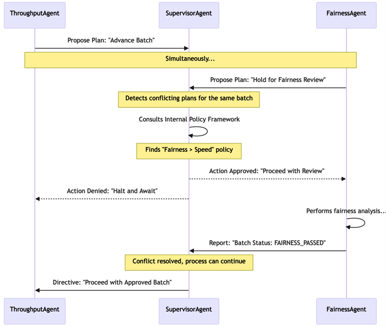

*Figure 5.13 – Conflict Resolution workflow*

Example implementation
The following implementation demonstrates the Conflict Resolution pattern within an enterprise loan
processing system. In this example, the SupervisorAgent acts as a mediator between two agents with opposing
objectives: one focused on maximizing throughput and another focused on ensuring demographic fairness.
The code illustrates a policy-based resolution approach where the supervisor evaluates the proposed plans
against a non-negotiable compliance framework. By invalidating the high-speed plan in favor of the fairness
review, the system ensures that ethical guidelines are upheld without the agents needing to understand the
broader corporate policy themselves. This centralized mediation prevents the system from entering a state of
logical inconsistency or proceeding with an unvetted decision.
classSupervisorAgent:
def__init__(self):
```python
# Policies define the rules of engagement
self.POLICY_FRAMEWORK = {
"FAIRNESS_CHECK_REQUIRED": True
}
```

defhandle_proposed_plans(self, plan1, plan2):
Chapter 5 172
ifself.is_conflicting(plan1, plan2):
print("Conflict Detected!")
```python
# Apply Policy-Based Resolution
ifself.POLICY_FRAMEWORK["FAIRNESS_CHECK_REQUIRED"]:
```

if plan1.action == "HOLD_FOR_FAIRNESS_REVIEW":
```python
# FairnessAgent's plan has priority
self.approve_plan(plan1)
self.deny_plan(plan2, reason="Fairness check must complete first.")
else:
# ThroughputAgent's plan must wait
self.approve_plan(plan2)
self.deny_plan(plan1, reason="Fairness check must complete first.")
else:
# Other resolution logic
pass
```

defis_conflicting(self, plan1, plan2):
```python
# A simple example of a conflicting condition
return plan1.target == plan2.target and plan1.action!= plan2.action
defapprove_plan(self, plan):
print(f"Approving plan: {plan.name}")
```

defdeny_plan(self, plan, reason):
print(f"Denying plan: {plan.name}. Reason: {reason}")
classPlan:
## def__init__(self, name, target, action):

self.name = name
self.target = target
self.action = action
```python
# Example Usage:
supervisor = SupervisorAgent()
plan1 = Plan("Fairness Check", "Loan Batch 123", "HOLD_FOR_FAIRNESS_REVIEW")
plan2 = Plan("Advance to Approval", "Loan Batch 123", "ADVANCE_TO_APPROVAL")
supervisor.handle_proposed_plans(plan1, plan2)
173 Multi-Agent Coordination Patterns
Consequences
Pros:
Coherence: Ensures that the system does not end up in a contradictory or deadlock state,
maintaining the integrity of the overall operation
Safety: Prevents dangerous situations where agents might inadvertently interfere with each
other (e.g., physical robot collisions or logical data corruption)
Cons:
Latency: Conflict detection and resolution introduce a computational overhead that can slow
down the system's response time
Complexity: Designing robust policies or negotiation protocols for every possible conflict
scenario significantly increases the engineering effort
Implementation guidance
The success of any conflict resolution strategy hinges on a few core principles that ensure a system's stability
and trustworthiness. These principles aren't just technical details; they are foundational to designing a resilient
multi-agent system.
Conflict detection: the first step
```

Before a onflict can be resolved, it must first be detected. This is a critical and often underappreciated part of
the process. It's like having an early warning system. The most straightforward approach is to have a centralized
supervisor agent that monitors all agent actions and plans.
For example, if two agents register a plan to use the same finite resource, the supervisor can immediately lag
the conflict. Other methods include using resource locking mechanisms, where an agent "locks" a resource it
intends to use, or requiring agents to register their intended actions in a shared space before execution.
Explainable resolutions: the audit trail
When a conflict is resolved, it's not enough for the system to simply proceed. The reasoning behind the ision
must be logged. An audit trail is essential for debugging, compliance, and building trust in the system. The log
should clearly state why a particular resolution was chosen.
For example: "Agent B's plan was approved over Agent A's because policy [number] states that safety-critical
tasks have priority over all others." This transparency allows a human operator to understand the system's
behavior and verify that it's operating as intended.
Defined escalation paths: human-in-the-loop
In an ideal world, all conflicts would be resolved automatically. In reality, there will always be critical,
unforeseen scenarios where the system's automated mechanisms fail or cannot reach a conclusion. For these
situations, there must be a clear and reliable escalation path.
The ultimate fallback in enterprise systems is almost always a human-in-the-loop, a human operator who can
review the context of the conflict and provide a final judgment. The system should be designed to hand off all
necessary information to the human for a quick, informed decision.
◦
◦
◦
◦
Chapter 5 174
Simulate to understand: testing for resilience
Before deploying a multi-agent system, especially one using complex negotiation or game-theoretic models, it is
crucial to simulate agent interactions under a wide variety of conditions.
This practice helps to stress-test the conflict resolution strategies and identify potential deadlocks or
undesirable emergent behaviors. By simulating conflicts and their resolutions in a safe environment, developers
can fine-tune the system's policies and protocols, ensuring it will maintain coherence and stability when faced
with real-world challenges.
The foundation for coherence and stability
Clear protocols are needed for resolving conflicts in a multi-agent system so the overall system can maintain its
coherence and stability even when its constituent agents have divergent goals, opinions, or draw opposite
conclusions.
This prevents costly deadlocks and ensures that the system can continue to operate effectively, making decisions
that align with global priorities rather than getting stuck in internal disputes. It is a fundamental pattern for
building resilient systems that can gracefully handle the natural friction that arises in any complex,
decentralized environment.
It is crucial to resolve logical conflicts and manage resources to ensure agents can work together on abstract
tasks. However, coordination challenges are not always about goals or data; sometimes they are about the
physical (or logical) arrangement of the agents themselves. In domains such as robotics or complex simulations,
the ability of a group of agents to act as a cohesive unit with a specific structure, such as a swarm, is important
to the success of the project.
This is where the Formation Control pattern becomes essential.
Formation Control
The Formation Control pattern is a design principle for collective movement and spatial organization in a group
of agents. Unlike patterns that manage abstract tasks or resources, this pattern is specifically for scenarios
where a group of agents must maintain a defined physical or logical structure relative to one another while
moving through an environment.
It enables a "swarm" or "squad" of agents to act as a single, coordinated entity, fluidly reacting to changes
without a centralized controller.
Context
The system involves a group of agents that need to maintain a specific physical or logical structure relative to
each other while moving or acting in an environment. This is common in robotics, complex simulations, and
scenarios where a unified, collective action is required.
175 Multi-Agent Coordination Patterns
Problem
How can a group of agents dynamically maintain a collective formation without a rigid, centralized controller
dictating the exact position of each agent? Relying on a single leader creates a single point of failure and
struggles to adapt to obstacles or environmental changes. This can lead to collisions, a broken formation, or
## inefficient navigation. Forces in the problem space include the following:

Global coherence versus local sensing: The swarm needs to maintain a specific global shape, but
individual agents often only have access to information about their immediate neighbors, which makes
maintaining a perfect formation over a large group difficult.
Structural rigidity versus obstacle avoidance: The group must remain in a predefined formation to
fulfill its objective, but individual agents must also be free to deviate from that structure to navigate
around environmental hazards or avoid collisions.
Communication latency versus synchronization speed: Precise formation control requires rapid
updates between agents to maintain alignment, but high-frequency communication can saturate a
network or increase the power consumption of battery-operated agents, such as drones or mobile
robots.
Solution
The Formation Control pattern enables a group of agents to self-organize by decentralizing the control logic.
The core idea is that each agent makes decisions based on the positions and states of its immediate neighbors,
rather than following commands from a central leader. Each agent is programmed with a simple set of control
laws that dictate its desired distance and bearing from its designated neighbors. This approach allows the
formation to adapt fluidly to obstacles and environmental changes, as each agent's localized reaction cascades
through the formation, causing a collective, emergent response.
Example: Agricultural drone swarm
Imagine a leet of agricultural drones tasked with spraying a large field in a precise grid formation to ensure even
coverage.
Formation rule: Each drone is programmed with a simple rule: Maintain a position 10 meters to
the right of your left neighbor and directly aligned with your forward neighbor.
Coordinated movement: As the lead drone moves forward, each drone in the swarm follows,
constantly adjusting its own speed and position based on its neighbors' locations to maintain the grid.
Dynamic adaptation: Drone_C, in the middle of the formation, detects a tree directly in its path. It
autonomously executes an avoidance maneuver, slowing down and flying around the obstacle.
Self-organization: The drones immediately neighboring Drone_C sense its change in position.Drone_B
(to its left) and Drone_D (to its right) reduce their speed to avoid a collision. The drone behind Drone_C
also slows down to maintain spacing.
Re-formation: Once Drone_C has cleared the obstacle, it accelerates back to its designated position. Its
neighbors sense this correction and adjust their own speeds to seamlessly re-establish the perfect
formation, all without any central command.
The core logic loop for any single agent within this formation can be visualized in the following diagram:
1.
2.
3.
4.
5.
Chapter 5 176
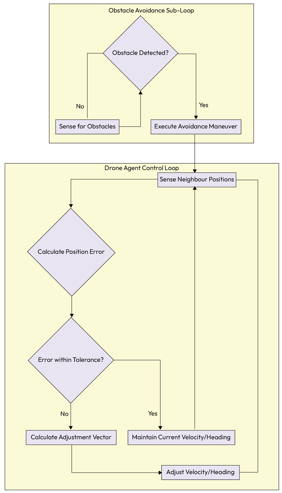

*Figure 5.14 – A single agent's control loop for Formation Control*

177 Multi-Agent Coordination Patterns
Example implementation
The following implementation demonstrates the Formation Control pattern through a simplified rone swarm
simulation. In this example, each DroneAgent operates using a decentralized control loop, where its movement
is determined by a fixed offset from a designated neighbor.
The code illustrates how a collective structure emerges from local rules rather than a central command. Each
agent continuously senses its neighbor's position, calculates its own desired coordinates based on a predefined
offset, and applies velocity adjustments to correct any errors. This localized approach allows the entire
formation to remain fluid and resilient, as the swarm can adapt to individual deviations or environmental shifts
without the need for a global path planner.
classDroneAgent:
DESIGNATED_OFFSET = Vector(10, 0) # e.g., 10 meters to the right
defcontrol_loop(self):
whileTrue:
```python
# 1. Sense neighbor's position
neighbor_position = self.get_neighbor_position()
my_position = self.get_my_position()
# 2. Calculate the desired position based on the neighbor
desired_position = neighbor_position + self.DESIGNATED_OFFSET
# 3. Calculate the error between current and desired position
position_error = desired_position - my_position
# 4. Check if adjustment is needed
```

if NORM(position_error) > TOLERANCE:
```python
# 5. Calculate an adjustment vector to correct the error
adjustment_vector = self.calculate_adjustment(position_error)
self.adjust_velocity(adjustment_vector)
else:
self.maintain_velocity()
# An obstacle avoidance sub-loop would also be running
...
Chapter 5 178
Consequences
Pros:
Scalability: The formation can grow to include hundreds or thousands of agents without
increasing the computational load on any single controller, as decisions are local
Resilience: The system is robust to the failure of individual agents; if one drops out, the
neighbors naturally close the gap
Cons:
Local optima: Agents acting on local information may get stuck in complex obstacles (such as a
cul-de-sac) that a global planner would easily avoid
Stability risks: Poorly tuned control laws can lead to oscillation, where agents continuously
over-correct their positions, causing the formation to jitter
Implementation guidance
To successfully implement the Formation Control pattern, several technical considerations must be addressed,
starting with the requirement for neighbor discovery. Agents need a reliable mechanism to identify and track
the state of their relevant peers, which can be achieved through direct, low-latency communication, such as a
```

local mesh network, or by observing a shared state representation. The core of the pattern lies in the control
laws, the specific rules that govern how an agent adjusts its position relative to others. These laws must be
carefully designed using principles from control theory to ensure the formation remains stable and does not
oscillate or break apart under stress. Finally, the use of simulations is essential for testing and refining these
control laws prior to deployment in a physical environment, providing a safe and cost-effective way to iterate on
the collective behavior.
With the Formation Control pattern, we conclude our exploration of the fundamental patterns of multi-agent
coordination. We have journeyed from high-level task delegation and planning to the intricate dynamics of
negotiation, resource management, and now, spatial organization.
Now, let's step back and summarize the key lessons from this chapter.
## Summary

This chapter explored the essential patterns that enable multiple autonomous agents to work together as a
cohesive and intelligent system. We established that moving from a single agent to a multi-agent system
introduces a new layer of complexity that requires structured solutions for collaboration, competition, and
communication. These patterns provide the architectural blueprints for building robust, scalable, and coherent
multi-agent systems. We not only detailed these individual patterns but also contextualized them within the
GenAI Maturity Model, showing how their application evolves as systems advance from foundational to
autonomous.
We began by establishing the high-level Task Delegation Frameworks (Supervisor versus Swarm) and
explored specific Agent Composition Topologies, such as the Blackboard for shared knowledge evolution,
Contract-Net for market-based task allocation, and Supervision Trees for fault tolerance. From there, we delved
◦
◦
◦
◦
179 Multi-Agent Coordination Patterns
into the specific mechanisms of collaboration, including Multi-Agent Planning for task decomposition,
Knowledge Sharing to create collective intelligence, and Tool Routingfor managing capabilities.
The discussion then shifted to managing the natural friction that arises in any distributed system. We explored
a suite of patterns designed to handle disagreement and competition gracefully, including Consensus,
Negotiation, Resource Allocation, and Conflict Resolution. Finally, we examined the Formation Control pattern
for systems requiring spatial coordination.
## The key takeaways are as follows:

Coordination is architected, not assumed: Effective multi-agent systems are built on a foundation of
explicit coordination patterns that define how they delegate tasks, plan, and interact.
Frameworks and topologies dictate control flow: The choice of architecture-whether a centralized
Supervisor, a decentralized Swarm, or a specialized topology such as a Blackboard-shapes the
system's balance between predictability and adaptability.
Collaboration requires shared context: Agents need both a shared plan (Multi-Agent Planning) and
a shared pool of knowledge (Knowledge Sharing) to work together effectively and improve as a
collective over time.
Protocols for disagreement are essential: To prevent chaos and deadlock, systems need structured
patterns for managing competition, including Consensus for agreeing on facts, Negotiation for
resolving goal conflicts, and Conflict Resolution for handling direct clashes.
Coordination extends to execution and environment: Effective coordination goes beyond abstract
planning to include concrete actions, such as managing which agent uses which tool (Tool Routing)
and how they are physically or logically arranged (Formation Control).
An evolutionary approach to coordination: The choice and complexity of coordination patterns
directly map to a system's maturity. Foundational multi-agent systems (Level 4) rely on centralized,
predictable patterns like the Supervisor, while advanced and self-correcting systems (Levels 5-6)
require dynamic and decentralized patterns such as Negotiation, Consensus, and meta-agents to
manage emergent behavior.
By thoughtfully applying these coordination patterns, developers can build sophisticated multi-agent systems
that are far more capable than the sum of their individual parts, enabling them to tackle complex, real-world
challenges in a robust, scalable, and intelligent manner.
Having explored the essential patterns for coordinating the actions of multiple agents, we have a solid
foundation for building systems that can collectively tackle complex problems. We now know how to make
them plan, share knowledge, and resolve conflicts.
However, creating a system that is merely effective is not enough for production-grade, enterprise
environments. We must also ensure that these autonomous systems are transparent, auditable, and operate
within strict ethical and regulatory boundaries.
In the next chapter, we will shift our focus from coordination to accountability, exploring the critical patterns
that make agentic systems trustworthy.
Chapter 5 180
then follow the steps on the page.
Note: Keep your invoice handy. Purchases made directly from Packt don't require one
181 Multi-Agent Coordination Patterns