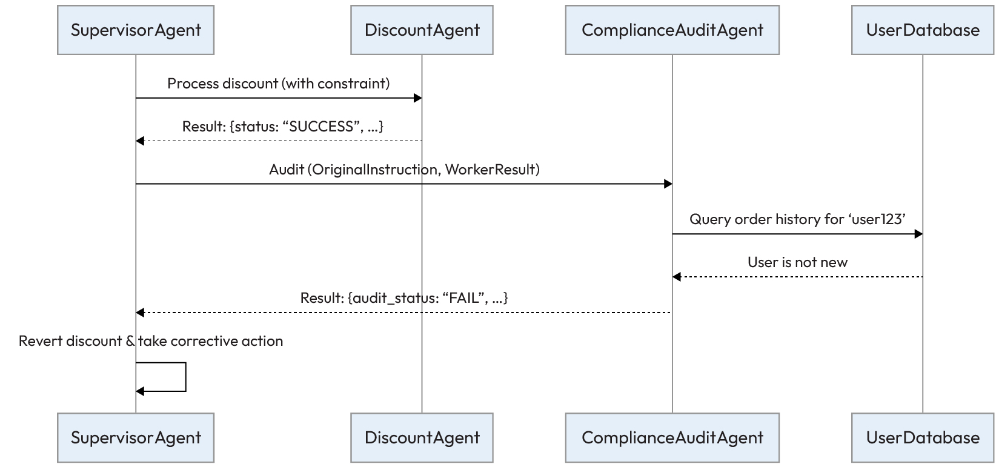
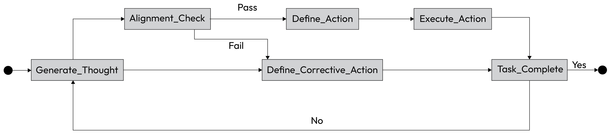
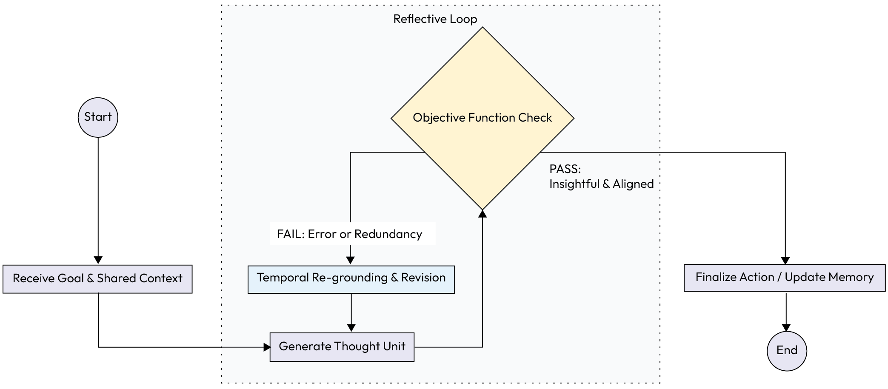
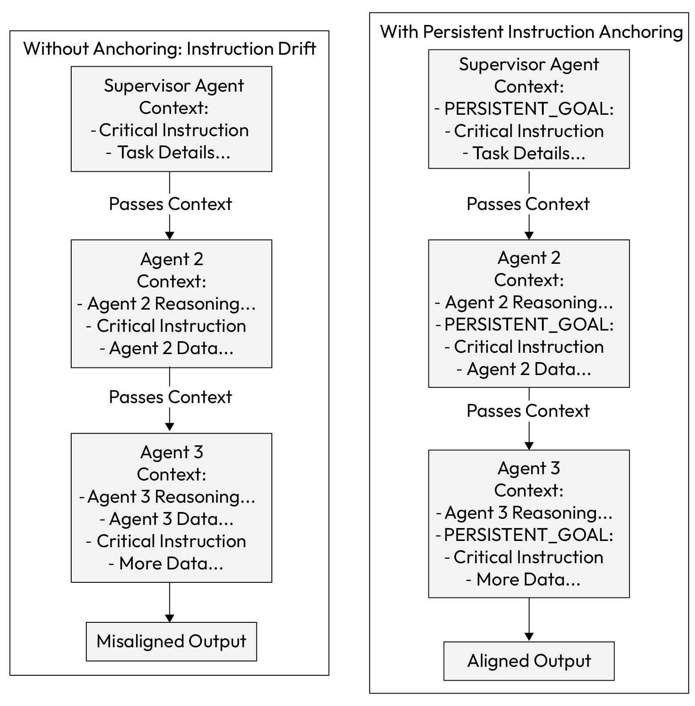

# Chapter 6: Explainability and Compliance Agentic Patterns

Explainability and Compliance
Agentic Patterns
In the previous chapter, we detailed the coordination patterns that enable multiple agents to work in concert,
tackling complex problems through structured collaboration. We have the blueprints for making agents plan,
share knowledge, and resolve conflicts. However, for an agentic system to move beyond a prototype and into a
production enterprise environment, its effectiveness must be matched by its trustworthiness. Autonomy
without accountability is a liability.
## This brings us to the critical domains of explainability and compliance:

Explainability focuses on making an agent's decision-making process transparent and understandable,
answering the crucial question: Why did the agent do that?
Compliance ensures that n agent's actions adhere to a complex web of external regulations and
internal policies, answering the equally important question: Can I verify whether the agent followed the
rules?
To incorporate these aspects within an agentic system, this chapter introduces four specific architectural
patterns: Instruction Fidelity Auditing, Fractal Chain-of-Thought (FCoT) Embedding, Persistent Instruction
Anchoring, and Shared Epistemic Memory.
To make these patterns as practical as possible, we will take a "map before the journey" approach. Before diving
into the technical details of each pattern, we will first present a strategic guide to implementation.
This guide, aligned with our GenAI Maturity Model, provides a roadmap for how the need for these
accountability patterns deepens as a system evolves from a single agent to a multi-agent collective. By
understanding the bigger picture first, you will have the context to appreciate where each specific pattern fits
and why it is essential for building accountable, production-grade agentic systems.
A strategic guide to implementing explainability and
compliance patterns
The patterns in this chapter are not just a toolkit; their pplication deepens as an organization's agentic systems
mature. While useful for a single, complex agent, they become absolutely essential for governing the intricate
interactions within a multi-agent collective. The following table illustrates how the application of these
## patterns evolves as a system matures from a single-agent to a multi-agent architecture:

Architectural aspect Application at Level 5 (singleagent system)
Application at Level 6 (multiagent system)
Primary goal Ensure a single, autonomous
agent is accountable and its
complex reasoning is auditable.
Ensure an entire system of
collaborating agents remains
aligned with the top-level goal
and is collectively reliable.
Instruction Fidelity Auditing Used to audit the final output of a
single agent before it takes a
critical action.
Used to audit the handoffs
between agents, ensuring
instruction fidelity is maintained
at each step in the hierarchy.
Fractal CoT Embedding Enables internal self-correction for
a single agent, allowing it to refine
its own multi-step reasoning
process.
Enables both internal selfcorrection and inter-agent
reflectivity, where agents can
revise their plans based on the
reasoning of their peers.
Persistent Instruction AnchoringKeeps a single agent focused on its
primary goal and constraints
throughout a long, multi-step
task.
Crucial for ensuring the original
instruction and constraints
survive the journey down a deep
hierarchy of multiple agents.
Shared Epistemic Memory Less critical for a single agent, but
can be used for logging its state or
sharing context with a human
supervisor.
Essential for inter-agent
collaboration. It becomes the
central nervous system, providing
the "ground truth" that the entire
system relies on.
Table 6.1 - Mapping explainability and compliance patterns to the GenAI Maturity Model
With this strategic context in mind, we can now explore the individual patterns that provide these guarantees.
We will begin with a pattern that acts as an essential external verification layer, a critical checkpoint to ensure
an agent's actions are fully aligned with its given instructions.
Chapter 6 184
## Instruction Fidelity Auditing

In hierarchical multi-agent systems, a high-level agent often delegates sub-tasks to specialized subordinates.
While these agents are designed to optimize their local tasks, they can unintentionally misinterpret or ignore
higher-level constraints. This leads to "silent failures," where sub-tasks appear to complete successfully, but the
overall outcome is misaligned with the original business intent.
To prevent this, the Instruction Fidelity Auditing pattern introduces a verification layer to ensure that an
agent's actions strictly adhere to the original instructions it was given.
Context
A multi-agent system where a supervising agent delegates tasks to one or more worker agents. The overall
success of the operation pends on the worker agents' strict compliance with all constraints specified in the
original instruction.
Problem
How can a system ensure that n autonomous agent, while optimizing for its local sub-task, remains strictly
aligned with the original high-level instructions and global constraints, preventing silent failures where the
overall goal is missed?
Solution
The Instruction Fidelity Auditing pattern introduces a specialized auditor agent that acts as an automated
checkpoint. The auditor's role is not to perform the task but to compare the output of a worker agent against the
original instruction it received.
It verifies that all constraints and goals from the initial instruction have been met before the action is finalized.
This creates an explicit verification layer that enforces accountability and prevents instruction drift.
Example: Auditing an e-commerce discount application
An e-commerce platform uses a SupervisorAgent to handle a customer's request for a discount. The supervisor
## must ensure that the DiscountAgent correctly applies the company's discount policies:

SupervisorAgent goal: Ensure customer requests are handled correctly and according to business rules
DiscountAgent goal: Apply specified discounts to customer orders efficiently
ComplianceAuditAgent goal: Verify that actions taken by other agents comply with all constraints in the
original instructions
## The auditing workflow unfolds as follows:

Instruction: The SupervisorAgent generates a precise instruction: Apply a 15% 'WELCOME' discount
for user 'user123' on order #5678, but **only if** this is their first order.
Delegation andexecution: The instruction is sent to the DiscountAgent. It focuses on the primary
## action and applies the 15% discount, returning a success message: {"status": "SUCCESS", "action":

"15% discount applied to order #5678"}. The agent neglects to check the "first order" constraint.
1.
2.
185 Explainability and Compliance Agentic Patterns
Audit: Before finalizing the transaction, the SupervisorAgent sends the original instruction and the
DiscountAgent's output to the ComplianceAuditAgent for verification.
Verification: The ComplianceAuditAgent uses its tools to query the customer database. It finds that
'user123' has several past orders.
Verdict: The auditor returns a failure verdict with a clear reason: {"audit_status": "FAIL",
"reason": "Worker agent failed to check the 'first order' constraint. User 'user123' is
not a new customer."}.
Resolution: The SupervisorAgent receives the failure, reverts the discount applied by the
DiscountAgent, and sends an appropriate message to the user, preventing a policy violation.


*Figure 6.1 – Instruction Fidelity Auditing workflow*

This process ensures that even if a specialized agent takes a shortcut, the system's integrity is maintained by the
independent audit layer.
Example implementation
The following sample code demonstrates a conceptual implementation of the Instruction Fidelity Auditing
pattern. In this scenario, we see how the SupervisorAgent orchestrates the workflow, ensuring that the output
from the DiscountAgent is passed to the ComplianceAuditAgent for a mandatory verification check before the
transaction is finalized.
classSupervisorAgent:
defhandle_request(self, user_request):
original_instruction = (
"Apply a 15% 'WELCOME' discount for user 'user123', "
"but only if this is their first order."
)
3.
4.
5.
6.
Chapter 6 186
```python
# Delegate to worker agent
worker_result = DiscountAgent().run(instruction=original_instruction)
# Delegate to auditor agent for verification
audit_verdict = ComplianceAuditAgent().run(
original_instruction=original_instruction,
worker_output=worker_result
)
```

if audit_verdict.get("audit_status") == "PASS":
print("Action is compliant. Finalizing order.")
#... logic to finalize the order...
return"Order Finalized"
else:
print(
f"Action failed audit. Reverting. Reason: "
f"{audit_verdict.get('reason')}"
)
#... logic to revert the action and handle the error...
return"Action Reverted"
classDiscountAgent:
defrun(self, instruction):
```python
# This agent incorrectly focuses only on applying the discount
print("DiscountAgent: Applying 15% discount as instructed.")
return {
"status": "SUCCESS",
"action": "15% discount applied to order #5678"
}
classComplianceAuditAgent:
```

defrun(self, original_instruction, worker_output):
```python
# In a real system, this would use an LLM or other tools
# For this example, we simulate the logic
is_first_order = self.check_customer_history("user123")
```

if"first order"in original_instruction andnot is_first_order:
return {
"audit_status": "FAIL",
"reason": (
"Worker agent failed to check the 'first order' constraint. "
"User 'user123' is not a new customer."
187 Explainability and Compliance Agentic Patterns
)
}
else:
return {
"audit_status": "PASS",
"reason": "Action is compliant with all instructions."
}
defcheck_customer_history(self, user_id):
```python
# Simulate a database lookup
print(f"ComplianceAuditAgent: Checking order history for {user_id}.")
returnFalse# Simulate that the user has previous orders
Consequences
Pros:
```

Accountability andexplainability: This pattern creates an explicit checkpoint for ompliance.
The justifications from the auditor generate a clear, auditable trail of how and why decisions
were validated, improving system transparency.
Reliability: It actively reduces silent failures where sub-tasks succeed locally but the overall
goal is missed, thus making the entire system more robust and predictable.
Con:
Performance overhead: Adding an auditing layer introduces latency and computational cost,
as each check may require additional tool use or LLM calls. This creates a direct trade-off
between speed and reliability.
Implementation guidance
When implementing this pattern, carefully select the critical junctures where auditing is most necessary.
Applying audits at every step can severely impact performance. Focus on handoffs where the risk of
misinterpretation or policy violation is highest. The goal is to strike a balance between the need for strict
compliance and acceptable system latency.
While the Instruction Fidelity Auditing pattern provides an essential external check on an agent's output, it is a
reactive measure. To build a truly robust system, we also need agents to be proactive about maintaining
alignment. The FCoT Embedding pattern addresses this by embedding a self-correcting capability directly into
an agent's own reasoning process.
## Fractal Chain-of-Thought Embedding

While standard chain-of-thought (CoT) enables an gent to perform sequential reasoning, it is often too rigid
for dynamic, multi-agent environments. In these systems, agents must coordinate plans, adapt to new
information, and correct their reasoning based on feedback from others. Traditional CoT and its variants lack
the mechanisms for this kind of recursive revision and reflective coordination.
◦
◦
◦
Chapter 6 188
The FCoT pattern addresses this by structuring an agent's reasoning as a recursive, multi-level framework,
enabling dynamic self-correction and better alignment in collaborative tasks.
Context
A multi-agent system is assigned complex problem that requires collaborative reasoning and adaptation. An
agent's initial conclusions may become invalid as other agents in the system provide new or conflicting data,
requiring a dynamic way to revise previous reasoning steps.
Problem
How can an agent's reasoning process be structured to allow for dynamic self-correction, synchronization with
the reasoning of other agents, and analysis at multiple levels of detail, overcoming the static and isolated nature
of traditional CoT methods?
Solution
The FCoT pattern structures an agent's reasoning process as a recursive and multi-scale framework. Instead of a
static, linear chain, FCoT organizes reasoning into self-contained units that can be recursively refined. This
allows an agent to correct its past conclusions based on new evidence and adapt its analysis to ifferent levels of
detail.
## This pattern operates on several core principles:

Recursive self-correction: Reasoning is guided by an objective function that simultaneously
maximizes insight while minimizing error, creating a continuous self-correction loop
Dynamic context aperture: The agent can widen or narrow its focus, zooming in for detailed analysis
or zooming out to incorporate broader context from other agents
Inter-agent reflectivity: Agents are designed to evaluate and reflect upon the reasoning of other
agents, enabling better alignment and more intelligent delegation
Temporal re-grounding: Earlier reasoning steps can be formally revised in light of newer evidence,
creating a dynamic and auditable thought process rather than a static, append-only log
## To illustrate this concept, please review the following diagram:



*Figure 6.2 – FCoT internal reasoning loop*

189 Explainability and Compliance Agentic Patterns
Example: Collaborative research synthesis
An AI system is tasked with producing literature review on "climate-resilient urban design" using a team of
specialized agents:
SynthesizerAgent goal: To lead the project and synthesize the findings from specialist agents into a
coherent final report
ClimateScienceAgent andMaterialSustainabilityAgent goals: To research their specific domain and
provide an expert summary
## The collaborative reasoning process unfolds using FCoT:

Initial research: Each specialist agent generates an independent summary. The
MaterialSustainabilityAgent produces a report highlighting the benefits of hempcrete based on its
initial data.
Inter-agent reflection: The SynthesizerAgent shares these summaries. The ClimateScienceAgent
analyzes the hempcrete recommendation and reports that high humidity in coastal cities could
compromise the material's structural integrity.
Temporal re-grounding: The FCoT framework prompts the MaterialSustainabilityAgent to revise
its original assessment based on this new constraint. Its initial reasoning is formally corrected to
"Hempcrete is a viable sustainable material, but may degrade under high humidity without
specialized treatment.". This is a direct revision of a past conclusion, not just an addition.
Granularity control: The SynthesizerAgent initially works at a paragraph level to combine insights. It
then adjusts its focus to a document-level perspective, ensuring the final report has a coherent narrative
structure rather than being a collection of separate facts.
The following flowchart illustrates the FCoT process, where an agent's thought is generated, checked against
objectives and external feedback, and then either finalized or recursively refined.


*Figure 6.3 – FCoT use case example*

1.
2.
3.
4.
Chapter 6 190
Example implementation
FCoT is often implemented via a sophisticated prompt template that guides an LLM through the recursive and
reflective steps. It orces the model to externalize its thought, check it against constraints, and explicitly decide
## to either proceed or revise:

```python
# Conceptual prompt template for an agent using FCoT
```

FRACTAL_COT_PROMPT_TEMPLATE = """
**Overall Goal:**
{original_instruction}
**Shared Context & Peer Agent Summaries:**
{context_from_shared_memory}
**My Previous Reasoning Steps (Thought Units):**
{summary_of_my_previous_reasoning}
**My Next Step:**
1. **Thought:** Based on the goal and all context, what is my next thought or
hypothesis?
[LLM generates its next thought here...]
2. **Self-Correction Check (Objective Function):**
- **Objective:** Does my thought maximize new insight and align with the Overall Goal?
- **Constraint:** Does it conflict with any facts in the Shared Context or my previous
reasoning? Does it introduce redundancy?
- **Verdict & Justification:** [LLM must analyze and justify its thought here...]
3. **Action / Revision:**
- **If Verdict is PASS:** State the action to take (e.g., call a tool, write to memory).
- **If Verdict is FAIL:** State the corrective action. This may involve revising a
*previous* thought unit (Temporal Re-grounding).
191 Explainability and Compliance Agentic Patterns
[LLM generates its action or revision plan here...]
"""
Consequences
Pros:
Reliability andself-correction: The framework's greatest strength is its ability to enable realtime, self-corrective reasoning. Agents can catch and fix their own misalignments, leading to far
more robust and reliable outcomes.
Explainability: The explicit self-correction checks and temporal re-grounding create a
transparent and auditable trace. It is possible to see not only what an agent decided but how and
why it changed its mind.
Con:
Complexity andoverhead: FCoT is more complex to implement than standard CoT. It requires
a sophisticated orchestration layer to manage shared context and trigger reflective loops, which
can increase latency and token costs.
Implementation guidance
Implementing FCoT requires a robust orchestration layer capable of managing shared memory, triggering
reflective loops, and handling recursive updates.
Start by defining a clear objective function for self-correction. Be mindful of the increased latency and token
costs associated with recursive checks, and apply this pattern to complex, high-value tasks where correctness
and adaptability are more critical than raw speed.
FCoT provides a powerful framework for agents to reason and self-correct internally. However, even the most
sophisticated reasoning is vulnerable to system-level failures where context is lost or instructions are forgotten.
To address this, we move from the agent's internal thought process to the way instructions are managed across
the workflow. In the next section, we will explore the foundational pattern of Persistent Instruction Anchoring,
which ensures that core objectives remain "front and center" regardless of how long or complex a conversation
becomes.
## Persistent Instruction Anchoring

In long, hierarchical agent chains, initial instructions from a top-level orchestrator are often placed at the
beginning of the context. As subordinate agents add their own reasoning and data, this critical instruction gets
pushed into the middle of the context window.
LLMs often struggle with this "lost in the middle" problem, where they give less weight to information that isn't
at the very beginning or end of their prompt.
The Persistent Instruction Anchoring pattern solves this by using special tags to make critical instructions
stand out, ensuring they are not forgotten by downstream agents.
◦
◦
◦
Chapter 6 192
Context
In a deep, hierarchical multi-agent system, an initial instruction is passed down a chain of agents. As each agent
adds its own reasoning and data, the context window grows, pushing the original instruction further from the
high-priority start and end positions.
Problem
How can a system ensure that critical, high-level instructions and constraints are not forgotten or ignored by
downstream agents as the context window becomes longer and more cluttered? Without a mechanism to
counteract the model's natural recency bias, a gradual "instruction drift" can occur, misaligning the final output
from the original intent.
Solution
The Persistent Instruction Anchoring pattern ensures that critical instructions remain salient regardless of
their position in the context. This is achieved by embedding high-priority goals or constraints within
semantically significant tags (e.g., <CRITICAL_INSTRUCTION>, [GOAL], #DO_NOT_FORGET:). These "anchors" are
passed down the chain and are designed to be easily recognized by the LLM, effectively reminding it of the ore
objectives at every step of the workflow.
Example: Maintaining constraints in financial reporting
A financial reporting system uses a team of agents to generate a quarterly summary. The system must ensure
## that a strict legal onstraint is followed throughout the process:

ReportingSupervisor goal: Generate a Q3 financial summary without including any illegal forwardlooking statements
DataExtractionAgent goal: Extract specific financial data for Q3 from internal databases
SummarizationAgent goal: Create a narrative summary based on the provided financial data
## The workflow prevents instruction drift using an anchor:

Instruction andanchoring: The ReportingSupervisor agent defines the task with a strict negative
constraint, which it frames as an anchor: "Generate a summary of Q3 financial performance.
PERSISTENT_GOAL: [NO_FORWARD_LOOKING_STATEMENTS]".
Delegation: The supervisor delegates the first part of the task to the DataExtractionAgent, passing
along the anchored constraint with the new instruction.
Processing andhandoff: The DataExtractionAgent performs its task and passes its findings to the
SummarizationAgent. The context it passes includes both the extracted data and the persistent goal
## anchor: "Data: {revenue: 10M, profit: 2M}. PERSISTENT_GOAL:

[NO_FORWARD_LOOKING_STATEMENTS]. Please summarize this."
Final output: The SummarizationAgent's prompt now contains the critical instruction right alongside
the data it needs to process. Its LLM core is far more likely to see and adhere to the negative constraint,
preventing it from adding speculative language about Q4 performance.
1.
2.
3.
4.
193 Explainability and Compliance Agentic Patterns
The following diagram ontrasts a workflow without anchoring, where instructions are lost, against a workflow
with anchoring, where the instructions remain prominent and ensure an aligned output.


*Figure 6.4 – Persistent Instruction Anchoring workflow*

Example implementation
## The implementation involves passing the nchored instruction string through the agent chain:

classReportingSupervisor:
defgenerate_report(self):
```python
# The critical constraint is defined once and anchored
anchored_instruction = "PERSISTENT_GOAL: [NO_FORWARD_LOOKING_STATEMENTS]"
print(f"Supervisor initiated process with anchor: {anchored_instruction}\n")
Chapter 6 194
# Delegate to the first agent
data = DataExtractionAgent().run(anchored_instruction)
# Delegate to the second agent, passing the data and the same anchor
summary = SummarizationAgent().run(data, anchored_instruction)
print("\n--- Final Report Summary ---")
print(summary)
print("--- End of Report ---")
classDataExtractionAgent:
defrun(self, instruction):
print(f"DataExtractionAgent received instruction: {instruction}")
# Extracts data from a source...
extracted_data = "{revenue: '10M', profit: '2M'}"
print("DataExtractionAgent completed its task.")
return extracted_data
classSummarizationAgent:
```

defrun(self, data, instruction):
```python
# The LLM prompt includes both the data and the anchored instruction
```

# ensuring the constraint is visible at the point of generation.
prompt = f"""
Summarize the following financial data.
Data: {data}
{instruction}
"""
print(f"\nSummarizationAgent is using the final prompt for the LLM.")
```python
# Simulate LLM call that adheres to the constraint
return"The company's Q3 performance showed a revenue of $10M with a profit
margin of 20%."
# Execute the workflow
supervisor = ReportingSupervisor()
supervisor.generate_report()
195 Explainability and Compliance Agentic Patterns
Consequences
Pros:
Reliability: This pattern significantly improves the recall of upstream instructions, reducing
instruction drift and ensuring downstream agents remain aligned with the primary mission
Explainability: The presence of anchored instructions in agent-to-agent messages provides a
clear and auditable trace of how critical constraints were maintained throughout the workflow
Con:
Prompt overhead: It adds a minor overhead to the prompt and requires a consistent
templating structure across all agents in the system to be effective
Implementation guidance
Establish a standardized format for your anchors (e.g., PERSISTENT_GOAL: [...] or <CONSTRAINT>...</
CONSTRAINT>) and ensure this format is used consistently across all agents in your system. This allows the
```

instruction to be reliably parsed and re-inserted at each step of the chain, maximizing its visibility to the LLM.
The Persistent Instruction Anchoring pattern provides a foundational technique for preventing instruction drift
by ensuring a single agent remembers its goals.
However, remembering the instruction is only half the battle. In a collaborative environment, agents also need
to share a dynamic understanding of the current reality. If one agent discovers a critical piece of information, for
example, a server outage or a change in inventory, how do we ensure the rest of the team knows about it
immediately without passing endless messages?
This brings us to the Shared Epistemic Memory pattern, which moves us from individual focus to collective
synchronization.
## Shared Epistemic Memory

In single-agent systems, "memory" is often just the conversation history, sometimes referred to as session
memory or short-term memory as well. However, in a multi-agent collective, relying on individual context
windows creates a "Tower of Babel" effect. If one agent learns that a server is down but another still believes it is
running, their coordinated actions will fail.
The Shared Epistemic Memory pattern addresses this by establishing a single, mutable source of truth that
exists outside the individual agents' context windows, ensuring that the entire collective shares the same
understanding of the world state.
Context
A multi-agent system where gents operate with their own local memory and receive distinct tasks. An
observation made by one agent (e.g., a specific tool output or state change) might not be naturally available to
another, leading to decisions based on fragmented, incomplete, or inconsistent information.
◦
◦
◦
Chapter 6 196
Problem
Without a unified and evolving source of truth, agents in a hierarchy can easily become misaligned. One agent
might update its understanding based on a new piece of data, but if this "fact" is not propagated, other agents
may operate on outdated assumptions.
## This misalignment stems from three core forces:

Fragmented knowledge: Each agent's "worldview" is limited to its local context
Lossy communication: Passing state through long chains of conversation often results in nuance being
dropped
Lack of "ground truth": There is no authoritative reference point to check the canonical state of the
task
Solution
The Shared Epistemic Memory pattern establishes a global "scratchpad" or centralized memory module that all
agents within a specific workflow can read from and write to.
This shared memory serves as the collective, authoritative source of truth. It ensures that all agents, regardless
of their position in the hierarchy, operate from the same set of facts and assumptions. This is a key feature of
architectures such as the "chain-of-agents" framework, allowing the system to maintain coherence even as
individual agents perform isolated reasoning tasks.
Example: Supply chain disruption
A multi-agent system manages a company's global supply chain. The system relies on three agents: a
MonitoringAgent (news feeds), a LogisticsAgent (shipment tracking), and a CustomerNoctificationAgent
(client communication).
## The shared memory contains the following baseline status:

{"shipment_A1": {"status": "On Time"}, "shipment_B2": {"status": "On Time"}}
## The workflow proceeds as follows:

Event detection: The MonitoringAgent detects a report of a major storm at a key shipping hub. It writes
an update to the shared memory: SharedMemory.update({"event_log": ["Storm reported at Port
X"]}).
Impact analysis: The LogisticsAgent periodically reads the shared memory. Seeing the new event log,
it queries its internal tools and confirms that shipment_B2 is routed through Port X. It writes a specific
update: SharedMemory.update({"shipment_B2": {"status": "Delayed", "reason": "Storm at Port
X"}}.
Proactive action: The CustomerNotificationAgent reads the shared memory. It sees the status for
shipment_B2 change to "Delayed". It immediately triggers a tool to notify the affected customer,
preventing a service complaint.
1.
2.
3.
197 Explainability and Compliance Agentic Patterns
Without this pattern, the CustomerNotificationAgent would remain unaware of the delay until a human
manually intervened or the deadline was missed.


*Figure 6.5 – Shared Epistemic Memory Workflow*

Example implementation
The following sample code illustrates how to implement the Shared Epistemic Memory pattern using a
centralized state manager. In this supply chain scenario, the SharedMemory class acts as a global "scratchpad" or
single source of truth. Unlike individual agent context windows, which are private and ephemeral, this shared
module allows specialized agents to asynchronously read from and write to a common state, ensuring that a
critical update, such as a storm delay, propagates instantly across the entire collective.
classSharedMemory:
def__init__(self):
self.store = {
"shipments": {
"shipment_A1": {"status": "On Time"},
"shipment_B2": {"status": "On Time"}
},
Chapter 6 198
"event_log": []
}
## defupdate(self, key, value):

print(f"[Memory Update] Setting {key} to {value}")
## if key == "event_log":

self.store["event_log"].append(value)
else:
```python
# Simplified recursive update for demo purposes
self.store["shipments"].update(value)
defread(self):
returnself.store
classMonitoringAgent:
defrun(self, memory):
# Simulate detecting external news
print("MonitoringAgent: Detected storm at Port X.")
memory.update("event_log", "Storm reported at Port X")
classLogisticsAgent:
defrun(self, memory):
state = memory.read()
```

if"Storm reported at Port X"in state["event_log"]:
print("LogisticsAgent: Found affected shipment_B2.")
memory.update(
"shipments",
{"shipment_B2": {"status": "Delayed", "reason": "Storm at Port X"}}
)
classCustomerNotificationAgent:
defrun(self, memory):
state = memory.read()
b2_status = state["shipments"]["shipment_B2"]
## if b2_status["status"] == "Delayed":

print(
f"CustomerNotificationAgent: Alerting customer about delay due to
{b2_status['reason']}."
)
199 Explainability and Compliance Agentic Patterns
```python
# Orchestration
shared_mem = SharedMemory()
MonitoringAgent().run(shared_mem)
LogisticsAgent().run(shared_mem)
CustomerNotificationAgent().run(shared_mem)
Consequences
Pros:
Consistency: This pattern drastically reduces semantic drift. It ensures all agents have a
synchronized understanding of the task and environment, leading to coherent collective
behavior.
Efficiency: It is often more efficient than passing large amounts of state information through
direct conversational messages, as agents can simply pull the specific context they need when
they need it.
Cons:
Centralization risk: The shared memory can become a single point of failure or a performance
bottleneck if not designed for high availability and concurrent access
Complexity: It introduces the complexity of managing a shared state, requiring mechanisms to
handle potential race conditions if multiple agents try to write to the same data simultaneously
Implementation guidance
When implementing Shared Epistemic Memory, the choice of backing store is critical. For production systems,
avoid simple in-memory dictionaries that vanish when the process restarts. Instead, use low-latency, persistent
key-value stores such as Redis or Memcached. These tools support atomic operations, which are essential for
```

preventing race conditions when multiple agents try to update the state simultaneously.
Additionally, you must implement a Time-to-Live (TTL) or timestamp validation strategy. Information in an
agentic system "rots" quickly; a fact about server status that was true five minutes ago may be false now.
Enforce schema where every memory entry requires a timestamp and a source_agent_id value. This allows
downstream agents to weigh the reliability of the data ("This fact is 20 minutes old; I should verify it
again") rather than blindly trusting it.
Finally, expose this memory to your agents via strict, typed tools (e.g., update_order_status(id, status)),
rather than a generic write_memory(text) tool. This prevents the shared memory from becoming a dumping
ground for unstructured, unparseable text.
With the Shared Epistemic Memory pattern, we ensure that our agents share a consistent view of the world.
However, this pattern is just one piece of the puzzle. True systemic reliability emerges not from a single
technique but from combining multiple patterns into a layered defense.
The next section explores how these individual strategies work together.
◦
◦
◦
◦
Chapter 6 200
Pattern composition for systemic reliability
While each of these patterns addresses a specific point of failure, their true value is realized when they are
composed into a multi-layered defense against instruction drift and misalignment. They are not mutually
xclusive choices but complementary components of a robust, production-grade architecture.
## A resilient hierarchical system can be designed by combining the following patterns:

Shared Epistemic Memory: This acts as the foundational layer of truth. It ensures all agents work from
a common, synchronized set of facts and a shared understanding of the task's state.
Persistent Instruction Anchoring: This serves as a constant reminder of the mission. It ensures that no
matter how complex the task becomes or how many agents are involved, the core objectives and
constraints are never "lost in the middle" of the context.
Fractal CoT Embedding: This serves as the internal, proactive self-governance mechanism. It is the
continuous process improvement that happens during an agent's work, ensuring its internal reasoning
remains aligned with its goals.
Instruction Fidelity Auditing: This acts as the external, reactive checkpoint. It is the final quality
assurance gate that inspects the output of an agent's work, verifying that the outcome is fully compliant
with the original instructions before it is finalized or passed to the next stage.
For instance, a system can be designed where a SupervisorAgent first writes the primary goal to a Shared
Epistemic Memory. It then delegates a sub-task to a WorkerAgent, passing along a Persistent Instruction
Anchor. The WorkerAgent uses FCoT Embedding to continuously align its own thought process with its
assigned sub-goal. After it produces its final output, that output is passed to a separate auditing agent, which
verifies that the result complies with the original, top-level instructions stored in the shared memory.
By composing these patterns, you create a system with multiple, redundant safeguards. For production-grade
reliability, designing systems with at least two or three of these patterns instantiated concurrently is a
recommended best practice.
Let's now summarize everything we have discussed in this chapter.
201 Explainability and Compliance Agentic Patterns
## Summary

This chapter tackled the critical enterprise requirements of explainability and compliance in agentic AI systems.
We established that as autonomy increases, so does the need for transparency and accountability to build trust
and ensure reliability. We also showed how the application of these patterns deepens as a system matures from
a single-agent to a multi-agent architecture.
The primary challenge we addressed was instruction drift, where the original intent of a task becomes diluted or
lost in complex, hierarchical agent systems. To counter this, we introduced a suite of four complementary
patterns: Instruction Fidelity Auditing, FCoTEmbedding,Persistent Instruction Anchoring, and Shared
Epistemic Memory.
## The key takeaways are as follows:

Trust requires transparency: For agents to be deployed in production, their decision-making
processes must be auditable and explainable.
Preventing instruction drift is key: In hierarchical systems, you must actively architect safeguards to
ensure the original goal is not lost or misinterpreted by subordinate agents.
Combine internal and external checks: The most robust systems use a combination of patterns for
internal self-correction (FCoT) and external verification (auditing).
Shared knowledge prevents misalignment: A shared source of truth (Shared Epistemic Memory) is
foundational for ensuring a team of agents can work together coherently.
Maturity dictates governance needs: While these patterns are useful for a single complex agent (Level
4), they become absolutely essential for managing instruction drift and ensuring collective alignment in
multi-agent systems (Level 5), shifting from individual accountability to systemic reliability.
By strategically combining these patterns, developers can design agentic systems that are not only more
effective but also more transparent, auditable, and aligned with their intended goals.
Now that we have established patterns for making agentic systems more accountable and compliant, we must
turn our attention to another crucial aspect of production-readiness: their ability to withstand the unexpected.
An agent that follows instructions perfectly but collapses at the first sign of an error or external failure is not
truly robust.
In the next chapter, we will explore Robustness and Fault Tolerance patterns. These patterns provide the
architectural solutions needed to build resilient systems that can handle errors gracefully, manage unexpected
events, and maintain operational integrity even when individual components fail.
Chapter 6 202
Subscribe for a free eBook
New frameworks, evolving architectures, research drops, production breakdowns-AI_Distilled filters the noise
into a weekly briefing for engineers and researchers working hands-on with LLMs and GenAI systems. Subscribe
now and receive a free eBook, along with weekly insights that help you stay focused and informed.
Subscribe at https://packt.link/8Oz6Y or scan the QR code below.
203 Explainability and Compliance Agentic Patterns