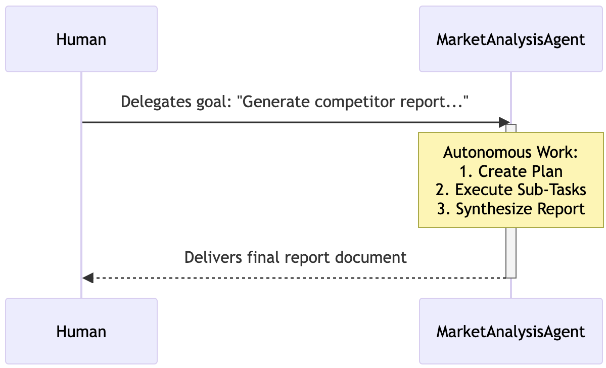
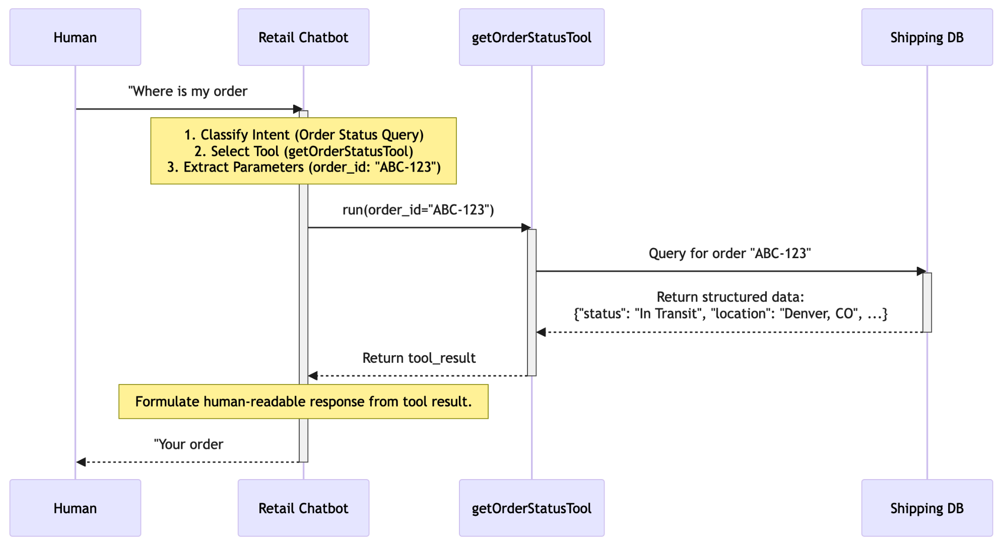
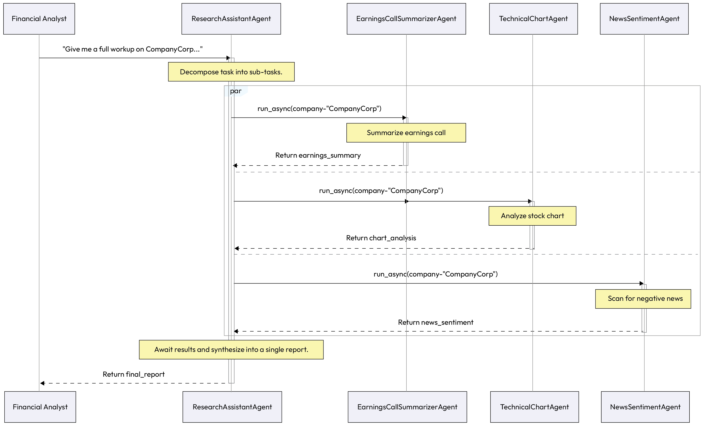
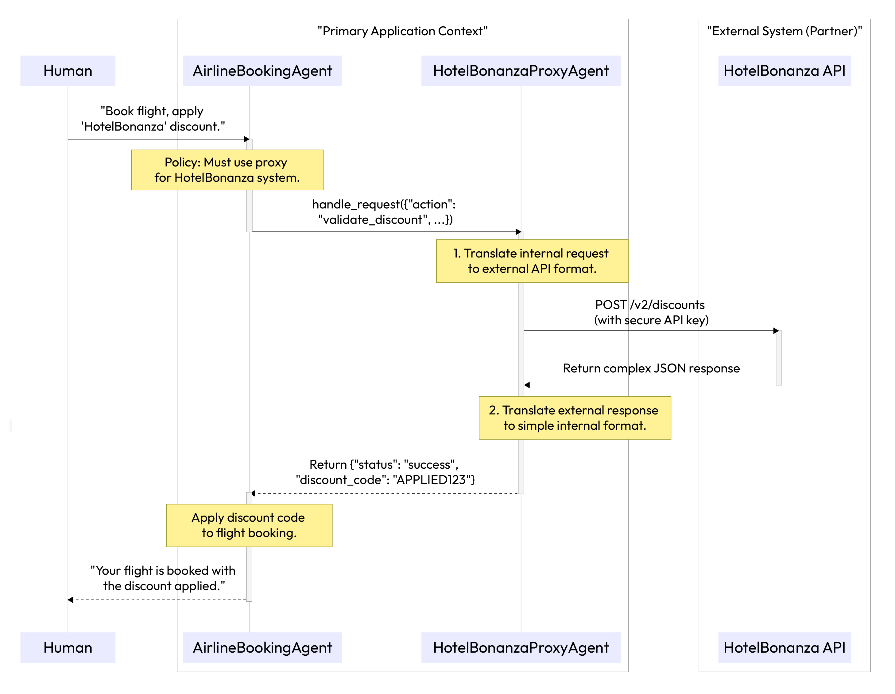

# Chapter 8: Human-Agent Interaction Patterns

## Human-Agent Interaction Patterns

In the previous chapters, we established the architectural patterns for making agentic systems coordinated,
compliant, and robust. A system that is reliable and transparent is the essential foundation for the most critical
relationship of all: the one between the AI agent and its human user. For agentic systems to move beyond
backend automation and truly augment human knowledge workers, their interactions with people must be
intuitive, trustworthy, and effective.
This chapter is dedicated to the patterns that govern this crucial interface. To make these patterns as actionable
as possible, we will take a "map before the journey" approach. Before detailing each individual pattern, we will
first present a strategic guide to implementation. This guide introduces a maturity model that organizes the
patterns into a clear, progressive roadmap, moving from simple transactional bots to proactive, collaborative
partners.
By understanding the bigger picture first, you will have the context to appreciate where each specific pattern fits
and why it is essential for building agentic systems that are not only powerful but also safe, usable, and
ultimately, adopted by the people they are designed to serve.
In this chapter, we'll be covering the following topics:
Strategic guide to implementing human-agent interaction patterns
Agent Calls Human (Human-in-the-Loop Escalation)
Human Delegates to Agent
## Human Calls Agent

Agent Delegates to Agent
## Agent Calls Proxy Agent

Strategic guide to implementing human-agent interaction
patterns
Knowing the individual patterns for human-agent interaction is the first step. The next step is applying them
strategically to build systems that are both powerful and trustworthy. It's not necessary or even advisable to
implement all patterns at once. The correct approach is to adopt them progressively as your system's complexity
and the need for sophisticated, collaborative workflows grow.
Levels of human-agent interaction
A common question when faced with a comprehensive pattern language is, "Where do I start?" Implementing
all of these patterns at once is not only impractical but often unnecessary for systems in their early stages. The
key to success is progressive adoption, building a foundation of simple, reliable interactions and adding more
sophisticated layers of autonomy and collaboration as your agentic system grows in complexity and
responsibility.
The following maturity model provides a strategic roadmap for this journey. It organizes the human-agent
interaction patterns into five distinct levels, moving from basic transactional bots to proactive, collaborative
digital assistants. By identifying your system's current needs and future goals, you can use this model to select
the right set of patterns to implement at the right time.
Level Capabilities Enabled patterns Summary
1. Transactional systemsDirect, single-turn
interactions
Human Calls Agent The system acts as a
responsive tool,
handling simple, welldefined commands and
queries with speed and
accuracy
2. Assisted automationBasic delegation and
escalation
Human Delegates to
Agent
## Agent Calls Human

The system can take on
simple multi-step tasks
but knows its limits,
reliably escalating to a
human for ambiguity or
approval
3. Collaborative systemsInternal multi-agent
workflows
Agent Delegates to
Agent
The system can solve
complex problems by
orchestrating a team of
internal specialist
agents, hidden from the
user
Chapter 8 282
Level Capabilities Enabled patterns Summary
4. Secure and
interoperable
ecosystems
Secure external
interactions
Agent Calls Proxy AgentThe system can securely
and reliably interact
with third-party
systems, enabling crossenterprise collaboration
5. Proactive and
personalized partners
Anticipatory, contextaware collaboration
All patterns, combined
with long-term memory
The system evolves from
a tool to a partner,
learning user
preferences and
proactively assisting
with complex goals
Table 8.1 - A maturity model for adopting human-agent interaction patterns
This maturity model provides the when (a guide to the sequence of adoption). However, to implement these
patterns effectively, we also need to understand the where (how they fit into the different functional layers of a
production-grade system). The following architecture provides a practical blueprint for integrating these
patterns into a cohesive whole.
System integration architecture: how the patterns work together
This architecture shows how the patterns can be organized into functional tiers within a complete application.
These layers ensure a clear separation of concerns, from the user-facing interface to the secure handling of
external communications:
User interface (UI)tier: This is the direct point of contact for the human user. All interactions are
initiated here.
Patterns enabled: Human Calls Agent (for direct commands) and Human Delegates to Agent (for
complex goals).
Orchestration and primary agent tier: This tier houses the primary agent that the user interacts with
(e.g., TravelPlannerAgent and ResearchAssistantAgent). It is responsible for high-level planning,
decomposing user goals, and managing the overall workflow.
Patterns enabled: It receives delegated tasks and initiates Agent Delegates to Agent calls to the
specialist tier. It is also responsible for handling escalations via the Agent Calls Human pattern.
Specialist and worker agent tier: This tier contains the functional, fine-grained agents that perform
the core business logic (e.g., FlightBookingAgent and NewsSentimentAgent).
Patterns enabled: It executes tasks received via the Agent Delegates to Agent pattern and, when
necessary, initiates external requests through the security tier.
Security and proxy tier: This is a specialized, isolated layer responsible for all external
communications.
283 Human-Agent Interaction Patterns
Patterns enabled: It houses the proxy agents that act as secure gateways to third-party APIs or other
enterprise systems via the Agent Calls Proxy Agent pattern. This tier is the only one with the
credentials and logic to interact with the outside world.
To see how these patterns connect in a real-world scenario, let's walk through a common enterprise task:
booking corporate travel.
Pattern chaining in practice: a corporate travel booking example
This example illustrates how the different interaction and delegation patterns chain together to fulfill a complex
user goal, with the system seamlessly escalating for human input when it reaches its operational limits.
This example illustrates how the patterns work together in a real workflow to fulfill a complex user request.
## Here is the travel booking flow:

Human Delegates to Agent: A user tells the TravelOrchestratorAgent to do the following: Book me a
trip to the New York office next week for the Q3 planning meeting. Get me a refundable
flight and a room at our corporate preferred hotel.
## Agent Delegates to Agent: The TravelOrchestratorAgent decomposes the goal and delegates subtasks:

It sends Find refundable flights to JFK for next week to its specialist
FlightBookingAgent
It sends Find rooms at corporate hotel in NYC for next week to its specialist
HotelBookingAgent
Agent Calls Proxy Agent: The FlightBookingAgent must use the company's secure travel portal
(Concur). It calls a ConcurProxyAgent, passing the flight criteria. The proxy is the only agent with the
API keys to securely interact with the Concur service.
Agent Calls Human: The HotelBookingAgent discovers the preferred hotel is sold out. It identifies two
other approved hotels, but cannot decide on its own. It triggers an escalation: The corporate hotel is
unavailable. Would you prefer Hotel A (closer to the office) or Hotel B (better
amenities)? The orchestrator pauses the workflow.
Human Calls Agent: The user receives the notification and replies: "Book Hotel A." This is a direct,
transactional command that resolves the ambiguity.
The TravelOrchestratorAgent receives the human's decision, directs the HotelBookingAgent to
proceed, collects the final confirmations from all specialists, and presents a complete itinerary to the
user.
Consistent with our approach in Chapter 7, we have included dedicated sections for pattern chaining and
evaluation metrics in this chapter. While the foundational patterns explored in Chapters 5 and 6 focused on the
internal logic of agent coordination and observability, Chapters 7 and 8 focus on the critical points of contact
where the system meets the real world. In human-agent interaction, "success" is often perceived as subjective.
However, for a system to be enterprise-grade, we must move beyond anecdotal feedback and transform user
experience into objective, measurable data. By chaining these interaction patterns and applying the following
1.
2.
◦
◦
3.
4.
5.
6.
Chapter 8 284
metrics, you can quantify the efficiency of your human-in-the-loop workflows and ensure that your agents are
providing genuine, measurable value to the knowledge workers they assist.
Measuring success: evaluation metrics by pattern
In a production-grade system, user experience cannot be a matter of opinion; it must be measured.
Implementing these patterns requires careful design and development, so teams must be able to quantify the
value they provide. By defining clear metrics for each pattern, you can track their effectiveness, diagnose
weaknesses, and justify continued investment in a user-centric agentic architecture.
The following table provides sample metrics and instrumentation strategies to help you measure the impact of
these key interaction patterns.
## Pattern Metric Instrumentation

Agent Calls Human Escalation rate/resolution timeLog every escalation event.
Measure the time from escalation
to human response and
subsequent task resumption.
Human Delegates to Agent Task success rate/user satisfactionTrack the end-to-end completion
rate of delegated goals. Follow up
with a simple user survey (CSAT/
NPS).
Human Calls Agent First-contact resolution rate/
average response time
Measure the percentage of queries
solved in a single turn. Track the
end-to-end latency from user
input to final response.
Agent Delegates to Agent Orchestration overhead/sub-task
failure rate
Log timestamps for each interagent delegation and response to
measure added latency. Track
errors returned by specialist
agents.
Agent Calls Proxy Agent External API error rate/security
incidents
Monitor logs from the proxy agent
for failed or timed-out API calls.
Implement security monitoring on
the proxy's isolated environment.
Table 8.2 - Sample metrics for evaluating patterns.
By defining lear metrics, we transform the abstract goal of a "good user experience" into a tangible, measurable
quality of our agentic systems. This data-driven approach is essential for justifying the architectural choices
these patterns represent and for driving continuous improvement. With a comprehensive language of patterns
for human-agent collaboration and a clear methodology for evaluating their impact, we have now completed
our deep dive into building systems that work effectively with people.
285 Human-Agent Interaction Patterns
Let's explore the Human-Agent interaction patterns in detail.
Agent Calls Human (Human-in-the-Loop Escalation)
While the goal of agentic systems is to maximize automation, there are situations where an agent, by design or
necessity, must pause and ask for human help. This can occur when the agent's confidence in its decision falls
below a critical threshold, when it encounters highly ambiguous data, or when a task involves a high-stakes
decision that company policy requires a human to approve.
The Agent Calls Human pattern provides a structured mechanism for this critical process. It defines a formal
escalation path for an agent to gracefully pause its operation, package the necessary context, and request a
decision from a human expert, ensuring that automation and human oversight can work together seamlessly.
Context
An autonomous agent, during its operation, encounters a situation that it cannot resolve on its own. The system
needs to maximize automation to be efficient, but it must also allow for human oversight to ensure safety and
handle edge cases that fall outside the agent's capabilities.
Problem
How can an agent gracefully pause its autonomous operation and escalate to a human for intervention? A poorly
managed escalation can be disruptive, provide insufficient context for a decision, or fail to capture the human's
response correctly, undermining the entire workflow.
Solution
The Agent Calls Human pattern implements a formal escalation mechanism, often referred to as a "human-inthe-loop" checkpoint. When an agent identifies a situation requiring human intervention, it packages the
current state and all relevant context into a structured request. This request is then routed to a human operator
through a dedicated UI or task queue. The agent's workflow is paused until the human provides a decision,
which is then fed back into the system, allowing the agent to resume its task with the new, human-validated
information.
Example: Resolving a loan application ambiguity
## A loan approval system uses an agent to process mortgage applications:

The LoanApprovalAgent goal is to process applications autonomously unless confidence drops below
95%
The human underwriter goal is to review ambiguous cases escalated by the agent and make a final
judgment
## The human-in-the-loop workflow unfolds as follows:

Trigger: The LoanApprovalAgent successfully verifies an applicant's income and credit score. However,
when analyzing the property appraisal, it detects a significant discrepancy between the appraisal's
square footage (1,800 sq. ft) and the property tax records (1,500 sq. ft), causing its confidence to drop.
1.
Chapter 8 286
Package context: The agent creates a "review package" containing the applicant ID, links to the
conflicting documents, and a summary, Discrepancy found in property square footage between
appraisal and tax records. Human review required to validate property value.
Escalate: It calls a HumanReviewTool, which pushes the package to a human underwriter's dashboard.
Pause: The agent's workflow for this specific application is paused, pending the outcome of the review.
Human decision: The underwriter reviews the documents, determines that it was a clerical error in the
tax records, and provides a decision via the UI, saying "VALIDATE_APPRAISAL".
Resume: The agent receives the structured decision, updates its internal state to reflect the human
override, and proceeds with the next step in the approval process.
The ollowing diagrams illustrate how the agent pauses its workflow, packages context for a human, and then
resumes its task based on the human's decision.


*Figure 8.1 – Agent Calls Human escalation flow*

2.
3.
4.
5.
6.
287 Human-Agent Interaction Patterns


*Figure 8.2 – Agent Calls Human escalation flow (cont.)*

Example implementation
The following code snippet monstrates how the Agent Calls Human pattern is structured in Python. Note
how the agent evaluates its own confidence against a predefined threshold and uses a dedicated
HumanReviewSystem to manage the "paused" state of the workflow while waiting for an external decision.
classLoanApprovalAgent:
## CONFIDENCE_THRESHOLD = 0.95

defprocess_application(self, application_data):
#... initial processing steps...
```python
# Analyze property appraisal
property_analysis = self.analyze_property(application_data.appraisal)
Chapter 8 288
```

if property_analysis['confidence'] < self.CONFIDENCE_THRESHOLD:
```python
# 1. Package the context for human review
review_package = {
"application_id": application_data.id,
"issue": "Property data discrepancy",
"details": property_analysis['details']
}
# 2. Call the human review system and pause
human_decision = HumanReviewSystem.request_decision(review_package)
# 3. Act on the human's decision
```

if human_decision['action'] == "VALIDATE_APPRAISAL":
self.log("Human validated appraisal. Resuming process.")
#... continue processing...
return"Status: Approved"
else:
self.log("Human rejected appraisal. Halting process.")
return"Status: Rejected by Underwriter"
else:
#... continue with high-confidence automated processing...
return"Status: Approved"
classHumanReviewSystem:
```python
@staticmethod
defrequest_decision(package):
```

# In a real system, this would push to a UI and wait for a callback.
```python
# Here, we simulate the human's response.
print(f"--> Escalation sent to Human Review Dashboard: {package['issue']}")
return {"action": "VALIDATE_APPRAISAL"}
289 Human-Agent Interaction Patterns
Consequences
Pros:
Safety and trust: This pattern is fundamental for building safe and trustworthy systems. It
ensures that critical or ambiguous decisions are vetted by a human, reducing the risk of costly
automated errors.
Handles edge cases: It provides a robust mechanism for handling the inevitable edge cases and
```

novel situations that an agent may not have been trained for.
Con:
Bottleneck: The human in the loop can become a performance bottleneck. The overall speed of
the system is limited by the availability and responsiveness of the human operators.
Implementation guidance
When implementing this pattern, design the human-facing interface with care. It should present the context
concisely and provide a structured way for the human to input their decision (e.g., buttons and forms) to
minimize ambiguity. Ensure that the system has a robust mechanism for managing the "paused" state of the
agent, including timeouts and default actions if a human fails to respond within a certain period.
While the Agent Calls Human pattern provides a critical safety net for when automation reaches its limits, the
majority of interactions are initiated by the user. Next, we will explore the patterns that govern how a human
can effectively offload work to an agent, starting with complex, long-running tasks.
Human Delegates to Agent
Agentic AI systems are defined by their ability to operate autonomously to achieve complex goals, moving
beyond simple question-and-answer interactions. The Human Delegates to Agent pattern ptures the essence
of this capability. Instead of providing step-by-step instructions, the human user delegates a high-level, often
ambiguous, objective to the agent. This pattern enables a fundamental shift in the human-AI relationship: from
direct command-and-control to a partnership where the human sets the strategic direction and the agent
manages the tactical execution.
◦
◦
◦
Chapter 8 290
This is the pattern that most closely resembles the popular vision of an AI "personal assistant" or "copilot" or
"co-scientist" that can complete entire tasks with minimal supervision. It is particularly useful for tasks that are
time-consuming, repetitive, or require navigating multiple systems and data sources.
Context
A human user has a high-level goal or a complex, multi-step task to accomplish, but they do not want to, or
cannot, execute each step manually. They want to offload the entire process to a capable autonomous system.
Problem
How can a user tively hand off a complex goal to an AI agent? The system must be able to accurately capture
the user's intent from a high-level instruction, operate autonomously over an extended period, and remain
aligned with the original goal without requiring constant human guidance.
Solution
The Human Delegates to Agent pattern structures the interaction as a clear handoff. The user provides a highlevel objective. The agent then enters an autonomous loop where it first creates a detailed plan to achieve that
objective, breaking it down into smaller, executable sub-tasks. It then executes this plan, using its tools and
reasoning capabilities to handle each step. The agent may provide periodic updates or request clarification if it
runs into an unrecoverable ambiguity, but otherwise operates independently until the final goal is achieved.
Example: Delegating market research
## A marketing manager delegates a research task to a MarketAnalysisAgent:

User's delegated goal: The manager gives the command: Generate a report on the top three
competitors for our new 'ProWidget X' in the European market. Focus on their pricing, key
features, and recent customer sentiment. I need a draft by tomorrow.
Note: Two sides of ambiguity -delegation versusescalation
At first glance, this pattern might seem to contradict Agent Calls Human. However, they are not
## contradictory but complementary, defining the two sides of a robust partnership:

Human Delegates to Agent (strategic ambiguity): Here, the human gives the agent a highlevel, "fuzzy" strategic goal (e.g., Generate a competitor report). The agent's primary job is
to resolve this ambiguity by creating a concrete, step-by-step plan.
Agent Calls Human (tactical ambiguity): This pattern is the safety net. It's triggered when the
agent, while executing its plan, encounters a new, unforeseen tactical problem it cannot or
should not solve alone (e.g., The competitor's pricing data is password-protected,
should I skip it or wait?).
In short, a capable agent can resolve the user's initial strategic ambiguity. A safe agent knows when to
escalate new tactical ambiguity.
Note
1.
291 Human-Agent Interaction Patterns
Agent's generated plan: The MarketAnalysisAgent receives the goal and breaks it down into an
internal plan:
Identify competitors: Use a web search tool to find top competitors for 'ProWidget X' in
Europe.
Get pricing: For each competitor, use a financial data API to find product pricing.
Analyze sentiment: For each, use a product review aggregator to summarize customer
sentiment from the last 6 months.
Synthesize report: Consolidate all collected data into a structured report document.
Deliver: Send the final report to the manager via email.
Autonomous execution: The gent executes each sub-task sequentially, using its tools and storing the
intermediate findings in its memory without further human input.
Completion: Once the report is drafted, the agent sends an email to the marketing manager with the
document attached, fulfilling the original delegated objective.


*Figure 8.3 – Human Delegates to Agent workflow*

Example implementation
The following sample code illustrates the transition from a strategic goal to tactical execution. In this example,
the MarketAnalysisAgent acts as an orchestrator that first invokes an LLM to generate a structured plan. It then
iterates through that plan, dynamically invoking the necessary tools, such as web searching nd sentiment
analysis, to fulfill the user's broad objective autonomously.
```python
# --- Placeholder Tool Definitions ---
classWebSearchTool:
2.
a.
b.
c.
d.
e.
3.
4.
Chapter 8 292
defrun(self, query):
return ["Competitor A", "Competitor B", "Competitor C"]
classReviewAggregatorTool:
defrun(self, competitors):
return {"Competitor A": "Positive", "Competitor B": "Mixed"}
# --- Agent Definition ---
classMarketAnalysisAgent:
def__init__(self):
self.web_search_tool = WebSearchTool()
self.review_aggregator_tool = ReviewAggregatorTool()
def_llm_create_plan(self, goal):
```

# In a real system, this would be an LLM call to generate a plan.
print("AGENT: Generating plan from high-level goal...")
return [
{"step": 1, "action": "identify_competitors", "query": "competitors for
ProWidget X in Europe"},
{"step": 2, "action": "analyze_sentiment"},
{"step": 3, "action": "synthesize_report"}
]
def_llm_synthesize_report(self, data):
```python
# Simulates using an LLM to write the final report.
print("AGENT: Synthesizing final report...")
return (
f"Market Research Report:\n"
f"Competitors: {data['competitors']}\n"
f"Sentiment: {data['sentiment']}"
)
```

defsend_email(self, to, document):
print(f"AGENT: Emailing report to {to}.")
## defexecute_delegated_task(self, high_level_goal: str):

```python
# 1. Use an LLM to create a plan from the goal
plan = self._llm_create_plan(high_level_goal)
# 2. Execute the plan
research_data = {}
293 Human-Agent Interaction Patterns
```

for step in plan:
print(f"AGENT: Executing Step {step['step']}: {step['action']}")
## if step['action'] == 'identify_competitors':

competitors = self.web_search_tool.run(query=step['query'])
research_data['competitors'] = competitors
## elif step['action'] == 'analyze_sentiment':

sentiment = self.review_aggregator_tool.run(
competitors=research_data.get('competitors')
)
research_data['sentiment'] = sentiment
#... other steps would be executed here...
```python
# 3. Final step: Synthesize and deliver
final_report = self._llm_synthesize_report(research_data)
self.send_email(to="manager@example.com", document=final_report)
return"Task Complete. Report has been sent."
# --- Execute the Delegation ---
agent = MarketAnalysisAgent()
goal = "Generate a report on the top competitors for 'ProWidget X'..."
agent.execute_delegated_task(goal)
Consequences
Pros:
Efficiency: This pattern is extremely powerful for user productivity, as it allows humans to
offload complex, time-consuming tasks to an autonomous system
Capability: It enables the solving of problems that are too large or complex for a simple, singleprompt interaction
Con:
Risk of misalignment: The primary risk is that the agent misinterprets the initial high-level
goal and spends significant resources executing a plan that is not aligned with the user's true
intent
◦
◦
◦
Chapter 8 294
Implementation guidance
To mitigate the risk of misalignment, consider implementing a Plan Confirmation step. After the agent generates
```

its initial plan (step 2 in the example), it can present the plan to the user for a quick "go/no-go" approval before
beginning the autonomous execution. This small checkpoint ensures that the agent's interpretation of the goal
is correct without requiring the user to supervise every step.
Delegating a complex goal is a powerful capability, but many interactions are simpler and more direct. Now that
we've seen how an agent handles a high-level objective, let's examine the foundational pattern for managing
immediate, transactional requests: Human Calls Agent.
## Human Calls Agent

Not every human-agent interaction is a long, complex delegation. Often, a user needs specific piece of
information or wants a single, well-defined action performed immediately. For these transactional and direct
queries, the user expects a fast, accurate, and concise response.
The Human Calls Agent pattern structures this fundamental request-response cycle. It is the foundation for
building common applications such as chatbots and voice assistants, where the agent's primary role is to act as
a direct interface to a tool or piece of information.
Context
A user needs a specific piece of information or wants a single, well-defined action performed immediately. The
interaction is transactional, and the user expects a fast and accurate response without unnecessary
conversational steps.
Problem
How can the system provide a direct, responsive, and accurate answer to a transactional query? The agent must
quickly understand the user's direct command, use the appropriate tool to get the information or perform the
action, and return the result concisely.
Solution
The Human Calls Agent pattern structures the interaction as a direct, request-response cycle. The user's query
is treated as a direct invocation. The agent's primary logic is to classify the user's intent, select the single best
tool to fulfill that intent, execute the tool with the necessary parameters extracted from the query, and return
the result to the user, often with minimal conversational filler. This pattern is foundational for building
chatbots, voice ssistants, and other direct interaction tools.
Example: Checking an order status
## A user interacts with a retail chatbot to find out where their package is:

User's direct command: The user types, Where is my order #ABC-123?
Agent's logic (intent classification & tool selection): The agent's LLM core immediately recognizes
this as an "order status query" and identifies getOrderStatusTool as the appropriate tool to call.
Parameter extraction: The LLM extracts the order ID, ABC-123, as the necessary parameter for the tool.
295 Human-Agent Interaction Patterns
Tool execution: The agent calls the tool: getOrderStatusTool(order_id="ABC-123"). The tool
internally queries the company's shipping database and returns structured data: {"status": "In
Transit", "location": "Denver, CO", "estimated_delivery": "2025-09-22"}.
Response generation: The agent's LLM receives the tool's output and formats it into a clear, concise,
human-readable response.
Return to user: The chatbot replies, Your order #ABC-123 is currently in transit in Denver,
CO, with an estimated delivery date of September 22, 2025.


*Figure 8.4 – Human Calls Agent sequence*

Example implementation
The sample implementation below demonstrates the "Request-Response" cycle typical of transactional systems.
In this scenario, the RetailBotAgent is optimized for speed and accuracy. It uses an LLM primarily as an
intelligent router, identifying the user's intent, extracting the necessary parameters (like an Order ID), and
invoking the specific OrderStatusTool to retrieve real-time data from a backend system.
```python
# --- Placeholder Tool and LLM Definitions ---
classOrderStatusTool:
defget_schema(self):
return {
"name": "getOrderStatusTool",
"parameters": {"order_id": "string"}
}
defrun(self, order_id):
Chapter 8 296
return {
"status": "In Transit",
"location": "Denver, CO",
"estimated_delivery": "2025-09-22"
}
# --- Agent Definition ---
classRetailBotAgent:
def__init__(self):
self.order_status_tool = OrderStatusTool()
# The agent's LLM is pre-configured with the tool's schema
# self.llm = LanguageModel(tools=[self.order_status_tool.get_schema()])
```

defhandle_user_query(self, query: str):
```python
# 1. LLM determines which tool to call and with what parameters
# llm_response = self.llm.generate(f"User query: {query}")
```

# In a real system, the LLM would populate the following based on the query.
```python
# We simulate the LLM's decision here for clarity.
tool_to_call = "getOrderStatusTool"
params = {"order_id": "ABC-123"}
```

if tool_to_call == "getOrderStatusTool":
```python
# 2. Extract parameters and execute the tool
tool_result = self.order_status_tool.run(
order_id=params['order_id']
)
# 3. Generate a final response based on the tool's output
# final_response_prompt = f"Data: {tool_result}. Formulate a helpful
response."
# final_response = self.llm.generate(final_response_prompt)
```

# We simulate the final generation step here.
final_text = (
f"Your order #{params['order_id']} is currently {tool_result['status']} "
f"in{tool_result['location']}, with an estimated delivery date of "
f"September 22, 2025."
)
297 Human-Agent Interaction Patterns
return final_text
else:
return"I'm sorry, I can only help with order status inquiries."
```python
# --- Execute the Interaction ---
agent = RetailBotAgent()
user_query = "Where is my order #ABC-123?"
response = agent.handle_user_query(user_query)
print(response)
Consequences
Pros:
Speed and efficiency: This pattern is optimized for speed and is ideal for building highly
responsive, transactional assistants.
Simplicity: The logic is straightforward, making it one of the easiest agentic patterns to
implement and debug.
Con:
Limited scope: It is not well-suited for complex, multi-step tasks or long-running goals. It
excels at well-defined, single-purpose interactions.
Implementation guidance
The key to implementing this pattern effectively is robust tool definition. The tools available to the agent
should be well-documented with clear descriptions, and their parameters should be strongly typed (meaning
each parameter explicitly defines its data type, such as string, integer, or Boolean). This metadata is what allows
the LLM to accurately select the correct tool and extract the necessary arguments from a user's conversational
query.
These three patterns-Agent Calls Human, Human Delegates to Agent, and Human Calls Agent-define the
primary interfaces between the user and the system. To make these seamless experiences possible, we will now
look at two crucial internal patterns that govern how agents collaborate behind the scenes to fulfill a user's
```

request, starting with how a primary agent can delegate work to a team of specialists.
Agent Delegates to Agent
Often, a user delegates a omplex task to a single primary agent, but successfully completing it requires a set of
specialized skills that the primary agent does not possess. For system to fulfill such a request, it needs a way to
break down the user's high-level goal and route the resulting sub-tasks to the correct specialists, all while
maintaining a seamless experience for the user.
The Agent Delegates to Agent pattern implements this hierarchical or collaborative structure. A primary
"supervisor" agent acts as a project manager, decomposing a user's goal into smaller tasks and delegating each
◦
◦
◦
Chapter 8 298
to the appropriate specialized "worker" agent. This allows the system to combine the skills of multiple experts
to solve problems far more complex than any single agent could handle alone.
Context
A primary agent (e.g., an orchestrator) has received a complex task from a user that requires multiple specialized
skills or domains of knowledge to complete.
Problem
How can an gentic system fulfill a user's complex request without overwhelming a single "generalist" agent or
requiring the user to interact with multiple, specialized agents directly?
Solution
The Agent Delegates to Agent pattern implements a hierarchical structure, often using a supervisor
(orchestrator) architecture. The user interacts with a single primary agent, which analyzes the user's request
and acts as a "project manager," decomposing the overall goal into smaller sub-tasks. It then delegates each
sub-task to the appropriate specialized "worker" agent, which has the specific tools and knowledge to handle it.
The primary agent collects the results from the worker agents and synthesizes the final response for the user,
making the internal collaboration invisible.
Example: Comprehensive financial analysis
## A financial analyst delegates a task to their primary ResearchAssistant agent:

Human's delegated goal: The analyst asks, Give me a full workup on CompanyCorp. I need a
summary of their last earnings call, a technical analysis of their stock chart, and a
check for any recent negative news.
## Primary agent's decomposition plan: The ResearchAssistant agent plans the task:

Sub-task 1: Summarize the Q1 earnings call transcript
Sub-task 2: Analyze the 3-month stock chart for support and resistance levels
Sub-task 3: Scan news sources from the last 7 days for negative sentiment
Agent-to-agent delegation: The ResearchAssistant agent delegates these sub-tasks to its team of
specialists:
It sends the summarization task to the EarningsCallSummarizerAgent
It sends the chart analysis task to the TechnicalChartAgent
It sends the news scan task to the NewsSentimentAgent
Specialist execution: Each specialist agent performs its task using its dedicated tools and returns the
result to the orchestrator.
Synthesis and response: The ResearchAssistant agent collects all the pieces of the analysis,
synthesizes them into a single, coherent report, and presents it to the human analyst.
1.
2.
◦
◦
◦
3.
◦
◦
◦
4.
5.
299 Human-Agent Interaction Patterns


*Figure 8.5 – Agent Delegates to Agent architecture*

Example implementation
The following sample code demonstrates a hierarchical multi-agent setup using Python's asyncio for
concurrent execution. In this implementation, the ResearchAssistantAgent acts as a supervisor. Rather than
performing the technical work itself, it decomposes a broad financial query into specific tasks and delegates
them to specialist agents. This modular approach allows each worker agent to maintain its own specialized
tools and logic, while the supervisor focuses on synthesizing their collective outputs into a final, coherent
report.
```python
import asyncio
# --- Placeholder Specialist Agent Definitions ---
classEarningsCallSummarizerAgent:
asyncdefrun_async(self, company):
returnf"Earnings summary for {company} is positive."
classTechnicalChartAgent:
asyncdefrun_async(self, company):
returnf"Chart analysis for {company} shows a bullish trend."
classNewsSentimentAgent:
Chapter 8 300
asyncdefrun_async(self, company):
returnf"News sentiment for {company} is neutral."
# --- The Orchestrator Agent ---
classResearchAssistantAgent:
def__init__(self):
self.summarizer_agent = EarningsCallSummarizerAgent()
self.chart_agent = TechnicalChartAgent()
self.news_agent = NewsSentimentAgent()
```

def_llm_synthesize(self, earnings, chart, news):
```python
# In a real system, an LLM would synthesize this into a polished report.
returnf"Financial Workup:\n- {earnings}\n- {chart}\n- {news}"
```

asyncdefgenerate_workup(self, company_name: str):
print(
f"Orchestrator: Decomposing task for {company_name} "
f"and delegating to specialists..."
)
```python
# Decompose and delegate tasks to run in parallel
earnings_summary_task = self.summarizer_agent.run_async(company=company_name)
chart_analysis_task = self.chart_agent.run_async(company=company_name)
news_sentiment_task = self.news_agent.run_async(company=company_name)
# Await and collect results from all specialists
earnings_summary, chart_analysis, news_sentiment = await asyncio.gather(
earnings_summary_task,
chart_analysis_task,
news_sentiment_task
)
print("Orchestrator: All specialist agents have returned their results.")
# Synthesize results into a final report
final_report = self._llm_synthesize(
earnings_summary,
chart_analysis,
news_sentiment
)
return final_report
301 Human-Agent Interaction Patterns
# --- Execute the Delegation ---
asyncdefmain():
orchestrator = ResearchAssistantAgent()
report = await orchestrator.generate_workup("CompanyCorp")
print("\n--- Final Report Presented to User ---")
print(report)
asyncio.run(main())
Consequences
Pros:
Modularity and specialization: This pattern allows for the creation of highly capable and
maintainable systems. Each agent can be an expert in its domain, and they can be developed,
tested, and updated independently.
Enhanced capability: By combining the skills of multiple specialists, the system can solve
```

problems that are far more complex than any single agent could handle.
Con:
Orchestration overhead: The system's performance and reliability depend heavily on the
orchestrator agent. Designing the logic for task decomposition, delegation, and result synthesis
adds complexity and can introduce latency.
Implementation guidance
The orchestrator's planning capability is the most critical component of this pattern. For simpler, predictable
workflows, the decomposition plan can be a static, predefined sequence of agent calls. For more complex and
dynamic tasks, the orchestrator itself may need to use an LLM to generate a multi-step plan, as shown in the
example.
Orchestrating a team of internal agents (a.k.a. an agent mesh) allows the system to solve complex problems.
However, many enterprise workflows require interaction with external, third-party systems. The final pattern in
this chapter, Agent Calls Proxy Agent, provides a secure and modular blueprint for managing these crucial
external communications.
## Agent Calls Proxy Agent

Often, an agent needs to interact with an external system that resides in a ifferent security context, such as a
third-party partner's API or a sensitive internal database. Giving the primary agent direct credentials to every
external system it might need to contact is a major security risk and an integration nightmare. The system needs
a way to manage these interactions securely and reliably.
The Agent Calls Proxy Agent pattern provides this by introducing a specialized intermediary, known as the
"proxy," which acts as a secure and standardized gateway to an external system. This decouples the core agent
logic from the complexities of external integrations and centralizes security enforcement.
◦
◦
◦
Chapter 8 302
Context
An agent, in the process of ulfilling a user's request, needs to interact with an external system. Direct access
from the primary agent is not allowed due to security policies, network boundaries, or a desire to abstract away
the complexity of the external system.
Problem
How can an agent securely and reliably interact with an external system without being tightly coupled to it and
without compromising security?
Solution
The Agent Calls Proxy Agent pattern introduces a specialized intermediary agent, the proxy, which acts as a
secure and standardized gateway. The primary agent does not call the external system directly. Instead, it sends
a simple, internal request to the proxy agent. The proxy is the only component that holds the credentials and
logic necessary to communicate with the external system. It translates the primary agent's request into the
specific format required by the external system, handles the secure interaction, and then translates the (often
complex) response back into a simple, standardized format for the primary agent to use.
Example: Cross-enterprise loyalty program
A user is booking a flight with an AirlineBookingAgent and wants to apply a discount from a partner hotel
## chain's loyalty program:

Primary agent (AirlineBookingAgent): Manages the flight booking workflow for the user
Proxy agent (HotelBonanzaProxyAgent): Securely manages all communication with the external
HotelBonanza API
External system: The HotelBonanza partner API
## The interaction is handled securely and efficiently:

User request: The user tells the AirlineBookingAgent: Book the flight to London and apply my
'HotelBonanza' loyalty discount.
Primary agent action: The AirlineBookingAgent knows it is not allowed to access the HotelBonanza
system directly.
## Call to proxy: It calls the HotelBonanzaProxyAgent with a simple, internal request: {"action":

"validate_discount", "user_id": "user123", "loyalty_code": "HB-XYZ"}.
Proxy execution: The HotelBonanzaProxyAgent, which is the only agent with the secret API keys,
receives the request. It formats a specific API call required by the external HotelBonanza system and
sends it securely.
External response: The HotelBonanza API returns a complex JSON object confirming the discount.
1.
2.
3.
4.
5.
303 Human-Agent Interaction Patterns
Proxy translation: The proxy agent parses this response, extracts the essential information (the onetime use discount code), and returns a simple, standardized response to the primary agent: {"status":
"success", "discount_code": "APPLIED123"}.
Task completion: The AirlineBookingAgent receives this simple response and applies the code to the
flight booking, completing the user's request without ever handling external redentials or omplex API
logic.


*Figure 8.6 – Agent Calls Proxy Agent pattern for secure interaction*

Example implementation
The following implementation highlights the separation of concerns between core business logic and external
system integration. The AirlineBookingAgent (the primary agent) operates in a high-trust environment but
lacks the credentials to reach outside its network. It communicates using a simple, internal vocabulary. The
HotelBonanzaProxyAgent, conversely, resides in a secure, isolated context; it alone holds the sensitive API keys
and possesses the specific logic required to translate internal requests into the complex formats required by
external third-party providers.
```python
# --- Placeholder for external interaction ---
```

defhttp_post(url, data, headers):
6.
7.
Chapter 8 304
print(f"PROXY: Calling external API at {url}...")
```python
# Simulate a complex response from the external API
return {"external_status": "OK", "data": {"one_time_code": "APPLIED123",
"valid_until": "2025-09-22"}}
# --- Resides in the main application context ---
classAirlineBookingAgent:
```

defapply_partner_discount(self, user_id, loyalty_code):
```python
# The primary agent only knows about the internal proxy
proxy = HotelBonanzaProxyAgent()
proxy_request = {
"action": "validate_discount",
"user_id": user_id,
"loyalty_code": loyalty_code
}
# The call is simple and uses internal language
proxy_response = proxy.handle_request(proxy_request)
return proxy_response.get('discount_code')
# --- Resides in a secure, isolated context ---
classHotelBonanzaProxyAgent:
def__init__(self):
# This proxy is the only component with the secret API key
# self.api_key = load_secret("HOTEL_BONANZA_API_KEY")
305 Human-Agent Interaction Patterns
self.api_key = "SECRET_API_KEY"
```

defhandle_request(self, internal_request: dict):
```python
# 1. Translate the internal request into the external API format
```

external_request = {"user": internal_request["user_id"], "code":
internal_request["loyalty_code"]}
```python
# 2. Securely call the external system
external_response = http_post(
"https://api.hotelbonanza.com/v2/discounts",
data=external_request,
headers={"Authorization": f"Bearer{self.api_key}"}
)
# 3. Translate the complex external response back to a simple internal format
```

if external_response.get("external_status") == "OK":
return {"status": "success", "discount_code": external_response["data"]
["one_time_code"]}
else:
return {"status": "failure", "discount_code": None}
```python
# --- Execute the Workflow ---
booking_agent = AirlineBookingAgent()
discount = booking_agent.apply_partner_discount("user123", "HB-XYZ")
print(f"Booking Agent received discount code: {discount}")
Chapter 8 306
Consequences
Pros:
Security: This pattern significantly enhances security by centralizing and isolating access to
external systems. Primary agents never handle sensitive credentials, reducing the attack
surface.
Decoupling and maintainability: It decouples the main agentic system from the complexities
of external APIs. If a partner's API changes, only the proxy agent needs to be updated; the
primary agents remain untouched.
Con:
Latency: It introduces an extra "hop" in the communication chain, which can add latency. This
```

makes it less suitable for interactions that require extremely low-latency responses.
Implementation guidance
Use this pattern to enforce a clear security boundary between your internal agent system and the outside world.
The proxy agent should be the only component with the necessary network access and credentials to reach a
specific external service. Ensure that the internal communication protocol between the primary agent and the
proxy is simple and standardized, effectively creating an internal API that abstracts away the external
complexity.
These interaction patterns, from high-level delegation to secure proxy calls, provide a comprehensive toolkit for
designing systems where humans and agents can collaborate effectively. Now that we have explored the
individual building blocks, the final step is to understand how to apply them strategically.
Let's now step back and consolidate the key principles we've established in the summary.
## Summary

This chapter explored the critical patterns that govern the interface between humans and AI agents. We have
established that for agentic systems to be truly useful and trusted, their interactions with people must be
designed with intention, clarity, and safety in mind. These patterns provide the architectural solutions for
managing the spectrum of human-agent collaborations, from direct commands to complex, long-running
delegations.
## The key takeaways are as follows:

Interactions are diverse: The relationship between humans and agents is not monolithic. It ranges
from quick, transactional calls (Human Calls Agent) to complex, long-term handoffs (Human
Delegates to Agent). A robust system must support these different modes.
Escalation is a core feature, not a failure: Intelligent systems must know their own limits. The Agent
Calls Human pattern is a fundamental mechanism for ensuring safety and handling ambiguity, making
the human in the loop a core part of the architecture.
Collaboration should be seamless: Users should not be burdened with the internal complexity of a
multi-agent system. The Agent Delegates to Agent and Agent Calls Proxy Agent patterns provide the
◦
◦
◦
307 Human-Agent Interaction Patterns
blueprints for creating sophisticated, multi-part workflows that remain simple and coherent from the
user's perspective.
Building trust is the ultimate goal: All of these patterns, in different ways, are designed to build and
maintain user trust. They do this by ensuring that the agent understands user intent, acts in alignment
with goals, provides transparency when needed, and operates securely on the user's behalf.
By thoughtfully applying these interaction patterns, we move beyond creating mere tools and begin to design
true AI collaborators. These patterns provide the foundation for building agentic systems that can be safely and
effectively integrated into human workflows, unlocking the full potential of this transformative technology.
Now that we have a solid understanding of how to architect the human-agent relationship, we are ready to
focus on the agent itself. In the next chapter, we will explore agent-level patterns, which deal with the internal
design and capabilities of individual agents that enable them to perceive their environment, make decisions,
and act with greater intelligence and autonomy.
Subscribe for a free eBook
New frameworks, evolving architectures, research drops, production breakdowns-AI_Distilled filters the noise
into a weekly briefing for engineers and researchers working hands-on with LLMs and GenAI systems. Subscribe
now and receive a free eBook, along with weekly insights that help you stay focused and informed.
Subscribe at https://packt.link/8Oz6Y or scan the QR code below.
Chapter 8 308