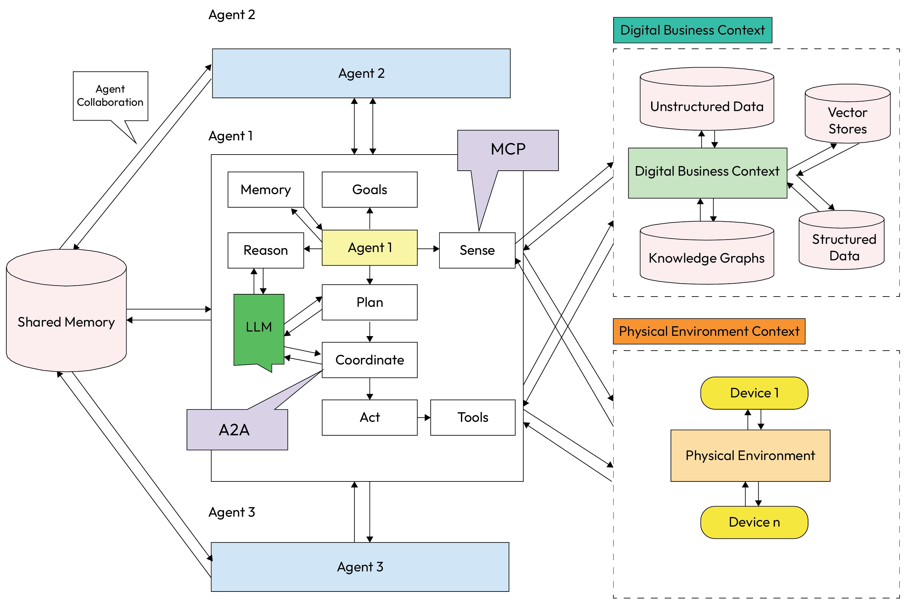
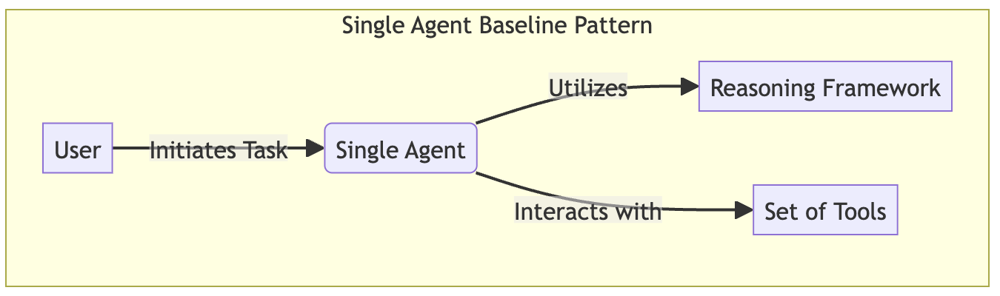
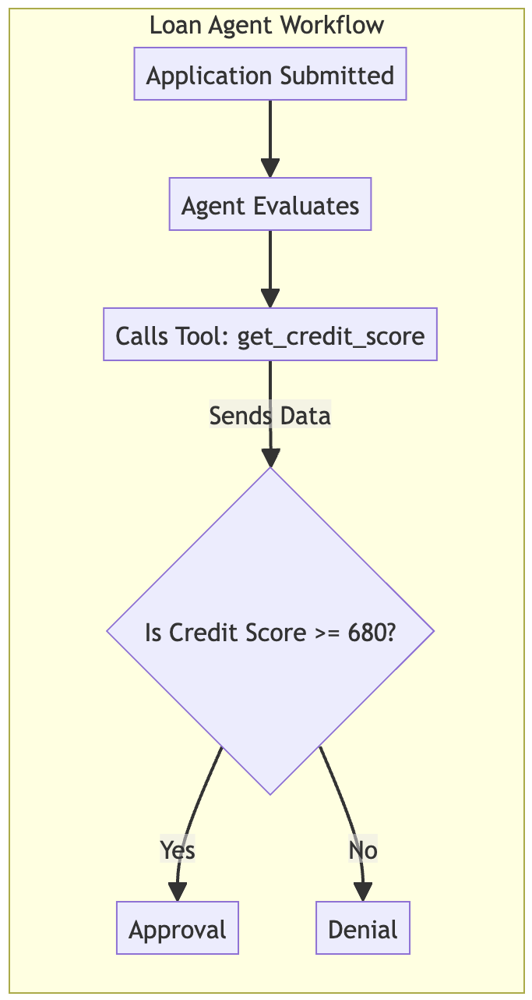
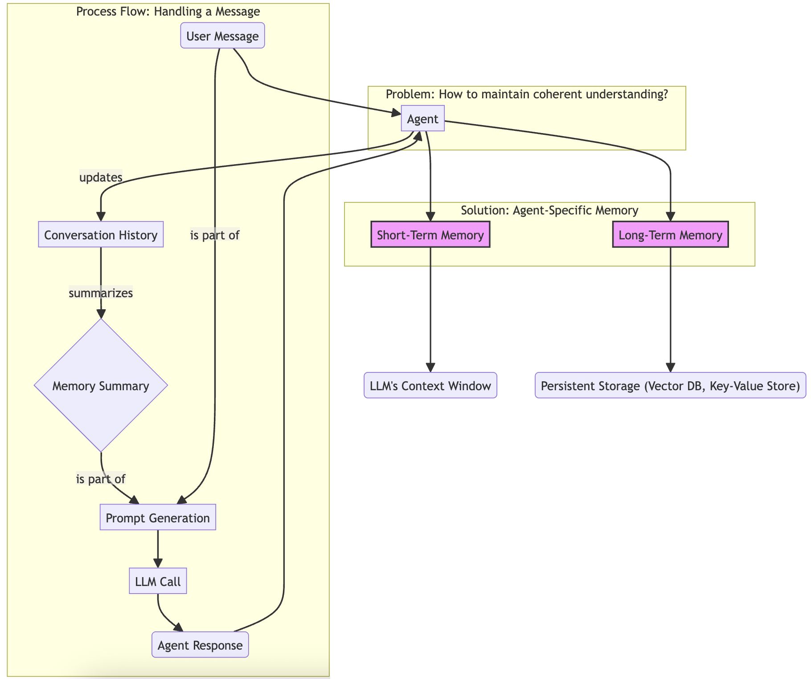
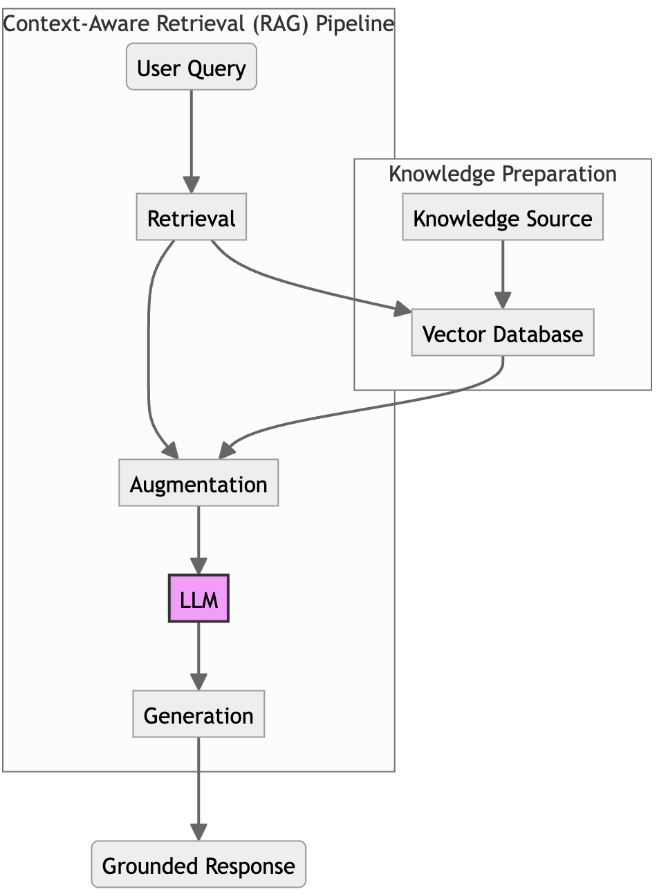
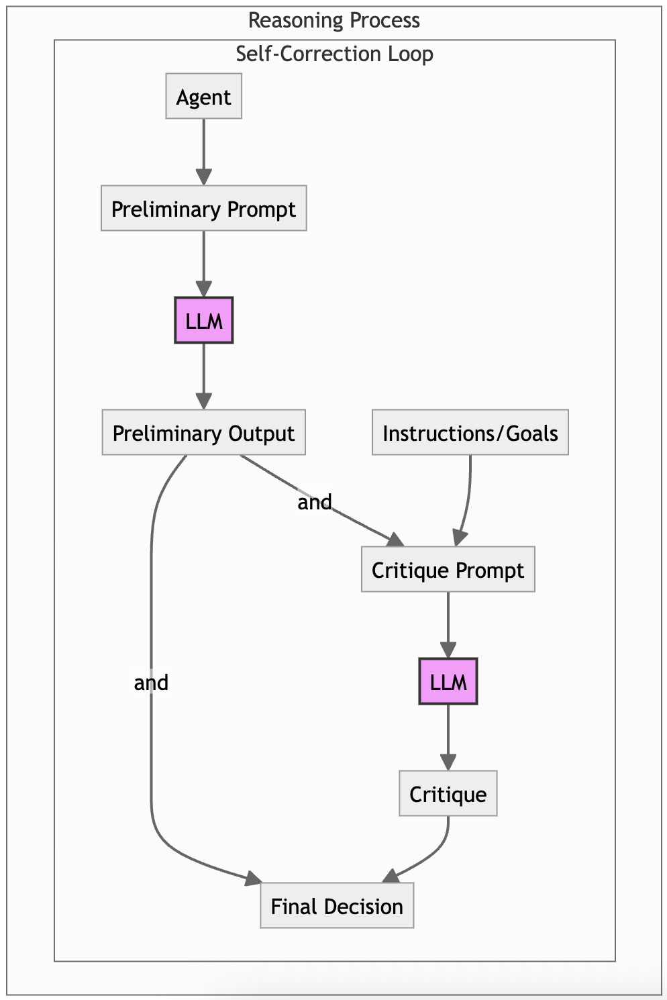
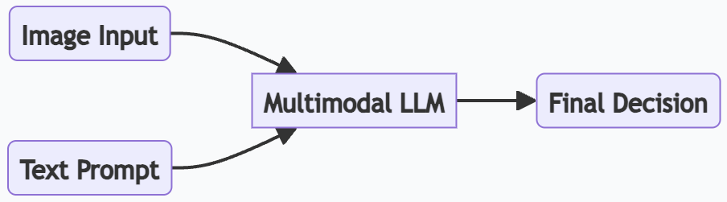

# Chapter 9: Agent-Level Patterns

Agent-Level Patterns
In the preceding chapters, we explored the patterns that govern how multiple agents collaborate within a robust
system architecture. Now, we will zoom in on the fundamental unit of any such ecosystem: the individual
autonomous agent. This chapter is dedicated to the agent-level patterns that define an agent's internal
architecture and bring its core components to life.
These patterns form the blueprints for an agent's essential capabilities: how it perceives its environment, how it
manages its memory, how it structures its reasoning, and how it acts upon the world.
Mastering these individual patterns is the first step toward building the sophisticated, collaborative multi-agent
systems required for production-grade enterprise solutions.
To make these patterns as practical as possible, we will take a "map before the journey" approach, starting with
a strategic guide that provides a maturity model for agent development. By understanding the bigger picture
first, you will have the context to appreciate where each specific pattern fits and why it is essential for building
agents that are not only powerful but also reliable and purposeful.
In this chapter, we'll be covering the following topics:
Strategic guide to implementing agent-level patterns
## Single Agent Baseline

Agent-Specific Context and Memory
RAG
Structured Reasoning and Self-Correction
## Multimodal Sensory Input

Guidance for enterprise rollout
Measuring success: evaluation metrics by pattern
Let's begin by exploring this strategic guide and the Agent Maturity Model.
Strategic guide to implementing agent-level patterns
Knowing the individual patterns is the first step. The next step is applying them strategically to build agents
that are both powerful and practical. The correct approach is to adopt these capabilities progressively, layering
them to match the growing complexity and responsibility of the agent's role.
Components required to implement agent capabilities
The Maturity Model provides strategic roadmap for developing agents, moving from a simple tool user to a
sophisticated, perceptive specialist. By identifying your agent's required capabilities, you can select the right set
of patterns to implement at the right time.
Let's dive deeper into the components required to implement agentic capabilities as depicted in the agent
anatomy diagram introduced in Chapter 1. These are patterns that describe the internal interactions between the
components in a single agent as represented within the agent anatomy diagram.


*Figure 9.1 – The agent anatomy*

In Chapter 4, we defined the anatomy of an agent in terms of verbs and actions, such as Sense, Reason, Plan, Act,
and Recall (Memory), as the essential building blocks of an autonomous system. We described these verbs the
'organs' of an agent, figuratively speaking, perform. These allow an agent to function within a continuous
operational loop.
However, knowing the anatomy is only the first step. To move to a production-ready system, we need to apply
specific agent-level patterns that adapt these components to fit the realities of enterprise data and complex
logic required for business process agentic automation. The following table maps the anatomical components
Chapter 9 310
we explored earlier to the design patterns covered in this chapter, shifting our focus from what an agent is to how
each of its faculties is engineered for reliability and scale.
## Component Capabilities Interactionamong

components
implemented by
patterns
## Summary

Act and tools Executes direct
commands and uses
simple tools
Single Agent Baseline The agent functions as a
basic automator. It uses
the Act block to execute
workflows and the Tools
block to interface with
external APIs.
Memory Handles multi-turn
conversations and
remembers key facts
Agent-Specific MemoryThe agent becomes
stateful. The Memory
component persists
session history and user
preferences to maintain
context.
Memory Accesses and reasons
over external, domainspecific data
Context-Aware Retrieval
(RAG)
The agent is grounded in
factual knowledge. The
Memory component is
augmented to retrieve
external data, reducing
hallucinations.
Reason and plan Reasons transparently
and corrects its own
errors
Structured Reasoning
and Self-Correction
The agent becomes
reliable. It uses the
Reason component to
think through problems
and the Plan component
to structure complex
tasks.
Sense Understands and
processes visual
information from
documents and UIs
Multimodal Sensory
Input
The agent functions as a
gateway to the world.
The Sense component
ingests multimodal
inputs (images, audio)
before processing.
Table 9.1 - Components and patterns for adopting agent-level patterns
311 Agent-Level Patterns
Internal agent architecture: how the patterns fit together
These patterns are not isolated features but integrated components of an agent's internal architecture. They
## enhance the agent's core cognitive loop of Perceive --> Reason --> Act:

Perception layer: This is the agent's gateway to the world. It processes raw inputs and prepares them
for the reasoning engine.
Pattern enabled: Multimodal Sensory Input allows this layer to process not just text but also images,
sound, and other data formats.
Memory andknowledge layer: This layer provides the context the agent needs to reason effectively. It
is not part of the core loop but acts as a critical resource for the cognition layer.
Patterns enabled: Agent-Specific Memory provides session history and user preferences, while the
RAG retriever fetches external knowledge on demand.
Cognition andreasoning layer: This is the agent's "brain," powered by an LLM. It plans, makes
decisions, and formulates responses.
Patterns enabled: Structured Reasoning and Self-Correction patterns operate here, ensuring that the
agent's thought process is robust, transparent, and aligned with its goals.
Action layer: This layer executes the decisions made by the cognition layer. It is where the agent
interacts with its environment.
Pattern enabled: The Single Agent Baseline defines the agent's core ability to use tools (APIs and
functions) housed in this layer to effect change.
Now, let's xplore the details of each one of the patterns as described in the previous maturity model table. Note
that in order to go from one level of maturity to the next, you will need to consider implementing the patterns
for the next level of maturity. In this way, it will give you a very clear pathway from where you are to where you
want to end up, from an enterprise's sophistication, capability, adoption, and maturity level for agentic AI.
## Single Agent Baseline

Before diving into more complex patterns, let's establish a baseline. The Single Agent Baseline pattern
represents the simplest form of an agentic system, where a single agent is tasked with handling a complete
workflow by accessing a variety of tools. It is the starting point for most agentic implementations and serves as
a benchmark against which more advanced architectures can be measured.
Context
This pattern is ideal for tasks that are complex enough to require tool use but do not necessitate the overhead of
multiple collaborating agents. It is the most common starting point for building task-oriented agentic systems.
Problem
How do you structure a basic but functional agent that can perform a series of semi-autonomous actions to
achieve a goal?
Chapter 9 312
Solution
The solution involves creating a single agent powered by an LLM. This agent is provided with a set of tools
(functions or APIs) and a goal described in an instruction prompt. Using a reasoning framework such as ReAct
(Reason-Act) or the more sophisticated Fractal Chain of Thought (FCoT), the agent's LLM core independently
decides which tools to call, in what sequence, and with what parameters to gather information and accomplish
its task. The entire thought process (aka reasoning) and execution logic (aka planning) is contained within this
single agent.
The following diagrams illustrate this architecture.Figure 9.2 shows the general, high-level pattern, while Figure
9.3 provides a more specific workflow for how this agent would handle a concrete task.


*Figure 9.2 – The Single Agent Baseline pattern*

Now that we've seen the high-level architecture, let's walk through a concrete example to see how this pattern is
implemented.
Example: A simple loan approval agent
A bank wants to automate the initial review of a loan application. The task is assigned to SingleLoanAgent:
Agent's goal: To decide whether a loan application should be approved or denied based on a credit
score threshold of 680
Available tool: A get_credit_score tool that can retrieve a score for a given applicant ID
## The agent's execution flow is as follows:

Receive task: The agent is given the following goal: Process the loan application for
applicant_id: 'john_doe_123' and loan_amount: 50000.
Reasoning: The agent's LLM determines that to evaluate the loan, it first needs the applicant's credit
score.
Tool selection and execution: It identifies the get_credit_score tool as the correct one to use. It calls
the tool with the applicant_id='john_doe_123' parameter.
Observation: The tool executes and returns a value of 720.
Final reasoning and action: The agent now has all the necessary information. It compares the score
(720) to the required threshold (680). Since the score is sufficient, it concludes that the final action is to
approve the loan.
Response: The agent returns the final answer: Approved.
1.
2.
3.
4.
5.
6.
313 Agent-Level Patterns


*Figure 9.3 – Single Agent loan agent workflow*

Example implementation
Here is a simplified implementation of a single agent for a loan application. The LLM's reasoning and decisionmaking steps are simulated for clarity:
```python
# A mock tool for the agent to use
```

defget_credit_score(applicant_id: str) -> int:
"""Retrieves the credit score for a given applicant ID."""
Chapter 9 314
print(f"TOOL CALLED: Getting credit score for {applicant_id}...")
```python
# In a real system, this would call an external API
```

if applicant_id == "john_doe_123":
return720
return640
classSingleLoanAgent:
def__init__(self):
```python
# The agent has a dictionary of available tools
self.tools = {"get_credit_score": get_credit_score}
```

defprocess_application(self, applicant_id: str, loan_amount: int):
"""Processes a loan application for a given applicant."""
print(f"\nAGENT: Received task for applicant {applicant_id}.")
```python
# 1> Agent reasons it needs the credit score and calls the tool
credit_score = self.tools["get_credit_score"](applicant_id)
print(f"AGENT: Observed credit score is {credit_score}.")
# 2> Agent reasons about the final decision based on the tool's output
# In a real system, this would be a second LLM call
prompt = f"""
Evaluate the following loan application.
Applicant ID: {applicant_id}
Credit Score: {credit_score}
Loan Amount: ${loan_amount}
Based on a credit score threshold of 680, should this loan be 'Approved' or
'Denied'?
"""
# Simulate the LLM making a decision based on the tool's output
response = "Approved"if credit_score >= 680else"Denied"
print(f"AGENT DECISION: The loan for {applicant_id} is {response}.")
return response
# --- Execute the Workflow ---
loan_agent = SingleLoanAgent()
loan_agent.process_application(applicant_id="john_doe_123", loan_amount=50000)
315 Agent-Level Patterns
Consequences
Pro:
Simplicity: The primary advantage is simplicity in implementation and debugging. It's easier to
```

manage and observe the behavior and state of a single agent compared to a multi-agent system.
Con:
Scalability: This architecture does not scale well as the number of tools or the complexity of the
domain increases. A single agent can become overloaded, and its prompt can become too
complex to manage effectively, leading to performance degradation and a higher likelihood of
error.
Implementation guidance
The Single Agent Baseline provides a complete, self-contained execution loop, allowing an agent to use tools,
via function calling, to achieve a specific goal. However, this simple agent is stateless; it has no memory of past
interactions and treats every new task as if it's the first. To create more intelligent and personalized experiences,
an agent must be able to remember what has happened before in some kind of shared memory that it can
access.
The next pattern, Agent-Specific Context and Memory, addresses this fundamental need. It equips an agent
with its own state management system, enabling it to maintain a coherent understanding of its task and
environment over time.
Agent-Specific Context and Memory
For an agent to act intelligently, it must be aware of its context (sense its current environment) and remember
past interactions in that environment. The Agent-Specific Context and Memory pattern addresses the need for
an agent to maintain and utilize its own dedicated contextual information to guide its decision-making process.
This includes its initial instructions/goals and also its chain of orchestration: namely, what instructions were
handed down to it from its parent AI orchestrator, if it has one; otherwise, it will rely on the instructions and
goals given to it directly. This elevates an agent from a simple command executor to a stateful entity that can
learn and adapt.
Context
This pattern is rucial for any agent that needs to perform tasks beyond simple, one-shot commands. It's
fundamental for conversational agents, long-running task automation, and any system where past events
influence future actions.
Problem
How oes an agent maintain a coherent understanding of its task and contextual environment over time,
especially during multi-turn interactions?
◦
◦
Chapter 9 316
Solution
The solution is to equip each agent with its own memory or state management system. This allows the agent to
build a persistent understanding of its context, separate from the immediate instructions it receives. This
## memory is often divided into two types:

[State management] Short-term memory: Often managed within the LLM's context window, it holds
the immediate history of the current task or conversation. Techniques such as summarization or a
sliding window of recent messages are used to keep this context relevant and concise.
Long-term memory: A more persistent storage mechanism, such as a vector database or a key-value
store. Here, the agent can store and retrieve key facts, user preferences, and past conclusions for use in
future sessions.Retrieval-augmented generation (RAG) is a common pattern for accessing this
memory.
Example: A stateful conversational loan agent
A user interacts with a conversational agent to start a loan application. The agent uses memory to maintain a
coherent dialogue:
Agent goal: To guide a user through a loan application over multiple turns, remembering the context of
the conversation
## The stateful interaction unfolds:

Turn 1 (user): I need to apply for a home loan.
Turn 1 (agent): The agent responds, I can help with that. What is the applicant's ID? It then
updates its short-term memory summary to User is asking about a home loan.
Turn 2 (user): My ID is 'jane_doe_456'.
Turn 2 (agent): The agent receives the new message. It combines its memory summary with the new
message to form a complete picture. It understands that 'jane_doe_456' is the applicant ID for the
home loan inquiry. It responds, Thank you. What is the loan amount for Jane Doe? and updates its
memory again.
Because of its memory, the agent avoids asking redundant questions and maintains a natural, logical
conversational flow.
Note
Simply feeding an entire conversation history into an LLM's context window is often counterproductive.
Research shows that models tend to forget information "lost in the middle" of a long context and can be
distracted by irrelevant noise. Effective memory management is essential.
Note
1.
2.
3.
4.
317 Agent-Level Patterns


*Figure 9.4 – Agent-specific memory*

Example implementation
This example monstrates a simple summarization approach to managing short-term memory:
classConversationalLoanAgent:
def__init__(self):
self.conversation_history = []
self.memory_summary = "No prior conversation."
def_update_memory(self):
"""Summarizes the conversation to manage context size."""
```python
# In a real implementation, this would be an LLM call to summarize.
```

iflen(self.conversation_history) > 1:
last_exchange = (
f"User: '{self.conversation_history[-2]['content']}', "
f"Agent: '{self.conversation_history[-1]['content']}'"
Chapter 9 318
)
self.memory_summary = (
"The conversation is about a loan application. "
f"The last topic was: {last_exchange}"
)
print(f"MEMORY UPDATED: {self.memory_summary}")
## defhandle_message(self, user_message: str):

"""Handles a new message from the user in a conversation."""
self.conversation_history.append(
{"role": "user", "content": user_message}
)
```python
# The agent's prompt includes the memory summary for context
prompt = f"""
Conversation Summary: {self.memory_summary}
Latest User Message: "{user_message}"
```

Respond to the user's latest message in a helpful manner.
"""
```python
# Simulate LLM response based on the full context
# response = self.llm.generate(prompt)
if"loan"in user_message:
response = "I can help with that. What is the applicant's ID?"
else:
response = "Thank you. What is the loan amount?"
self.conversation_history.append(
{"role": "agent", "content": response}
)
self._update_memory()
return response
# --- Execute the Workflow ---
agent = ConversationalLoanAgent()
print("--- Turn 1 ---")
agent.handle_message("I need to apply for a home loan.")
319 Agent-Level Patterns
print("\n--- Turn 2 ---")
agent.handle_message("My ID is 'jane_doe_456'.")
Consequences
Pro:
Stateful behavior and personalization: This pattern is what enables coherent, stateful
behavior. It allows agents to learn from experience, remember user preferences, and adapt their
actions over time.
Con:
```

Complexity and contextual drift: Implementing a robust memory system adds complexity.
Poorly managed memory can lead to the agent recalling outdated or irrelevant information, a
phenomenon known as contextual drift, which can degrade performance.
Implementation guidance
For short-term memory, start with simple strategies such as a "sliding window" of the last N conversation turns
or a summarization approach as shown in the example. For long-term memory, a RAG system connected to a
vector database is the standard approach. Be deliberate about what information is stored in long-term memory;
focus on high-value data such as user profiles, key decisions, and finalized facts to avoid polluting the memory
with noise.
Giving an agent a general or shared memory allows it to maintain a coherent internal model of a task or
conversation. However, to ground its reasoning in external, factual knowledge, it needs a more specialized
mechanism for accessing specific information on demand.
The next pattern, RAG, provides this capability, allowing an agent to query vast knowledge bases to find relevant
information and enhance its responses, significantly reducing the risk of hallucination.
Sensing with RAG
While the gent's general memory provides conversational context, theRAG pattern provides the specific
mechanism for grounding its reasoning in external, factual knowledge. It is one of the most effective and widely
adopted patterns for enhancing an agent's performance, reducing hallucinations, and connecting it to
proprietary or real-time information.
Context
This pattern is essential when an agent's tasks require factual accuracy that goes beyond the LLM's static,
pretrained knowledge. It is widely used in customer support, research, legal analysis, and any domain where
decisions must be based on a specific body of documents.
Problem
LLMs are pretrained on vast but static datasets, meaning their knowledge can be outdated or lack enterprisespecific context. How can an agent access and reason over up-to-date, proprietary, or domain-specific
information without costly retraining?
◦
◦
Chapter 9 320
Solution
The RAG pattern implements a pipeline that connects the agent to one or more external knowledge sources,
augmenting its prompt with relevant, retrieved facts before the LLM generates a response. The process involves
the following:
Indexing: Enterprise documents are cleaned, divided into manageable chunks, and converted into
vector embeddings, which are then stored in a vector database.
Retrieval: When the agent receives a query, the system retrieves the most relevant document chunks
from the vector database based on semantic similarity.
Augmentation: The retrieved chunks are inserted into the agent's prompt as additional context for the
LLM.
Generation: The LLM uses this augmented context to generate a response that is grounded in the
provided information.
Example: A RAG-enabled loan agent
A SingleLoanAgent needs to make a decision based on the latest, most complex internal lending policies:
Agent goal: To evaluate a high-value loan application by consulting the most current internal policy
documents
Knowledge source: A vector database containing all of the bank's lending policies
## The RAG-enhanced workflow proceeds as follows:

Receive task: The agent receives an application for a loan of $750,000.
Retrieval: Before making a decision, the agent queries its RAGRetriever tool with the following query:
policy for high-value loan. The retriever performs a semantic search on the vector database and
finds a document chunk stating Policy #23B: Loans over $500,000 require a credit score of
740 and a manual review.
Augmentation: The agent's reasoning prompt is augmented with this retrieved policy.
Grounded reasoning: The agent's LLM now reasons with this new context. It sees that the applicant's
score of 720 is below the required 740 for a loan of this size.
## Grounded response: The agent returns a decision that is explicitly grounded in the retrieved policy:

Denied due to insufficient credit score as per Policy #23B for high-value loans.
1.
2.
3.
4.
Tip
The sophistication of RAG can vary.Simple RAG involves a straightforward retrieve-and-generate
workflow, while agentic RAG introduces specialized agents that can perform tasks such as query
reformulation or iterative retrieval to improve results.
Tip
1.
2.
3.
4.
5.
321 Agent-Level Patterns


*Figure 9.5 – Context-aware retrieval (RAG) agent*

Example implementation
This xample simulates a RAG system where the agent retrieves a relevant policy document to make a more
nuanced decision:
```python
# --- RAG Components Simulation ---
classRAGRetriever:
def__init__(self):
# In a real system, this connects to a vector database
Chapter 9 322
self.knowledge_base = {
"high_value_loan": "Policy #23B: Loans over $500,000 require a credit score
of 740.",
"standard_loan": "Policy #17A: Standard loans require a credit score of 680."
}
```

defretrieve(self, query: str) -> str:
"""Retrieves a relevant document based on the query."""
if (
"high value"in query.lower()
or"500000"in query
or"750000"in query
):
returnself.knowledge_base["high_value_loan"]
returnself.knowledge_base["standard_loan"]
```python
# --- RAG-Enabled Agent ---
classRAGEnabledLoanAgent:
def__init__(self):
self.retriever = RAGRetriever()
# self.tools = {"get_credit_score": get_credit_score} from previous pattern
```

defprocess_application(self, applicant_id: str, loan_amount: int):
```python
# credit_score = self.tools["get_credit_score"](applicant_id)
credit_score = 720 # Simulating tool call for this example
# 1> Retrieve relevant context before reasoning
retrieved_context = self.retriever.retrieve(
f"policy for loan of ${loan_amount}"
)
print(f"CONTEXT RETRIEVED: {retrieved_context}")
# 2> Augment the prompt with the retrieved context
prompt = f"""
CONTEXT: {retrieved_context}
TASK: Evaluate the loan for {applicant_id}
```

with a score of {credit_score} and amount of ${loan_amount}.
323 Agent-Level Patterns
State your reasoning based on the provided context.
"""
```python
# 3> Simulate the LLM's grounded reasoning
# response = self.llm.generate(prompt)
```

if loan_amount > 500000and credit_score < 740:
response = (
"Denied due to high loan amount and insufficient "
"credit score as per Policy 23B."
)
## elif credit_score < 680:

response = (
"Denied due to credit score below the threshold "
"in Policy 17A."
)
else:
response = "Approved."
print(f"AGENT DECISION: {response}")
return response
```python
# --- Execute Workflow ---
rag_agent = RAGEnabledLoanAgent()
rag_agent.process_application(
applicant_id="jane_doe_456",
loan_amount=750000
)
Consequences
Pros:
Accuracy and trust: RAG drastically reduces hallucinations and improves the accuracy of agent
```

responses by grounding them in factual data. This builds user trust in the system's outputs.
Knowledge freshness: It allows an agent's knowledge to be updated in real time by simply
updating the knowledge source, without needing to retrain the LLM.
Cons:
Dependency on retrieval quality: The performance of the RAG system is highly dependent on
the quality of the indexed data and the effectiveness of the retrieval mechanism. If the retriever
pulls irrelevant context, it can confuse the LLM and degrade the response.
Contextual drift: A phenomenon known as RAG drift can occur where the indexed knowledge
itself becomes stale or outdated, leading to a decay in performance over time.
◦
◦
◦
◦
Chapter 9 324
Implementation guidance
The quality of your retrieval is paramount. Invest in a robust document processing pipeline that cleans and
chunks your source data effectively. The choice of embedding model and vector database should be tailored to
your specific domain. For complex queries, consider implementing agentic RAG, where a dedicated agent can
refine the user's initial query, perform iterative searches, and synthesize results from multiple retrieved
documents to provide the LLM with the best possible context.
The RAG pattern provides an agent with the necessary external knowledge to reason effectively. However,
simply having the right information is not enough; the agent must also have a robust internal process for
thinking through that information to arrive at a reliable conclusion.
The next family of patterns, focused on Structured Reasoning and Self-Correction, provides the techniques to
guide the agent's thought process, making it more logical, transparent, and aligned with its goals.
Structured Reasoning and Self-Correction
An agent's ility to reason is central to its autonomy. This family of patterns focuses on structuring the agent's
internal thought process to improve the quality of its reasoning and enable self-correction, moving beyond
simple single-step decision-making.
Context
These patterns are used when the reliability and explainability of an agent's conclusions are critical. They are
especially valuable in complex, multi-step tasks where there is a high risk of the agent misinterpreting its
instructions or failing to consider all relevant constraints.
Problem
How can you ensure that an agent's reasoning process is logical, transparent, and aligned with its core
instructions, especially for complex, multi-step tasks?
325 Agent-Level Patterns
Solution
The solution is to implement advanced prompting techniques and internal validation loops that guide the
LLM's reasoning process and encourage it to review its own work. These techniques are often composed
together:
Persistent Instruction Anchoring (from Chapter 6): Key instructions or goals are embedded in the
prompt using distinct tags (e.g., #OBJECTIVE:) and are repeated or placed at the beginning and end of
the context to counteract the "lost in the middle" problem.
Instruction Fidelity Auditing (Self-Correction) (from Chapter 6): The agent is designed to perform a
self-review of its own output before finalizing it. This is a multi-step process: first, the agent generates a
preliminary response; then, it runs a "critique" step where it evaluates its own output against the
original instructions and context.
Chain-of-Thought (CoT) and its "vanilla"variants: Instead of asking for an immediate answer, the
gent is prompted to "think step by step." This forces the LLM to externalize its reasoning process,
which often leads to more accurate results and provides a clear audit trail of its logic. The variants are
Graph of thought, Tree of thought etc.
Fractal Chain-of-Thought (FCoT): Using an increasingly detailed Context Aperture, we zoom in into
the various levels of granularity, starting from macro then meso, and finally to micro. At each level we
define and apply dual objective functions: one that maximizes and the other that minimizes a factor
that we are interested in hill-climbing towards. At each iteration/loop we self-reflect and correct what
was missed in the previous loop of reasoning.
Chapter 9 326


*Figure 9.6 – A self-correction loop, where an agent generates a preliminary output and then critiques it against its goals,*

leading to a more reliable final result
327 Agent-Level Patterns
Example: A self-correcting loan agent
A RAGEnabledLoanAgent uses a self-correction loop to ensure that its decision fully complies with a complex
## policy retrieved via RAG:

Agent goal: To evaluate a high-value loan and provide a decision that correctly and completely applies
the relevant internal policy
Retrieved context: The agent retrieves Policy #23B: Loans over $500,000 require a credit score
of 740 and a manual review.
## The self-correction workflow unfolds:

Initial reasoning (CoT): The agent receives an application for a $750,000 loan with a credit score of
720. It uses CoT to generate a preliminary decision: Step 1: The loan is high-value. Step 2:
## Policy #23B applies. Step 3: The score of 720 is less than 740. Preliminary Decision:

Denied.
Self-critique: Before returning the answer, the agent's internal auditor is prompted to review the
preliminary decision against the retrieved context, specifically looking for missed details.
Correction identified: The critique step identifies an error: Critique: The decision to deny is
correct, but the reasoning is incomplete. Policy #23B also mentions that the application
is eligible for a 'manual review'. This option should be included in the final answer.
Final, corrected output: The agent incorporates the critique to generate a more complete and accurate
final decision: FINAL DECISION: Denied for automatic approval based on Policy #23B. However,
the application is eligible for a manual review.
Example implementation
The following implementation demonstrates a SelfCorrectingAgent utilizing a critique loop. Instead of
returning the first result, the agent is orchestrated to pause, review its own preliminary output against the
## retrieved policy constraints, and generate a corrected final response if necessary:

classSelfCorrectingAgent:
def__init__(self):
```python
# self.tools = {"get_credit_score": get_credit_score} from previous pattern
# self.retriever = RAGRetriever() from previous pattern
pass
```

defprocess_with_self_correction(self, applicant_id: str, loan_amount: int):
```python
# credit_score = self.tools["get_credit_score"](applicant_id)
# context = self.retriever.retrieve(f"policy for ${loan_amount}")
credit_score = 720
context = (
"Policy 23B: Loans over $500,000 require a credit score "
"of 740 and a manual review."
1.
2.
3.
4.
Chapter 9 328
)
# 1> Generate a preliminary decision using CoT and Anchoring
preliminary_prompt = f"""
```

OBJECTIVE: Provide an initial loan decision based on the context.
CONTEXT: {context}
DATA: Applicant {applicant_id} has score {credit_score},
wants ${loan_amount}.
Think step-by-step and provide a preliminary decision.
"""
```python
# Simulate LLM generating the first draft
preliminary_decision = (
f"Step 1: Loan is ${loan_amount}, which is high-value. "
f"Step 2: Policy 23B applies. "
f"Step 3: Score is {credit_score}, which is less than 740. "
f"Step 4: PRELIMINARY DECISION: Denied."
)
print(f"PRELIMINARY REASONING: {preliminary_decision}")
# 2> Generate a critique of the preliminary decision
critique_prompt = f"""
OBJECTIVE: You are an auditor. Verify if the preliminary decision
correctly follows all rules in the context.
CONTEXT: {context}
PRELIMINARY DECISION: {preliminary_decision}
Does the decision correctly apply the policy?
Is there anything missed? For example, does the policy mention
a manual review?
"""
# Simulate LLM generating the critique
critique = (
"Critique: The decision to deny is correct, but Policy 23B "
"also mentions a 'manual review' as an option. "
"The reasoning should include this."
)
329 Agent-Level Patterns
print(f"SELF-CRITIQUE: {critique}")
# 3> Generate a final, corrected decision
# final_prompt = f"..."
final_decision = (
"FINAL DECISION: Denied for automatic approval based on Policy 23B. "
"However, the application is eligible for a manual review."
)
print(f"FINAL AGENT DECISION: {final_decision}")
return final_decision
# --- Execute Workflow ---
self_correcting_agent = SelfCorrectingAgent()
self_correcting_agent.process_with_self_correction(
"jane_doe_456",
750000
)
Consequences
Pro:
Reliability and transparency: These patterns lead to more robust, reliable, and transparent
reasoning. The externalized thought process makes it easier for developers to debug agent
```

behavior and for auditors to understand why a decision was made.
Con:
Latency and cost: These techniques increase latency and computational cost due to the
additional reasoning or validation steps. A self-correction loop, for example, requires at least
two separate LLM calls instead of one.
Implementation guidance
Compose these patterns for maximum effect. Use Persistent Instruction Anchoring in all complex prompts to
keep the agent on task. Use Chain-of-Thought for the initial reasoning pass to generate a transparent, step-bystep analysis. Finally, for high-stakes decisions, add a Self-Correction loop where a second prompt explicitly
asks the LLM to play the role of a critique or auditor to review the initial CoT reasoning against the original
context and constraints.
Structured reasoning patterns give an agent a robust internal thought process. However, much of the data in the
real world is not text-based. To be truly effective, an agent must be able to perceive and understand visual
information such as documents, charts, and user interfaces. The next pattern, Multimodal Sensory Input,
◦
◦
Chapter 9 330
equips agents with this crucial capability, allowing them to see and interpret the world in the same way humans
do.
## Multimodal Sensory Input

To operate tively in workflows that rely on visual documents and user interfaces, an agent must be able to
process more than just text. The Multimodal Sensory Input pattern expands an agent's perception beyond
language, allowing it to interpret images, screenshots, and visual data as part of its reasoning process. This
moves the agent from a simple chatbot to a true co-pilot that can understand its environment visually.
Context
This pattern is essential for agents in document-heavy industries such as finance (processing invoices),
healthcare (analyzing medical forms), and logistics (reading shipping labels). It is particularly relevant as
enterprises require agents to interpret screenshots, invoices, or product images as part of their workflows.
Problem
How can n agent operate effectively in workflows that rely on visual documents and user interfaces?
Solution
The solution is to integrate multimodal capabilities into the agent's perception component. This allows the
agent to process images, extract text via optical character recognition (OCR), and understand spatial layouts
to perform actions. There are two primary approaches to implementation, offering a trade-off between control
and simplicity:
Implement a pipeline of specialized tools: This approach uses a series of single-purpose models or
services. An agent first sends an image to a dedicated tool, such as an OCR service, to extract text. The
extracted text is then passed to a separate LLM for reasoning. This method provides greater control over
each step of the process.
Employ a native multimodal model: A more advanced approach uses a single foundation model that
is inherently multimodal, such as Google's Gemini family of models. These models are trained to
process images, text, audio, and video inputs simultaneously. The agent can directly feed an image and
a text prompt to the model, and the model handles both the visual parsing and the reasoning in a single
step.
While these two approaches describe how an agent can process sensory data, a related challenge is how it
securely and reliably obtains that data from its environment. This is especially critical as agents sense not just
their digital environment but also the physical world. Standardized protocols are emerging to govern this
information exchange:
Model Context Protocol (MCP): MCP provides a standardized, secure way for an agent to discover and
interact with tools from within its own organization. It acts as a fundamental building block for
developing individual agents, allowing an agent to securely obtain resources (like from an IoT device) or
contextual information as input for its reasoning process.
Agent-to-Agent (A2A) protocol: The A2A protocol is designed for agent-to-agent communication,
often across organizational boundaries. It is a building block for creating complex workflows or multi-
331 Agent-Level Patterns
agent orchestrators, allowing different agents (e.g., one from your company and one from a partner's)
to communicate securely to achieve a shared goal, handling requirements such as authorization and
authentication (for example, OAuth).
Example: Processing a loan application from an image
## A loan agent needs to process an application that has been submitted as a scanned image:

Agent goal: To extract key information from a loan application image and make an initial decision
Pipeline approach:
Perception: The agent receives the image of the application form.
Tool use (OCR): It sends the image to a specialized ocr_service tool.
## Observation: The tool returns the extracted text: Applicant: John Doe, Loan Amount:

$600,000.
Reasoning: The agent now passes this extracted text to its LLM core to perform the final
reasoning and decision-making.


*Figure 9.7 – Multimodal processing via multimodal pipeline*

## Native multimodal approach:

Perception: The agent receives the image and a text prompt: Analyze this loan application
form image and provide a decision.
Reasoning: It sends both the image and the text directly to a native multimodal LLM. The
single model performs both the OCR and the decision-making in one step, returning a complete
analysis.


*Figure 9.8 – Native multimodal LLM multimodal processing*

Example implementation
The ollowing code contrasts the two implementation strategies. First, the PipelineMultimodalAgent
demonstrates the tool-based approach, where a specialized OCR service extracts text, which is then passed to
the LLM. Second, the NativeMultimodalAgent shows the streamlined approach, passing the image directly to a
## multimodal model for simultaneous analysis and reasoning:

```python
# --- Implementation 1: Pipeline of Specialized Tools ---
```

defocr_service(image_bytes: bytes) -> str:
1.
2.
3.
4.
◦
◦
Chapter 9 332
"""Mock OCR service that extracts text from an image."""
```python
# In a real system, a call to a service like Google Cloud Document AI would be made
print("TOOL CALLED: OCR Service")
return"Applicant: John Doe, ID: john_doe_123, Loan Amount: $600,000"
classPipelineMultimodalAgent:
```

defprocess_application_from_image(self, image_file: bytes):
"""Processes a loan application submitted as an image using a pipeline."""
print("\n--- AGENT PERCEPTION (Pipeline) ---")
```python
# Step 1: Use an external tool for OCR
extracted_text = ocr_service(image_file)
print(f"OCR EXTRACTION: '{extracted_text}'")
# Step 2: Use an LLM to reason over the extracted text
print("AGENT REASONING: Sending extracted text to LLM for decision.")
#... additional agent logic here...
return"Decision based on pipeline processing."
# --- Implementation 2: Native Multimodal Model ---
# Placeholder for a native multimodal LLM
classNativeMultimodalLLM:
```

defgenerate_content(self, text_prompt: str, image_file: bytes) -> str:
"""Simulates a native multimodal model call."""
print("MODEL: Receiving image and text simultaneously...")
return (
"Interpreting image data... Extracted text: "
"'Applicant: John Doe, ID: john_doe_123, Loan Amount: $600,000'. "
"Final analysis: Approved."
)
classNativeMultimodalAgent:
def__init__(self):
self.llm = NativeMultimodalLLM()
## defprocess_application_from_image(self, image_file: bytes):

"""Processes a loan application with a native multimodal model."""
print("\n--- AGENT PERCEPTION (Native Multimodal) ---")
333 Agent-Level Patterns
prompt = "Analyze this loan application form image and provide a decision."
response = self.llm.generate_content(
text_prompt=prompt,
image_file=image_file
)
print(f"MODEL RESPONSE: '{response}'")
#... additional agent logic to parse response and act...
return"Decision based on native multimodal processing."
```python
# --- Execute Workflows ---
dummy_image = b"some_image_bytes"
pipeline_agent = PipelineMultimodalAgent()
pipeline_agent.process_application_from_image(dummy_image)
native_agent = NativeMultimodalAgent()
native_agent.process_application_from_image(dummy_image)
Consequences
Pro:
Expanded use cases: This pattern dramatically expands the agent's applicable use cases,
moving it from a language-based tool to a digital assistant that can interact with the same
interfaces as a human. For instance, a multimodal agent can reduce claim processing time by
interpreting images in approval workflows.
Con:
Cost and latency: Multimodal models are computationally more expensive and can have
higher latency. They typically require specialized infrastructure (such as GPUs) and a different
```

approach to testing and validation compared to text-only models.
Implementation guidance
Choose your pproach based on your specific needs. The pipeline approach is often a good starting point as it
allows you to use best-in-class specialized services (such as a highly accurate OCR tool) and provides more
control and observability over each step. The native multimodal model approach is simpler to orchestrate and can
be more powerful for tasks that require a deep, holistic understanding of both the image and text together, but
may offer less granular control.
While the patterns we have explored define the what and how of an agent's internal cognitive loop, the challenge
for the enterprise is determining the when. Transitioning from a theoretical blueprint to a live production
◦
◦
Chapter 9 334
environment requires a tactical sequence that balances ambition with reliability. In the following section, we
will translate these patterns into a phased roadmap, ensuring that each capability is layered onto a stable
foundation of trust and measurable success.
Guidance for enterprise rollout
A phased implementation, aligned with the Maturity Model, is the most effective approach for deploying a
capable agent. This allows your team to build a foundation of trust and reliability, layering on more advanced
capabilities as the system scales.
Phase Patterns to implement Rationale
Phase 1: Foundational automationSingle Agent Baseline, AgentSpecific Memory
Start with a simple, transactional
agent for a high-volume, low-risk
task (e.g., an internal IT helpdesk
bot). This proves immediate value
and builds core infrastructure.
Phase 2: Building expertise Context-Aware Retrieval (RAG)Enhance the agent by connecting
it to a knowledge base (e.g.,
technical documentation). This
makes the agent a trusted source
of information.
Phase 3: High-trust autonomyStructured Reasoning, Multimodal
Input
For critical processes, add selfcorrection for reliability and vision
capabilities to operate on realworld visual data. This enables
high-stakes workflows, such as a
finance agent that processes
scanned invoices and self-audits
its work before approval.
Table 9.2 - Example rollout sequence for agent capabilities
335 Agent-Level Patterns
Measuring success: evaluation metrics by pattern
To justify rchitectural hoices, the value provided by each pattern must be quantified. Defining clear metrics
allows you to track effectiveness and drive continuous improvement.
## Pattern Metric Instrumentation

Single Agent Baseline Task completion rate/tool call
success rate
Log the final outcome of each task
(success/failure). Monitor logs for
failed or erroneous tool API calls.
Agent-Specific Memory Session coherence score/reduction
in repeated questions
Use human raters to score
conversation quality. Track how
often users have to repeat
information that the agent should
have remembered.
Context-Aware Retrieval (RAG)Hallucination rate/factual
accuracy score
Evaluate responses against a
golden dataset to measure the
frequency of fabricated
information.
Structured Reasoning Self-correction trigger rate/
reduction in final errors
Track how often the critique step
identifies a flaw. Compare the
error rate of preliminary versus
final outputs.
Multimodal Sensory Input Data extraction accuracy/success
on visual tasks
Measure the accuracy of OCR or
field extraction against groundtruth data. Track task completion
for workflows requiring image
input.
Table 9.3 - Sample metrics for evaluating agent-level patterns
Chapter 9 336
## Summary

This chapter explored the essential patterns that define the capabilities of a single, autonomous agent. We
established that building a powerful agent is an incremental process, starting from a simple baseline and
progressively layering on more sophisticated behaviors for memory, knowledge retrieval, reasoning, and
perception.
## The key takeaways are as follows:

Agents are built, not summoned: A capable agent is the result of deliberate architectural choices. The
patterns discussed provide the blueprints for these choices.
Start simple, scale intelligently: The strategic path to a sophisticated agent begins with the Single
Agent Baseline and layers on patterns such as Memory, RAG, and Structured Reasoning as the agent's
responsibilities grow.
Grounding and reliability are paramount: For an agent to be trusted in an enterprise context, it must
be grounded in facts (RAG) and its reasoning must be robust and transparent (Self-Correction).
Perception is the next frontier: The ability to process visual information with the Multimodal Sensory
Input pattern is what elevates an agent from a text-based processor to a true co-pilot capable of
operating in human-centric workflows.
By thoughtfully applying these patterns, we can design individual agents that are reliable, intelligent, and fit for
purpose. These capable agents are the fundamental building blocks of any larger system. Now that we have a
solid understanding of how to construct a single, competent agent, we are ready to explore how these building
blocks can be assembled. In the next chapter, we will examine system-level patterns, which deal with how
multiple agents interact, collaborate, and are governed within a cohesive and robust architecture.
337 Agent-Level Patterns
then follow the steps on the page.
Note: Keep your invoice handy. Purchases made directly from Packt don't require one.
Chapter 9 338