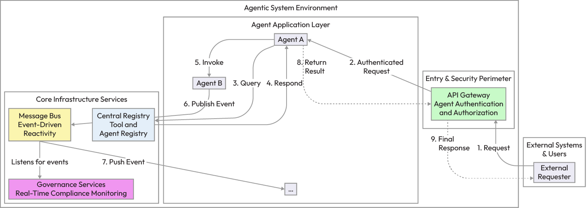
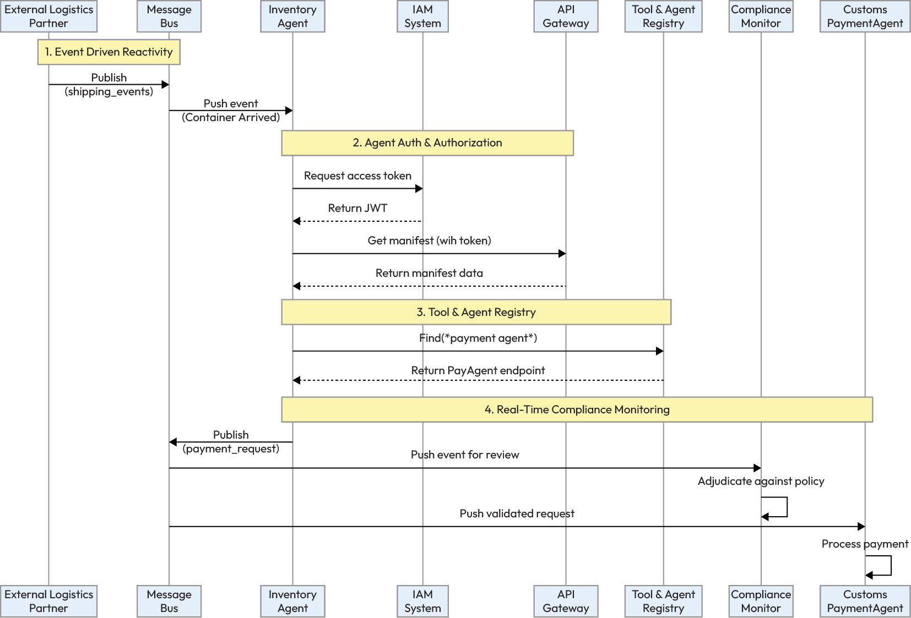
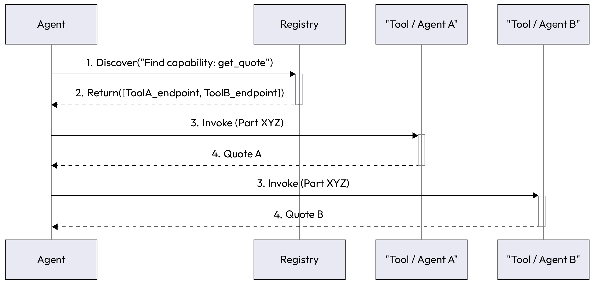
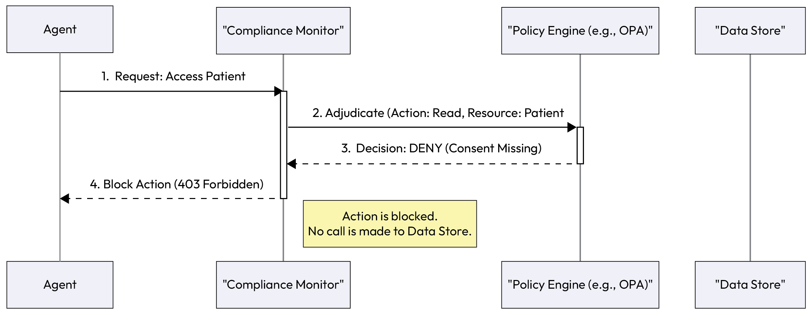
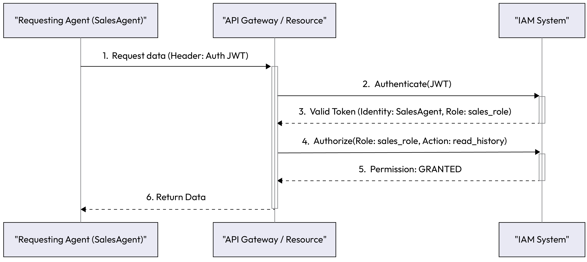
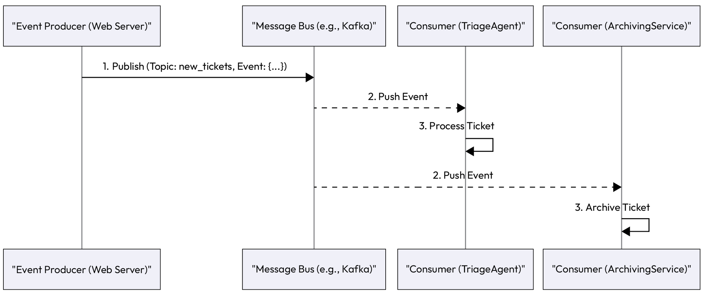

# Chapter 10: System-Level Patterns for Production Readiness

System-Level Patterns for
Production Readiness
In the preceding chapters, we meticulously examined and assembled the building blocks of agentic AI. We
designed individual agents with memory and reasoning, enabled them to coordinate on complex tasks, and
provided solutions to the challenges inherent in architecting them to be both robust and accountable. We have,
in effect, paved the way to design and build highly capable, intelligent agent actors. Now, we must build the
contextual world in which they will live and operate.
As we know by now, a multi-agent system is more than just a collection of agents. In many ways, it mirrors a
modern microservices architecture, but with a critical distinction. Instead of static services executing rigid code,
its components are reasoning, goal-directed agents that act autonomously. To collaborate effectively and
actuate an enterprise-grade application, this distributed intelligence requires a complete unit of orchestration,
policy adherence, and shared infrastructure. This reality requires us to shift our focus from the agent itself to the
holistic system architecture that encompasses it. Thus, in this chapter, we will introduce the system-level
patterns that provide the architectural scaffolding for production-grade multi-agent systems. These patterns
address the non-negotiable requirements of any enterprise application, answering critical questions such as the
following:
How do services and agents discover each other dynamically?
How do we enforce security, identity, and access control for autonomous agents?
How can we monitor and enforce compliance rules in real time?
How does the system react to external events asynchronously and at scale?
To make these patterns as actionable as possible, we will adopt a system-first approach. Building on the agentlevel architecture from Chapter 4, we shift our focus from the internal workings of an agent to the external
ecosystem it inhabits. Before detailing each individual pattern, we will prioritize architecture before
implementation by presenting a strategic guide. This guide, which is aligned with our GenAI Maturity Model,
provides a roadmap for how the need for these architectural patterns becomes critical as a system evolves from a
single agent to a collaborative ecosystem.
By understanding the bigger picture first, you will have the context to appreciate where each specific pattern fits
and why it is essential for transforming an agentic proof of concept into a reliable, secure, and robust production
environment.
In this chapter, we'll be covering the following topics:
Strategic guide to implementing system-level patterns
Tool and Agent Registry
## Real-Time Compliance Monitoring

Agent Authentication and Authorization
Event-Driven Reactivity
Strategic guide to implementing system-level patterns
Understanding the individual architectural patterns is the first step toward building a robust agentic system.
The next, more critical step is applying them strategically to create an infrastructure that is secure, scalable, and
ready for the enterprise. It is neither necessary nor advisable to implement all of these patterns for a day-one
proof of concept. The correct approach is to adopt them progressively as your system's complexity, risk profile,
and scale requirements grow.
Mapping system-level patterns to the GenAI maturity model
A common question when faced with these foundational patterns is, How much of this do I need to start? The
answer depends entirely on where you are in your agentic AI journey. Implementing a highly available tool
registry for a single, non-critical agent is over-engineering. Conversely, deploying a multi-agent system that
handles sensitive data without robust authentication and compliance is negligent.
We will turn to the GenAI maturity model to provide a strategic roadmap for this journey. It will help you align
the implementation of these architectural patterns with your system's current capabilities and future
ambitions, ensuring that you build the right foundation at the right time.
Level Capabilities Enabled patterns Summary
Level 3 -Agent-ready
LLMs
Foundational models
and tools
Initial thoughts on
## security and reactivity:

basic IAM (service
accounts) and simple
reactivity (webhooks)
Before deploying any
agents, foundational
decisions about security
(IAM integration) and
communication (event
infrastructure) should be
part of the platform
design.
Chapter 10 340
Level Capabilities Enabled patterns Summary
Level 4 - Single-agent
systems
Production-grade single
agents
Agent Authentication
and Authorization,
Event-Driven Reactivity,
and Real-Time
Compliance Monitoring
As the first agent goes
into production, security
is non-negotiable. The
agent must be reactive to
its environment, and if it
handles sensitive tasks,
compliance monitoring
becomes essential.
Level 5 - Multi-agent
systems
Collaborative agent
ecosystems
Tool and Agent RegistryAs soon as two or more
agents need to
collaborate dynamically,
a registry becomes the
cornerstone of the
architecture, enabling
discovery and loose
coupling across the
entire system.
Table 10.1 - Mapping system-level patterns to the GenAI Maturity Model
This Maturity Model provides the when, a guide to the sequence and progression of adoption. To implement
these patterns effectively, we also need to understand the where, that is, how they fit into the different
functional layers of a production-grade system.
System integration architecture: a blueprint for production
readiness
This architecture illustrates how system-level patterns form the operational backbone of a complete agentic
application. These components are not part of any single agent but rather provide the environment in which all
## agents operate securely and efficiently:

API gateway (security and entry point): This is the single, fortified entry point for all requests into the
agentic system.
Patterns enabled: Agent Authentication and Authorization. Checks signatures, expiration, audience
claims, and scopes, and enforces token rotation to ensure secure, least-privilege agent-to-agent
communication.
Message bus/event stream (reactive backbone): This is the central nervous system for asynchronous
communication.
Patterns enabled: Event-Driven Reactivity. Agents typically sense events by running as continuous
consumers or via long-lived stream connections. When a new event arrives on a subscribed topic, the
agent's Sense component is triggered, immediately initiating its reasoning loop. This allows the system
to react to changes without direct coupling.
341 System-Level Patterns for Production Readiness
Central registry (discovery and directory): This is the system's "yellow pages," allowing for dynamic
discovery.
Patterns enabled: Tool and Agent Registry. All discoverable agents and tools register their capabilities
and endpoints here.
Governance services (oversight and compliance): This is a dedicated layer that observes and governs
agent behavior.
Patterns enabled: Real-time Compliance Monitoring. A compliance service or agent subscribes to the
message bus or acts as a gateway to intercept and adjudicate actions against a central policy engine. To
meet enterprise standards, this layer enforces constraints at action-level (e.g., approve loan), row-level
(specific records), and field-level (e.g., blocking PII/PHI). This ensures granular compliance before any
operation proceeds.
To visualize how these omponents create a cohesive system, the following diagram illustrates this blueprint for
production readiness. It shows how an external request flows through the security perimeter and into an
application environment where agents interact with the core infrastructure services that enable discovery,
communication, and governance.


*Figure 10.1 – A system integration architecture showing how system-level patterns provide the foundational infrastructure*

for agentic applications
The architectural blueprint shows how the system components relate to one another. To bring this to life, the
ollowing example traces a single business event from start to finish, demonstrating how these patterns chain
together in a real-world sequence.
Pattern chaining in practice: an automated supply chain example
To see how these patterns connect, let's walk through an automated supply chain management scenario. This
example shows how architectural patterns work in concert to handle an external event securely and at scale:
Event-Driven Reactivity: A message from an external logistics partner's webhook is published to a
shipping_events topic on the system's message bus. The event indicates a container's arrival at port.
Event-Driven Reactivity: An InventoryAgent is subscribed to this topic. The new message triggers it to
act. Its goal is to verify the container's contents and update the inventory.
1.
2.
Chapter 10 342
Agent Authentication and Authorization: To get the container's manifest, the InventoryAgent needs
to access the ShippingAPI. It first requests an access token from the IAM system using its service
account credentials.
Agent Authentication and Authorization: The InventoryAgent calls the ShippingAPI, presenting its
token. The API gateway intercepts the call, validates the token, and confirms that the agent has the
read:manifest permission.
Tool and Agent Registry: After processing the manifest, the InventoryAgent determines that it must
notify the finance department. It queries the Tool and Agent Registry to "find an agent that can process
customs payments." The registry returns the endpoint for the CustomsPaymentAgent.
Real-Time Compliance Monitoring: The InventoryAgent sends a request to the CustomsPaymentAgent
to initiate payment. A ComplianceMonitor intercepts this event from the message bus. It checks the
payment amount against its policy engine and verifies that the vendor is on the approved list, logging a
compliance-checked event.
The CustomsPaymentAgent receives the validated request and securely completes its task.
The following sequence diagram visualizes this entire workflow, showing the handoffs and interactions
between the different agents and infrastructure services as they collaborate to process the event.
3.
4.
5.
6.
7.
Resiliency in action: handling a failure path
To illustrate system resilience, consider if the InventoryAgent's access token had expired during Step 4:
Failure: The ShippingAPI rejects the call with a 401 Unauthorized error.
Recovery: Instead of crashing, the agent's internal logic catches this specific error code. It
automatically re-authenticates with the IAM system, obtains a fresh token, and retries the
request to the ShippingAPI.
Result: The workflow resumes automatically, demonstrating how system-level security patterns
work with agent-level robustness to handle common interruptions.
Note
343 System-Level Patterns for Production Readiness


*Figure 10.2 – A sequence diagram showing how system-level patterns chain together in an automated supply chain*

workflow
This supply chain example demonstrates how these architectural patterns interlock to create a powerful,
automated workflow. However, building such a system doesn't happen overnight. To bridge the gap between
theory and a successful enterprise deployment, a phased approach is essential. The ollowing section provides a
guide for a practical rollout sequence to help you implement these patterns incrementally.
Guidance for enterprise rollout
Adopting these rchitectural patterns requires a deliberate, phased approach. Aligning implementation with the
maturity model ensures that you build a stable, secure foundation before adding complexity.
Phase Patterns to implement Rationale
Phase 1: Secure the foundationAgent Authentication and
Authorization
For the very first production agent
(Level 4), security is paramount.
Integrate with your enterprise IAM
system from day one. Treat the
agent as a first-class service
identity.
Chapter 10 344
Phase Patterns to implement Rationale
Phase 2: Enable reactivity and
oversight
Event-Driven Reactivity and RealTime Compliance Monitoring
As the system takes on more
critical tasks, decouple
components with an event bus for
scalability. Introduce compliance
monitoring for any workflow
involving sensitive data, PII, or
financial transactions.
Phase 3: Scale the ecosystem Tool and Agent Registry When you are ready to move to a
true multi-agent system (Level 5),
a registry is required to manage
the complexity and enable
dynamic collaboration between
agents.
Table 10.2 - A phased rollout for system-level patterns
Having established a strategic roadmap and the performance indicators that define success, we have moved
from the why and how much of system-level architecture to the practical how. We will now dive into the detailed
implementation of each pattern, beginning with the foundational component that enables a truly dynamic and
decoupled ecosystem: the Tool and Agent Registry.
Tool and Agent Registry
As an agentic ecosystem grows, the number of specialized agents and available tools can expand rapidly. A
static, hardcoded approach where agents know about each other's functions in advance becomes brittle and
impossible to maintain. The Tool and Agent Registry pattern provides a dynamic and scalable solution for
service discovery.
Context
This pattern is fundamental for any multi-agent or tool-heavy system where you want to promote loose
coupling and allow the system to evolve. It is foundational for enabling agents to dynamically discover and
leverage capabilities they weren't explicitly programmed to know about at design time.
Problem
How can an agent find the right tool or another agent with the required capability (and tool) to complete a task,
especially in a large, evolving system where new tools and agents are constantly being added?
345 System-Level Patterns for Production Readiness
Solution
The solution is to implement a centralized registry, a service that acts as a "yellow pages" for the system's
capabilities:
Registration: When a new tool or agent is deployed, it registers itself with the registry. It provides
metadata about its capabilities, such as a function name (e.g., get_supplier_quote), a natural language
description of what it does, its input/output schema, and its network endpoint.
Discovery: When an agent needs a capability, it queries the registry instead of using a hardcoded call. It
can search by name or, more powerfully, by semantic meaning (e.g., Find a tool that can book a
flight).
Invocation: The registry returns a list of matching services and their endpoints. The requesting agent
then uses this information to invoke the service directly.
This pattern effectively decouples the knowledge of a capability from its implementation.
This diagram illustrates the dynamic discovery process. An agent queries the central registry to find a tool,
receives the necessary information, and then directly invokes the tool.


*Figure 10.3 – The Tool and Agent Registry pattern decouples the agent from the tool implementation*

Example: A dynamic procurement system
A ProcurementAgent needs to get a price quote for a specific part. The company has multiple ways to do this,
## including an internal API for preferred vendors and a web scraping tool for public sites:

Registration: The PreferredVendorAPITool and the WebScrapingQuoteTool both register themselves
with the tool registry, each advertising a get_quote capability.
1.
2.
3.
1.
Chapter 10 346
Discovery: The ProcurementAgent receives a task: Get the best price for Part #XYZ. It asks its LLM
to form a plan, which includes getting quotes. The agent then queries the registry: Find all tools
with the get_quote capability.
Invocation: The registry returns the endpoints for both tools. The agent's reasoning logic decides to call
both in parallel to find the best price. It formats the request for each tool according to the schema
provided by the registry and executes the calls.
If a new InternationalVendorAPITool is added next month, no changes are needed to the ProcurementAgent.
As soon as the new tool is registered, the agent will discover and use it automatically.
Example implementation
Here is a simplified Python implementation demonstrating the core logic of a dynamic tool registry. This
example shows how tools can be registered and then discovered by an agent based on their capabilities:
```python
# --- 1. Define the Central Tool Registry ---
classToolRegistry:
def__init__(self):
# The registry stores tools indexed by their capability
self.registry = {}
defregister_tool(
self, tool_name: str, capability: str, endpoint: object,
schema: dict
):
"""Registers a new tool's capability and how to call it."""
```

if capability notinself.registry:
self.registry[capability] = []
tool_info = {
"name": tool_name,
"endpoint": endpoint,
"schema": schema
}
self.registry[capability].append(tool_info)
print(f"REGISTRY: Registered '{tool_name}' with capability '{capability}'.")
## defdiscover_tools(self, capability: str) -> list:

"""Finds all tools that match a given capability."""
print(f"REGISTRY: Discovery query for capability '{capability}'.")
returnself.registry.get(capability, [])
```python
# --- 2. Define Mock Tools (as functions) ---
2.
3.
347 System-Level Patterns for Production Readiness
```

defpreferred_vendor_api(part_id: str) -> dict:
"""Internal API for preferred vendors."""
print(f" -> TOOL (PreferredVendor): Getting quote for {part_id}...")
return {"source": "PreferredVendorAPI", "price": 95.00}
## defweb_scraping_quote_tool(part_id: str) -> dict:

"""Scraping tool for public sites."""
print(f" -> TOOL (WebScraper): Getting quote for {part_id}...")
return {"source": "WebScraper", "price": 98.50}
```python
# --- 3. Setup and Registration ---
# Initialize the central registry
GLOBAL_REGISTRY = ToolRegistry()
# Register the tools
GLOBAL_REGISTRY.register_tool(
tool_name="PreferredVendorAPITool",
capability="get_quote",
endpoint=preferred_vendor_api,
schema={"part_id": "string"}
)
GLOBAL_REGISTRY.register_tool(
tool_name="WebScrapingQuoteTool",
capability="get_quote",
endpoint=web_scraping_quote_tool,
schema={"part_id": "string"}
)
# --- 4. Agent Implementation ---
classProcurementAgent:
```

def__init__(self, registry: ToolRegistry):
self.registry = registry
## defget_best_price(self, part_id: str):

print(f"\nAGENT: Received task to get best price for {part_id}.")
```python
# 2. Discovery: Agent queries the registry, not its own code
capability_to_find = "get_quote"
found_tools = self.registry.discover_tools(capability_to_find)
ifnot found_tools:
Chapter 10 348
returnf"Error: No tools found with capability '{capability_to_find}'."
print(f"AGENT: Discovered {len(found_tools)} tools. Invoking all...")
# 3. Invocation: Agent calls the discovered tools
results = []
```

for tool in found_tools:
```python
# Assumes all tools for 'get_quote' have the same schema
tool_function = tool["endpoint"]
result = tool_function(part_id=part_id)
results.append(result)
# Agent's reasoning logic to find the best price
best_quote = min(results, key=lambda x: x["price"])
print(f"AGENT: Best price found: {best_quote}")
return best_quote
# --- Execute the Workflow ---
procurement_agent = ProcurementAgent(registry=GLOBAL_REGISTRY)
procurement_agent.get_best_price("Part #XYZ")
Consequences
Pros:
Modularity and scalability: It promotes a highly modular and scalable architecture. New
capabilities can be added to the system without changing a single line of code in existing
agents.
Resilience: If a specific tool or agent instance goes down, the registry can provide alternatives,
allowing the system to route around failures.
Cons:
Single point of failure: The registry itself can become a single point of failure. It must be
designed for high availability and resilience.
Overhead: It adds an extra network hop for discovery, which can introduce a small amount of
latency. The registry must also be maintained.
Implementation guidance
```

For simple cases, a shared tabase or even a well-maintained JSON file can serve as a registry. For enterprise
systems, dedicated service discovery tools such as Consul or etcd are more robust. The key to a successful
registry is a well-defined and rich metadata schema for describing capabilities.
Now that we have established a mechanism for agents to dynamically find the capabilities they need, we must
address another critical concern: ensuring their actions are safe and permissible. The next pattern provides a
framework for governance.
◦
◦
◦
◦
349 System-Level Patterns for Production Readiness
## Real-Time Compliance Monitoring

In regulated industries such as finance, healthcare, and law, agentic systems cannot be "black boxes." Their
actions must be auditable and adhere strictly to external regulations and internal policies. The Real-Time
Compliance Monitoring pattern provides a mechanism for continuous, automated governance.
Context
This pattern is essential for any agentic system that handles sensitive data, executes high-stakes transactions, or
operates in a domain governed by regulations such as GDPR, HIPAA, or financial compliance rules.
Problem
How can a system nsure that the actions of its autonomous agents continuously adhere to a complex and
dynamic set of rules, preventing violations before they occur rather than just detecting them after the fact?
Solution
The solution is to implement a dedicated, system-wide compliance monitor, which can be another specialized
## agent or a dedicated policy engine service. This monitor acts as a governance layer:

Centralized policy engine: Define all rules and regulations in a machine-readable format using a
policy engine such as Open Policy Agent (OPA).
Event interception: The monitor subscribes to a system-wide event bus or acts as a gateway for critical
actions. It inspects every significant event (e.g., an agent requesting data or an agent communicating
with an external party).
Real-time adjudication: For each event, the monitor queries the policy engine to validate contextaware constraints that go beyond standard authorization. While AuthZ checks whether an agent can
access a resource (permission), the compliance monitor checks whether it should be allowed to, based
on the current state (e.g., Agent X has permission to read records, but does it have valid user
consent for this specific research purpose?).
Enforcement: If the action is compliant, it's allowed to proceed. If it violates a policy, the monitor
blocks the action, logs a compliance breach, and can trigger an alert to a human supervisor.
This diagram shows how a compliance agent or monitor intercepts an action. It checks the action against a
central policy engine before allowing or denying it, ensuring that all actions adhere to predefined rules.
1.
2.
3.
4.
Chapter 10 350


*Figure 10.4 – The Real-Time Compliance Monitoring pattern intercepts actions for policy adjudication*

Example: A HIPAA-compliant healthcare agent
An agent, ResearchQueryAgent, is tasked with inding patient records that match certain criteria for a clinical
study:
The action: The agent attempts to access the patient database for Patient #12345.
Interception: A HIPAAComplianceAgent intercepts this data access request.
## Adjudication: It checks its policy engine with the context of the request:

Rule: A patient's record can only be accessed if explicit, auditable consent for "clinical research"
is on file
Check: The compliance agent queries the consent database and finds that Patient #12345 has
only consented to data use for "billing purposes"
Enforcement: The policy engine returns DENY. Then, the HIPAAComplianceAgent blocks the database
query, preventing a HIPAA violation. It logs the denied attempt and raises an alert for review.
Example implementation
Here is a sample implementation for the Real-Time Compliance Monitoring pattern, based on the HIPAAcompliant healthcare agent example. This code simulates how a central monitor intercepts an agent's action,
## checks it against a policy engine, and blocks the action if it violates a rule:

```python
# --- Mock Database / Services ---
# Mock database of patient consent records
```

PATIENT_CONSENT_DB = {
"Patient-12345": ["billing"],
"Patient-67890": ["billing", "clinical_research"]
}
```python
# Mock policy engine (can be a simple function or a dedicated service)
1.
2.
3.
◦
◦
4.
351 System-Level Patterns for Production Readiness
defpolicy_engine_adjudicate(
action: str, resource_id: str, consent_types: list
```

) -> bool:
"""
Checks if an action is compliant.
Returns True for 'ALLOW' and False for 'DENY'.
"""
## if action == "access_patient_record_for_research":

```python
# Rule: Must have 'clinical_research' consent
return"clinical_research"in consent_types
returnFalse# Default deny
# --- Agent and Monitor Implementation ---
classHIPAAComplianceMonitor:
"""
Acts as the compliance agent/monitor.
```

It intercepts actions and checks them against the policy engine.
"""
def__init__(self, consent_db):
self.consent_db = consent_db
defintercept_and_adjudicate(
self, agent_name: str, action: str, patient_id: str
## ) -> dict:

"""
Intercepts an agent's action, checks policy, and enforces a decision.
"""
print(f"MONITOR: Intercepted action '{action}' from '{agent_name}' for
'{patient_id}'.")
```python
# 1. Get relevant context (patient's consent)
patient_consent = self.consent_db.get(patient_id, [])
print(f"MONITOR: Found consent for '{patient_id}': {patient_consent}")
# 2. Adjudication: Ask the policy engine for a decision
is_allowed = policy_engine_adjudicate(
action, patient_id, patient_consent)
# 3. Enforcement
if is_allowed:
print(f"MONITOR: Action ALLOWED.")
return {"status": "ALLOW"}
else:
Chapter 10 352
print(f"MONITOR: Action DENIED. (Reason: Missing required consent
'clinical_research')")
# In a real system, this logs a formal compliance breach alert
return {"status": "DENY",
"reason": "Missing required consent 'clinical_research'"}
classResearchQueryAgent:
"""
The agent performing the work. It must send its actions
through the compliance monitor.
"""
```

def__init__(self, monitor: HIPAAComplianceMonitor):
self.monitor = monitor
## defaccess_patient_data(self, patient_id: str):

print(f"\nAGENT (ResearchQueryAgent): Attempting to access data for
'{patient_id}'...")
action_to_perform = "access_patient_record_for_research"
```python
# Send action to the monitor for approval *before* execution
decision = self.monitor.intercept_and_adjudicate(
agent_name="ResearchQueryAgent",
action=action_to_perform,
patient_id=patient_id
)
# Only proceed if the action was allowed
```

if decision["status"] == "ALLOW":
print(f"AGENT: Access granted. Fetching data for {patient_id}...")
#... database.query(patient_id)...
returnf"Successfully retrieved data for {patient_id}."
else:
print(f"AGENT: Access denied. Aborting task.")
## returnf"Error: Could not access data for {patient_id}. Reason:

{decision['reason']}"
```python
# --- Execute the Workflow ---
# 1. Initialize the monitor with the consent database
compliance_monitor = HIPAAComplianceMonitor(consent_db=PATIENT_CONSENT_DB)
# 2. Initialize the agent and pass it the monitor
research_agent = ResearchQueryAgent(monitor=compliance_monitor)
353 System-Level Patterns for Production Readiness
# 3. Run Scenario 1: The Non-Compliant Request (Patient-12345)
# This patient only has 'billing' consent.
result_1 = research_agent.access_patient_data("Patient-12345")
print(f"FINAL RESULT 1: {result_1}")
# 4. Run Scenario 2: The Compliant Request (Patient-67890)
# This patient has 'clinical_research' consent.
result_2 = research_agent.access_patient_data("Patient-67890")
print(f"FINAL RESULT 2: {result_2}")
Consequences
Pros:
Trust and safety: It is essential for building trust and ensuring that the system operates safely
```

and legally. It provides an auditable trail for all actions.
Dynamic governance: Policies can be updated in the central engine without redeploying the
agents, allowing the system to adapt to new regulations quickly.
Cons:
Performance overhead: Checking every action against a policy engine adds latency. This
pattern should be applied judiciously to sensitive or critical operations.
Complexity: It requires the setup and maintenance of a separate policy engine and a carefully
crafted set of rules.
Implementation guidance
Using a standard policy language, such as Rego (for OPA), is highly recommended. For efficiency, not every
single action needs to be checked. Focus on creating policy "choke points" for critical interactions, such as access
to data stores, external APIs, and communication with users.
While compliance monitoring governs what actions are allowed, its rules are often based on who is performing
the action. For this check to be secure, the system cannot simply trust an agent's self-proclaimed identity. It
must be able to verifiably prove it. This reliance on a secure, authenticated identity is a fundamental
prerequisite, which leads directly to the next pattern: Agent Authentication and Authorization.
Agent Authentication and Authorization
When agents can act autonomously on behalf of the system, a user, or an organization, security becomes the
paramount concern. An unsecured agent is not just a vulnerability; it's an existential risk to the application. It
can be manipulated into leaking sensitive data, executing fraudulent transactions, or causing system-wide
damage.
Therefore, before we can trust an agent with any meaningful task, we must be able to answer two fundamental
security questions with cryptographic certainty: Who is this agent? (authentication) and What is this agent
allowed to do? (authorization).
◦
◦
◦
◦
Chapter 10 354
Context
This pattern is a non-negotiable requirement for any agentic system that is not a simple, isolated monolith. It's
critical whenever agents need to access controlled resources (APIs, databases, etc.), interact with other agents
with different levels of privilege, or perform actions that have real-world consequences.
Problem
How do you securely manage agent identities and enforce access controls to prevent unauthorized actions, data
breaches, or malicious takeovers of agent capabilities in a distributed, dynamic environment?
Solution
The solution is to integrate the agentic system with a robust identity and access management (IAM)
framework, treating agents as first-class citizens with digital identities, similar to users or services:
Authentication (verifying identity): Each agent is issued a unique, verifiable credential when it is
deployed. This is typically a service account that can generate short-lived cryptographic tokens (e.g.,
JSON Web Tokens (JWTs)). Every request an agent makes to another part of the system must be signed
with its token. The receiving service validates this token to confirm the agent's identity.
Authorization (enforcing permissions): Once an agent is authenticated, the system must check what
it's allowed to do. This is managed through access control policies. Using role-based access control
(RBAC), agents re assigned roles (e.g., billing_analyst, read_only_reporter), and permissions are
granted to roles, not individual agents. When an authenticated agent makes a request, the resource
server checks if the agent's role has the required permission for that specific action.
This diagram details the security flow. An agent presents its credentials (a JWT) to a resource. An API gateway
validates the token and checks the agent's role-based permissions before granting access.
1.
2.
High-security enhancements
In environments requiring maximum integrity, the standard OAuth 2.0 client credentials flow is
often combined with signed JWTs validated against a rotating JSON Web Key Set (JWKS).
Additionally, mutual TLS (mTLS) can be enforced to authenticate both the client agent and the
server at the transport layer, preventing token interception and ensuring end-to-end trust.
Note
355 System-Level Patterns for Production Readiness


*Figure 10.5 – The Agent Authentication and Authorization pattern secures interactions using standard IAM protocols*

Example: A multi-departmental analytics system
A company has a ntral CustomerDataAgent that guards the main customer database. There are also two other
## agents, called SalesAgent and MarketingAgent:

Authentication: The SalesAgent needs to get the purchase history for a customer. It generates a JWT
from its service account and includes it in the header of its request to the CustomerDataAgent. The
CustomerDataAgent's API gateway validates the token's signature, confirming the request is legitimately
from the SalesAgent.
Authorization: The gateway, having confirmed the agent's identity, checks its role: sales_role. It
consults its access control list and sees that sales_role is permitted to read the purchase_history and
contact_info fields. However, the MarketingAgent (with marketing_role) is only permitted to read
anonymized, aggregated data. If the SalesAgent tried to access a restricted field, such as payment
details, the authorization check would fail, and the request would be denied with a 403 Forbidden
error.
Example implementation
To illustrate this pattern, let's use the multi-departmental analytics system. We'll have a central
CustomerDataAgent guard the database while a SalesAgent and a MarketingAgent attempt to access it. This
example will show how the system first verifies who is asking (authentication) and then checks what they are
## allowed to do (authorization):

```python
# --- 1. Define the Access Control List (ACL) ---
```

# This defines what each role is allowed to do.
## ROLE_PERMISSIONS = {

"sales_role": ["read_purchase_history", "read_contact_info"],
"marketing_role": ["read_aggregated_data"]
}
1.
2.
Chapter 10 356
```python
# --- 2. Define the Protected Resource (the Data Agent) ---
classCustomerDataAgent:
def__init__(self, acl):
self.acl = acl
# Mock database of protected data
self.database = {
"purchase_history": {"items": ["Laptop", "Mouse"]},
"contact_info": {"email": "j.doe@example.com"},
"payment_details": {"card": "xxxx-xxxx-xxxx-1234"},
"aggregated_data": {"total_sales": 10000}
}
```

defget_data(self, requested_action: str, agent_token: str):
"""
Handles a data request, checking auth and authorization.
'agent_token' is a simple string representing the agent's role.
"""
print(f"\n--- New Request ---")
print(f"AGENT (Role: {agent_token}) requests: '{requested_action}'")
```python
# 1. Authentication (Who is this?)
```

# We simply trust the token is the role for this example.
agent_role = agent_token
## if agent_role notinself.acl:

print(f"DENIED (401): Role '{agent_role}' does not exist.")
return"Error: 401 Unauthorized"
```python
# 2. Authorization (What are they allowed to do?)
allowed_actions = self.acl.get(agent_role)
```

if requested_action notin allowed_actions:
print(f"DENIED (403): Role '{agent_role}' cannot perform
'{requested_action}'.")
return"Error: 403 Forbidden"
```python
# 3. Grant Access
data = self.database.get(requested_action)
print(f"ALLOWED (200): Access granted.")
returnf"Success: {data}"
# --- 3. Execute the Workflow ---
# Initialize the system
357 System-Level Patterns for Production Readiness
data_agent = CustomerDataAgent(acl=ROLE_PERMISSIONS)
# Define the agents' "tokens" (their roles)
SALES_AGENT_TOKEN = "sales_role"
MARKETING_AGENT_TOKEN = "marketing_role"
# --- Scenario 1 (Success) ---
# Sales agent requests allowed data
result_1 = data_agent.get_data("read_purchase_history", SALES_AGENT_TOKEN)
print(result_1)
# --- Scenario 2 (Authorization Failure) ---
# Sales agent requests forbidden data
result_2 = data_agent.get_data("read_payment_details", SALES_AGENT_TOKEN)
print(result_2)
# --- Scenario 3 (Success) ---
# Marketing agent requests allowed data
result_3 = data_agent.get_data(
"read_aggregated_data", MARKETING_AGENT_TOKEN)
print(result_3)
Consequences
Pros:
Security: Provides fundamental security guarantees. It prevents agent impersonation and
ensures the principle of least privilege, where agents can only perform actions they absolutely
need to.
```

Auditability: Creates a clear, auditable log of which agent performed which action and when.
Cons:
Infrastructure complexity: Requires setting up and managing a proper IAM system, including
service accounts, token issuance, and policy definition. This adds operational overhead.
Development overhead: Agent developers must correctly implement token handling and
management in their code.
Implementation guidance
Do not reinvent the wheel for security. Implementing your own authentication or authorization protocol is a
common anti-pattern that often leads to security breaches.
Leverage standard, battle-tested enterprise security protocols. The modern industry standards are OAuth 2.0
for authorization and OpenID Connect (OIDC) for authentication.
◦
◦
◦
◦
Chapter 10 358
Understand the OAuth 2.0machine-to-machine (M2M) flow. Since agents are automated services, they don't
have human to enter a password. The appropriate OAuth 2.0 flow for this scenario is the client credentials
## flow. Here's how it works:

Setup: You register your agent as a client with your central authorization server (e.g., Okta, Microsoft
Entra ID (fka Azure Active Directory), or Google IAM). You receive a client_id value and a
client_secret value.
Token request: When the agent needs to access a protected resource, it presents its client_id and
client_secret to the authorization server's token endpoint.
Token issuance: The server validates these credentials and issues a short-lived access token (typically a
JWT) back to the agent.
API call: The agent includes this access token in the Authorization header of its request to the
protected resource (e.g., another agent's API).
Validation: The resource server (or an API gateway in front of it) validates the token to ensure it is
authentic and has not expired, and then checks the permissions (scopes) associated with the token to
authorize the specific action.
Centralize enforcement with an API gateway. Instead of having every single agent or tool implement its own
token validation logic, centralize this function in an API gateway. The gateway acts as a secure entry point to
## your system. It is responsible for the following:

Intercepting all incoming requests
Validating the JWT access token
Performing initial authorization checks
Passing the validated request, along with the agent's identity and permissions, to the downstream
service
This approach ramatically simplifies the code for individual agents, as they can trust that any request they
receive has already been authenticated and authorized.
Key resources and further reading
To properly implement this pattern, your team should become familiar with these core technologies.
OAuth 2.0 website: The best place to start for conceptual overviews and links to the official
specifications is https://oauth.net/.
RFC 6749: For a deep technical understanding, this is the official specification for the OAuth 2.0
authorization framework.
JWT debugger: This is a must-use tool for debugging JWTs. You can paste a token to decode its payload
and verify its signature (https://www.jwt.io/).
1.
2.
3.
4.
5.
359 System-Level Patterns for Production Readiness
Identity provider documentation: The best practical guides will come from your chosen identity
provider (IdP), such s Okta, Auth0, Microsoft Entra ID (formerly Azure AD), or Google Cloud IAM.
They provide step-by-step tutorials for implementing the client credentials flow.
Secrets management: The agent's client_id and client_secret values are highly sensitive
credentials. They should never be hardcoded in your application. Use a dedicated secrets management
tool such as HashiCorp Vault, AWS Secrets Manager, or Google Secret Manager to store and securely
retrieve them at runtime.
With agents that can be discovered, governed, and secured, we have the core components of a robust system.
The final pattern in this chapter addresses how this system can react efficiently to the dynamic world around it,
ensuring it is not just secure, but also responsive.
Event-Driven Reactivity
Agents often need to respond to things happening in the outside world in (near)-real time: a new email arriving,
a stock price changing, or a new file being uploaded. Constantly polling sources for updates is inefficient and
scales poorly. The Event-Driven Reactivity pattern provides a far more elegant and scalable solution.
Context
This pattern is used when an agentic system needs to be responsive to asynchronous, unpredictable events from
external systems, users, or even other agents. It's the foundation for building reactive, real-time applications.
Problem
How can an agentic system efficiently react to external or internal triggers without wasting resources on
constant polling?
Solution
To eliminate the inefficiency of polling, we must invert the communication flow. The solution is to build the
system on an event-driven architecture, facilitated by a central message bus or event stream. This architecture
## relies on the interaction between three core components:

Event producers: Systems that generate events (e.g., a web server handling a new user signup, or an IoT
sensor) are called producers. They publish a small, self-contained message describing the event (e.g.,
{ "event_type": "new_user", "user_id": "123" }) to a specific topic on the message bus.
Message bus: A dedicated infrastructure component (such as Apache Kafka, RabbitMQ, or Google
Cloud Pub/Sub) that receives messages from producers and routes them to interested consumers.
Event consumers (agents): Agents that need to react to events are consumers. They subscribe to the
topics they care about. The message bus handles pushing the messages to them as soon as they are
published. This push-based model triggers the agent's sense-plan-act loop.
The agent doesn't ask, "Is there anything new?" The system tells the agent, "Here is something new."
To make this architecture resilient, three operational controls are essential.Backpressure mechanisms must be
in place to prevent a flood of events from overwhelming the agent's rate limits.Dead-letter queues (DLQs)
should configured to capture malformed events that cause agents to crash, preventing a "poison pill" from
blocking the queue. Finally, agent actions must be designed for idempotency, ensuring that if the message bus
Chapter 10 360
redelivers an event (a common occurrence in distributed systems), the agent doesn't execute the same action
twice (e.g., double-billing a customer).
The following diagram shows a decoupled, asynchronous workflow. A producer publishes an event to a message
bus, which then pushes the message to any subscribed agents, triggering them to act in real time.


*Figure 10.6 – The Event-Driven Reactivity pattern enables scalable and responsive systems through a central message*

bus
Example: An automated customer support system
To see this pattern in tion, let's look at an automated customer support system. When a user submits a new
ticket, the system uses an event bus to instantly trigger multiple, independent processes. This "push" model
allows a TriageAgent and an ArchivingService to react in real time without ever needing to poll a database for
new work:
Producer: A user submits a new support ticket through a web form. The web server publishes a
message to the new_tickets topic on Kafka.
Message bus: Kafka receives the message and sees that two services are subscribed to this topic.
Consumers:
A TriageAgent receives the event. The agent is triggered immediately, reads the ticket content,
uses an LLM to classify its priority and category (e.g., "Billing", "Urgent"), and publishes a
new, enriched event to the triaged_tickets topic.
An ArchivingService also receives the original event and immediately writes a copy of the raw
ticket to a long-term data warehouse for analytics.
The TriageAgent didn't have to poll a database. It was activated instantly by the event, making the entire
system highly responsive.
1.
2.
3.
◦
◦
361 System-Level Patterns for Production Readiness
Example implementation
The following is a Python example simulating this event-driven workflow. We'll create mock classes for the
## message bus and agents to demonstrate the flow of information:

```python
import time
classMessageBus:
"""A simple mock message bus (like Kafka or Pub/Sub)."""
def__init__(self):
# Stores subscribers as: {"topic_name": [list_of_callbacks]}
self.subscriptions = {}
print("BUS: Message Bus initialized.")
```

defsubscribe(self, topic: str, callback_function):
"""Allows a consumer (agent) to subscribe to a topic."""
## if topic notinself.subscriptions:

self.subscriptions[topic] = []
self.subscriptions[topic].append(callback_function)
```python
# Get the name of the class that owns the callback
consumer_name = callback_function.__self__.__class__.__name__
print(f"BUS: '{consumer_name}' subscribed to topic '{topic}'.")
```

defpublish(self, topic: str, message: dict):
"""A producer calls this to publish an event."""
print(f"\nBUS: New message published to topic '{topic}': {message}")
## if topic inself.subscriptions:

```python
# Push the message to all subscribed consumers
```

for callback inself.subscriptions[topic]:
callback(message) # Trigger the consumer's method
classTriageAgent: # Consumer 1
## def__init__(self, bus: MessageBus):

self.bus = bus
```python
# Subscribe to the 'new_tickets' topic
self.bus.subscribe("new_tickets", self.handle_new_ticket)
```

defhandle_new_ticket(self, ticket_data: dict):
"""This is the callback function triggered by the bus."""
print("AGENT (Triage): Received new ticket. Classifying...")
```python
# Simulate LLM classification logic
priority = "Urgent"if"payment"in ticket_data['content'].lower() else"Medium"
category = "Billing"if"payment"in ticket_data['content'].lower() else
Chapter 10 362
"Technical"
enriched_ticket = {
**ticket_data,
"priority": priority,
"category": category
}
# Publish the enriched ticket to a new topic
self.bus.publish("triaged_tickets", enriched_ticket)
classArchivingService: # Consumer 2
```

def__init__(self, bus: MessageBus):
self.bus = bus
```python
# Subscribe to the same 'new_tickets' topic
self.bus.subscribe("new_tickets", self.archive_ticket)
```

defarchive_ticket(self, ticket_data: dict):
"""This callback is also triggered by the 'new_tickets' event."""
print(f"AGENT (Archive): Received ticket {ticket_data['id']}. Writing to data
warehouse...")
```python
# Simulate database write
time.sleep(0.5)
print(f"AGENT (Archive): Wrote {ticket_data['id']} to warehouse.")
classWebServer: # Producer
```

def__init__(self, bus: MessageBus):
self.bus = bus
## defsubmit_ticket(self, ticket_content: str, user: str):

ticket_id = f"TKT-{hash(ticket_content)}"
print(f"\nSERVER: User '{user}' submitted a new ticket.")
new_ticket = {
"id": ticket_id,
"user": user,
"content": ticket_content
}
```python
# Publish the event to the bus
self.bus.publish("new_tickets", new_ticket)
# --- Execute the Workflow ---
363 System-Level Patterns for Production Readiness
message_bus = MessageBus()
# 1. Initialize the Consumers (Agents)
# They automatically subscribe when created
triage_agent = TriageAgent(bus=message_bus)
archiving_service = ArchivingService(bus=message_bus)
# 2. Initialize the Producer
web_server = WebServer(bus=message_bus)
# 3. Simulate a user submitting a ticket
web_server.submit_ticket(
ticket_content="I can't access my payment history.",
user="user@example.com"
)
Consequences
Pros:
```

Scalability and decoupling: This pattern creates a highly scalable and decoupled system.
Producers don't need to know who the consumers are, and vice versa. You can add more agents
to consume events without changing the producers.
Responsiveness: The system becomes highly reactive and operates in near-real time, as agents
are triggered by events as they happen.
Cons:
Complexity: It introduces the operational complexity of deploying and managing a message
bus. Asynchronous programming can also be more difficult to debug than a simple requestresponse model.
Guaranteed delivery: You must configure the message bus correctly to handle message delivery
guarantees (e.g., "at least once" delivery) and manage potential message failures.
Implementation guidance
Define a clear, versioned schema for your event payloads (e.g., using Avro or Protobuf) to ensure that producers
and consumers can communicate reliably over time. Start with a managed service (such as Google Pub/Sub or
Amazon SQS/SNS) to reduce operational burden before considering self-hosting a solution such as Kafka.
We have now explored the four foundational patterns for building production-ready agentic systems: dynamic
discovery with a registry, robust security through authentication, automated governance via compliance
monitoring, and scalable responsiveness with an event-driven architecture.
Understanding these components individually is essential, but knowing how and when to deploy them is what
separates a successful system from a brittle one. The strategic guide we provided at the beginning of the chapter
provides a practical roadmap for integrating these patterns as your agentic system evolves from a single agent to
a complex, enterprise-wide ecosystem.
◦
◦
◦
◦
Chapter 10 364
With a comprehensive language of patterns and a clear methodology for their implementation, we have now
completed our deep dive into the essential architecture for production-grade agentic AI. Let's now step back and
consolidate the key principles we've established in the summary.
## Summary

This chapter shifted our focus from the internal capabilities of individual agents to the critical, holistic, and
external architecture that enables them to operate as a cohesive, enterprise-grade multi-agent system or
application. We moved beyond the agent's mind and into the "city" it inhabits, that is, the infrastructure that
ensures it can communicate, act securely, and scale effectively. These system-level patterns present the
blueprints for transforming a promising agentic proof of concept into a reliable, secure, and production-ready
application with demonstrable ROI.
## The key takeaways are as follows:

Security is the foundation: An agent's identity and permissions are not optional features. The Agent
Authentication and Authorization pattern is a non-negotiable first step for any system where agents
perform meaningful actions. Without it, trust is impossible.
Decoupling enables scale and evolution: Production systems are dynamic. The Event-Driven
Reactivity pattern ensures that the system is responsive and scalable, while the Tool and Agent
Registry pattern allows the ecosystem to grow and evolve without requiring constant code changes,
promoting a modular and resilient architecture.
Governance must be automated: In high-stakes environments, hope is not a strategy. The Real-Time
Compliance Monitoring pattern embeds governance directly into the system's fabric, ensuring that
autonomous actions adhere to rules and regulations automatically and continuously.
Production readiness is an architectural choice: These patterns collectively represent a shift in
mindset. They are the deliberate architectural decisions required to address the non-functional
requirements (security, scalability, governance, and reliability) that distinguish a robust application
from a fragile experiment.
Use these system-level patterns to ensure the inclusion of the architectural vocabulary necessary to design and
build the foundational infrastructure for any serious agentic AI initiative. With a solid understanding of both
the agent-level and system-level patterns, we are now fully equipped to see how they come together.
Having established the secure, responsive, and governed "city" in which our agents live, we have addressed the
external requirements for production readiness. However, for a system to be truly enterprise-grade, the agents
themselves must evolve beyond static instructions. In the next chapter, Advanced Adaptation: Building Agents
That Learn, we will explore how to move from fixed behaviors to dynamic intelligence by implementing
feedback loops, fine-tuning, and specialized learning patterns that allow your agents to improve with every
interaction.
365 System-Level Patterns for Production Readiness
Subscribe for a free eBook
New frameworks, evolving architectures, research drops, production breakdowns-AI_Distilled filters the noise
into a weekly briefing for engineers and researchers working hands-on with LLMs and GenAI systems. Subscribe
now and receive a free eBook, along with weekly insights that help you stay focused and informed.
Subscribe at https://packt.link/8Oz6Y or scan the QR code below.
Chapter 10 366