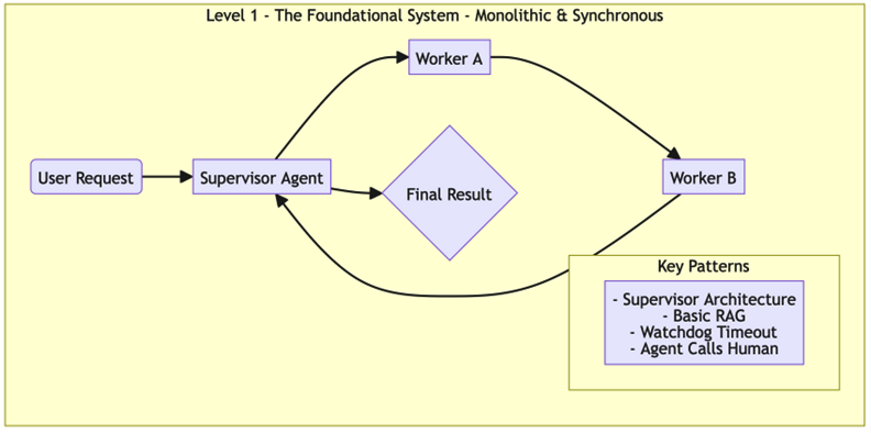
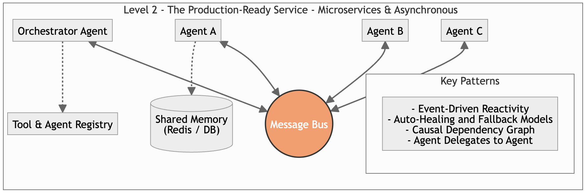
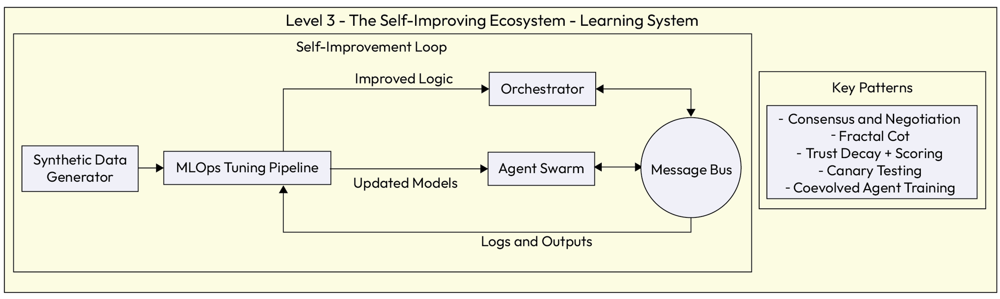

# Chapter 12: A Practical Roadmap: Implementing Agentic Patterns by Maturity Level

## A Practical Roadmap:

Implementing Agentic Patterns by
Maturity Level
In the preceding chapters, we explored a comprehensive pattern language of design and architectural patterns
focused on building agentic AI systems. We covered several categories of patterns: multi-agent coordination,
explainability and compliance, robustness and fault tolerance, human-agent interaction, and the core
capabilities of individual agents. With such a rich toolkit, the natural and most pressing question becomes:
Where do I start?
Implementing every pattern at once is not only impractical but often unnecessary. The key to successfully
deploying gentic AI is progressive adoption, that is, building a solid foundation of essential capabilities and
then layering on more sophisticated patterns as your system's complexity, scale, and responsibilities grow.
This approach provides a vital roadmap: for those who want a simple implementation, they can focus on the
foundational level, while for those who need the highest degree of sophistication, the advanced levels serve as
an encyclopedic reference.
This chapter illustrates that roadmap, synthesizing the patterns discussed throughout Part 2 into three distinct
maturity levels. Note that we have simplified the six levels of agentic AI maturity initially outlined in Chapter 3,
for a more accessible enterprise rollout by mapping 2 levels into one level resulting in basic, intermediate, and
advanced maturity levels
Level 1 - The foundational system (basic maturity): This level details the bare minimum set of
patterns required to build a functional, single-process agentic system that can be deployed in a
production setting. It focuses on getting a reliable proof of concept running to validate the core business
logic.
Level 2 - The production-ready service (intermediate maturity): This level focuses on rearchitecting the foundational system into a decoupled, resilient, and observable set of microservices. It
introduces patterns for scalability, asynchronous communication, and robust fault tolerance.
Level 3 - The self-improving ecosystem (advanced maturity): This level represents the cutting edge
of agentic AI. It incorporates patterns for self-optimization, deep domain specialization, and adaptive
learning, creating a system that not only performs its tasks but actively improves over time.
By following this roadmap, you can strategically select and implement the right set of patterns at the right time,
ensuring your journey into agentic AI is both ambitious and achievable.
Level 1 - The foundational system (basic maturity)
The architectural objective to achieve at this level is to rapidly build and validate the core logic of an agentic
workflow in a single, monolithic, and synchronous application. The objective is to create a functional system
that proves the business value of the agentic approach, even if it is not yet optimized for scale or resilience.
Figure 12.1 illustrates the architecture of a Level 1 system. It depicts a monolithic, synchronous workflow where a
central supervisor agent acts as the sole orchestrator, sequentially delegating tasks to worker gents to produce
a final result. Notice how the architecture xplicitly integrates key "safety net" patterns, such as Watchdog
Timeout and Agent Calls Human, to ensure that even this simple design remains reliable and governable in a
production setting.

*Figure 12.1 – Level 1 patterns*

With this visual lueprint established, let's examine the guiding design philosophy that defines this maturity
level.
Core architectural principle
At this foundational level, the guiding principle is simplicity to enable rapid validation. The primary objective is
to prove the business value of the agentic workflow without the overhead of distributed systems. To achieve
this, the system is built as a single, monolithic application where a central orchestrator synchronously calls
worker agents. This predictable design ensures the system is easy to develop and debug, providing the quickest
path to a functional prototype.
Chapter 12 408
Patterns to implement
To build a oundational system, you should focus on the most essential patterns from each category, including
the following:
## Coordination and Planning (from Chapter 5):

Task Delegation Framework (Supervisor Architecture): This is the natural starting point. A
single, central orchestrator agent is responsible for the entire workflow, providing a clear chain
of command.
Multi-Agent Planning: The orchestrator uses this pattern to perform basic task decomposition,
breaking a user's request into a hardcoded or simple, dynamic sequence of steps.
## Explainability and Compliance (from Chapter 6):

Basic Audit Logging: While a full Causal Dependency Graph may be overkill, every action and
decision must be logged to a file or console with timestamps, agent IDs, and outcomes. This is
the non-negotiable minimum for debugging and accountability.
## Robustness and Fault Tolerance (from Chapter 7):

Watchdog Timeout Supervisor: This is a critical safety net. Wrap all agent calls, especially
those involving external APIs, with a timeout to prevent a single hanging agent from freezing
the entire application.
Simple Retry Mechanism: Implement a basic loop to retry a failed task a fixed number of times.
This handles transient network errors or API blips.
## Human-Agent Interaction (from Chapter 8):

Human Calls Agent: This is the primary input mechanism for transactional, command-based
tasks.
Agent Calls Human: This is the essential safety valve. The system must have a simple, reliable
way to stop and escalate to a human when it encounters a critical error or low-confidence
situation.
## Agent-Level Capabilities (from Chapter 9):

Single Agent Baseline: This defines the structure of your worker agents, each equipped with a
specific set of tools
Agent-Specific Memory (Short-Term): At a minimum, agents need a way to manage the
context of the current session, such as storing the conversation history
Context-Aware Retrieval (Simple RAG): To ground the agent and prevent basic hallucinations,
connect it to a single, core knowledge source via a straightforward RAG pipeline
## System-Level Infrastructure (from Chapter 10):

Agent Authentication and Authorization: Even in a monolithic system, if the agent needs to
access internal APIs or databases, it must do so using a secure service account with clearly
defined, least-privilege permissions
◦
◦
◦
◦
◦
◦
◦
◦
◦
◦
◦
409 A Practical Roadmap: Implementing Agentic Patterns by Maturity Level
Implementation focus
To achieve the rapid validation shown in Figure 12.1, the implementation strategy deliberately trades scalability
for speed and simplicity. Instead of building a distributed network of services, the focus is on creating a selfcontained, executable prototype:
Single-process architecture: As shown in the diagram, the entire workflow-from the Supervisor to
Worker B-should run within a single application or script. This eliminates network latency and
distributed system failures, allowing developers to debug the entire logic flow in a single IDE window.
Hardcoded orchestration: The logic connecting the Supervisor Agent to its workers is static. Unlike
advanced systems that dynamically discover agents via a registry, a Level 1 implementation hardcodes
the relationships (e.g., "If step A is done, call Worker B"). This mirrors the explicit arrows in the
diagram, ensuring the workflow is deterministic and easy to trace.
In-memory state management: Data flowing through the diamond decision nodes and worker gents
does not need complex external databases. State is managed simply by passing a context object (such as
a Python dictionary) between functions. This keeps the architecture flat and removes the overhead of
managing persistent storage during the validation phase.
By accepting these engineering constraints, we trade long-term flexibility for immediate execution. Let's look at
the specific operational characteristics of the system that result from these choices.
Resulting system and consequences
The outcome is a functional but brittle system. It can successfully execute its intended workflow on the "happy
path" and handle the most basic errors. However, it is not scalable, has high latency ue to its synchronous
nature, and would not survive a component crash. Its primary value lies in validating that the agentic workflow
and core reasoning logic can effectively solve the business problem. This proof of value justifies the significant
engineering investment required to re-architect the system for the scale and resilience of Level 2.
These operational bottlenecks (tight coupling and blocking execution) set the stage for the necessary evolution.
To transform this fragile prototype into a robust enterprise asset, we must break the monolith. This necessity
leads us directly to Level 2, where we address these vulnerabilities by re-architecting the system into a set of
resilient, asynchronous microservices.
Level 2 - The production-ready service (intermediate
maturity)
The main objective to reach at this level is to re-architect the foundational prototype into a decoupled, scalable,
resilient, and observable set of asynchronous microservices. The objective is to build production-ready system
that is cost-efficient, secure, and trustworthy enough for real-world business operations.
Note
Many organizations may find that a well-built Level 1 system is sufficient for internal, non-critical
automation tasks. Not every agentic system needs to evolve to the highest levels of maturity.
Note
Chapter 12 410
The following figure describes the transformation from a monolith to a distributed network. The central
message bus replaces direct function calls, acting as the nervous system that enables Event-Driven Reactivity.
Notice that Agent A, Agent B, and Agent C no longer rely on the Orchestrator for every immediate instruction;
instead, they subscribe to relevant events, allowing for asynchronous and parallel execution.

*Figure 12.2 – Level 2 maturity*

This architecture introduces dedicated infrastructure to support this complexity: Tool and Agent Registry
allows the orchestrator to dynamically discover available services (supporting the Agent Delegates to Agent
pattern), while Shared Memory (such as Redis) ensures that state is persisted outside of the individual agents.
This separation ensures that if an agent crashes, it can be auto-healed without losing the context of the ongoing
transaction.
Core architectural principle
At this intermediate level, the guiding principle is decoupling for scalability and resilience. Unlike the
monolithic prototype, a production-ready system must be able to survive component failures and handle
fluctuating loads without collapsing. However, the transition to microservices should be driven by necessity.
Microservices introduce significant operational complexity, so this architectural shift is recommended only
when the monolithic approach no longer meets the system's requirements for scale, fault isolation, or team
velocity.
## When this shift is justified, the architecture relies on three fundamental structural changes:

Asynchronous communication via message bus: Instead of Agent A directly calling Agent B and
waiting for a response (blocking execution), Agent A publishes an event to the central message bus.
Relevant agents subscribe to these events and process them in parallel. This decoupling prevents a
single slow agent from creating a bottleneck that freezes the entire system.
Service isolation: Each agent operates as an independent service (typically containerized). If Agent A
crashes due to a bug or memory leak, Agent B and Agent C remain unaffected. This isolation is what
enables Auto-Healing; the infrastructure can detect the crash and restart the specific failed agent
automatically without bringing down the application.
Externalized state: In Level 1, the application state lived in the script's memory. In Level 2, the state is
pushed to Shared Memory (such as Redis or a database). This ensures that if an agent is restarted, it can
retrieve the current context or task status from the shared store and resume work immediately,
facilitating Incremental Checkpointing.
411 A Practical Roadmap: Implementing Agentic Patterns by Maturity Level
Patterns to implement
This level uilds upon the foundational patterns and introduces more sophisticated solutions, including the
following:
## Coordination and Planning (from Chapter 5):

Hybrid Delegation Framework: The system may evolve to a hybrid model where a top-level
orchestrator delegates tasks to self-organizing swarms or "crews" of agents.
Knowledge Sharing: A simple in-memory state is replaced by a persistent, Shared Epistemic
Memory (e.g., a Redis cache or a dedicated database) that all agents can access. To ensure
production stability, this implementation must include concurrency controls to prevent race
conditions, Time-to-Live (TTL) policies for data hygiene, and semantic indexing to ensure
efficient retrieval.
## Explainability and Compliance (from Chapter 6):

Instruction Fidelity AuditingandPersistent Instruction Anchoring: These are now formally
implemented to prevent instruction drift in more complex, multi-hop workflows
Causal Dependency Graph (from Chapter 7): Basic logging is upgraded to a structured,
auditable graph that traces the full lineage of every decision
## Robustness and Fault Tolerance (from Chapter 7):

Adaptive Retry with Prompt Mutation: Simple retries are enhanced with logic to modify the
prompt on failure.
Auto-Healing Agent Resuscitation and Incremental Checkpointing: The system n now
automatically restart crashed agent services and resume long-running tasks from the last saved
state. To prevent infinite "crash loops" caused by persistent errors, this mechanism must be
governed by exponential backoff strategies and maximum retry thresholds.
Fallback Model Invocation: Provides a business continuity plan for LLM API outages.
Rate-Limited Invocation: Protects downstream APIs and manages costs.
## Human-Agent Interaction (from Chapter 8):

Agent Delegates to Agent: The internal complexity of multi-agent collaboration is now
abstracted away from the user
Agent Calls Proxy Agent: Securely manages all interactions with external, third-party systems
## Agent-Level Capabilities (from Chapter 9):

Advanced RAG: The RAG pipeline is enhanced with techniques such as re-ranking and query
transformation to improve retrieval quality
## System-Level Infrastructure (from Chapter 10):

Tool and Agent Registry: This becomes essential for a microservices architecture, allowing
agents to dynamically discover each other
Event-Driven Reactivity: The entire system is re-architected around a central message bus
(such as Kafka or Google Cloud Pub/Sub), enabling asynchronous, scalable communication
◦
◦
◦
◦
◦
◦
◦
◦
◦
◦
◦
◦
◦
Chapter 12 412
Implementation focus
To build the architecture we introduced in Figure 12.2, the implementation focus shifts from writing logic to
engineering infrastructure. The goal is to create an environment where the decoupled components can operate
## reliably at scale:

Containerization (Docker): As depicted in the diagram, Agent A, Agent B, and Agent C are distinct
entities. In practice, each agent is packaged into its own container with its specific dependencies (e.g.,
Python libraries, drivers). This isolation prevents "dependency hell" and ensures that an update to
Agent A's environment does not inadvertently break Agent B.
Orchestration (Kubernetes): Managing dozens of independent containers requires an orchestrator.
Kubernetes serves as the invisible hand that manages the life cycle of the agents in the diagram. It
handles auto-healing (detecting whether Agent B crashes and restarting it automatically) and
horizontal scaling (spinning up multiple copies of Agent C if the load increases), ensuring the resilience
promised by this maturity level.
Event infrastructure (message bus): The central circle in Figure 12.2 represents the implementation of
a robust message broker such as Apache Kafka, RabbitMQ, or Google Cloud Pub/Sub. The
implementation focus here is on defining clear topics and schemas so that agents can publish and
subscribe to events without knowing who is on the other end, enabling true Event-Driven Reactivity.
Infrastructure as Code (IaC) and CI/CD: Because the system is no longer a single script, manual
deployment is risky and unscalable. Implementation at this level requires defining the infrastructure
(registry, Redis, or message bus) using tools such as Terraform and stablishing CI/CD pipelines. This
allows individual agents to be updated, tested, and deployed independently, minimizing the risk of
system-wide regressions during updates.
The shift to this distributed model solves the fragility issues of Level 1, but it introduces new dynamics in how
the system operates and fails.
Resulting system and consequences
The system is now a robust, observable, and secure production service. It can scale to handle real-world load,
recover from common failures, and be maintained by an operations team. The consequence of this resilience is a
significant increase in architectural complexity. Managing a distributed system of dozens of specialized
microservices requires a mature DevOps and MLOps culture.
However, stability is not the same as intelligence. A Level 2 system, for all its robustness, remains static: it
executes the same logic tomorrow as it did today. To unlock the true transformative potential of agentic AI, we
must move beyond mere execution to adaptation. This brings us to the final frontier of maturity, where we
transform our stable architecture into a dynamic engine of continuous learning.
Level 3 - The self-improving ecosystem (advanced
maturity)
At this level, the main architectural objective is to evolve the production-ready service into a state-of-the-art,
self-improving system that develops deep domain expertise and optimizes its own performance through
automated feedback loops and strategic analysis.
413 A Practical Roadmap: Implementing Agentic Patterns by Maturity Level
The following diagram illustrates the transition from a static execution engine to a cyclic learning machine.
Unlike the linear flows of previous levels, this architecture is dominated by the self-improvement loop. Notice
how logs and outputs are not just stored for audit (as in Level 2) but are piped back into an MLOps tuning
pipeline. This pipeline uses synthetic data generators to augment real-world experience, creating a rich training
dataset that produces updated models and improved logic. These improvements are then continuously
deployed back to the orchestrator and agent swarm, ensuring the system gets smarter with every transaction.

*Figure 12.3 – Level 3 patterns*

With this closed-loop architecture in mind, let's examine the guiding principle that makes this evolution
possible.
Core architectural principle
The core principle here is self-optimization. The system is no longer static; it is a ynamic, learning ecosystem.
It is designed not only to perform its tasks but also to measure its own performance, learn from its successes and
failures, and adapt its behavior to become more effective and efficient over time.
To achieve this state of autonomous improvement, the architecture relies on three fundamental pillars:
Closed-loop learning: The architecture is designed to capture its own outputs-both successes and
failures-and use them as training data. By integrating MLOps tuning pipelines directly into the
runtime, the system can fine-tune its models (using patterns such as Coevolved Agent Training) to
adapt to shifting data distributions without manual engineering intervention.
Emergent coordination: Instead of relying solely on top-down orchestration, agents are mpowered
with "social" skills. Patterns such as Consensus & Negotiation allow the Agent Swarm to resolve
ambiguity nd resource conflicts autonomously, reducing the burden on the central orchestrator and
enabling the system to handle novel, undefined scenarios.
Safe evolution: Because the system changes dynamically, stability is managed through rigorous
automated testing.Canary Testing and Trust Decay ensure that "improved" logic is validated against
real-world performance metrics before being fully trusted, preventing regression as the system evolves.
Chapter 12 414
Patterns to implement
This level introduces the most advanced patterns, focused on learning, strategic evaluation, and complex
## collaboration, including the following:

## Coordination and Planning (from Chapter 5):

Consensus, Negotiation, andConflict Resolution: The system now has the "social" skills to
handle ambiguity and disagreement autonomously. Agents can debate conflicting data,
negotiate for resources, and resolve conflicting plans without needing a top-down directive.
## Explainability and Compliance (from Chapter 6):

Fractal CoT Embedding: Agents use this advanced reasoning pattern for recursive selfcorrection, enabling them to catch their own logical flaws and revise their plans based on new
evidence
## Robustness and Fault Tolerance (from Chapter 7):

Majority Voting Across Agents: For the most critical decisions, a panel of agents is used to
achieve extreme reliability
Trust Decay and Scoring: The orchestrator implements a reputation system to adaptively route
tasks to the most reliable agents
Canary Agent Testing: New agent versions are deployed safely into production without risking
system stability
## Agent-Level Capabilities (from Chapter 9):

Agentic RAGandGraph-Vector Hybrid Retrieval: The system builds and maintains its own rich
knowledge graph, combining it with vector search for state-of-the-art domain expertise
## Continuous Improvement and Tuning (from Chapters 3 and 14):

Hybrid Workflow Agent Architecture (Planner + Scorer): The system uses a generatorevaluator pairing to create and vet its own workflows
Coevolved Agent Training: The planner and scorer agents are improved in tandem using a mix
of SFT, DPO, and iterative learning
Preference-Controlled Synthetic Data Generation: To prevent runaway divergence or collusion,
where agents reinforce shared biases or drift into satisfying each other's quirks rather than the
business objective, this generation process requires strict offline evaluation benchmarks and
periodic human-in-the-loop validation
Custom Evaluation Metrics: Domain-specific metrics (such as the STEPScore) are developed
to measure workflow quality accurately
◦
◦
◦
◦
◦
◦
◦
◦
◦
◦
415 A Practical Roadmap: Implementing Agentic Patterns by Maturity Level
Implementation focus
To realize the self-improving cycle shown in Figure 12.3, the engineering focus shifts from application logic to
building a sophisticated MLOps and DataOps infrastructure. The goal is to close the loop between execution
## and training without requiring manual intervention:

Automated data synthesis: As depicted by the Synthetic Data Generator box on the left of the
diagram, the system cannot rely solely on organic user data, which is often sparse or noisy.
Implementation requires building pipelines where planner agents generate scenarios and scorer agents
label them, creating a clean dataset to fuel the learning process.
Continuous tuning pipelines: The MLOps Tuning Pipeline is the engine of this architecture. Unlike
Level 2, where models are static assets, this level requires infrastructure (such as Kubeflow or Vertex AI
Pipelines) that can automatically ingest data, trigger fine-tuning (SFT) or DPO jobs, and produce
updated models.
Feedback loop integration: The arrow flowing from Logs & Outputs back into the pipeline represents
the critical data engineering challenge: transforming raw execution logs into structured training
examples. This requires implementing Custom Evaluation Metrics (such as the STEPScore) to
programmatically grade agent performance and signal the tuning pipeline on what to reinforce.
Safe model promotion: The arrow moving from Updated Models to the Agent Swarm implies a robust
deployment strategy. Implementation here requires Canary Testing infrastructure to automatically
evaluate the new model against a control group before allowing it to take over full production traffic.
This architecture transforms the system from a static utility into an asset that increases in value over time.
Resulting system and consequences
The outcome is a state-of-the-art system that acts as a dynamic, evolving expert for its domain. It not only
provides accurate answers but also improves its own capabilities, hardens its defenses, and can demonstrate its
strategic value through business-aligned metrics. The cost of this sophistication is extreme complexity and a
significant, ongoing investment in the infrastructure and expertise required to maintain the automated
knowledge creation and training loops.
Your agentic roadmap: A strategic reflection guide
You have now seen the roadmap from a simple, foundational system to a complex, self-improving osystem.
This model provides the what, a catalog of possibilities and patterns. The most important step, however, is to
translate this map into a concrete plan for your own project, that is the how and the when.
The following section is designed to facilitate that translation, moving you from architectural theory to strategic
action. Think of it not as a test but as a structured conversation with your team to chart the course for your
agentic system's evolution.
Chapter 12 416
The journey begins: Where are you today?
To successfully navigate this roadmap and chart your specific course, you must first determine your starting
location. Every successful agentic system begins with an honest assessment of its current state nd immediate
goals. Start by asking your team: Is this a brand-new, exploratory proofofconcept or are we trying to scale an existing,
perhaps brittle, automation system? The answer will fundamentally shape your next steps.
Your primary business objective for the near term is your compass. Are you trying to simply validate that an
agentic workflow can solve a specific problem? If so, your focus is squarely on Level 1.
Or is the goal to build a resilient, scalable service that can handle real-world load? This points you toward Level
2.
Perhaps you are at the cutting edge, and the objective is to create a self-improving expert that becomes a durable
competitive advantage. This is the ambitious path to Level 3.
Finally, consider your team's current expertise. Are you fluent in distributed systems and MLOps or is this a new
frontier? Honesty here will prevent you from over-architecting a system that you cannot maintain.
The outcome of this initial reflection is a clear identification of which maturity level best describes your
immediate, practical goal. This defines the scope for your initial or next implementation, ensuring you solve the
right problem for right now.
Laying the foundation: What is your minimum viable agent?
Once you have identified your starting point and strategic destination, the next step is execution. If your
ssessment placed you at Level 2 or 3, you might be tempted to immediately provision complex microservices or
orchestration swarms. However, successful agentic engineering requires a discipline of progressive validation.
Regardless of your ultimate target, the development life cycle of a new agentic workflow should begin by
establishing a Level 1 foundational system as a validation step. Think of this not necessarily as your final
architectural destination but as the minimum viable agent (MVA) phase of your engineering process. Even
sophisticated engineering teams use this phase to isolate and perfect the agent's reasoning logic, tool
interactions, and safety guardrails within a controlled, monolithic environment before adding the complexity of
distributed systems.
Resist the urge to over-engineer the initial logic. Ask your team: What is the simplest possible version of this system
that proves our core business logic works?
Can the workflow be managed by a single Supervisor Architecture to start? This allows you to debug cognitive
errors and prompt logic before introducing the latency and tracing challenges of a distributed architecture.
From there, focus on the most critical risks. If the agent calls an external API, a Watchdog Timeout is not a
luxury; it's a necessity. If the system could get stuck in a state of ambiguity, a safe Agent Calls Human escape
hatch is non-negotiable.
By validating your patterns at this foundational level first, you ensure that when you do scale to Level 2 or 3, you
are scaling a system that is already fundamentally functional and safe.
417 A Practical Roadmap: Implementing Agentic Patterns by Maturity Level
Building for scale: What is your path to production?
A successful Level 1 prototype inevitably creates demand for more - more users, more features, more agents.
This is when the limitations of a simple, monolithic architecture become apparent. The path to a productionready Level 2 service is a deliberate re-architecture focused on resilience and scale.
Start this phase by identifying the specific triggers that will necessitate this evolution. Will it be a certain
number of daily users? Is it the need to add more than three or four specialized agents? Or is it a requirement for
long-running, asynchronous processing that a simple script cannot handle? Having these triggers defined in
advance turns the decision to scale from a reactive panic into a planned event.
Next, prioritize which Level 2 patterns will be most critical for your system's reliability. If uptime is the most
important metric, patterns such as Auto-Healing Agent Resuscitation and Fallback Model Invocation are your
top priorities. If real-time responsiveness is key, then architecting around an Event-Driven Reactivity model
with a central message bus is essential. As you envision adding more specialized agents, the question of
discovery becomes paramount, leading you irectly to planning for a Tool and Agent Registry.
This reflection provides a strategic plan that outlines not just what you will build but when and why you will
need to invest in a more complex, microservices-based architecture to meet growing demand.
Reaching for autonomy: What is your North Star?
Not every system needs to reach the zenith of agentic maturity, but understanding what is possible can inform
your long-term strategy and prevent you from making early architectural decisions that block future innovation.
This is the stage of envisioning your Level 3 system-your North Star.
Ask the big question: Does our core business problem require the system to learn and adapt over time to be truly
effective? If the answer is yes, then a path to Level 3 is a strategic necessity. What would a "self-improving"
version of your system look like? Would it learn from implicit user feedback to personalize its responses? Would
it automatically A/B test different workflows to find the most efficient path? This vision will point you toward
advanced patterns such as Trust Decay and Scoring and Coevolved Agent Training.
Finally, consider the stakes. Are individual decisions made by the system so critical that a single error could have
major consequences? If so, the high cost and complexity of advanced patterns such as Consensus and Majority
Voting are not just justified; they are a requirement for building a trustworthy system.
This long-term vision for your agentic system will guide your strategic investments and ensure your
architecture remains adaptable enough to incorporate the rapid advancements that are sure to come.
Roadmap summary table
The following table provides a condensed summary of this strategic guide. Use it as a quick reference to align
## your project's goals with the key decisions and patterns at each level of maturity:

Chapter 12 418
Maturity level Strategic focus Key
architectural
decisions
Critical patterns
to consider
Key question for
your team
Level 1 -
Foundational
Validate the
concept
Monolithic versus
microservices
Synchronous
versus
asynchronous
Supervisor
Architectu
re
Watchdog
Timeout
Agent
Calls
Human
Basic RAG
"What is the
simplest version of
this that works
safely and proves
the value?"
Level 2 -
Production-ready
Achieve stability
and scale
Centralized versus
decentralized
Stateful versus
stateless services
EventDriven
Reactivity
AutoHealing
Tool and
Agent
Registry
Causal
Dependen
cy Graph
"How will this
system handle 10x
the load and
recover from
failure without
human
intervention?"
Level 3 - Selfimproving
Enable learning
and adaptation
Static versus
dynamic
workflows
Rule-based versus
learned behavior
Consensu
s and
Negotiatio
n
Fractal
CoT
Trust
Decay and
Scoring
Coevolved
Agent
Training
"Does our business
gain a competitive
advantage if this
system learns and
adapts on its
own?"
Table 12.1 - A strategic summary for implementing agentic patterns
419 A Practical Roadmap: Implementing Agentic Patterns by Maturity Level
By deliberately walking through this reflection process, you can transform a comprehensive pattern language
from a catalog of options into a concrete architectural blueprint, one that is tailored to your unique needs,
resources, and ambitions.
## Summary

This chapter provided a crucial bridge between the theoretical knowledge of individual design patterns and the
practical reality of building a complete agentic system. We addressed the fundamental question of "Where do I
start?" by introducing a strategic, three-level maturity model that serves as a practical roadmap for
implementation. This approach allows organizations to adopt agentic AI progressively, aligning architectural
complexity with their specific business goals and operational readiness.
We began by defining Level 1, the foundational system, which focuses on simplicity and speed to value. By using
a monolithic, synchronous architecture and a core set of patterns such as Supervisor Architecture and
Watchdog Timeout, this level allows for the rapid validation of an agentic workflow's core logic in a safe,
understandable manner.
Next, we detailed the path to Level 2, the production-ready service. This stage involves a deliberate rearchitecture of the foundational system into a decoupled, resilient, and scalable set of microservices. By
embracing patterns such as Event-Driven Reactivity, Auto-Healing Agent Resuscitation, and Tool and Agent
Registry, this level creates a robust, observable, and trustworthy system fit for real-world business operations.
Finally, we explored the cutting edge with Level 3, a self-improving ecosystem. This advanced stage introduces
patterns for deep domain specialization and autonomous learning, such as Consensus and Negotiation for
complex collaboration and Coevolved Agent Training for continuous self-optimization. This level represents
the transformation of an agentic application from a static tool into a dynamic, learning partner.
## The key takeaways from this chapter are as follows:

Adopt progressively: Building a sophisticated agentic system is a journey, not a single step. Start with
the simplest architecture that delivers value and layer on complexity intentionally as the system's needs
evolve.
Align architecture with goals: Your choice of patterns should be a direct reflection of your strategic
objectives-whether that is to validate a concept, achieve production stability, or create a selfimproving asset.
Strategy precedes implementation: Before writing a single line of code, the strategic reflection guide
encourages you to ask the critical questions that will define your project's scope, architecture, and longterm vision.
With this strategic roadmap in hand, you are now equipped not just with the individual blueprints (the
patterns) but with a comprehensive plan for construction. To bring all of this to life, the following chapters will
move from architectural theory to practical application, demonstrating how these patterns and maturity levels
come together to solve real-world business problems in our detailed use cases.
Chapter 12 420
Subscribe for a free eBook
New frameworks, evolving architectures, research drops, production breakdowns-AI_Distilled filters the noise
into a weekly briefing for engineers and researchers working hands-on with LLMs and GenAI systems. Subscribe
now and receive a free eBook, along with weekly insights that help you stay focused and informed.
Subscribe at https://packt.link/8Oz6Y or scan the QR code below.
421 A Practical Roadmap: Implementing Agentic Patterns by Maturity Level