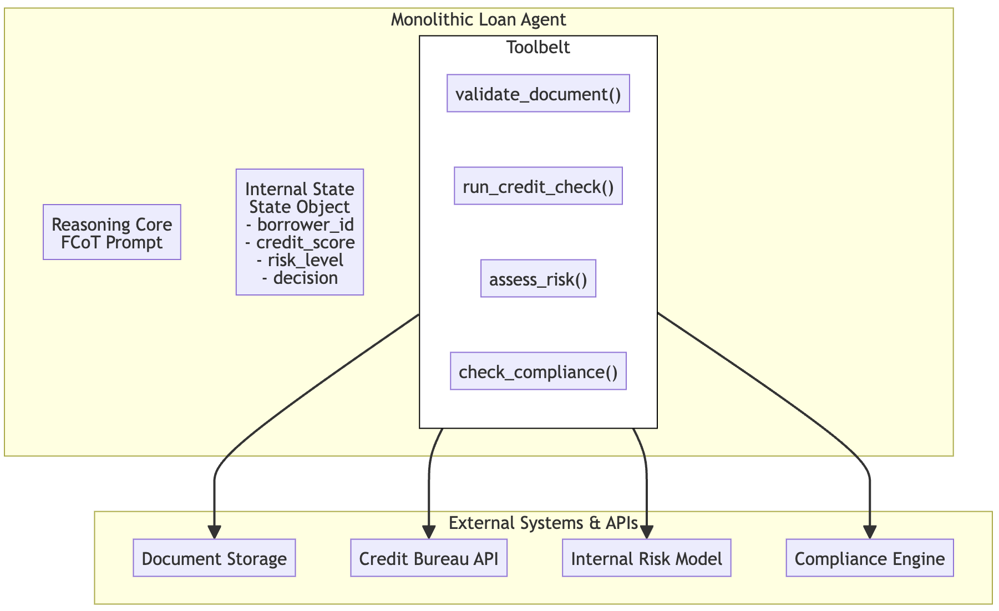

# Chapter 13: Use Case: A Single Agent for Loan Processing

Use Case: A Single Agent for Loan
Processing
In the preceding chapters, we have studied the foundational concepts of agentic AI, from the core anatomy of an
agent, its key components and interactions, to the architectural patterns that enable it to perform complex tasks
at various levels of sophistication as required by business or application need. We established a maturity model
to guide the level of sophistication required for each stage of development and explored the design patterns that
provide the blueprints for robust and scalable agentic systems. Now, it is time to transition from theory to
practice.
In this chapter we will begin our hands-on implementation, where we will build a complete agentic system to
solve a real-world business problem: automating a loan origination pipeline. To provide the most valuable
learning experience, we will tackle this challenge in two distinct phases, spanning this chapter and the next.
First, we will construct the entire system using a single, monolithic agent. Through this exercise, you will learn
how to implement the Fractal Chain of Thought (FCoT) approach and pattern that we will use to structure the
agent's reasoning and how to define a robust toolbelt that allows it to interact with the world. This will allow us
to achieve initial success and demonstrate the core value of an agent-based approach.
However, we will not stop here at prototyping a solution: we will use this initial implementation to deliberately
expose the architectural strains/possible shortcomings inherent in a single-agent design, specifically
highlighting issues of cognitive overload and fault isolation when faced with production-level complexity. By
identifying these specific "cracks in the foundation," we lay the necessary groundwork for Chapter 14, where we
will re-architect this system using a more robust, maintainable, and scalable multi-agent approach.
In this chapter, we'll be covering the following topics:
The challenge: a high-stakes workflow
Guiding the agent's mind using the FCoT framework
Designing a monolithic agent
Building the agent in a Colab notebook
Execution and analysis
Moving from Level 5 to 6: a roadmap for improvement
Technical requirements
To successfully complete the hands-on examples in this chapter, you will need the following:
A Google account: This is required to access Google Colab and Google AI Studio.
Google Colab: The code examples are designed to run in a Google Colab notebook, which provides a
free, cloud-based Python environment. The examples are lightweight, so you do not need highperformance local hardware; a standard web browser will suffice.
Google AI Studio API key: You will need a valid API key to access the Gemini models used in the agent
examples. You can obtain a key by following the documentation here: https://ai.google.dev/
gemini-api/docs/api-key.
Python libraries: The examples rely on the google-adk library and other standard Python packages.
We selected Google Agent Development Kit (ADK) for this implementation because it offers a
production-first architecture that natively supports the structured reasoning and strong typing
required for the FCoT pattern. The notebook includes the necessary commands to install these
dependencies directly within the environment.
The complete code for this chapter, including the runnable notebooks and helper scripts, is available in the
book's GitHub repository: https://github.com/PacktPublishing/Agentic-ArchitecturalPatterns-for-Building-Multi-Agent-Systems/tree/main/Chapter_13.
The challenge: a high-stakes workflow
A loan origination pipeline is an ideal use case for an agentic system because it is not a single task, but a
sequence of complex stages, each with its own logic, data requirements, and potential for failure. To appreciate
the challenge, let's break down the typical workflow.
Stage Description Key challenge for automation
1. Document intake and validationReceiving the application and
ensuring that all supporting
documents (e.g., income
verification) are complete and
valid
Note: All relevant documents have
been provided; we will not deal
with the actual intake, OCR, etc.,
in this example.
Handling various document
formats, identifying missing
information, and applying
business rules for completeness
Chapter 13 424
Stage Description Key challenge for automation
2. Credit check Interacting with external credit
bureau APIs to pull the borrower's
credit history and score
Securely handling credentials,
parsing varied API responses, and
gracefully handling network errors
or API downtime
3. Risk assessment Applying internal business logic
and dynamic risk-scoring models
based on all gathered financial
data
Executing complex, often nonlinear logic that synthesizes
multiple data points (not just a
simple if/then rule)
4. Compliance review Auditing the process to ensure that
it heres to all relevant
regulations, such as the Equal
Credit Opportunity Act (ECOA)
Maintaining an auditable trail of
the decision-making process and
ensuring no protected attributes
influenced the outcome
5. Final decision and generationSynthesizing all information to
make a final approve/deny
decision and generating the
necessary documentation
Creating a coherent, humanreadable justification for the
decision based on the entire
preceding workflow
Table 13.1 - Stages of a loan origination workflow
Attempting to automate this with traditional scripts would create a brittle, hard-to-maintain system.
Traditional automation relies on rigid, predefined rules that break easily when faced with unstructured data,
such as varying document formats or ambiguous applicant details. To handle every possible exception,
developers would need to write and maintain an endless web of if/then logic, which quickly becomes
unmanageable. Instead, the workflow requires dynamic reasoning to handle exceptions gracefully, structured
planning to adapt execution steps based on context, and the ability to generate a clear, auditable trail for its
decisions. This is where agentic AI shines.
Guiding the agent's mind using the FCoT framework
To ensure that our agent operates with the rigor required for this financial task, we will equip it with a
sophisticated ognitive framework built upon the Fractal Chain-of-Thought (FCoT) approach and pattern. We
will initially craft a prompt that embodies the principles of FCoT. This FCoT prompt will act as the agent's
internal "operating system," providing a formal structure for its mission, constraints, and reasoning process. It
is the constitution that will govern the agent's actions.
In complex, multi-step business processes such as our loan origination workflow, simpler agents often suffer
from goal drift, a behavioral failure where the agent gradually deviates from its original objective s the task
progresses. This drift is frequently caused by a well-documented technical limitation known as the "lost in the
middle" phenomenon, where LLMs struggle to recall critical constraints or instructions buried deep within a
long context window. The FCoT pattern is a powerful technique designed specifically to combat both issues by
425 Use Case: A Single Agent for Loan Processing
enforcing a rigid, self-correcting structure on the agent's reasoning, ensuring that it constantly refers back to its
core mission and constraints regardless of the context length.
Conceptually, the FCoT pattern is composed of two primary elements, which we will implement in our agent's
instructions:
First is the instruction contract (IC), which serves as the agent's immutable source of truth. It formally
defines the agent's mission, the exact deliverables it must produce, and the safety and compliance
guardrails it must never violate.
The second lement is the recursive loop, which defines the agent's active thinking process. This
structure compels the agent to iterate through cycles of planning its actions, executing them, and most
importantly, verifying its work and reasoning against the IC at every stage.
When we build our agent's mind around using our FCoT approach, implemented by the FCoT pattern, we are
laying a foundation for reliable and auditable behavior. With this cognitive core in mind, we can now move on
to defining the high-level architecture for our monolithic system.
Designing a monolithic agent
After we have ined the business problem and the sophisticated FCoT framework that will guide our agent's
reasoning, we can proceed with its architectural design. For this first implementation, we will adopt a
monolithic approach. This means a single, highly capable agent will be responsible for executing the entire loan
origination workflow from start to finish.
This design pattern is common in the initial stages of agentic development (reflecting Level 3 of our Agentic AI
Levels). While the preceding chapters focused on foundational capabilities such as prompting and basic
workflows (Levels 1 and 2), we are now stepping up to full agentic autonomy through introspective reasoning
and self-correction. This approach concentrates all the logic, tools, and state management into one centralized
component. The agent's primary task is to follow its internal FCoT prompt, sequentially invoking the right tools
at the right time to move the loan application through the pipeline.
## Our monolithic agent will be composed of three essential parts:

The FCoTreasoning core: The FCoT prompt we introduced in the previous section will serve as the
agent's "brain."
State management: The gent needs a way to track the status of the loan application as it progresses.
Runner and SessionService in ADK will handle this for us.
The toolbelt: To interact with the outside world, the agent requires a toolbelt, which is a collection of
functions it can call.
The overall architecture is straightforward: the agent, guided by its FCoT core, uses its tools to gather and
process information until it can make a final decision.
Chapter 13 426


*Figure 13.1 – Architectural diagram of the monolithic loan processing agent*

With our architectural blueprint and cognitive framework in place, we are ready to translate these concepts into
working code. In the following sections, we will build this monolithic agent step by step using Python and
Google ADK. We will begin by setting up the environment, defining our specialized tool functions, configuring
the agent's FCoT instructions, and finally, executing test scenarios to verify its performance.
Building the agent in a Colab notebook
We will now implement our monolithic loan processing agent using Google ADK in a Jupyter/Colab Notebook
format. This will provide a clear, step-by-step, and runnable example.
## Before writing any code, we need to initialize our development environment:

Navigate to Google Colab (colab.research.google.com).
Click on File | New notebook.
(Optional) Rename the notebook to Chapter13_Monolithic_Agent.ipynb.
Once your environment is ready, the first step is to install the necessary libraries and import the required
modules. Copy the following code into the first cell of your notebook and run it.
Setup and dependencies
## The first step is to install the necessary libraries and import the required modules:

#@title Install dependencies
!pip install google-adk
#@title Imports
1.
2.
3.
427 Use Case: A Single Agent for Loan Processing
from google.adk.planners import BuiltInPlanner
from google.adk.agents.llm_agent import LlmAgent
from google.adk.tools import FunctionTool
from google.adk.planners import BuiltInPlanner
from google.adk.runners import Runner
from google.adk.sessions import InMemorySessionService
from google.genai import types
from google.genai.types import ThinkingConfig
```python
import os
import time
import random
import uuid #
```

Let's briefly look at the key components we are importing, as they map directly to the agent anatomy we defined
earlier:
LlmAgent: The core class representing our agent. It brings together the model, instructions, and tools
into a cohesive unit.
BuiltInPlanner and ThinkingConfig: These components power the agent's reasoning core. The
planner manages the execution loop, while the configuration allows us to enable and control the
agent's internal thought process for observability.
FunctionTool: The wrapper that turns our standard Python functions into a toolbelt that the agent can
understand and invoke.
RunnerandInMemorySessionService: These handle the state management and execution life cycle,
managing the conversation history and context for our user session.
Standard libraries (os, time,random, anduuid): We use these to manage API keys, simulate latency in
our tools, generate mock data, and create unique session identifiers.
You will also need to set up an API key. In this case, we are going to use a Google AI Studio API key; in production
## systems, we recommend using Google Vertex AI:

```python
from getpass import getpass
GEMINI=getpass("Enter your GEMINI API KEY: ")
os.environ["GOOGLE_API_KEY"]=GEMINI
print(f"Google API Key set: {'Yes'ifos.environ.get('GOOGLE_API_KEY') and
os.environ['GOOGLE_API_KEY']!= 'YOUR_GOOGLE_API_KEY'else'No (REPLACE PLACEHOLDER!)'}")
model= "gemini-3flash"
Chapter 13 428
When building your own agents, we strongly recommend checking for the latest available models to ensure that
```

you are using the most capable and efficient version. You can find the current list of available models in the
Google AI Studio documentation: https://ai.google.dev/models/gemini.
Now, let's define the tools that will be used by our agent.
Defining the tools
An agent's ability to reason is only as powerful as its ability to act. The toolbelt is the critical component that
bridges the agent's cognitive processes to the real world, allowing it to perform tasks, gather information, and
effect change.
In this specific implementation, we will equip our agent with four specialized tools designed to simulate the key
## stages of the loan origination workflow:

validate_document: Simulates the document intake process by checking whether the required
document IDs are present in the application.
run_credit_check: Simulates a request to a credit bureau. It returns a realistic credit score and report
summary, using a short delay (time.sleep()) to mimic real-world network latency.
assess_risk: Simulates the bank's internal underwriting logic, determining a risk level (low, medium, or
high) based on the credit score and loan amount.
check_compliance: Simulates a regulatory audit, verifying that the risk assessment and decisionmaking process adhere to fair lending guidelines.
By implementing these as simple Python functions with mock data, we can create a fully functional, selfcontained example. This allows us to focus entirely on the agent's orchestration and reasoning logic without the
complexity of managing live API keys or external service dependencies.
Note
We use the gemini-3-flash model in these examples for its speed and cost-efficiency, which is ideal for
learning and experimentation. However, the landscape of LLMs is evolving rapidly.
Note
Production note
In a real-world deployment, these function signatures would remain largely the same, but their internal
logic would change. Instead of returning mock strings, they would act as wrappers for complex
operations, calling internal document management systems, third-party APIs, or communicating with
other services via the Model Context Protocol (MCP).
Note
429 Use Case: A Single Agent for Loan Processing
Here, we define our four specialized tools as Python functions and then wrap them in ADK's FunctionTool class.
## This wrapper makes the function's description and parameters available to the agent's LLM core:

#@title Tools Definition
```python
# --- Tool 1: Document Validation ---
```

defvalidate_document(document_ids: list[str]) -> dict:
"""
Validates if the required application documents are present and complete.
Use this first to ensure the application is ready for processing.
Returns a status of 'validated' or 'incomplete'.
"""
print("--- Tool Called: validate_document() ---")
time.sleep(1)
## ifnot document_ids orlen(document_ids) < 2:

return {"status": "incomplete", "missing_docs": ["income_proof", "id_proof"]}
return {"status": "validated"}
validate_document_tool = FunctionTool(func=validate_document)
```python
# --- Tool 2: Credit Check ---
```

defrun_credit_check(borrower_id: str) -> dict:
"""
Retrieves a borrower's credit score by calling the credit bureau API.
This should be done after documents are validated.
"""
print(f"--- Tool Called: run_credit_check(borrower_id='{borrower_id}') ---")
time.sleep(2)
## if borrower_id == "Borrower-400":

score = 450
report_summary = "Credit history is compromised."
else:
score = random.randint(750, 850) # Simulate a good credit score
report_summary = "Credit history is clean."
return {"credit_score": score, "report_summary": report_summary}
run_credit_check_tool = FunctionTool(func=run_credit_check)
```python
# --- Tool 3: Risk Assessment ---
```

defassess_risk(credit_score: int, loan_amount: float) -> dict:
"""
Assesses the risk of a loan application based on the borrower's credit score.
Returns a risk level of 'low', 'medium', or 'high'.
Chapter 13 430
"""
print(f"--- Tool Called: assess_risk(credit_score={credit_score},...) ---")
time.sleep(1.5)
## if credit_score > 740:

return {"risk_level": "low", "details": "High credit score indicates low risk."}
else:
return {"risk_level": "high", "details": "Low credit score indicates high risk."}
assess_risk_tool = FunctionTool(func=assess_risk)
```python
# --- Tool 4: Compliance Check ---
```

defcheck_compliance(risk_level: str) -> dict:
"""
Performs a final compliance check on the process to ensure it adheres
to Fair Lending guidelines before making a final decision.
"""
print(f"--- Tool Called: check_compliance(risk_level='{risk_level}') ---")
time.sleep(1)
return {"compliance_status": "pass", "details": "Process adheres to guidelines."}
check_compliance_tool = FunctionTool(func=check_compliance)
Next, let's configure our agent's system instructions.
Configuring the agent's mind
With the tools ready, we can assemble the agent itself. A critical part of this is defining the agent's instructions.
The following prompt is much more than a simple set of commands; it is a direct implementation of the FCoT
pattern, which serves as the master pattern for the agent's entire reasoning process.
Production tip: Strong typing for data contracts
In this example, we use simple Python dictionaries for tool outputs to keep the code accessible and
focused on the agent's logic. However, in a real-world financial system, strongly typed data structures are
essential for reliability.
When building for production, consider using libraries such as Pydantic to define rigorous data models
(e.g., class RiskAssessmentResult(BaseModel)). This enforces schema validation, prevents data type
errors, and serves as a strict "data contract" between your agents, ensuring that downstream
components always receive exactly the data structure they expect.
Tip
431 Use Case: A Single Agent for Loan Processing
## Let's dissect this prompt to see how FCoT and other crucial design patterns are put into practice:

#@title Agent Instructions
agent_instructions = """
You are an FCoT reasoner orchestrating and verifying agent activity for an Agentic Loan
Origination Pipeline built with Google ADK and Google Gemini.
## INSTRUCTION CONTRACT (IC)

- Mission: Originate, evaluate, and approve a loan with full policy compliance, factual
grounding, and fairness.
- Deliverables: JSON + Narrative summary containing:
-- (a) borrower profile
-- (b) creditworthiness decision
-- (c) justification citing verified data
-- (d) compliance audit record
-- (e) explainability report.
- Success Criteria:
- Accuracy ≥ 95% vs gold truth (financial data).
- Policy compliance = 100%.
- Explainability coverage ≥ 90%.
- Latency < 5 min end-to-end.
- Hard Constraints:
- No personally identifiable data in logs.
- Must follow Fair Lending & ECOA regulations.
- All numerical fields validated from authoritative sources.
- Safety Policy:
- Reject speculative or hallucinated data.
- Never fabricate borrower details.
- Defer ambiguous cases to Human-in-the-Loop agent.
- IC-Fingerprint: LOAN-FCoT-v3-Δ0710
FCoT RECURSIVE LOOP (N = 3)
## Iteration 1 (Planning):

- RECAP: Echo IC-FP, map subtasks (data ingest, credit scoring, compliance, document).
- REASON: Design DAG of actions; choose retrieval sources; initialize PoF ledger.
- VERIFY: Ensure all subtasks preserve IC clauses.
Chapter 13 432
## Iteration 2 (Execution):

- RECAP: IC-FP; execute tools for credit scoring & data validation.
- REASON: Compute risk score, validate data sources against policy.
- VERIFY: Check causal alignment between borrower attributes and decision logic.
## Iteration 3 (Verification & Explainability):

- RECAP: IC-FP; collect deliverables, run RAG verifier.
- REASON: Summarize SHAP values, create narrative justification.
- VERIFY: Evaluate coherence vs IC and dual objectives.
"""
Pattern insight: Semantic guardrails versusprogrammatic evaluation
You might notice the success criteria (e.g., Latency < 5 min) and deliverables listed in the prompt. A
common question is: Does the Python code enforce this?
In this Level 3 monolithic design, these are semantic guardrails. They are not external Python assertions
but instructions for the LLM's internal reasoning ngine. By explicitly listing Accuracy and Policy
compliance as success criteria, we force the model to consider these factors during its VERIFY steps in
the FCoT loop.
Ideally, the model uses these instructions to self-correct (e.g., "I need to be concise to keep latency low").
In a Level 5 or production system, we would pair these prompts with a real external evaluation harness
(using tools such as DeepEval or Ragas) to programmatically enforce these metrics, moving from incontext verification to system-level governance.
Pattern insight: cognitive control versus code control
The instruction FCoT RECURSIVE LOOP (N = 3) is a prime example of cognitive architecture.
It is important to note that N=3 is not a Python parameter passed to BuiltInPlanner. Instead, it is a
semantic instruction to the LLM to iterate over three repetitions. We are effectively programming the
model in English, directing it to structure its internal reasoning process into three distinct iterations
(planning, execution, and verification), each with its own objective functions, before considering the task
complete.
While the Python code (thinking_budget=1024) sets the resource limits (how many tokens it can use),
the prompt defines the algorithm (how it should use them).
Concept note: Explainable AI (XAI) and SHAP
In Iteration 3, in the section REASON: Summarize SHAP values, create narrative justification,
you will notice the instruction refers to SHapley Additive exPlanations (SHAP) values. This is a
standard method in data science for interpreting ML models. This method assigns a numerical value to
each feature (e.g., Credit Score or Debt-to-Income) to quantify exactly how much it contributed to a
specific prediction.
In a hybrid agentic architecture, we often see a powerful pattern.
Note
433 Use Case: A Single Agent for Loan Processing
This instruction prompt is composed of two primary sections: INSTRUCTION CONTRACT and FCoT RECURSIVE
LOOP. Each section applies specific design patterns to ensure that the agent is reliable, safe, and aligned with its
mission.
The instruction contract: implementing governance and safety
The entire INSTRUCTION CONTRACT block is a direct implementation of the IC pattern. It establishes fixed, nonnegotiable set of rules, goals, and constraints that govern the agent's behavior, preventing "goal drift" and
ensuring its actions are always auditable and aligned with business objectives.
## Within the IC, we can identify several other patterns at play:

Guardrails pattern: The Hard Constraints and Safety Policy sections are a clear application of this
pattern. Instead of hoping the agent behaves, we are building explicit, non-negotiable rules into its core
## identity. In our specific prompt, we establish these boundaries through the following directives:

Must follow Fair Lending & ECOA regulations is a compliance guardrail.
Reject speculative or hallucinated data is a safety guardrail that promotes factual
grounding
Human-in-the-Loop pattern: The line Defer ambiguous cases to Human-in-the-Loop agent
explicitly defines the escalation path. This is a critical pattern for enterprise pplications, ensuring that
the agent knows when it has reached the limit of its capabilities and needs to ask for help.
Explainability and Audit Trail pattern: This pattern is instantiated in the Deliverables section. The
## agent is not just asked for a final decision; it is mandated to produce the following:

(c) justification citing verified data
(d) compliance audit record
(e) explainability report
This forces the agent to show its work, providing the necessary transparency and traceability required in a
regulated industry such as finance.
Traditional ML (the tool) performs the precise risk calculation and generates raw SHAP values (e.g.,
Credit Score: -0.45 contribution).
GenAI (the agent) acts as the narrator. It takes these dry, mathematical values and translates them into a
coherent, human-readable justification for the customer (e.g., "Your application was primarily impacted
by your credit score...").
By including the instruction Summarize SHAP values in the prompt, we prepare the agent to handle the
rich payloads typically returned by financial models. In our code, you will see this manifested in the
explainability_report section of the final JSON output. The agent isn't just reciting a result; it is
synthesizing the why behind the what, satisfying the transparency requirements of Level4 and 5
systems.
◦
◦
◦
◦
◦
Chapter 13 434
The recursive loop: implementing planning and verification
This section is the "engine" of the FCoT pattern. It forces the agent to think in a structured, iterative ycle of
reasoning and self-verification, rather than trying to solve the entire problem in one go. Let's examine how this
## iterative structure instantiates key agentic patterns:

Task decomposition (planner) pattern: In Iteration 1 (Planning), the instruction REASON: Design
DAG of actions is a direct implementation of this pattern. The agent is compelled to first break down
the complex mission into a sequence of smaller, manageable subtasks (a directed acyclic graph) before
it begins execution.
Tool use pattern: Iteration 2 (Execution) is where the agent actively uses its tools (execute tools
for credit scoring & data validation). The FCoT structure ensures that tool use is not random but
is part of a deliberate, pre-planned sequence.
Self-correction and verification: The VERIFY step in every single iteration is the most powerful feature
## of the FCoT pattern:

In the planning phase, it verifies that the plan itself is compliant
In the execution phase, it verifies that the reasoning is sound (Check causal alignment)
In the final phase, it verifies that the output is coherent and fulfills all aspects of the IC
By engineering this prompt, we have woven a safety net of patterns that guide the agent toward a correct, safe,
and verifiable outcome. This pattern-based approach to prompt design is a hallmark of moving from
experimental agents to production-grade agentic systems.
We are now ready to instantiate the agent object itself. This setup process involves three critical configuration
## steps that translate our architectural design into executable code:

Configuring the planner (the reasoning engine): We initialize BuiltInPlanner with ThinkingConfig.
Crucially, we set include_thoughts=True. This is what enables observability. It forces the agent to
expose its internal monologue (the FCoT process) in the output, allowing us to debug its reasoning logic
rather than just seeing the final result.
Assembling the toolbelt: We aggregate our four FunctionTool objects into a single list. This explicitly
defines the agent's action space; it can only perform the actions listed here.
Instantiating the agent: Finally, we create the LlmAgent object. This is the integration step that binds
together the specific model (Gemini), the cognitive core (agent_instructions), the planner, and the
toolbelt into a single, runnable entity.
## Now, let's explore the agent setup:

#@title Agent Initialization
```python
# 1. Configure the agent's reasoning engine (Planner)
thinking_config = ThinkingConfig(
include_thoughts=True,
thinking_budget=1024
)
◦
◦
◦
1.
2.
3.
435 Use Case: A Single Agent for Loan Processing
planner = BuiltInPlanner(
thinking_config=thinking_config
)
# 2. Create a list of the wrapped FunctionTool objects
loan_processing_tools = [
validate_document_tool,
run_credit_check_tool,
assess_risk_tool,
check_compliance_tool
]
# 3. Instantiate the LlmAgent with the FCoT prompt
agent = LlmAgent(
model="gemini-3-flash",
name="LoanProcessingAgent",
instruction=agent_instructions,
planner=planner,
tools=loan_processing_tools
)
print("Loan Processing Agent has been created and configured successfully.")
```

With the system instructions and the agent initialized, let's run two sample prompts.
Execution and analysis
With the agent's cognitive core and toolbelt fully assembled, we now move to the final phase: bringing it to life.
In this section, we will instantiate the execution environment and run specific test scenarios.
Our primary goal here is observability. We do not just want to know whether the agent approves or denies a
## loan; we want to see how it reaches that conclusion. We need to verify that it does the following:

Respects the FCoT structure (planning, executing, and verifying)
Maintains state across multiple steps
Gracefully handles both qualified applicants and high-risk cases
To do this, we will set up an ADK runner to manage the session life cycle and define a helper function,
## call_agent, to print a clean, filtered log of the agent's "thoughts" and tool interactions:

#@title Session init
```python
# Define unique IDs for our test user and session
USER_ID = "loan_officer_01"
SESSION_ID = str(uuid.uuid4()) # Generate a new session ID for this run
APP_NAME = "Loan_Agent"
Chapter 13 436
session_service = InMemorySessionService()
session = await session_service.create_session(app_name=APP_NAME, user_id=USER_ID,
session_id=SESSION_ID)
runner = Runner(agent=agent, app_name=APP_NAME, session_service=session_service)
print(f"Runner is set up. Using Session ID: {SESSION_ID}")
```

While Runner handles the execution, the raw output from the LLM can be dense and difficult to read. To truly
understand our agent's reasoning, we need to extract and format specific parts of the conversation, specifically,
its internal "thoughts" and "tool calls."
The following function, call_agent, acts as our observability layer. It runs the user's query and filters the vent
## stream to print a clean, readable log of the FCoT process:

defcall_agent(query: str):
print(f"\n > > > > USER REQUEST: {query.strip()}\n")
content = types.Content(role='user', parts=[types.Part(text=query)])
try:
```python
# Step 1: Start the run (Protected by Retry & Throttling)
events = start_agent_run(runner, USER_ID, SESSION_ID, content)
print("--- Agent Activity Log ---")
# Step 2: Iterate through events (The API calls happen here!)
```

for event in events:
if event.content:
## for part in event.content.parts:

## if part.thought and part.text:

print(f"\n🧠 THOUGHT:\n{part.text.strip()}")
if part.function_call:
tool_name = part.function_call.name
tool_args = dict(part.function_call.args)
print(f"\n🛠️ TOOL CALL: {tool_name}({tool_args})")
if part.function_response:
tool_name = part.function_response.name
tool_output = dict(part.function_response.response)
print(f"\n↩️ TOOL OUTPUT from {tool_name}:\n{tool_output}")
## if event.is_final_response() and event.content:

437 Use Case: A Single Agent for Loan Processing
final_text = ""
## for part in event.content.parts:

## if part.text andnot part.thought:

final_text = part.text.strip()
break
if final_text:
print("\n---------------------------------")
print("✅ FINAL RESPONSE:")
print(final_text)
print("---------------------------------")
```python
# --- FAILURE: Professional Error Handling ---
```

except Exception as e:
error_msg = str(e)
```python
# Determine the cause
is_quota = "RESOURCE_EXHAUSTED"in error_msg or"429"in error_msg
is_free_tier = "FreeTier"in error_msg or"limit: 20"in error_msg
print("\n" + "━" * 60)
print("SYSTEM CRITICAL ERROR")
print("━" * 60)
if is_quota:
print(" ⚠️ CAUSE: QUOTA EXCEEDED (API Refusal)")
print(" 🔍 CONTEXT: The LLM provider rejected the request.")
if is_free_tier:
print("\n 📉 DIAGNOSIS: FREE TIER LIMIT REACHED")
print(" You have hit the hard cap (approx. 20 requests/day).")
print(" Retry Logic cannot bypass this daily limit.")
print("\n 🛠️ ACTION: [1] Wait 24 Hours")
print(" [2] Enable Billing (Pay-As-You-Go)")
else:
print(f"\n 📝 DETAILS: {error_msg}")
else:
print(f" ⚠️ CAUSE: UNEXPECTED EXCEPTION")
print(f" 📝 DETAILS: {error_msg}")
print("━" * 60 + "\n")
Chapter 13 438
Our implementation of call_agent includes a professional error handling block. This is critical because, in the
```

real world, a 429 Rate Limit error shouldn't just be a cryptic Python traceback; it should be a diagnostic
message that tells the operator exactly what happened and how to fix it (e.g., "Wait 24 Hours" or "Enable
Billing").
Running the happy path
Now, we begin our testing. In software engineering, the happy path refers to scenario where the input is valid,
no exceptions occur, and the system produces a successful, positive outcome.
Our goal here is to verify the baseline functionality of the agent. We want to confirm the following:
The agent correctly interprets a standard, well-qualified loan application
It triggers the tools in the correct order (validation → credit → risk → compliance)
It produces an approval decision without hallucinating obstacles
Once we confirm that this core logic works, we will then move on to testing a rejection scenario (the unhappy
## path) in the next step:

```python
# Define our user request for the "happy path" scenario
user_request = """
Please process the loan application for Borrower-789.
The loan amount is $250,000.
```

The application includes the following documents: ['doc_id_123', 'doc_income_456'].
"""
```python
# Call the agent
call_agent(user_request)
)
```

Now that we have dispatched the request, let's look at the result. We are not just looking for a final Approved
message; we are looking for proof of reasoning.
Analyzing the output
The following output, generated by our call_agent helper, provides a transparent view into the agent's FCoT.
As you read through the log, pay close attention to how the agent explicitly plans its approach in the THOUGHT
block before it ever touches a tool. This is the Reasoning phase of the FCoT pattern in action, preventing the
## agent from rushing to a hallucinated conclusion:

>>>> USER REQUEST: Please process the loan application for Borrower-789...
🧠 THOUGHT: Laying Out the Loan Processing Pipeline
Okay, so I've got a loan application to process, and my job is to follow the loan
origination pipeline. Let's break this down. First, I need to remind myself of the core
tasks: data ingestion (specifically, document validation), credit scoring, risk
439 Use Case: A Single Agent for Loan Processing
assessment, a compliance check, and then the final decision and documentation.
## The plan is this:

1. Validate the documents: I'll kick things off by calling validate_document using a list
of document IDs.
2. Run the credit check: Assuming the documents validate, I'll then move to
run_credit_check using the borrower ID.
3. Assess the risk: Success in the credit check is key, as I'll need the credit score and
loan amount to call assess_risk.
4. Check for compliance: If the risk assessment goes well, it's time for check_compliance
based on the determined risk level.
5. Final decision: Finally, based on the outcomes of all the previous steps, I'll
formulate the final decision and generate the necessary deliverables.
Before I go live with this plan, I want to make sure I'm solid on a few things. First,
each step directly contributes to the overall goal. Second, the logging should be clean,
with no personally identifiable information (PII) being logged. IDs, scores, and amounts
are fine, but not sensitive borrower details. Third, the compliance step helps address
any Fair Lending or ECOA concerns. Then, I need to ensure that the tools are validating/
sourcing numerical fields like loan amounts and credit scores. Finally, the tools should
handle rejection of any questionable
data. The whole directed acyclic graph (DAG) should, at a high level, cover all the steps
to reach a decision.
## Now, let's look at the actual execution:

* I'll start with validate_document with doc_id_123 and doc_income_456.
* If validation returns 'validated', then I'll call run_credit_check with borrower ID
Borrower-789.
* Upon successful credit checking, I'll call assess_risk with the derived credit_score
and a loan amount of $250,000.
* Assuming successful risk assessment, I'll then check_compliance.
* With all the results in hand, I'll build the final decision and create the proper
documentation.
--- Tool Called: validate_document() ---
🛠️ TOOL CALL: validate_document({'document_ids': ['doc_id_123', 'doc_income_456']})
↩️ TOOL OUTPUT from validate_document: {'status': 'validated'}
--- Tool Called: run_credit_check(borrower_id='Borrower-789') ---
Chapter 13 440
🧠 THOUGHT: Onward to Borrower-789's Creditworthiness
Okay, the validation process is complete. I've confirmed everything looks good with the
submitted documents. That's a solid start. Now, it's time to move to the next critical
step: initiating a credit check for Borrower-789...
[... log continues with tool execution...]
✅ FINAL RESPONSE: All checks are complete, and the application has passed compliance.
Outcome analysis
The preceding iltered output demonstrates that our monolithic agent is functional. It successfully reasoned
through the steps, executed the plan, and resulted in an Approved decision.
Now, let's test how it handles failure.
Running the exception path: handling rejection
Now, we test the system's robustness. A loan agent isn't useful if it approves everyone; it must be able to tect
risk and make difficult decisions while maintaining compliance.
In this scenario, we introduce Borrower-400, an applicant with a compromised credit history. We want to verify
## that the agent does the following:

Correctly identifies the low credit score
Triggers a High risk assessment
Still performs the compliance check (crucial for Fair Lending laws)
Generates a denial with a clear, fact-based justification
To observe how the agent navigates these constraints under pressure, we will execute the following code block
## to initiate the rejection workflow:

```python
# Define our user request for the "not so happy path" scenario
user_request = """
Please process the loan application for Borrower-400.
The loan amount is $350,000.
```

The application includes the following documents: ['doc_id_123', 'doc_income_456'].
"""
```python
# Call the agent
call_agent(user_request)
441 Use Case: A Single Agent for Loan Processing
Observing the agent's critical reasoning
The following output demonstrates the agent handling a negative scenario. Pay particular attention to
Iteration 3 (Verification & Explainability). Even though the loan is denied, the agent produces a
detailed Explainability Report citing the specific data points (Score 450\) that led to the decision. This is the
```

Audit Trail pattern in action:
\>\>\>\> USER REQUEST: Please process the loan application for Borrower-400...
🧠 THOUGHT: Ready to Process This Loan Application
Okay, I'm diving in. I need to process this new loan application, and my framework, the
## FCoT RECURSIVE LOOP, is primed. Let's break it down:

Iteration 1: Planning \- Mapping the Course
First, I need to remind myself of the core mission: originate, evaluate, approve this
loan adhering to policy, facts, and fairness... My process will be five steps: Document
Ingestion and Validation, Credit Scoring, Risk Assessment, Compliance Check, and then
Final Decision & Report.
Iteration 2: Execution \- Putting it in Motion
I'll execute those four tool calls in sequence. First, validate the
documents. Then, I'll perform the credit check for Borrower-400. After that, I'll do the
risk assessment...
\--- Tool Called: validate\_document() \---
🛠️ TOOL CALL: validate\_document({'document\_ids': \['doc\_id\_123',
'doc\_income\_456'\]})
↩️ TOOL OUTPUT from validate\_document: {'status': 'validated'}
\--- Tool Called: run\_credit\_check(borrower\_id='Borrower-400') \---
🛠️ TOOL CALL: run\_credit\_check({'borrower\_id': 'Borrower-400'})
## ↩️ TOOL OUTPUT from run\_credit\_check: {'credit\_score': '450', 'report\_summary':

'Credit history is compromised.'}
\--- Tool Called: assess\_risk(credit\_score=450,...) \---
🛠️ TOOL CALL: assess\_risk({'loan\_amount': 350000, 'credit\_score': 450})
Chapter 13 442
↩️ TOOL OUTPUT from assess\_risk: {'risk\_level': 'high', 'details': 'Low credit score
indicates high risk.'}
\--- Tool Called: check\_compliance(risk\_level='high') \---
🛠️ TOOL CALL: check\_compliance({'risk\_level': 'high'})
## ↩️ TOOL OUTPUT from check\_compliance: {'compliance\_status': 'pass', 'details':

'Process adheres to guidelines.'}
✅ FINAL RESPONSE: All checks are complete, and the process passed compliance.
## Iteration 3 (Verification & Explainability):

RECAP: IC-FP: LOAN-FCoT-v3Δ0710. The loan processing steps - document validation, credit check, risk assessment,
and compliance check - have been successfully executed...
REASON: Based on the results of the executed steps, I will construct the final loan
## decision and accompanying reports:

Borrower Profile: Borrower-400, requesting a loan of $350,000.
Creditworthiness Decision: Denied.
Justification:
1\. Credit Score: Borrower-400 has a low credit score of 450, with a compromised credit
history, indicating significant risk.
2\. Risk Assessment: Based on the low credit score and the loan amount of $350,000, the
application was assessed as having a 'high' risk level.
3\. Compliance Check: The overall loan processing adhered to Fair Lending guidelines...
Given the high-risk assessment... the loan application is denied to mitigate potential
financial loss.
Explainability Report: The decision to deny this loan is directly attributable to the
following:
\* Poor Financial History: The credit check revealed a very low credit score (450)...
\* High Risk Profile: The combination of the poor credit score and the requested loan
443 Use Case: A Single Agent for Loan Processing
amount resulted in an unfavorable 'high' risk assessment.
\* Regulatory Adherence: A final compliance check confirmed that the entire process
conformed to Fair Lending guidelines... ensuring fairness and legality in the denial
process.
VERIFY:
\* Coherence vs IC: The generated output directly addresses all required deliverables...
\* Accuracy: All factual statements are directly sourced from the outputs of the executed
tools.
\* Hard Constraints & Safety Policy: No speculative or hallucinated data was used.
Outcome analysis
This test onfirms that our monolithic agent is not just a "yes man." It successfully ingested data from the
run_credit_check tool, reasoned that a score of 450 constituted high risk, and correctly denied the loan.
Crucially, it still ran the check_compliance tool, ensuring that the process of denial was just as rigorous as the
process of approval.
Now that we have tested our first agent, let's analyze this architecture and the opportunities for improvement.
Moving from Level 5 to 6: a roadmap for improvement
The single-agent system we have built is a great success and a powerful example of a Level 5 implementation on
our Agentic AI Levels. It is a complete, autonomous solution that correctly follows a complex instruction set to
solve a business problem, using a toolbelt to act upon its environment. Reaching this stage marks a significant
step in maturity of the solution and can be used to deliver tangible business value.
By analyzing our successful Level 3 design, we can use the Agentic AI Levels as a roadmap to identify
opportunities for evolving this implementation into a more robust and scalable Level 4 system, and eventually
toward the self-correcting swarms of Level 6. The following opportunities are not weaknesses of the current
design, but rather the specific architectural enhancements required to advance to the next level of agentic
maturity, unlocking greater resilience, maintainability, and complexity handling.
Enhancing robustness and resilience
A key characteristic of our monolithic Level 3 system is that the agent itself represents a single point of ilure. In
our "happy path" test, the agent's logic was sound, and the execution was flawless. However, in a real-world
production environment, external systems can be unreliable. For example, if the API call within our
run_credit_check tool failed due to a temporary network issue, the entire agent's execution would halt with an
unhandled error. The agent's design does not account for transient failures in its dependencies.
Chapter 13 444
The path to a more resilient, Level 4 architecture lies in applying the principle of fault isolation. Instead of the
single agent being responsible for all external calls, we can introduce specialized agents to encapsulate the risk
of dependency failures.
In a multi-agent system, a dedicated CreditCheckAgent would be solely responsible for this interaction. This
specialist agent could be built with its own internal error-handling logic, such as an automatic retry mechanism
with exponential backoff. If the CreditCheckAgent ultimately fails, the error is contained within that specific
sub-system, allowing the main orchestrator to decide on a fallback plan rather than crashing the entire
workflow.
The orchestrating agent is decoupled from the direct failure. If the CreditCheckAgent ultimately fails after
several retries, the orchestrator can make a high-level strategic decision, such as invoking a backup credit
bureau tool or escalating the entire case by applying the Human-in-the-Loop pattern. This prevents a single
tool failure from bringing down the entire business process.
Improving maintainability through specialization
As we saw in our implementation, the core logic of our Level 3 agent is contained within the
agent_instructions variable. This FCoT prompt is a powerful, centralized artifact, but it mixes multiple
business concerns: document validation rules are in the same instruction set as risk assessment policies and
compliance checks. As the business evolves, these rules will inevitably change. A request from the credit risk
department to update their scoring logic would require a developer to carefully edit this large, complex prompt,
carrying a significant risk of accidentally disrupting the compliance or validation logic.
Advancing to Level4 involves applying the design principle of separation of concerns. We can dramatically
improve maintainability by decomposing our single agent into a team of specialists, each with its own focused
instruction set, as shown in these examples:
A RiskAssessmentAgent would have a much shorter, simpler prompt focused exclusively on risk
analysis. This agent could be owned and updated independently by the credit risk team.
A ComplianceAgent would be governed by instructions defined and maintained by the legal and
compliance department.
This modularity, a key feature of the multi-agent patterns we will explore, allows different parts of the system to
evolve independently and safely, which is a core tenet of modern, agile software engineering.
445 Use Case: A Single Agent for Loan Processing
Scaling to greater complexity with modularity
Our agent's FCoT instruction prompt works exceptionally well for the defined four-step process. However, a
single LLM has a finite cognitive capacity. If we needed to expand our workflow to 10 or 15 steps by adding the
FraudDetection, CollateralValuation, and InsuranceVerification stages, our single agent_instructions
prompt would become extremely long and complex. This increases the risk of the "lost in the middle" problem,
where an LLM can lose track of earlier instructions buried in a long context window.
A Level 5 multi-agent system solves this scaling challenge through division of cognitive labor, much like a wellrun human team.
For instance, an OrchestratorAgent, an implementation of the Supervisor pattern, does not need to know the
intricate details of fraud detection; it only needs to know when to delegate a task to the FraudDetectionAgent.
Instead, each specialist agent works with a shorter, simpler prompt that is hyper-focused on its specific domain.
This reduces the cognitive load and allows each agent to perform its task with higher accuracy and reliability.
This modular, plug-and-play architecture allows us to easily add new capabilities to the system, such as a new
InsuranceVerificationAgent, without increasing the complexity of the existing components, enabling the
system to scale gracefully. However, realizing this in practice requires enforcing standardized message schemas
and shared state objects (data contracts), ensuring that new agents can seamlessly interoperate with the
existing ecosystem without requiring custom integration logic.
Our deep dive into the monolithic agent is now complete. We have progressed from defining a complex business
problem to architecting a solution, implementing it with ADK, and observing its successful operation.
Furthermore, by analyzing our agent through the lens of the Agentic AI Levels, we have not only validated our
work as a significant Level 3 achievement but also illuminated the path toward an even more sophisticated
Level4 architecture. Before we conclude this chapter and prepare for the next step, let's consolidate the key
lessons from this practical journey.
Chapter 13 446
## Summary

In this chapter, we undertook the practical journey of building a complete, autonomous agent from the ground
up. We began with a real-world business challenge (loan processing) and progressed through architectural
design, implementation using ADK, and finally, execution and analysis.
The result is a functional Level 3 agent that successfully uses a sophisticated cognitive framework and a toolbelt
to complete a complex, multi-step task.
## The key takeaways from this chapter are as follows:

Pattern-driven design is key to reliability: An effective agent is not merely prompted; it is engineered.
By building our agent's instructions on the FCoT pattern, we embedded principles of planning, safety,
and explainability directly into its core, ensuring its behavior was both reliable and transparent.
Tools are the bridge to the real world: An agent's capabilities are defined by its tools. We saw how
standard Python functions, when properly described and wrapped with ADK's FunctionTool object,
become the agent's hands, allowing it to act upon its environment, call external APIs, and make
decisions based on real data.
Observability is non-negotiable: An agent's reasoning should not be a black box. Using ADK's
ThinkingConfig parameter to expose the agent's internal monologue is crucial for debugging,
establishing trust, and ensuring that the agent's actions are aligned with its instructions.
The monolithic agent is a valuable milestone: The single-agent architecture we built is a powerful
and necessary step in the agentic maturity journey. It is often the fastest way to deliver an end-to-end
autonomous solution and serves as the perfect foundation upon which more complex, resilient, and
scalable systems can be built.
Our successful Level 3 agent provides immense value, and the architectural opportunities we identified for
greater robustness, maintainability, and scalability are the natural motivators for advancing to the next stage. In
the next chapter, we will seize these opportunities and use this agent as the foundation for building a Level4
multi-agent system, demonstrating how a team of collaborating agents can solve problems at an even greater
scale.
447 Use Case: A Single Agent for Loan Processing
then follow the steps on the page.
Note: Keep your invoice handy. Purchases made directly from Packt don't require one.
Chapter 13 448