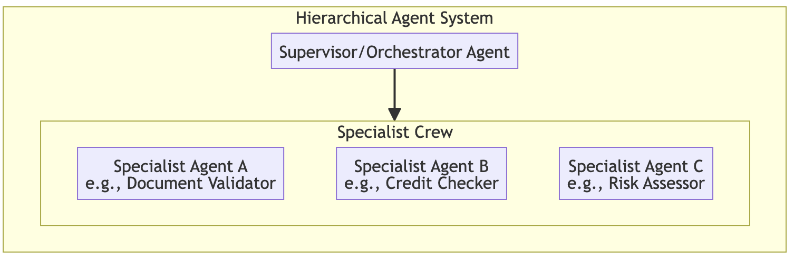
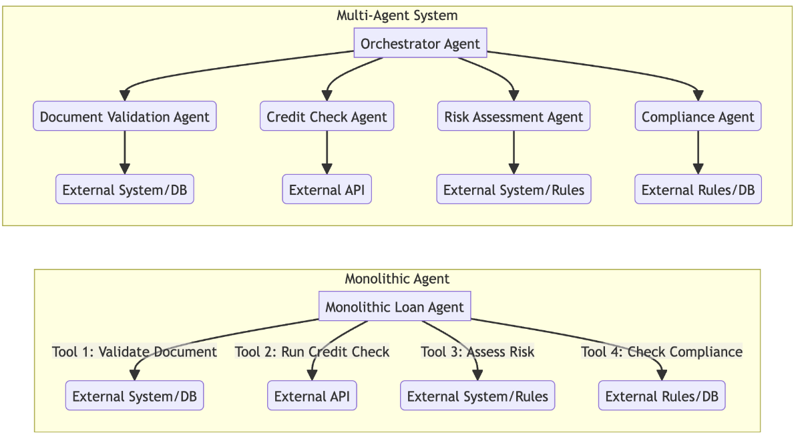

# Chapter 14: Use Case: A Multi-Agent System for Loan Processing

Use Case: A Multi-Agent System for
Loan Processing
In the previous chapter, we successfully built and tested a monolithic, single-agent system for processing loan
applications. By leveraging the FCoT pattern and a robust set of tools, we constructed a Level 3 agent capable of
orchestrating an entire workflow.
This single-agent architecture is a powerful and necessary milestone on the agentic maturity journey. It delivers
end-to-end autonomous value and serves as the perfect foundation for what comes next.
However, as we analyzed the system's performance and considered the demands of a real-world production
## environment, we identified several architectural limitations inherent in the single-agent design:

Cognitive overload and maintainability: The agent's central FCoT prompt becomes increasingly large
and complex. As we add more tools or nuanced business logic, this monolithic prompt becomes difficult
to debug and maintain without risking unintended side effects.
Single point of failure: The entire process relies on one agent's reasoning loop. If the agent
misinterprets a step or fails due to an underlying model issue, the entire workflow grinds to a halt. The
system lacks the modular resilience needed for mission-critical tasks.
Lack of specialization: While the agent can call specialized tools, the agent itself is a generalist. It must
know the intricacies of document validation, credit policies, risk modeling, and compliance, increasing
its cognitive load and making it difficult to update one area of expertise without affecting the others.
Now that we've seen the power and limitations of a single autonomous agent, we will address these challenges
head-on.
In this chapter, we will evolve our solution from Level 3 to Level 4 maturity by re-architecting it into a multiagent system.
We will apply the Supervisor (Orchestrator) Architecture pattern, promoting our specialized "tools" into a
team of collaborating, single-purpose agents. This approach will not only solve the limitations of our previous
design but also unlock a new level of scalability, resilience, and maintainability for our agentic application.
This new structure transforms our application from a single, complex entity into a system of simpler, and more
importantly, highly interoperable components, as we will see in the Hierarchical agent architectures section.
In this chapter, we'll be covering the following topics:
Hierarchical agent architectures
Building the multi-agent system
Examining the patterns in practice
Mapping the use case to the Agentic AI Levels
Technical requirements
To successfully complete the hands-on examples in this chapter, you will need the following:
A Google account: This is required to access Google Colab and Google AI Studio.
Google Colab: The code examples are designed to run in a Google Colab notebook, which provides a
free, cloud-based Python environment. The examples are lightweight, so you do not need highperformance local hardware; a standard web browser will suffice.
Google AI Studio API key: You will need a valid API key to access the Gemini models used in the agent
examples. You can obtain a key by following the documentation here: https://ai.google.dev/
gemini-api/docs/api-key.
Python libraries: The examples rely on the google-adk library and other standard Python packages.
The notebook includes the necessary commands to install these dependencies directly within the
environment.
The complete code for this chapter, including the runnable notebooks and helper scripts, is available in the
## book's GitHub repository:

https://github.com/PacktPublishing/Agentic-Architectural-Patterns-for-Building-MultiAgent-Systems/tree/main/Chapter_14.
Hierarchical agent architectures
While multi-agent systems can be organized in various topologies, such as decentralized swarms or peer-topeer networks suitable for open-ended creative tasks, regulated enterprise workflows require stricter control.
For a loan processing pipeline, where auditability and adherence to specific steps are non-negotiable, the most
effective design is the hierarchical architecture, also known as the Supervisor/Orchestrator pattern. This
pattern organizes agents into a structure resembling a corporate team, with a manager overseeing a crew of
specialists. Instead of a single, monolithic agent trying to do everything, we create a system where
responsibilities are clearly divided.
Chapter 14 450
## This model is composed of two distinct agent roles:

The supervisor (parent) agent: This gent acts as the manager. Its primary tasks are planning the
overall workflow, delegating sub-tasks to the appropriate specialist, monitoring progress, and
synthesizing the final result from the specialists' findings.
The specialist (sub-agent): These agents are the individual experts. Each one is designed to do one
thing exceptionally well, such as validating a document or calculating a risk score. It receives a task,
executes it using its dedicated tools, and returns a result to its supervisor.
With these roles defined, let's explore the specific architectural patterns that enable this orchestration and
modularity:
Agent Delegates to Agent: This is the core pattern in play. The supervisor agent doesn't perform the
work itself but delegates it to another autonomous agent. The ADK's AgentTool class is the direct
implementation of this pattern. It encapsulates an entire independent agent, complete with its own
LLM, instructions, and tools, behind a standard tool interface, allowing the supervisor to invoke it
synchronously just like any other function, albeit with the trade-off of nested latency and token costs.
Fault Tolerance And Isolation: By reaking the workflow into independent agents, we isolate failures.
If the CreditCheckAgent fails, it doesn't crash the entire system. The supervisor can catch the error and
decide on a course of action, such as halting the process or escalating to a human. This is a significant
improvement over the monolithic design.
Modularity: Each specialist agent is a self-contained module of expertise. We can update, improve, or
even replace the RiskAssessmentAgent without touching any other part of the system, leading to a
much more maintainable and scalable architecture.
## The following diagram illustrates this clear, hierarchical relationship:



*Figure 14.1 – A simplified model of a hierarchical agent architecture*

Let's also review this new architecture in contrast to the original monolithic architecture we explored in the
previous chapter.
This new structure transforms our application from a single, complex entity into a system of simpler,
## interoperable components, as illustrated here:

451 Use Case: A Multi-Agent System for Loan Processing


*Figure 14.2 – Contrasting monolithic with multi-agent architectures*

Let's dive deep into our multi-agent architecture.
Building the multi-agent system
We will now refactor our notebook to implement this superior architecture. The process involves creating truly
specialized agents, each with its own model, instructions, and a single dedicated tool.
Equipping specialists with dedicated tools
First, we define the Python unctions that will serve as the dedicated tools for each specialist. While our example
uses standard Python type hints for simplicity, a production-grade system should enforce strict input/output
schemas (using libraries such as Pydantic) to guarantee data integrity between agents.
Each function now contains the precise business logic for its task, including the specific rules for our "unhappy
path" scenarios, such as immediately flagging a credit score below 600 as a high-risk failure condition:
#@title Create and Equip All Specialist Sub-Agents with Tools
from google.adk.agents.llm_agent import LlmAgent
from google.adk.tools import FunctionTool, AgentTool
```python
import json
# --- 1. Define Python Functions to Serve as Tools ---
```

defvalidate_document_fields(application_data: str) -> str:
Chapter 14 452
#... (function definition from the notebook)...
## defquery_credit_bureau_api(customer_id: str) -> str:

#... (function definition from the notebook)...
## defcalculate_risk_score(loan_amount: int, income: str, credit_score: int) -> str:

#... (final, refined function definition from the notebook)...
## defcheck_lending_compliance(credit_history: str, risk_score: int) -> str:

#... (final, refined function definition from the notebook)...
```python
# --- 2. Wrap Functions in ADK FunctionTools ---
validation_tool = FunctionTool(func=validate_document_fields)
credit_tool = FunctionTool(func=query_credit_bureau_api)
risk_tool = FunctionTool(func=calculate_risk_score)
compliance_tool = FunctionTool(func=check_lending_compliance)
In the preceding code block, we established the foundational capabilities of our system. We defined four distinct
```

Python functions, each representing a specific domain capability:
validate_document_fields: Simulates the parsing of incoming loan application documents, ensuring
that the JSON structure is valid and all required fields are present
query_credit_bureau_api: Acts as our interface to external data, retrieving a credit score for a given
customer ID
calculate_risk_score: Encapsulates the core financial logic, computing a risk metric based on the
relationship between income, loan amount, and credit score
check_lending_compliance: Enforces business governance, verifying that the calculated risk profile
meets the institution's regulatory standards
We wrapped each of these functions in the ADK's FunctionTool object. This wrapper is essential; it inspects the
Python function signatures and generates the schema description that the LLM needs to understand how to call
the tool.
Now that we have forged the individual tools and defined the strict data contracts they enforce, we need to place
them into the hands of capable operators. In the next section, we will instantiate the specialized agents
themselves, assigning each a distinct identity, a specific mission, and the dedicated tool we just created.
453 Use Case: A Multi-Agent System for Loan Processing
Creating the specialist agent crew
With the tools defined, we create our specialist agents. Crucially, each agent is now its own LlmAgent instance,
complete with a model, a highly focused instruction set, and its single dedicated tool. Their instructions are now
simpler, telling them only to use their tool and to expect specific inputs. This enforces a clear "data contract"
between the agents.
This decoupling also enables a powerful production strategy: heterogeneous model selection. You are no longer
bound to a single model for the entire workflow. You can assign a lightweight, low-latency model (e.g., Gemini
Flash) to document_validator for rapid extraction, while reserving a more capable reasoning model (e.g.,
Gemini Pro) for compliance_checker to handle nuanced policy interpretation. While this optimizes cost and
performance, be aware that mixing models can introduce subtle variations in behavior; relying on strict
FunctionTool definitions, as we do here, is the best way to maintain consistency across a diverse agent team.
We then wrap each specialist agent in an AgentTool. This is the most critical step, as the AgentTool acts as an
## adapter, making one agent callable by nother and enabling the Agent Delegates to Agent pattern:

```python
# --- 3. Update Agent Instructions with Explicit Input Requirements ---
doc_validator_instructions = """
You are a Document Validation Agent.
```

Your ONLY task is to call the `validate_document_fields` tool.
**INPUT
REQUIREMENT:** You must receive the complete, original loan application as a JSON string.
If you receive the required input, call the tool and return its exact output.
If the input is missing or malformed, respond with an error: 'ERROR: Missing or invalid
application_data input.'
"""
#... (and so on for the other 3 agents' instructions)...
```python
# --- 4. Create Agent Instances, Assigning a Model to Each ---
document_validation_agent = LlmAgent(
model="gemini-3-flash",
instruction=doc_validator_instructions,
Chapter 14 454
name="document_validator",
description="Use this agent to validate the structure and content of a new loan
application document.",
tools=[validation_tool]
)
```

#... (and so on for the other 3 agents)...
```python
# --- 5. Wrap Agents in AgentTools ---
validator_agent_tool = AgentTool(agent=document_validation_agent)
credit_checker_agent_tool = AgentTool(agent=credit_check_agent)
risk_assessor_agent_tool = AgentTool(agent=risk_assessment_agent)
compliance_checker_agent_tool = AgentTool(agent=compliance_agent)
Production warning: The cost of abstraction
Be cautious with deep delegation chains (e.g., supervisor → manager → team lead → worker). Each
```

layer adds a full LLM inference round-trip, significantly increasing latency and token costs.
Design note: Production configuration via GenerateContentConfig
While our code highlights the structural wiring of the agents, production systems require strict
behavioral control. In the ADK (and Google GenAI SDK), this is managed via the
generate_content_config parameter, which accepts a types.GenerateContentConfig object. To
ensure our specialist agents behave predictably within an enterprise ready workflow, we must configure
## several key parameters:

Temperature (temperature): Set to 0.0 for specialist agents (such as our validator and
compliance agents) to force deterministic, analytical outputs. Use higher values (e.g., 0.7) only
for creative or conversational roles.
Output limits (max_output_tokens): Define strict limits to prevent runaway loops or excessive
verbosity.
Safety (safety_settings): Configure block thresholds to ensure agents process sensitive
financial data without triggering false-positive refusals.
Note
455 Use Case: A Multi-Agent System for Loan Processing
In the preceding code, we wrap each specialized agent into an AgentTool. This crucial step transforms our
autonomous sub-agents into callable tools that the orchestrator can invoke, effectively implementing the Agent
Delegates to Agent pattern.
With our specialist crew now fully defined and accessible, we must update the orchestrator that will lead them.
Adding production guardrails
While our architecture defines how agents talk to each other, a Level 4 system must also handle the noise of a
production environment. In our updated implementation, we introduce enterprise-grade robustness patterns to
ensure the system doesn't collapse under API pressure.
```python
# 1. Configure the agent's reasoning engine with a Thinking Budget
thinking_config = ThinkingConfig(
include_thoughts=True,
thinking_budget=1024
)
# 2. Implement the Robust Runner with Retries and Throttling
@sleep_and_retry
@limits(calls=15, period=60)
@retry(
stop=stop_after_attempt(5),
wait=wait_exponential(multiplier=2, min=4, max=30),
retry=retry_if_exception(is_rate_limit_error)
)
```

defstart_agent_run(runner, user_id, session_id, content):
return runner.run(user_id=user_id, session_id=session_id, new_message=content)
## As shown in the preceding code, we wrap our execution logic in a robust runner that implements:

Rate limiting: We use the @limits decorator to proactively throttle requests, ensuring we stay within
our provider's quota (e.g., 15 calls per minute).
Exponential backoff: Using the tenacity library, the system intelligently retries if it encounters a
RESOURCE_EXHAUSTED (429) error. Instead of failing the loan application, it waits and retries with
increasing intervals.
Thinking budgets: We configure a ThinkingConfig with a thinking_budget. This allows the
orchestrator to spend more compute cycles on internal reasoning, which is crucial for parsing the
nested JSON data returned by sub-agents.
For this architectural demonstration, we rely on the default settings to focus on the orchestration pattern, but you
should always explicitly configure these for live deployments.
Chapter 14 456
Revising the orchestrator's mind
The role of our main agent now shifts from a doer to a manager.
We update our main agent's FCoT prompt to reflect this. Instead of a list of tools, its instructions now refer to its
specialist team. The prompt also makes the orchestrator explicitly responsible for passing the correct data
context from one agent to the next, solving the "loss of context" problem we identified in our final debugging
session:
#@title Create the Orchestrator Agent (with Self-Correction and Data Awareness)
orchestrator_instructions = """
You are an FCoT-powered Orchestrator Agent managing a team of specialist agents...
Your primary role is to plan the workflow, delegate tasks, and intelligently handle
exceptions.
**Failure Handling Policy:**
1. **Reflect:** If a specialist agent returns an error, first analyze the error
message.
2. **Resolve:** If the error is due to missing information, review the original
request...
3. **Escalate:** Only if you cannot resolve the error on your own should you
escalate...
**Your Specialist Team (Available Agents for Delegation):**
Architectural note: Contextual state management
Unlike workflow engines that pass a structured Python dictionary (e.g., state = {'id': 123}) between
steps, our orchestrator relies on contextual state. The "state" is the accumulated history of JSON outputs
from the specialist agents.
For example, when the document validator returns {"status": "valid", "extracted_data":
{"customer_id": "CUST-123", "income": "5000"}}, the orchestrator reads this from its context
## window and dynamically constructs the payload for the next delegated call:

credit_checker_tool(customer_id="CUST-123").
This requires the orchestrator to be explicitly instructed on which fields to extract and forward,
effectively acting as a semantic data mapper.
Note
457 Use Case: A Multi-Agent System for Loan Processing
* **`document_validator`:**... It returns the validated data.
* **`credit_checker`:**... You must pass it the `customer_id` from the validated
data.
* **`risk_assessor`:**... You must pass it the `loan_amount`, `income`, and
`credit_score`...
* **`compliance_checker`:**... You must pass it the `credit_history` AND the
`risk_score`...
"""
#... (rest of the agent initialization code)...
These instructions define the operating principles for our supervisor. By explicitly defining a failure handling
policy and a roster of the specialist team with strict input requirements, we ensure that the orchestrator
manages the workflow rather than trying to execute every step itself.
With our architecture fully defined, from the individual tools to the central orchestrator, we are ready to put the
system to the test.
Execution and analysis
With our multi-agent system fully assembled, we are ready to deploy it. To do this, we need to establish a
runtime environment that not only executes the agent but also captures its complex internal reasoning for
analysis.
We will set up the ADK Runner object to manage the agent's life cycle and define a call_agent function. This
function serves as our window into the agent's mind, implementing the Observability pattern by filtering and
displaying the raw events generated during the execution loop: thoughts, tool calls, and outputs.
Session initialization
First, we initialize the session service. This maintains the state of our interaction, allowing the agent to retain
## context across multiple turns if necessary:

#@title Session init
```python
# Define unique IDs for our test user and session
USER_ID = "loan_officer_01"
SESSION_ID = str(uuid.uuid4()) # Generate a new session ID for this run
APP_NAME = "Loan_Agent"
session_service = InMemorySessionService()
session = await session_service.create_session(app_name=APP_NAME, user_id=USER_ID,
session_id=SESSION_ID)
Chapter 14 458
runner = Runner(agent=agent, app_name=APP_NAME, session_service=session_service)
print(f"Runner is set up. Using Session ID: {SESSION_ID}")
The execution loop: implementing observability
The following call_agent function acts as our execution harness. It sends the user's query to the runner and
```

then iterates through the stream of events returned by the agent.
Critically, this function parses the agent's output to separate thoughts (the internal monologue driven by our
FCoT instructions) from tool calls (the actions taken). This granular logging is essential for verifying that our
## orchestrator is correctly planning and delegating tasks according to the patterns we designed:

#@title Call Agent Method
defcall_agent(query: str):
"""
Packages a query, runs it, and prints a clean, filtered log of the
agent's thoughts, tool calls, and final response.
"""
print(f"\n > > > > USER REQUEST: {query.strip()}\n")
```python
# Create the user message content and run the agent
content = types.Content(role='user', parts=[types.Part(text=query)])
events = runner.run(user_id=USER_ID, session_id=SESSION_ID, new_message=content)
print("--- Agent Activity Log (Filtered) ---")
```

for event in events:
if event.content:
## for part in event.content.parts:

```python
# Check for a thought by checking for a truthy value
```

if part.thought and part.text:
print(f"\n🧠 THOUGHT:\n{part.text.strip()}")
```python
# Check for a tool call by checking for a truthy value
if part.function_call:
tool_name = part.function_call.name
tool_args = dict(part.function_call.args)
print(f"\n🛠️ TOOL CALL: {tool_name}({tool_args})")
# Check for a tool output by checking for a truthy value
if part.function_response:
tool_name = part.function_response.name
tool_output = dict(part.function_response.response)
print(f"\n↩️ TOOL OUTPUT from {tool_name}:\n{tool_output}")
459 Use Case: A Multi-Agent System for Loan Processing
# Extract the final text response at the end
```

if event.is_final_response() and event.content:
final_text = ""
```python
# The final answer is in a Part with text but is not a thought
```

for part in event.content.parts:
## if part.text andnot part.thought:

final_text = part.text.strip()
break# Use the first non-thought text part as the answer
if final_text:
print("\n---------------------------------")
print("✅ FINAL RESPONSE:")
print(final_text)
print("---------------------------------")
With our execution harness in place, we can now run the agent through specific scenarios.
Analysis of scenarios: a deep dive into agent reasoning
By examining the logs generated by call_agent, we will verify how the Supervisor and Agent Delegates to
Agent patterns function in practice.
Scenario 1: The happy path (successful approval)
In this scenario, we provide valid application from a well-qualified applicant. The goal is to observe the
perfect, uninterrupted flow of the multi-agent collaboration and the orchestrator's reasoning.
## Here is the full agent activity log for the happy path:

>>>> USER REQUEST: Please process this new loan application: …
## Please process this new loan application:

"customer_id": "CUST-12345"
"income": "USD 5000 a month"
"loan_amount": 50000,
"credit_history": "Very Solid",
"loan_documents":
["doc_1.pdf","doc_2.pdf","credit_history.pdf","loan_application.docx"]
## 🧠 THOUGHT (Iteration 1: Planning):

RECAP: Okay, so I've got a loan application here... I see the user has provided all the
necessary details: the customer ID ("CUST-12345"), their income (USD 5000 a month), the
requested loan amount (50000), the credit history ("Very Solid")... My team of
specialized agents are set up to handle each stage of the process...
REASON: The first agent, the document_validator, requires the entire application data in
a single JSON
string... Once validated, I'll extract the customer ID and feed that to the
Chapter 14 460
credit_checker... Then, using that score along with the loan amount and income, I'll pass
those to the risk_assessor... Finally, the risk score and the original credit history
will be analyzed by the compliance_checker...
VERIFY: I've verified that each agent's input matches their expected data contract,
making sure that everything is set up correctly for the agents to do their jobs. Now,
it's time to execute the plan...
🛠️ TOOL CALL: document_validator(...)
...
↩️ TOOL OUTPUT from document_validator: {'result': '{"status": "validated",...}'}
...
## 🧠 THOUGHT (Iteration 2: Synthesis):

RECAP: Okay, here's the final call. I've run this application through the complete
origination pipeline...
REASON:...document validation was a clean pass... credit check came back with a solid
score - 810... risk assessment gave us a risk score of 6, which falls within acceptable
parameters... compliance check? That's a green light... I will combine all these results.
VERIFY: Taking all of this into account, I have everything I need to render the final
summary and recommendation.
## ✅ FINAL RESPONSE:

The loan application... has been successfully processed... Loan Decision: Approved.
This execution trace provides a perfect, observable example of the FCoT pattern governing the agent's behavior:
Iteration 1,the planning phase: The orchestrator's very first thought is a complete FCoT planning
loop:
It begins with RECAP, where it acknowledges the user's request and inventories its available
resources (the specialist agents).
It then moves to REASON, where it formulates a precise, multi-step plan. Crucially, it's not just
sequencing the agents; it's reasoning about the data flow between them, explicitly mentioning
that it will "extract the customer ID" from one step to use in the next. This demonstrates its
awareness of the data contracts we embedded in its prompt.
Finally, it performs the VERIFY step, a critical component of FCoT. It critiques its own plan
against its internal rules, stating, "I've verified that each agent's input matches their
expected data contract." This act of self-correction ensures the agent proceeds with high
confidence and reduces the risk of errors.
Iteration 2, the synthesis phase: After all tool calls are complete, the agent's final thought before
## responding is another FCoT loop, this time focused on synthesis:

It begins with RECAP, summarizing the state of the workflow ("I've run this application
through the complete origination pipeline...").
a.
b.
c.
a.
461 Use Case: A Multi-Agent System for Loan Processing
It moves to REASON, where it synthesizes the individual findings from each specialist into a
coherent narrative ("document validation was a clean pass... credit check came back
with a solid score...").
It concludes with VERIFY, confirming that it has all the necessary information to produce the
final deliverable, directly fulfilling its instruction contract.
This structured, two-phase reasoning process is the hallmark of the FCoT pattern. It forces the agent to be
deliberate in its planning and rigorous in its conclusions, making it a highly reliable orchestrator for complex,
multi-step tasks.
The series of TOOL CALL logs following the plan is the direct execution of this verified strategy, showing the
Supervisor (Orchestrator) and Agent Delegates to Agent patterns in practice.
Scenario 2: The denied path (high-risk failure)
This scenario tests the system's ability to observe, moderate, and enforce critical business rules. This is often
referred to as policy adherence. The agent's reasoning in the face of a negative but expected outcome is a key test
of its robustness.
## Here is the full agent activity log for the denied path:

>>>> USER REQUEST: Please process the loan application: …
"customer_id": "CUST-55555"
"income": "USD 1000 a month"
"loan_amount": 1000000,
"credit_history": "Presenting Gaps",
"loan_documents": ["drivers_license.pdf"]
## 🧠 THOUGHT (Iteration 1: Planning):

RECAP: Okay, so I've got the application details: customer ID "CUST-55555," income of USD
1000 a month, a hefty loan amount of 1,000,000...
REASON: I'll kick things off by feeding the entire application data... into the
document_validator... Next, I'll extract the customer_id... and pass it to the
credit_checker... and so on.
VERIFY: Data dependencies are solid.
... (A series of successful TOOL CALLS for validator, credit checker, and risk
assessor)...
## ↩️ TOOL OUTPUT from risk_assessor:

{'result': '{"risk_score": 8}'}
... (TOOL CALL to compliance_checker with risk_score: 8)...
## ↩️ TOOL OUTPUT from compliance_checker:

{'result': '{"is_compliant": false, "reason": "Policy violation: Risk score of 8 is too
high for approval."}'}
## 🧠 THOUGHT (Iteration 2: Synthesis):

RECAP: Okay, so I've run through the entire process.
REASON: First, the documents looked good... Next, the credit check showed a score of
b.
c.
Chapter 14 462
680... The risk assessment flagged something though; a risk score of 8 came back. That's
## a bit high, and that's where the problem is. The compliance check flagged it right away:

a risk score of 8 violates policy. It's a clear-cut policy violation; that's the bottom
line.
VERIFY: The primary reason for denial is the high-risk score of 8, which exceeds the
acceptable threshold for loan approval according to internal policy.
## ✅ FINAL RESPONSE:

The loan application for CUST-55555 is rejected. The primary reason for the rejection is
a policy violation...
This execution trace reveals how the FCoT pattern ensures robustness even when the outcome is negative.
Rather than simply failing or returning a generic error, the agent applies the same rigorous cognitive structure
## to diagnose the issue and justify the rejection. Let's explore some aspects:

Consistent planning: The orchestrator's initial FCoT planning loop is identical to the happy path. This
demonstrates the system's reliability. It follows the same rigorous process of RECAP, REASON,andVERIFY,
regardless of the application's content, ensuring procedural consistency.
Synthesizing contradictory evidence: The most insightful part of this log is the final thought. This is
## where the FCoT's synthesis loop proves its value:

The agent performs a RECAP of the completed workflow.
In the REASON step, it is faced with conflicting evidence: the first few steps were successful
(documents looked good... credit check showed a score of 680...), but the final step
was a hard failure (The compliance check flagged it right away... It's a clear-cut
policy violation). The agent correctly reasons that the compliance failure is the most
important and decisive factor.
In the VERIFY step, it grounds its final conclusion directly in the output of the specialist agent,
stating, The primary reason for denial is the high-risk score of 8.... This fulfills the
Explainability and Audit Trail pattern by providing a transparent, verifiable reason for the
negative outcome.
This ability to weigh evidence and correctly prioritize a critical failure over initial successes is a sophisticated
reasoning capability.
The FCoT framework provides the structure that enables the agent to perform this analysis reliably,
demonstrating how it can be used to build agents that not only execute workflows but also make sound,
auditable judgments based on the results.
Now that we have analyzed the step-by-step execution of our multi-agent system, let's take a moment to
formally connect our observations to the design patterns we introduced earlier in the book. By explicitly
mapping the agent's behavior to these patterns, we can better understand how they serve as the foundational
blueprints for building robust and intelligent agentic systems.
a.
b.
c.
463 Use Case: A Multi-Agent System for Loan Processing
Examining the patterns in practice
Throughout this book, we have explored a catalog of design and architectural patterns for building multi-agent
systems effectively and efficiently. Each of these serves as a blueprint for solving specific challenges in agentic
engineering. Our multi-agent loan processor is not just a single piece of code running one agent; it is a dynamic
agentic ecosystem where these patterns come together to create a system infused with an intelligence that
mirrors business and domain needs, verified through rigorous evaluation and secured by safety guardrails,
resulting in a capability that is far greater than the sum of its individual parts.
Through this example, we witnessed how abstract patterns for orchestration, reasoning, and resilience can be
implemented to build a sophisticated agent that is not only intelligent but also robust and auditable.
Let's dissect our implementation to see exactly how these critical patterns were brought to life, using the agent's
own internal monologue as our guide.
Pattern: Supervisor (AI orchestrator or meta-agent) architecture
The Supervisor pattern is the master blueprint for our entire system. It addresses the challenge of managing
overwhelming complexity by establishing a clear hierarchy of control. Instead of a single, monolithic agent that
must be an expert in everything, this pattern advocates for a "manager and team" structure.
The supervisor agent's role is not to perform tasks but to understand the high-level goal, break it down into
logical steps, delegate those steps to the appropriate specialists, and synthesize their findings into a final,
coherent result.
In our use case, the orchestrator agent is the quintessential supervisor. Its FCoT prompt contains no business
logic for validating documents or assessing risk; its entire cognitive process is dedicated to workflow
management.
By offloading the detailed work, the supervisor can focus entirely on the strategic execution of the process,
ensuring that all steps are completed correctly and in the proper order. This abstraction is what allows the
system to handle a complex, multi-step business process without concentrating all the cognitive load on a
single agent, which is crucial for building scalable and resilient agentic applications.
We see this pattern clearly in the agent's final thought during the "denied path" scenario. After receiving reports
## from all specialists, its reasoning is purely managerial:

🧠 THOUGHT from the log: Okay, so I've run through the entire process. First, the
documents looked good... Next, the credit check showed a score of 680... The risk
assessment flagged something though; a risk score of 8 came back... The compliance check
flagged it right away... a risk score of 8 violates policy.
The agent isn't calculating risk or checking compliance itself; it is receiving, interpreting, and prioritizing the
reports from its team to make a final, executive decision. This separation of concerns is the core benefit of the
Supervisor pattern.
Let's take another example, that of an automated supply chain management system. A supervisor agent will
monitor overall inventory levels. If it detects low stock for a product, it will delegate tasks to a
Chapter 14 464
SupplierContactAgent to check availability, a LogisticsAgent to calculate shipping costs and times, and a
PurchaseOrderAgent to create and submit the order, orchestrating the entire procurement process without
managing the details of any single step.
Pattern: Agent Delegates to Agent
This pattern is the primary mechanism through which the Supervisor Architecture is implemented. It provides
a standardized way for one agent to invoke the capabilities of another autonomous agent.
For this to work, the calling agent doesn't need to know how the other agent works; it only needs to know what
the other agent does and what inputs it requires. This creates a powerful abstraction that allows for the creation
of modular, interoperable agentic systems.
We implemented this pattern directly using the ADK's AgentTool. By wrapping each of our specialists (e.g.,
document_validation_agent) in an AgentTool, we made them callable components that the orchestrator could
treat like any other tool in its toolbelt.
This encapsulation is key. All the complex logic (the specialist's instructions, its dedicated Python tool, and the
specific LLM it uses) is completely contained within the specialist agent itself. This allows us to develop, test,
and even replace specialist agents without ever having to modify the orchestrator.
The agent's log provides a perfect, unambiguous example of this pattern in action at the very start of the
workflow:
🧠 THOUGHT from the log: The first agent, the document_validator, requires the entire
application data in a single JSON string... it's time to execute the plan and get this
loan application processed.
🛠️ TOOL CALL: document_validator({'request': '{"customer_id": "CUST-12345",...}'})
This sequence shows the orchestrator planning the delegation and then executing the handoff. The AgentTool
provides the technical bridge to pass the task and the necessary data to the document_validator specialist,
which then begins its own independent reasoning loop.
Let's look at another example, that of a smart home system. When a central HomeManager agent receives a
command such as Movie time, it will then delegate the relevant tasks to the following agents: LightingAgent to
dim the lights, BlindsAgent to lower the blinds, and MediaAgent to turn on the TV and sound system, all
through the Agent Delegates to Agent pattern.
465 Use Case: A Multi-Agent System for Loan Processing
Pattern: FCoT
FCoT is the pattern that governs the supervisor's mind, acting as its cognitive operating system. It addresses the
critical challenge of ensuring that an agent's reasoning is deliberate, auditable, and aligned with its core
instructions, thus preventing "goal drift" in complex, multi-step tasks. It achieves this by forcing the agent to
follow an adaptive, recursive RECAP -> REASON -> VERIFY loop for both planning and synthesizing its final
answer.
It uses a dual objective function to optimize each of its iterations as it starts to close and focus its context
aperture.
This structured reasoning is what makes our orchestrator a reliable and trustworthy manager. It does not act
impulsively. Every major phase of its operation is preceded by a moment of structured reflection and selfcorrection.
In the "denied path" scenario, the FCoT's synthesis loop was critical in allowing the agent to weigh the
contradictory evidence (successful initial steps vs. a final compliance failure) and correctly reason that the
policy violation was the decisive factor.
The agent's very first thought in the happy path log is a perfect illustration of the FCoT planning loop:
🧠 THOUGHT from the log: RECAP: Okay, so I've got a loan application here... My team of
specialized agents are set up to handle each stage... REASON: The first agent, the
document_validator, requires the entire application data... Once validated, I'll extract
the customer ID and feed that to the credit_checker... VERIFY: I've verified that each
agent's input matches their expected data contract... Now, it's time to execute...
This is not just a simple plan; it is a structured, self-critiqued strategy that gives the agent high confidence in its
subsequent actions, making its behavior predictable and its audit trail clear.
Here's another example: a scientific research agent tasked with summarizing a paper. Its FCoT planning loop
## would be as follows:

RECAP: I need to summarize this scientific paper.
REASON: First, I will read the abstract and conclusion to understand the main points. Second, I will read
the methodology. Third, I will draft a summary.
VERIFY: This is a logical and efficient plan to create an accurate summary.
Having dissected the specific design patterns that bring our agent to life, it is now time to zoom out. By mapping
our practical implementation back to the Agentic AI Levels we introduced at the beginning of this book, we can
better understand the strategic implications of our architectural choices.
Our use case, in its evolution from a single agent to a multi-agent team, is not just a technical exercise; it is a
tangible demonstration of the journey an organization takes as it advances its agentic capabilities to solve
increasingly complex problems.
Chapter 14 466
Mapping the use case to the Agentic AI Levels
This two-chapter use case provides a clear, practical illustration of the journey through the highest levels of the
Agentic AI Levels, showing not just what each level is, but why the progression is so critical for enterprise
success.
Level 3: The capable but brittle monolith
The single-agent system we initially built is the quintessential Level 5 system. At this stage, an organization has
achieved a significant milestone: a single, autonomous agent capable of executing a complex, end-to-end
business process.
The LoanProcessing agent we built in Chapter 13 could successfully validate documents, check credit, assess
risk, and ensure compliance, delivering real business value. However, its monolithic nature, where all the
cognitive load, business logic, and workflow control are concentrated in a single, massive prompt, introduces
significant production challenges.
This centralization creates a system that is inherently brittle; a small logic error in one part of the prompt can
have unintended consequences for the entire workflow. Furthermore, as the business process evolves,
maintaining and updating this single, complex "brain" becomes increasingly difficult and risky, limiting the
system's long-term scalability.
Level 4: The resilient, collaborative team
The hierarchical, multi-agent system we constructed in this chapter is a direct implementation of a Level 4
system. The leap from Level 3 to Level 4 is not merely about adding more agents; it is a fundamental
architectural shift centered on the principle of problem decomposition.
We took a single, complex problem and broke it down into a series of smaller, simpler tasks. We then built a
team of highly specialized expert agents, each designed to do only one thing exceptionally well. This is the
agentic equivalent of moving from a single brilliant generalist to a coordinated team of specialists.
This architectural evolution is what unlocks true enterprise-grade capabilities. The system becomes
dramatically more resilient, as a failure in one specialist agent is isolated and can be handled gracefully by the
supervisor without bringing down the entire process.
The system becomes more maintainable, as the business logic for risk assessment can be updated within its
dedicated agent without any risk of affecting the credit-checking process. Most importantly, it becomes more
scalable, not just in a technical sense, but in a cognitive one. By distributing the cognitive load, this Level 4
architecture allows us to tackle problems of a much higher order of complexity, building systems that are far
more capable than any single agent could ever be alone.
The shift from a doer to a manager of specialized workers is the defining characteristic of Level 4, the summit of our
Agentic AI Levels.
467 Use Case: A Multi-Agent System for Loan Processing
Beyond Level 4: The future of agentic collaboration
While our Level 4 hierarchical system represents the current state of the art for production-grade agentic
applications, the journey does not end here. The patterns and architectures we have built are the foundation for
even more dynamic systems. We will soon see Level 5 systems that utilize meta-agents for real-time task
reassignment, but the ultimate future of agentic AI lies in systems that can self-organize, self-improve, and even
participate in their own economies.
Imagine a future Level 6 system characterized by emergent swarms. In this paradigm, there is no fixed
supervisor. Instead, a collection of specialized agents could receive a complex, novel problem and autonomously
form an ad hoc team to solve it. For example, in a complex corporate loan restructuring scenario, a planning
agent might temporarily take the lead, recruiting a data-analysis agent to model cash flow projections and a
reporting agent to summarize legal risks, forming a temporary hierarchy that dissolves once the restructuring
plan is complete.
Looking even further within the Level 6 horizon, we find self-improving agentic systems. An agentic loan
processor might not only process applications but also analyze its own performance. It could identify that its
risk_assessor specialist is a frequent bottleneck and suggest improvements, or even attempt to rewrite the
underlying tool's code for better efficiency. It might conduct its own A/B tests on different versions of its
prompts to optimize for accuracy and cost.
This moves beyond execution to a state of continuous, autonomous self-correcting optimization, a concept we
will explore further in the final part of this book. These future levels will rely on industry-standard
communication protocols to enable fluid and reliable interactions. The Agent-to-Agent (A2A) protocol, now an
official project under the Linux Foundation, provides the certified standard for this interoperability. Governed
by a cross-industry steering committee, A2A allows agents to discover, negotiate, and collaborate regardless of
their underlying framework. This formal standardization is what will enable a true economy of agents that can
discover, recruit, and collaborate to solve problems at a scale we are only just beginning to imagine.
Let's recap what we've covered in this chapter.
Chapter 14 468
## Summary

In this chapter, we put our design patterns and architectural theories into practice, culminating in a
sophisticated, multi-agent system for loan processing. By moving beyond abstract concepts and into a
functional implementation, we can now outline the key lessons learned from this transition:.
From monolith to a team of agents: Our journey began with a capable but brittle Level 3 monolithic
agent. We deliberately exposed its architectural weaknesses (poor fault isolation and difficult
maintainability) to motivate the evolution to a Level 4 multi-agent system. This transition from a single
doer to a manager of specialized agents is the defining characteristic of the highest level of agentic
maturity.
Patterns as the blueprint for success: We witnessed firsthand how a combination of design patterns
creates a robust and intelligent system. The Supervisor (Orchestrator) Architecture provided the
overall structure, with the Agent Delegates to Agent pattern serving as its primary mechanism. The
orchestrator's cognitive process was governed by the FCoT pattern and made efficient and reliable
through explicit data contracts.
Achieving production-ready resilience: The final multi-agent system demonstrated true enterprisegrade qualities. It achieved fault tolerance by isolating failures within specialist agents and handling
them gracefully. Its modular design allows for independent development and maintenance of each
agent's expertise. Finally, by providing a clear, step-by-step justification for its decisions, the system
fulfilled the critical need for Explainability and an Audit Trail.
Agentic AI as a software discipline: This use case demonstrated that the principles of good software
architecture are directly applicable to the world of agentic AI. By applying proven patterns of problem
decomposition and separation of concerns, we built a system that is not just intelligent but also
resilient, scalable, and ready for the complexities of the real world.
Our work in building this Level 4 system has provided us with a powerful and practical foundation. In the final
part of this book, we will build upon this foundation, exploring the critical topics of continuous improvement
and governance that are essential for the long-term success and responsible deployment of these advanced
agentic systems.
Now that we have a good understanding of what it means to build these advanced agentic systems, we must
turn our attention to the critical principles that govern their use.
In the next chapter, we will explore the frameworks essential for ensuring that the systems we build are not only
powerful but also safe, fair, and trustworthy.
469 Use Case: A Multi-Agent System for Loan Processing
Subscribe for a free eBook
New frameworks, evolving architectures, research drops, production breakdowns-AI_Distilled filters the noise
into a weekly briefing for engineers and researchers working hands-on with LLMs and GenAI systems. Subscribe
now and receive a free eBook, along with weekly insights that help you stay focused and informed.
Subscribe at https://packt.link/8Oz6Y or scan the QR code below.
Chapter 14 470